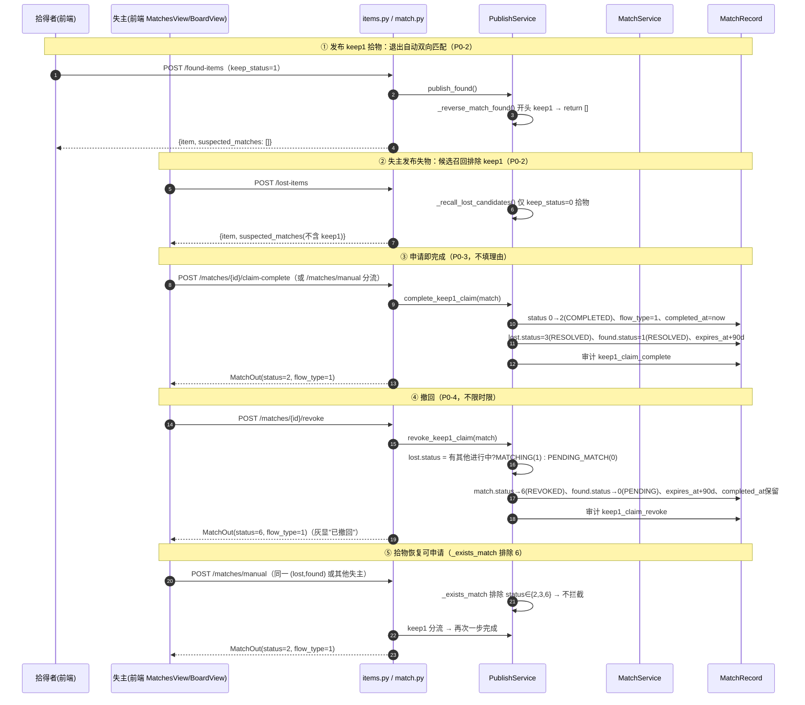

# 增量架构设计：已交接栏去重 + keep_status=1 简化流程 + 时间非必填 + 匹配度重心转向文字

| 项 | 内容 |
| --- | --- |
| 文档定位 | 在已落地 v8 + 昨日 mymatch-top10 增量之上的**增量架构设计 + 任务分解**（对应增量 PRD `docs/prd/2026-08-05-flow-v2.md`，Q1–Q7 已拍板） |
| 架构师 | Bob（软件架构师） |
| 基线 | v8 六维打分（20·photo + 30·category + 20·appearance + 15·feature + 10·time + 5·location）、阈值 80、状态机 0-5、mymatch-top10（每件 ≤10 候选、发布快照、对称落库、刷新候选） |
| 文档版本 | 2026-08-05 · 增量 v2 |
| 已拍板决策 | R1 已完成交接只展示拾物；R2 keep1 退出自动匹配 + 申请即完成（不填理由）+ 可撤回（不限时限、status=6）；R3 lost_time 非必填；R4 新公式 `15·photo+20·category+50·text+10·location+5·time` + text 动态计分 + 空值中性 0.5 |
| 明确不做 | 不改视觉/类目/阈值 80；不改 keep_status=0 现状闭环；不做全量实时重算；不重做广场页；论文公式段同步为配套交付（不阻塞代码） |

---

## 1. 实现方案总览

> ### ⚠️ flow-v3 修订批注（R2-a 口径已变更，全文适用）
>
> **本文档中一切关于「keep1 退出自动双向匹配」的表述（§1.1-2、§1.2 R2-a 行、§2.3.2 mockAdapter 第 1/2 条、
> §2.4.1 测试覆盖首条、§3 时序图 ① 注释、§5 第 7 条）均已由 flow-v3 增量修订为「keep1 单向进匹配池」。**
> 权威口径见 `docs/architecture/v9_flow_v3_incremental_design.md`。
>
> | 方向 | flow-v2（旧） | flow-v3（现行） | 实现位置 |
> | --- | --- | --- | --- |
> | **正向**（失主召回/刷新候选 → keep1 拾物） | ❌ 基查询 `keep_status == 0` 排除 | ✅ **放开**：删除 keep_status 过滤，仅保留 `deleted_at.is_(None)` | `publish_service._recall_lost_candidates` |
> | **反向**（发布 keep1 拾物 → 为拾得者生成候选） | ❌ 早退不生成 | ❌ **保持早退不变** | `publish_service._reverse_match_found` |
>
> **修订理由**：双向排除属过度设计。把 keep1 从**失主侧**召回池剔除，直接损害失主找回率——
> 「东西还在原地、你自己去拿」恰恰是失主最该看到的候选。拾得者「不被打扰」只需保证
> **不给拾得者推候选 + 不让拾得者被认领动作骚扰**，与「失主能否看到」是两件独立的事。
>
> **配套单向性守卫（flow-v3 新增）**：候选是**双方共享的单条记录**，反向不生成 ≠ 拾得者不可见——
> 失主侧召回落库后，拾得者在「我的匹配」中同样可见（**有意保留**，便于其知晓有人来取）。
> 故在 `routers/match.py` 补齐：拾得者对 keep1 候选调用 `confirm-return` / `reject` 一律
> **422**（`ParamError` / code 9001），与既有 `claim` 的 422 守卫三者对齐。
> keep1 唯一闭环路径：**失主「我要领走」→ `claim-complete` 一步完成（`flow_type=1`，可撤回）**。
>
> **不受影响**：R2-b（申请即完成）、R2-c（撤回 / `status=6` / `_exists_match` 排除 `{2,3,6}`）、
> `flow_type` 语义、R1 / R3 / R4 全部继续有效。
> **另**：flow-v3 新增 `MATCH_LOW_SCORE = 60`（**仅前端**失主侧低分弱化展示用，后端业务代码不得引用），
> 与 `MATCH_THRESHOLD = 80`（`suspected` 判定，**保留不删**）完全解耦。
>
> **回归映射**：`tests/test_flow_v3.py`（F3-01～F3-17 单向性专项）；`tests/test_flow_v2.py` 两条断言已调整为
> `test_keep1_found_publish_still_has_no_candidates`（反向，断言**不变**）与
> `test_lost_publish_includes_keep1_candidates`（正向，断言由「排除」**反转**为「包含」）。

### 1.1 核心策略（最小变更、按层解耦）

1. **R1（展示层收敛）**：`BoardView.vue` 的 `resolvedMerged` 只保留已解决**拾物**卡片（`FoundItem.status==1`）；对方失物信息、完成时间、撤回入口由「我的匹配-已完成」的 `MatchRecord`（status=2）索引提供，无需再拉 `resolvedLost`。后端零改动。
2. **R2（keep1 极简路径）**：
   - **退出自动匹配**：`publish_service._recall_lost_candidates` 基查询追加 `FoundItem.keep_status == 0`（失物召回/刷新天然排除 keep1）；`_reverse_match_found` 开头对 `found.keep_status == 1` 直接 `return []`。
   - **申请即完成**：新增 `POST /matches/{match_id}/claim-complete`（对已落库 status=0 候选）；`POST /matches/manual` 对 keep1 拾物分流为一步完成（P1-1 存量候选）。二者都走共享方法 `PublishService.complete_keep1_claim`：MatchRecord 直接落终态 `status=2 COMPLETED + flow_type=1 + completed_at`，lost/found 双端置已解决，审计 `keep1_claim_complete`。**不填理由、不生成交接码、不要求拾得者确认。**
   - **可撤回**：新增 `POST /matches/{match_id}/revoke` → `PublishService.revoke_keep1_claim`：`status→6 REVOKED`（终态）、lost.status 按"是否还有其他进行中匹配"回退 `MATCHING(1)/PENDING_MATCH(0)`、found.status→`PENDING(0)`、双方 `expires_at` 顺延 90 天恢复可检索、审计 `keep1_claim_revoke`。`_exists_match` 排除终态 {2,3,6}，撤回后同 (lost,found) 可再次申请。
   - **`MatchRecord` 新增 `flow_type` 列**（0=双向交接 / 1=keep1 单边，默认 0）作为撤回动作的唯一门控（Q7 配套）；`MatchStatus` 枚举新增 `REVOKED = 6`。
3. **R3（时间非必填）**：DTO / 模型 / 输出 schema / 前端表单 / 路由 Form 全部放开；SQLite 迁移用 Alembic `batch_alter_table` 重建表将 `lost_item.lost_time` 改为 nullable（同 0005 迁移的安全模式）；打分 time 空值给中性 0.5。
4. **R4（新公式）**：`MatchService` 新增 `text_match_rate`（失物侧词集 containment，description 首次进打分，appearance/feature 并入词集），`score()`/`score_detail()` 改为五维；`location_factor`/`time_decay_factor` 空值 0.0→0.5（行为变化）；「其他」类 `tag_match_rate` 升级为同口径词集；`config.py` 权重改为 15/20/50/10/5（`MATCH_W_APP/MATCH_W_FEAT` 保留标 deprecated）；前端维度展示同步。

### 1.2 现状 vs 目标差距表（R1–R4 逐项）

| # | 维度 | 现状行为 | 目标行为 | 改动位置 |
| --- | --- | --- | --- | --- |
| R1 | 已完成交接栏 | `resolvedMerged` = 已解决失物(status=3) + 已解决拾物(status=1) 合并展示，同笔交接两条 | 只展示已解决**拾物**；对方失物信息作为卡片辅助（counterpart 索引保留） | `BoardView.vue`（`resolvedMerged` 去 lost 分支、`load()` 停用 `resolvedLost` 拉取、索引带 matchId/flowType） |
| R2-a | keep1 参与自动匹配 | `_recall_lost_candidates` 不区分 keep_status；`_reverse_match_found` 对 keep1 也反向匹配 | keep1 拾物退出双向匹配：召回排除 keep1；发布 keep1 不反向匹配 | `publish_service._recall_lost_candidates`（基查询 `keep_status==0`）、`_reverse_match_found`（开头早退） |
| R2-b | keep1 申请动作 | `POST /matches/manual` → status=4 待自取 → `self-complete` 两步 | 一步完成：终态 status=2 + flow_type=1 + completed_at + lost/found 已解决 + 审计 | `routers/match.py` 新增 `claim-complete`；`manual` 按 keep_status 分流；`publish_service.complete_keep1_claim` |
| R2-c | 完成记录可撤回 | 无撤回能力；giveup(5) 只处理进行中；已完成(2) 终态保护 | 失主对 keep1 完成记录随时撤回：status→6、lost/found 回退、拾物恢复可申请、审计留档 | `routers/match.py` 新增 `revoke`；`publish_service.revoke_keep1_claim`；`models/match.py` flow_type；`common.MatchStatus.REVOKED=6` |
| R3 | 失物发布时间 | `LostItemPublishDTO.lost_time` 必填；模型 `nullable=False`；前端必填；time 空值实际按 1.0（delta 0） | 非必填（schema/model/前端/路由全放开 + SQLite 迁移）；time 空值中性 0.5（贡献 2.5） | `schemas/item.py`、`models/item.py`、`routers/items.py`、迁移 `0006`、`PublishView.vue`、`match_service.time_decay_factor` |
| R4 | 匹配度公式 | v8 六维 20/30/20/15/10/5；description 不参与打分；location 空值 0.0 | `15·photo+20·category+50·text+10·location+5·time`；text 动态 containment；location/time 空值 0.5；「其他」tag_match_rate 同口径 | `match_service.score/score_detail/text_match_rate/_text_token_set/location_factor/time_decay_factor`、`config.py` 权重、`schemas/match.py MatchOut` 新键、前端维度展示 |

---

## 2. 文件级改动清单

> 约定：`[变更]`=修改既有逻辑；`[新增]`=新增文件/方法/路由/列；`[复用]`=不改或仅确认。

### 2.1 后端

#### 2.1.1 `app/core/config.py` — `[变更]`（权重区）

- `MATCH_W_PHOTO: 20.0 → 15.0`；`MATCH_W_CAT: 30.0 → 20.0`；`MATCH_W_TIME: 10.0 → 5.0`；`MATCH_W_LOC: 5.0 → 10.0`。
- 新增 `MATCH_W_TEXT: float = 50.0`（文字动态词覆盖率权重）。
- `MATCH_W_APP: 20.0` / `MATCH_W_FEAT: 15.0` 保留值但注释改为 `[deprecated]`（不再被 score 调用，仅外部引用兼容）。
- `MATCH_W_OTHER: 80.0`、`MATCH_THRESHOLD: 80.0`、`MATCH_TOP_N: 10` 不变。
- 更新区块 docstring 为新公式。

#### 2.1.2 `app/schemas/common.py` — `[变更]`（枚举）

- `MatchStatus` 新增 `REVOKED = 6   # 已撤回（v2：keep1 完成记录撤回后的终态，Q7 拍板）`。

#### 2.1.3 `app/models/item.py` — `[变更]`（R3）

- `lost_time: Mapped[datetime] = mapped_column(DateTime, nullable=False)` → `Mapped[datetime | None]` + `nullable=True`。

#### 2.1.4 `app/models/match.py` — `[变更]`（R2）

- `MatchRecord` 新增列：
  ```python
  flow_type: Mapped[int] = mapped_column(SmallInteger, nullable=False, default=0)  # 0=双向交接 / 1=keep1 单边（申请即完成）
  ```
- `status` 字段注释补充 `6 已撤回`。
- `__table_args__` 可选加 `Index("idx_match_flow_type", "flow_type")`（规模小可不加）。

#### 2.1.5 `migrations/versions/0006_flow_v2.py` — `[新增]`（R2+R3 迁移）

- `down_revision = "0005_v8_match"`。
- `upgrade()`：
  1. `lost_item.lost_time`：inspector 读取当前 nullable，若为 False → `with op.batch_alter_table("lost_item") as b: b.alter_column("lost_time", existing_type=sa.DateTime(), nullable=True)`（SQLite 走 batch 重建表，MySQL 直接改列约束）。
  2. `match_record.flow_type`：inspector 判列不存在 → `b.add_column(sa.Column("flow_type", sa.SmallInteger(), nullable=False, server_default="0"))`。
- `downgrade()`：反向 drop `flow_type`、`lost_time` 恢复 `nullable=False`。
- 幂等：全部基于 inspector 判存在/判 nullable，重复执行安全。
- 说明：status=6 是 SmallInteger 值域扩展，**无需改表**；测试库由 conftest `drop_all/create_all` 重建，无需迁移。

#### 2.1.6 `app/schemas/item.py` — `[变更]`（R3）

- `LostItemPublishDTO.lost_time: datetime` → `Optional[datetime] = None`。
- `LostItemOut.lost_time: datetime` → `Optional[datetime] = None`。

#### 2.1.7 `app/schemas/match.py` — `[变更]`（R2+R4 输出）

- `MatchOut` 新增字段：
  - `flow_type: int = 0`（from_model 取 `getattr(match, "flow_type", 0)`）；
  - `text: Optional[float] = None`（文字维度加权贡献，0–50）；
  - `text_match_rate: Optional[float] = None`（文字词覆盖率原始值 0–1）；
  - `shared_text: list[str] = []`（P2-2 可解释：失物侧被命中的词）。
- `MatchOut.from_model` 签名扩展：`flow_type`、`text`、`text_match_rate`、`shared_text` 入参（默认 None/[]）。

#### 2.1.8 `app/services/match_service.py` — `[变更]`+`[新增]`（R4 核心）

**新增词集工具（模块级常量 + 方法）**
```python
_STOPWORDS = {"的","了","在","和","与","看见","一个","一把","捡到","丢失","我的","位于",
              "发现","上面","里面","比较","有","是","很","就","这个","那个","东西","物品"}  # 可维护
_QTY_RE = re.compile(r"^([一二两三四五六七八九十百千万0-9]+)(个|把|张|只|条|部|串|双|对|辆|台|本|支|根|件|枚)$")
```
- 新增 `@staticmethod _text_token_set(item, is_lost: bool) -> set[str]`：
  1. 原始文本 = `title`（仅失物侧）+ `description` + `tags` + `appearance` + `features` + `location`，按 `_ATTR_SPLIT_RE` 分词；
  2. 对每个 raw token 依次处理：
     a. **子串抽取**：遍历 `COLOR_WORDS` / `LOCATION_WORDS`（复用 `tagging_service` 导出的表），若为 token 子串则加入（如 "在教学楼看见" → "教学楼"）；
     b. **数量词前缀切分**：`_QTY_RE` 命中开头则把数量部分与剩余部分各自作为 token（"两个行李箱" → "两个" + "行李箱"）；
     c. **过滤**：丢弃停用词、纯标点、空串；
     d. **保留**：`NOUN_SET` 词、`COLOR_WORDS` 词、`LOCATION_WORDS` 词、数量词、以及其余长度 ≥2 且非停用词的 token（品牌/特殊标记兜底）。
- 新增 `@staticmethod text_match_rate(lost, found) -> float`：
  ```python
  lost_tokens = _text_token_set(lost, is_lost=True)
  if not lost_tokens:
      return 0.5                       # 失物侧词集为空 → 中性 0.5（text 贡献 25）
  found_tokens = _text_token_set(found, is_lost=False)
  if not found_tokens:
      return 0.0                       # 拾物侧为空且失物有词 → 0.0
  hit = sum(1 for t in lost_tokens if _token_hit(t, found_tokens))   # 复用精确+WordNet+中文近义词
  return hit / len(lost_tokens)        # 分母固定失物侧（containment）
  ```
- 新增 `@staticmethod shared_text_tokens(lost, found) -> list[str]`：失物词集中被 `_token_hit` 命中的词（排序，供 MatchOut.shared_text）。

**原子因子行为变更（空值规则 Q6）**
- `location_factor`：`if not a or not b: return 0.5`（**现状 0.0 → 0.5，行为变化**）。
- `time_decay_factor`：`if lost_time is None or found_time is None: return 0.5`（**现状实际 1.0 → 0.5，行为变化**）；双方都有值则沿用 `time_decay(delta_days(...), tau)`。

**「其他」类升级**
- `semantic_tag_match_rate` / `tag_match_rate`：`_union(item)` 改为复用 `_text_token_set(item, is_lost=...)` 同口径（词集纳入 description / title）；失物侧词集为空 → 0.5（原 0.0，行为变化）。`score` 的「其他」路径仍为 `20·photo + 80·tag_match_rate`。

**`score()` / `score_detail()` 重构（五维新公式）**
```python
# 普通类：
total = w.MATCH_W_PHOTO * photo + w.MATCH_W_CAT * cat + w.MATCH_W_TEXT * text_rate \
        + w.MATCH_W_LOC * loc + w.MATCH_W_TIME * td
# 「其他」类：total = w.MATCH_W_PHOTO * photo + w.MATCH_W_OTHER * tag_match_rate
```
- `score_detail` 返回键：`photo / category / text / text_match_rate / location / time / total / is_other / tag_match_rate / shared_text`；`appearance` / `feature` 保留键但恒为 `0.0`（deprecated 占位，避免破坏既有 JSON 消费者）。
- `build_match_outs` 透传 `text` / `text_match_rate` / `shared_text` / `flow_type`。

#### 2.1.9 `app/services/publish_service.py` — `[变更]`+`[新增]`（R2 核心）

- `_recall_lost_candidates`：基查询追加 `.filter(FoundItem.keep_status == int(KeepStatus.KEEPING))`（即排除 keep_status=1；`refresh_lost_candidates` 复用同一召回自动继承）。
- `_reverse_match_found`：开头
  ```python
  if int(found.keep_status) == int(KeepStatus.NOT_KEEPING):
      return []   # keep1 拾物不反向匹配失物（P0-2）
  ```
- `_exists_match`：改为排除终态
  ```python
  .filter(MatchRecord.lost_id == lost_id, MatchRecord.found_id == found_id,
          ~MatchRecord.status.in_([int(MatchStatus.COMPLETED), int(MatchStatus.REJECTED), int(MatchStatus.REVOKED)]))
  ```
  （保留 {0,1,4,5} 阻断：进行中/待自取/已放弃仍幂等；终态 2/3/6 放行，P1-2）
- 新增 `_lost_has_active_match(lost_id, exclude_match_id=None) -> bool`：查该失物下 status∈{0,1,4} 且 id≠exclude 的 MatchRecord。
- 新增 `complete_keep1_claim(self, match, ip, ua) -> MatchRecord`：
  1. 校验：`found.keep_status==1`；`match.status==PENDING_CLAIM(0)`；`found.status==PENDING(0)`；
  2. `match.status=COMPLETED(2)`、`match.flow_type=1`、`match.completed_at=now`；`lost.status=RESOLVED(3)`、`found.status=RESOLVED(1)`；双方 `expires_at = now+90d`；
  3. 审计 `action="keep1_claim_complete"`，detail=`lost_id=..;found_id=..;score=..;flow=keep1`。
- 新增 `revoke_keep1_claim(self, match, ip, ua) -> MatchRecord`：
  1. 校验：`match.flow_type==1`；`match.status==COMPLETED(2)`（不限时限）；
  2. `match.status=REVOKED(6)`（`completed_at` 保留原值）；`lost.status = MATCHING(1) if _lost_has_active_match(lost_id, match.id) else PENDING_MATCH(0)`；`found.status=PENDING(0)`；双方 `expires_at = now+90d`；
  3. 审计 `action="keep1_claim_revoke"`，detail=`lost_id=..;found_id=..;match_id=..;reason=误操作撤回`（审计 created_at 即撤回时间）。

#### 2.1.10 `app/routers/match.py` — `[变更]`+`[新增]`（R2 接口）

1. **`POST /matches/{match_id}/claim-complete` — `[新增]`（P0-3）**
   - 校验：仅失主（`lost.publisher_id==user.id`）；`match` 存在；调 `PublishService.complete_keep1_claim`；`db.commit()`；返回 `build_match_outs(db, [m])[0]`。
2. **`POST /matches/{match_id}/revoke` — `[新增]`（P0-4）**
   - 校验：仅失主；`match.flow_type==1` 且 `status==2`（否则 `MatchProcessedError`）；调 `PublishService.revoke_keep1_claim`；`db.commit()`；返回 `build_match_outs(db, [m])[0]`。
3. **`claim_match` — `[变更]`（P0-3 分流守卫）**：取到 `found` 后
   ```python
   if int(found.keep_status) == int(KeepStatus.NOT_KEEPING):
       raise ParamError("该拾物留在原地未挪动，请使用「申请即完成」")
   ```
4. **`create_manual_match` — `[变更]`（P1-1 分流）**：在去重校验之后、落库之前：
   - `found.keep_status==1` → 创建 `MatchRecord(status=COMPLETED, flow_type=1, match_score=score, completed_at=now)` + lost/found 双端 RESOLVED + expires_at 顺延 + 审计 `keep1_claim_complete`（等价于 `complete_keep1_claim` 路径，推荐抽出共享私有方法复用）；
   - `found.keep_status==0` → 保持现状 status=4。
5. **`self_complete_match` — `[变更]`（存量 status=4 一致性）**：完成时若 `found.keep_status==1` → `m.flow_type=1`（使旧 keep1 自取记录也可撤回）。
6. `list_my_matches` / `_counterpart_hidden` / `list_matches_for_lost` / `refresh_matches_for_lost`：**`[复用]`**（status=6 属终态，`_counterpart_hidden` 只过滤 {0,1,4}，天然保留展示）。

#### 2.1.11 `app/routers/items.py` — `[变更]`（R3）

- `create_lost_item`：`lost_time: str = Form(...)` → `Optional[str] = Form(None)`；`dto.lost_time = _parse_dt(lost_time) if lost_time else None`。
- docstring 更新：lost_time 选填。

### 2.2 前端

#### 2.2.1 `web/src/types/index.ts` — `[变更]`

- `LostItemOut.lost_time: string` → `string | null`（注释：R3 非必填，空显示"—"）。
- `MatchOut`：
  - `status` 注释追加 `6 已撤回（v2：keep1 完成记录撤回终态）`；
  - 新增 `flow_type?: number`、`text?: number | null`、`text_match_rate?: number | null`、`shared_text?: string[]`；
  - `appearance/feature` 注释改 `[deprecated] 旧六维，新公式下为 0 或缺失，前端按 text 键回退`。

#### 2.2.2 `web/src/api/constants.ts` — `[变更]`

- `MATCH_STATUS_LABEL[6] = '已撤回'`。
- 新增 `export const MATCH_WEIGHTS = { photo: 15, category: 20, text: 50, location: 10, time: 5 }`（与后端 settings 对齐，供维度展示复用）。

#### 2.2.3 `web/src/api/match.ts` — `[变更]`（新增 2 接口）

```ts
// keep1「申请即完成」：对 status=0 候选一步完成（后端 P0-3）
claimComplete(matchId: number): Promise<MatchOut> { return apiPost(`/matches/${matchId}/claim-complete`, {}) },
// keep1 完成记录撤回（后端 P0-4）
revoke(matchId: number): Promise<MatchOut> { return apiPost(`/matches/${matchId}/revoke`, {}) },
```

#### 2.2.4 `web/src/views/MatchesView.vue` — `[变更]`（核心 UI）

1. **维度展示适配（P1-5/P0-6）**：`MATCH_DIMENSIONS` 改为
   `[{photo,图像,15},{category,类别,20},{text,文字,50},{location,地点,10},{time,时间,5}]`；
   `hasDimensions(m)`：`typeof m.text === 'number'` → 新维度渲染；否则若旧 `appearance/feature` 为 number → 旧维度回退；否则隐藏（旧记录不崩溃）。
2. **已完成 tab 状态集合（Q7）**：`visibleMatches` 的 done 分支 `[2,3]` → `[2,3,6]`；`statusType(6)` → `'info'`；status=6 文案「已撤回」灰显。
3. **keep1 申请分流（P0-3）**：`onApplyMatch(m)` 开头
   ```ts
   if (m.found_item?.keep_status === 1) {
     await ElMessageBox.confirm('该拾物留在原地未挪动，申请后将立即完成交接（可随时撤回）。', '申请即完成', ...)
     await matchApi.claimComplete(m.id); ElMessage.success('已申请并完成交接'); await load(); return
   }
   ```
   否则走原低分二次确认 + 认领理由弹窗。
4. **撤回入口（P2-1/P0-4）**：done tab 中
   - `myRole(m)==='lost' && m.status===2 && m.flow_type===1` → 显示「撤回」按钮（`ElMessageBox.confirm('撤回后该拾物将恢复可申请。','撤回完成记录',...)` → `matchApi.revoke(m.id)` → `load()`）；
   - `m.status===6` → 灰显「已撤回」，无操作按钮；
   - keep0（flow_type=0）完成记录无撤回按钮。
5. **共享文字词展示（P2-2）**：`m.shared_text?.length` 时在「共享特征」区追加 `[词]` chips（文案「共享文字：」）。
6. 失主侧 status=0 按钮文案：keep1 候选仍显示「申请匹配」（点击走第 3 步分流），keep0 候选不变。

#### 2.2.5 `web/src/views/BoardView.vue` — `[变更]`（R1 + 撤回入口）

1. **R1 只展示拾物**：`resolvedMerged` computed 删除 lost 分支，仅保留
   `resolvedFound.filter(d => d.status === 1).map(kind:'found')`；`load()` 删除 `itemsApi.listLost({resolved_only:true})` 拉取（counterpart 索引改由 `matchApi.myMatches({status:2})` 提供）。
2. **counterpart 索引扩展**：`CounterpartEntry` 增加 `matchId: number; flowType: number`；构建时取 `m.completed_at || m.created_at` 作为完成时间（顺带修正现状用 created_at 的小问题）。
3. **撤回入口（P2-1）**：`counterpartFor` 已返回对方失物；新增 `revokableFor(it)`：`typeFilter==='resolved' && it.kind==='found'` 且索引 `found:{id}` 存在 `flowType===1 && counterpart.lost_item?.publisher_id===myId`；卡片传 `:revokable` 并监听 `@revoke` → `ElMessageBox.confirm('撤回后该拾物将恢复可申请。','撤回完成记录',...)` → `matchApi.revoke(matchId)` → `load()`。
4. **文案/空态（P1-4）**：resolved tab 顶部提示与空态改为「已完成的拾物交接记录」。

#### 2.2.6 `web/src/components/ItemCard.vue` — `[变更]`（撤回按钮）

- props 新增 `revokable?: boolean`；emits 新增 `revoke: [BoardItem]`。
- 在「已完成交接」展示区（counterpart/completed-at 之后）渲染：
  `<el-button v-if="revokable" size="small" type="danger" plain @click.stop="emit('revoke', props.item)">撤回</el-button>`。

#### 2.2.7 `web/src/views/PublishView.vue` — `[变更]`（R3/P2-3）

- 失物表单「丢失时间」label 去 `required`，占位改「选择丢失时间（不知道/记不清可留空）」+ 提示文字（P2-3）。
- `onSubmitLost`：删除 `if (!lost.lost_time) { ElMessage.warning('请选择丢失时间'); return }`；`fd.append('lost_time', ...)` 仅当非空时追加。

### 2.3 演示模式 mock

#### 2.3.1 `web/src/api/mockData.ts` — `[变更]`（演示样本对齐）

- 所有静态 `MatchOut` 补 `flow_type: 0`（keep1 完成样本为 1）。
- 静态匹配维度值改为新权重（photo/category/text/location/time + total），并补 `text` 键（否则前端 hasDimensions 判定失败）；保留 `appearance/feature` 为 0 或删除（前端按 text 回退）。
- 新增演示样本（复现 PRD 可测断言场景）：
  - lost 9（发布者=当前用户 1）：title「两个行李箱」、description「黄色和粉色，在教学楼看见」、location「教学楼」、tags `['黄色','粉色','教学楼']`；
  - found 9（拾得者 8，keep_status=1、contact_allowed=1）：description「行李箱两个，黄色的和粉色，在教学楼」、tags `['黄色','粉色','教学楼','行李箱']`；
  - match 10：lost 9 ↔ found 9，`status: 2, flow_type: 1, match_score: 高（text 40 分档）, text: 40, ...`，completed_at 有值（演示撤回入口）。
- 可选（P2 演示灰显）：再补一条 `status: 6, flow_type: 1` 的撤回样本（独立物品对），演示「已撤回」灰显。

#### 2.3.2 `web/src/api/mockAdapter.ts` — `[变更]`（演示行为对齐）

1. `genCandidatesForLost`：pool 过滤追加 `f.keep_status === 0`（R2-a）。
2. `handleCreateFound`：`keep_status === 1` 时 `created = []`（不反向匹配，R2-a）；keep0 保持对称生成。
3. `buildMockMatchOut`：维度改为新权重（photo/category/text/location/time），新增 `text`（按命中比例）、`flow_type`（默认 0）、`text_match_rate`、`shared_text`。
4. 新增 `claimCompleteMatch(ctx, id)`：校验 `found.keep_status===1`、`status===0` → `status=2, flow_type=1`、lost_item.status=3、found_item.status=1、`resetCompletion`。
5. 新增 `revokeMatch(ctx, id)`：校验 `flow_type===1 && status===2` → `status=6`、lost_item.status =（有其他进行中匹配?1:0）、found_item.status=0、双方 `expires_at` 顺延 +90 天、`completed_at` 保留。
6. `createManualMatch`：`found.keep_status===1` → 直接返回 status=2 完成记录（flow_type=1）；否则 status=4 现状。
7. `claimMatch`：`found.keep_status===1` → `fail(409, '该拾物留在原地未挪动，请使用申请即完成')`。
8. `myMatches`：status 过滤允许 6（done tab 灰显）；`counterpartHidden` 不变（6 属终态可见）。
9. ROUTES 新增：`POST /matches/{id}/claim-complete`、`POST /matches/{id}/revoke`。

### 2.4 测试

#### 2.4.1 `tests/test_flow_v2.py` — `[新增]`（本期验收自动化）

覆盖（对照 PRD §8 验收 2/3/4/6/7/8）：
- keep1 退出自动匹配（P0-2）：发布 keep1 拾物 `suspected_matches==[]`；失物发布候选不含 keep1；keep0 候选不回归。
- 申请即完成（P0-3）：keep1 候选 `POST /matches/{id}/claim-complete` → status=2、flow_type=1、completed_at 有值、lost=3、found=1、审计存在；`claim` 对 keep1 返回 4xx。
- 撤回与恢复可申请（P0-4/P1-2）：complete → revoke → status=6、lost 回退 0/1、found 回退 0；再次 manual 成功（`_exists_match`/manual 去重排除 6）；审计 `keep1_claim_revoke` 存在；keep0 完成记录 revoke 409。
- manual 分流（P1-1）：keep1 found manual → status=2；keep0 found manual → status=4。
- R3：不传 lost_time 发布失物 200 且 `lost_time==null`；传值正常。
- R4 可测断言：`MatchService.text_match_rate` 场景——失物词集 5 词，found2 命中 4/5 → text 40 > found1 命中 2/5 → text 20，总分 found2 > found1（可用 SimpleNamespace 纯函数级构造）。
- R4 空值规则（Q6）：location 任一侧缺失 → 0.5；time 任一缺失 → 0.5；text 失物空词集 → 0.5；「其他」无词 → 40。
- R4「其他」同口径：description 纳入 tag_match_rate 词集后命中率变化断言。

#### 2.4.2 既有测试更新清单（会被破坏，见 §4.2 与回复 ③）

| 测试文件 | 破坏点 | 修复方向 |
| --- | --- | --- |
| `tests/test_match.py` | 权重断言（20/30/20/15/10/5）与全部 score 期望值按新公式变化；location 空值 0.0→0.5；time 空值 1.0→0.5；「其他」无词 0.0→0.5 | 按新公式重写期望；`test_weights_and_threshold_config` 改断言 15/20/50/10/5 + deprecated；`test_location_factor_all_empty_returns_zero` → 0.5 |
| `tests/test_v4_auto_match.py` | `_publish_found` 用 keep_status="1" → 新规则 keep1 退出匹配池，found 不再进候选 | 两处 `_publish_found` 改 `keep_status="0"`（contact_allowed="1" 已满足 keep0 强制联系）；score 上界断言按新公式复核（银>黑仍成立） |
| `tests/test_mymatch_top10.py` | 同上一批 helper `_publish_found` 默认 keep_status="1" → 全部用例失配 | `_publish_found` 默认改 `keep_status="0"`；分数类断言（银>黑、黑<80）按新公式复核 |
| `tests/test_v4_manual_match.py` | keep1 found manual 由 status=4 变一步完成 status=2 → `test_v4_manual_match_and_self_complete`/`rejects_duplicate` 断言失败 | 相关用例 `_publish_found` 改 `keep_status="0"` 保住 status=4 语义；keep1 分流断言移交 `test_flow_v2.py` |
| `tests/test_publish_flow.py` | 可能：`match_score >= 80` 期望值（新公式下"黑色书包"文本高度重合仍≥80，预计通过，需复核） | 复核；如无必要不改 |
| `tests/test_triple_match.py` | 相对断言 s2>s1（新公式下 L2 词覆盖率更高，预计仍通过） | 复核；如无必要不改 |

---

## 3. 数据流 / 时序（Mermaid）

### 3.1 keep1 拾物全流程：发布(不匹配) → 申请即完成 → 撤回 → 恢复可申请



### 3.2 keep_status=0 现状闭环（标注：不变，不回归）

```mermaid
sequenceDiagram
    autonumber
    participant F as 拾得者
    participant L as 失主
    participant API as items.py / match.py
    participant PS as PublishService
    participant HS as HandoverService
    participant DB as MatchRecord

    Note over F, DB: 现状闭环（keep_status=0 暂为保管，本期零改动）
    F->>API: POST /found-items（keep_status=0，强制联系）
    PS->>PS: _reverse_match_found() 对存量失物对称补 top10（keep1 除外）
    L->>API: POST /lost-items / refresh-matches
    PS->>PS: 召回仅 keep_status=0 拾物 → top10 无论分数落 status=0
    L->>API: POST /matches/{id}/claim（claim_reason 必填）
    DB: status 0→1(认领中)、lost.status=2
    F->>API: POST /matches/{id}/confirm-return / reject
    L->>API: POST /matches/{id}/handover/generate → 双端 verify
    HS->>DB: 双方确认 → status=2、lost=3、found=1、completed_at、审计 handover_complete
    Note over DB: 该完成记录 flow_type=0（双向）→ 无撤回入口
```

---

## 4. 任务列表（有序，按实现顺序：后端 → 前端 → mock → 测试）

> 依赖方向：T01 → T02/T03 → T04 → T05；T02 与 T03 相互独立、均仅依赖 T01。每项列出源文件与验收要点。

### T01：后端数据层与配置基线（R2 状态/字段 + R3 模型 + 迁移）

- **源文件**：`app/core/config.py`（新权重 15/20/50/10/5 + `MATCH_W_TEXT`）、`app/schemas/common.py`（`MatchStatus.REVOKED=6`）、`app/models/item.py`（`lost_time` nullable）、`app/models/match.py`（`flow_type` 列）、`app/schemas/item.py`（DTO/Out 可空）、`migrations/versions/0006_flow_v2.py`（新增，SQLite batch 迁移）。
- **依赖**：无（增量基线任务）。
- **验收要点**：
  1. `MatchStatus.REVOKED == 6`；`MatchRecord.flow_type` 默认 0。
  2. `LostItemPublishDTO.lost_time` / `LostItemOut.lost_time` 可空；模型 nullable。
  3. `alembic upgrade head` 在 dev.db 幂等执行：`lost_item.lost_time` 变 nullable、`match_record.flow_type` 加列、数据不丢；downgrade 可逆。
  4. config 新权重就绪（旧 `MATCH_W_APP/FEAT` 标 deprecated 不影响读取）。

### T02：后端匹配引擎新公式（R4）

- **源文件**：`app/services/match_service.py`（`_text_token_set`/`text_match_rate`/`shared_text_tokens` 新增；`score`/`score_detail` 五维重构；`location_factor`/`time_decay_factor` 空值 0.5；`tag_match_rate` 同口径升级）、`app/schemas/match.py`（`MatchOut` 加 `flow_type/text/text_match_rate/shared_text` + from_model 透传）、`app/core/config.py`（权重读取，配合 T01）。
- **依赖**：T01。
- **验收要点**：
  1. `score` 按新公式计算且合计 100；`score_detail` 返回新五维 + `text_match_rate` + `shared_text`，`appearance/feature` 保留 0.0 占位。
  2. 可测断言：失物词集 5 词，found2 命中 4/5 → text≈40 > found1 2/5 → text≈20，总分 found2 > found1。
  3. 空值规则：location/time 任一缺失 → 0.5；text 失物空词集 → 0.5；「其他」无词 → 40。
  4. `_token_hit` 语义复用不变；nltk 缺失回退精确匹配铁律不破坏。

### T03：后端 keep1 简化流程（R2 全链路）

- **源文件**：`app/services/publish_service.py`（`_recall_lost_candidates` 排除 keep1、`_reverse_match_found` 早退、`_exists_match` 排除 {2,3,6}、新增 `complete_keep1_claim`/`revoke_keep1_claim`/`_lost_has_active_match`）、`app/routers/match.py`（新增 `claim-complete`/`revoke`、`claim_match` keep1 守卫、`manual` keep1 分流、`self_complete` flow_type 一致性）、`app/routers/items.py`（lost_time 选填 Form）。
- **依赖**：T01（status=6/flow_type 枚举与列已就绪）。
- **验收要点**：
  1. keep1 拾物发布无候选；失物发布/刷新候选不含 keep1；keep0 不回归。
  2. keep1 候选「申请即完成」：终态 status=2 + flow_type=1 + completed_at + lost/found 已解决 + 审计 `keep1_claim_complete`；claim 对 keep1 4xx。
  3. 撤回：仅失主、仅 flow_type=1、仅 status=2；撤回后 lost 回退 0/1、found 回退 0、拾物恢复可申请；同 (lost,found) 可再次申请（`_exists_match`/manual 去重排除 6）；审计 `keep1_claim_revoke`；keep0 完成记录不可撤回。
  4. manual 分流：keep1 → 一步完成；keep0 → status=4 不变。
  5. 不传 lost_time 发布失物 200 且为空。

### T04：前端页面与 API 层（R1 + R2 交互 + R3 表单 + R4 展示）

- **源文件**：`web/src/types/index.ts`（`lost_time` 可空、`MatchOut` 新字段）、`web/src/api/constants.ts`（`MATCH_STATUS_LABEL[6]`、`MATCH_WEIGHTS`）、`web/src/api/match.ts`（`claimComplete`/`revoke`）、`web/src/views/MatchesView.vue`（新维度、done={2,3,6}、keep1 申请分流、撤回按钮、shared_text、status=6 灰显）、`web/src/views/BoardView.vue`（resolvedMerged 只留拾物、索引带 matchId/flowType、撤回入口、文案）、`web/src/components/ItemCard.vue`（`revokable` prop + `revoke` emit）、`web/src/views/PublishView.vue`（lost_time 可选 + 占位引导）。
- **依赖**：T02、T03（接口/字段契约）。
- **验收要点**：
  1. 已完成交接 tab 同笔交接仅 1 条拾物卡片，卡片仍显示对方失物与完成时间；文案「已完成的拾物交接记录」。
  2. 「我的匹配-已完成」tab：keep1 完成记录显示「撤回」、status=6 灰显「已撤回」；keep0 无撤回。
  3. keep1 候选点「申请匹配」→ 二次确认 → 一步完成；keep0 候选仍弹认领理由。
  4. 匹配卡片维度按 15/20/50/10/5 渲染，text 最高 50；旧记录（无 text 键）不崩溃。
  5. 失物发布不填时间可成功；空时间详情显示"—"。

### T05：演示模式 mock 适配 + 测试（R1–R4 自动化验收）

- **源文件**：`web/src/api/mockData.ts`（flow_type/新维度/text 键、keep1 完成样本、可选 status=6 样本）、`web/src/api/mockAdapter.ts`（keep1 退出匹配、claim-complete/revoke/manual 分流/claim 守卫/新路由）、`tests/test_flow_v2.py`（新增，覆盖 P0-2/3/4、P1-1/2、R3、R4 断言与空值规则）、`tests/test_match.py`、`tests/test_v4_auto_match.py`、`tests/test_mymatch_top10.py`、`tests/test_v4_manual_match.py`（更新被破坏断言，见 §2.4.2）。
- **依赖**：T02、T03、T04。
- **验收要点**：
  1. 演示模式：keep1 发布无候选；keep1 申请即完成/撤回闭环可演示；维度按新权重展示。
  2. `pytest tests/ -x -q` 全绿；新增 test_flow_v2 覆盖 PRD §8 验收 2/3/4/6/7/8。

---

## 5. 依赖包

**无新增依赖**（后端/前端均不需要新增第三方包）。
- 后端沿用 FastAPI / SQLAlchemy 2.x / Pydantic / Alembic（全部已落地）。
- 前端沿用 Vue3 / Element Plus / Pinia / Axios（全部已落地）。
- 例外说明：无。

---

## 6. 共享知识（跨文件约定）

1. **新公式常量（唯一事实来源）**：`MATCH_WEIGHTS = {photo:15, category:20, text:50, location:10, time:5}`；后端 `settings.MATCH_W_PHOTO/CAT/TEXT/LOC/TIME`；`MATCH_W_APP/MATCH_W_FEAT` 为 deprecated（不被 score 调用）；前端 `constants.ts` 的 `MATCH_WEIGHTS` 与后端逐项对齐。
2. **text 词集口径（text_match_rate）**：失物侧词集 = title ∪ description ∪ tags ∪ appearance ∪ features ∪ location 分词并集；去停用词 `_STOPWORDS`；保留名词（`NOUN_SET`）/颜色词（`COLOR_WORDS`）/地点词（`LOCATION_WORDS`）/数量词（`_QTY_RE`，支持"两个/2个/一对"前缀切分）/品牌特殊标记兜底（长度≥2 非停用词）；命中判定复用 `_token_hit`（精确 + WordNet + 中文近义词表）；**分母固定失物侧**（containment）；description 首次进打分；appearance/feature 并入词集不再独立成块。
3. **空值计分规则（Q6）**：photo 无图→0.0；text 失物空词集→0.5 / 拾物空且失物有词→0.0；location 任一侧缺失→0.5（**行为变化**）；time 任一缺失→0.5（**行为变化**）；「其他」无词→0.5（原 0.0）。
4. **status=6 语义（Q7）**：`MatchStatus.REVOKED=6` 为 keep1 撤回终态；前端已完成 tab 过滤集合 `{2,3,6}`；status=6 灰显「已撤回」；`_counterpart_hidden` 只过滤 {0,1,4}，6 属终态保留。
5. **flow_type 语义**：`MatchRecord.flow_type` 0=双向交接（keep0/交接码/自取），1=keep1 单边（申请即完成）；**撤回动作唯一门控** = `flow_type==1 && status==2`；keep0 记录不可撤回。
6. **`_exists_match` / manual 去重排除集合**：`{2 已完成, 3 已拒绝, 6 已撤回}` 放行（允许重新生成/申请）；`{0,1,4,5}` 阻断（进行中/待自取/已放弃幂等）。撤回后同 (lost,found) 可再次申请即完成。
7. **keep1 退出自动匹配**：`_recall_lost_candidates` 基查询 `keep_status==0`（失物发布与刷新候选均继承）；`_reverse_match_found` 对 keep1 早退；存量 keep1 候选不清理，申请时按 keep_status 分流（P1-1）。
8. **lost_time 可空**：后端 DTO/模型/输出/Form 全部 `Optional`；前端表单可留空、空值显示"—"；打分 time 空值走中性 0.5（`time_decay_factor` 短路口径），不报错。
9. **审计 action 约定**：`keep1_claim_complete`（detail 含 lost_id/found_id/score）、`keep1_claim_revoke`（detail 含 match_id/reason）；撤回时间以审计 `created_at` 为准，`MatchRecord.completed_at` 保留原完成时间。
10. **演示模式与真实后端行为一致**：mockAdapter 同口径实现 keep1 排除/申请即完成/撤回/维度新权重。

---

## 7. 待明确事项（默认假设，主理人可转交用户确认）

1. **撤回后「已交接栏」的呈现**：撤回后 `FoundItem.status` 回退为待认领，拾物卡片会从「已完成交接」tab 消失（回到可申请池）——与"撤回后拾物恢复可申请"一致；「已撤回」灰显仅保留在「我的匹配-已完成」tab（MatchRecord status=6 视角）。若用户要求已交接栏也保留灰显记录，需另设计"已交接栏混入 status=6 记录"的展示方案（本期默认不做）。
2. **`_exists_match` 排除范围**：按主理人指示排除 `{2,3,6}`，`{5 已放弃}` 仍阻断（保持 giveup 幂等现状）。若希望 giveup 后同对也可重新生成候选，需再放开 5（本期默认不放）。
3. **「其他」类失物空词集计分**：新口径下由 0.0 变为中性 0.5（text 权重下 80×0.5=40），属行为变化；PRD 空值表只列了普通类 text 规则，默认对「其他」tag_match_rate 同样适用（统一中性化），已在任务中注明。
4. **时间显示字段**：BoardView/详情空时间显示"—"，默认不再显示占位文案（P2-3 只在发布表单加引导）。
5. **论文公式段同步**：按 PRD §5.5 用户已选方案 A（改公式段 + 写成创新点），由文档/论文负责人执行，**不阻塞代码交付**；本期仅在设计层标注"论文需同步 §3.3 公式、图4.2、摘要"。
6. **存量 keep1 status=4 记录**：本期 `self_complete` 对 keep1 found 补记 `flow_type=1`，使旧「待自取」完成的 keep1 记录也可撤回；未完成的存量 status=4 keep1 记录仍可 `self-complete`（语义兼容），如用户希望这类也改为一步完成，需另立迁移任务（本期默认不做）。
