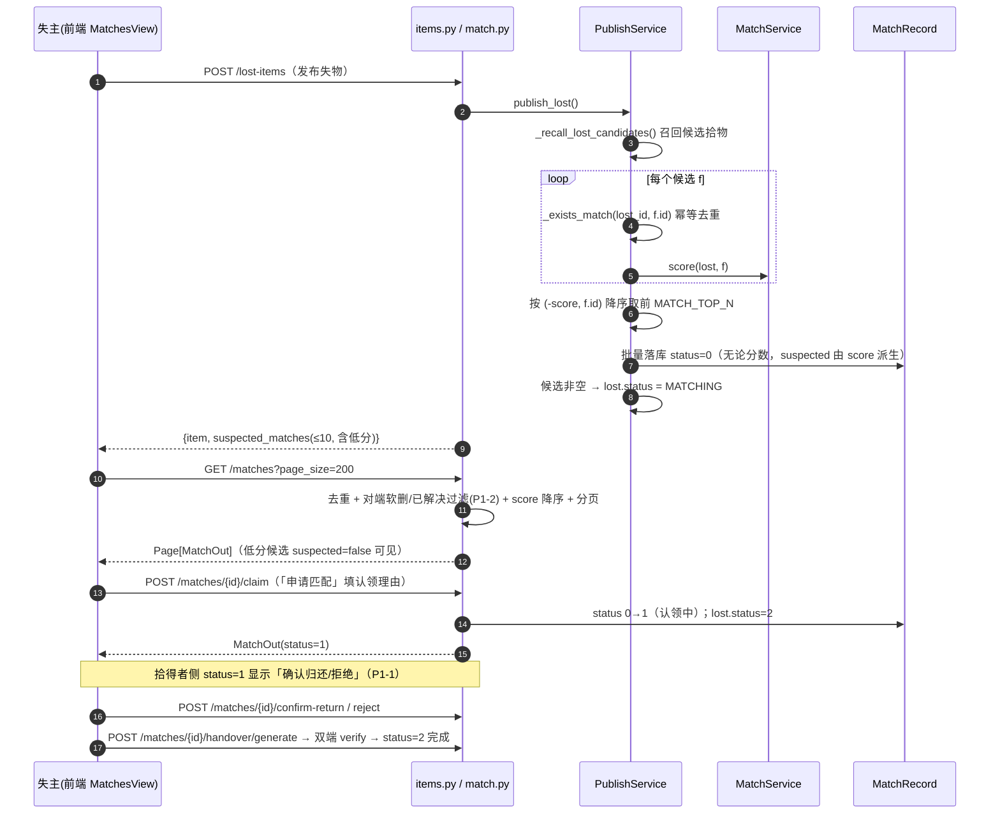
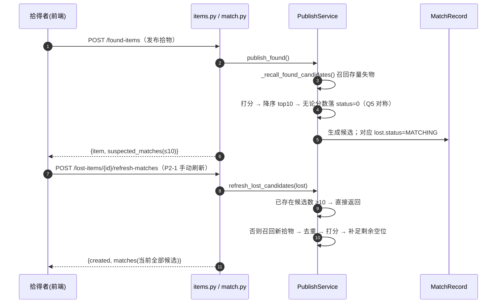
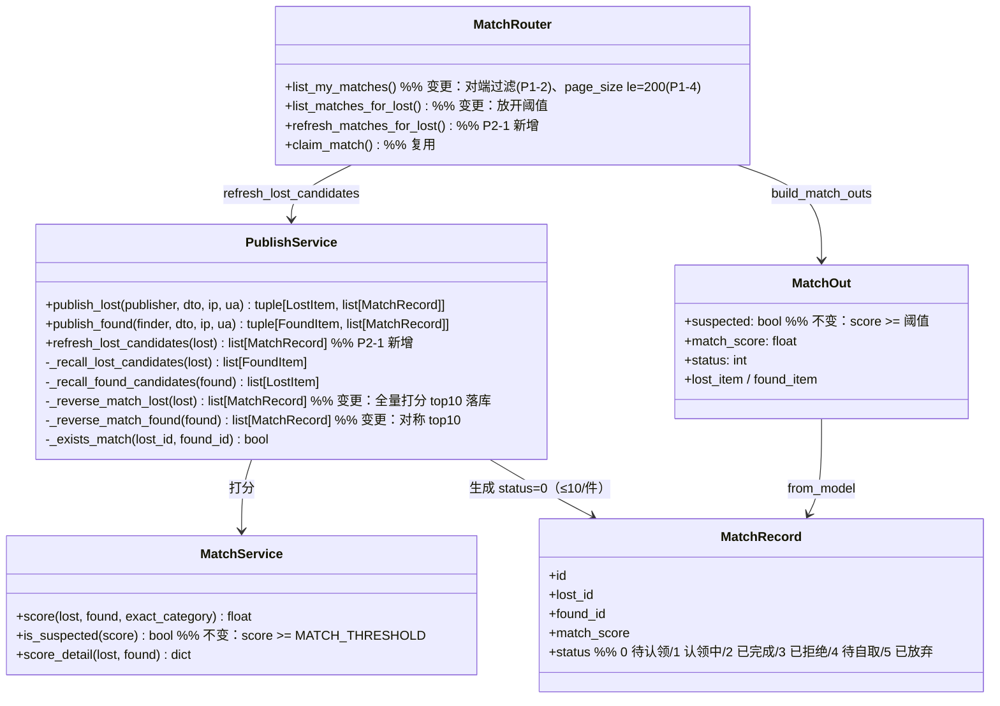

# 增量架构设计：失物发布后「我的匹配」自动陈列 Top10 候选并可直接申请匹配

| 项 | 内容 |
| --- | --- |
| 文档定位 | 在已落地 v8 之上的**增量架构设计 + 任务分解**（对应增量 PRD `docs/prd/2026-08-05-mymatch-top10.md`） |
| 架构师 | Bob（软件架构师） |
| 基线 | v8 六维打分（20·photo + 30·category + 20·appearance + 15·feature + 10·time + 5·location）、阈值 80、状态机 0-5 |
| 文档版本 | 2026-08-05 · 增量 |
| 已拍板决策 | Q1=top10 含低分；Q2=发布时快照落库 + 对称反向匹配 + P2 手动刷新；Q3=复用认领闭环（不新增状态）；Q4=沿用疑似标签+弱化样式+二次确认；Q5=拾得者侧对称落库但低分不打扰 |
| 明确不做 | 不改六维公式/阈值 80/类目/视觉模型；不新增状态枚举；不做全量实时重算；不重做广场页 |

---

## 1. 实现方案总览（增量改动策略）

### 1.1 根因与核心策略

**根因（主理人已实测确认）**：`PublishService._reverse_match_lost()/_reverse_match_found()` 用 `MatchService.is_suspected(score)`（`score >= MATCH_THRESHOLD(80)`）做**硬过滤**，低分候选（实测 60 分）不落 `MatchRecord` → `match_record` 0 行 → 「我的匹配」永远空。

**核心策略（最小变更）**：
1. **生成侧**：发布失物/拾物时，对**全部召回候选**打分 → 按分数降序取前 `MATCH_TOP_N(10)` 条 → **无论分数**均落 `MatchRecord(status=0 待认领)`。`_exists_match` 幂等去重保留。
2. **展示侧**：`GET /matches` 本就不做阈值过滤（只按状态分页），低分候选入库后天然可见；补 P1-2 对端已解决/软删过滤。
3. **申请侧**：**零后端改动**。候选即 `status=0` 的 MatchRecord，失主点「申请匹配」直接复用现有 `POST /matches/{id}/claim`（填理由 → 0→1 认领中 → 拾得者确认归还/拒绝 → 交接码 → 完成）。
4. **新鲜度**：Q2 快照缺口的两个弥补手段——(a) 拾物发布时对称 `_reverse_match_found` 对**存量失物**补 top10；(b) P2-1 新增 `POST /lost-items/{id}/refresh-matches` 手动增量刷新。
5. **低分呈现**：后端 `suspected` 字段语义**不变**（`score >= 80`，验收 5 要求 suspected=true 展示不回归）；前端用 `match_score < 80` 派生「低匹配度」弱化样式 + 「申请匹配」二次确认（见 §6 共享知识与 §7 待明确）。

### 1.2 现状 → 目标行为差异表

| 维度 | 现状（v8） | 目标（本期） | 改动位置 |
| --- | --- | --- | --- |
| 发布失物候选生成 | 仅 `score>=80` 落库，低分全丢 | 全部召回候选打分 → 降序取 top10 → 无论分数落 `status=0` | `publish_service._reverse_match_lost` |
| 发布拾物候选生成 | 仅 `score>=80` 对称匹配 | 对称：全部候选打分 → top10 无论分数落库（Q5） | `publish_service._reverse_match_found` |
| 候选数量上限 | 无明确上限（受阈值天然截断） | 每件失物/拾物 ≤ `MATCH_TOP_N(10)` | `config.MATCH_TOP_N` + 排序切片 |
| 排序 | 入库无序，查询时 `build_match_outs` 降序 | 生成即降序 top10（`(-score, id)` 稳定排序），查询仍降序 | `publish_service` + `build_match_outs` |
| 幂等 | `_exists_match` 去重（任意状态） | 保留不变；刷新同样去重 | `_exists_match` |
| 失物 status | 生成任意候选 → `MATCHING`；0 条不动 | 不变 | `_reverse_match_lost` |
| 「我的匹配」内容 | 低分不可见 | 低分候选可见（`suspected=false`），按分数降序 | `match.py /matches`（补对端过滤） |
| 候选操作 | 失主侧 status=0 显示「认领」 | 统一「申请匹配」（低分二次确认），复用 claim | `MatchesView.vue` |
| 拾得者侧 | status=0 显示「确认归还/拒绝」 | <80 候选弱化「疑似候选（等待失主申请）」无主按钮；失主申请后 status=1 显示确认归还/拒绝 | `MatchesView.vue` |
| 某失物匹配列表 `GET /lost-items/{id}/matches` | 仅返回 `>=80` | 放开阈值返回全部候选（≤10） | `match.py list_matches_for_lost` |
| 分页 | `page_size le=100`，前端取 100 | `/matches` 放宽到 `le=200`，前端取 200（多失物×10 候选场景） | `match.py` + `MatchesView.vue` |
| 手动刷新候选 | 无 | 新增 `POST /lost-items/{id}/refresh-matches`（增量补 top10，去重） | `publish_service.refresh_lost_candidates` + `match.py` |
| 演示模式 mock | 无低分候选、发布不生成候选 | 发布生成候选、低分候选可见、刷新/申请闭环 | `mockData.ts` + `mockAdapter.ts` |

---

## 2. 文件级改动清单

> 约定：`[变更]` = 修改既有逻辑；`[新增]` = 新增文件/方法/路由；`[复用]` = 不改或仅确认。

### 2.1 后端

#### 2.1.1 `app/core/config.py` — `[变更]`（新增 1 个配置）

- 在「匹配打分」区新增：
  ```python
  MATCH_TOP_N: int = 10   # 每件失物/拾物发布时生成的候选上限（Q1/P0-1 拍板）
  ```
- 不改 `MATCH_THRESHOLD = 80.0`（明确不做）。

#### 2.1.2 `app/services/publish_service.py` — `[变更]`（核心）

**方法 `_reverse_match_lost(self, lost)`（重写打分循环，去掉 `is_suspected` 硬过滤）**

```python
def _reverse_match_lost(self, lost: LostItem) -> list[MatchRecord]:
    """失物发布：对全部召回候选打分，按 (-score, found_id) 降序取前 MATCH_TOP_N 条，
    无论分数均落 status=0 待认领；生成任意候选时 lost.status → MATCHING。"""
    candidates = self._recall_lost_candidates(lost)
    scored: list[tuple[float, FoundItem]] = []
    for f in candidates:
        if self._exists_match(lost.id, f.id):   # 幂等去重（任意状态）
            continue
        scored.append((self._matcher.score(lost, f), f))
    scored.sort(key=lambda pair: (-pair[0], pair[1].id))   # 分数降序，同分按 id 升序（确定性）
    created: list[MatchRecord] = []
    for score, f in scored[: settings.MATCH_TOP_N]:
        m = MatchRecord(
            lost_id=lost.id, found_id=f.id, match_score=score,
            status=int(MatchStatus.PENDING_CLAIM),
        )
        self.db.add(m)
        self.db.flush()
        created.append(m)
    if created:                                  # 候选 0 条时不置 MATCHING
        lost.status = int(LostItemStatus.MATCHING)
    return created
```

**方法 `_reverse_match_found(self, found)`（Q5 对称，同样去掉硬过滤）**

```python
def _reverse_match_found(self, found: FoundItem) -> list[MatchRecord]:
    """拾物发布：对称地对『待匹配/匹配中』失物打分，降序取前 MATCH_TOP_N 条无论分数落库；
    每条生成的候选将其 lost.status → MATCHING。"""
    candidates = self._recall_found_candidates(found)
    scored: list[tuple[float, LostItem]] = []
    for l in candidates:
        if self._exists_match(l.id, found.id):
            continue
        scored.append((self._matcher.score(l, found), l))
    scored.sort(key=lambda pair: (-pair[0], pair[1].id))
    created: list[MatchRecord] = []
    for score, l in scored[: settings.MATCH_TOP_N]:
        m = MatchRecord(
            lost_id=l.id, found_id=found.id, match_score=score,
            status=int(MatchStatus.PENDING_CLAIM),
        )
        self.db.add(m)
        self.db.flush()
        created.append(m)
        l.status = int(LostItemStatus.MATCHING)
    return created
```

**方法 `refresh_lost_candidates(self, lost)` — `[新增]`（P2-1 供刷新路由调用）**

```python
def refresh_lost_candidates(self, lost: LostItem) -> list[MatchRecord]:
    """P2-1：对单条失物重跑召回+打分，增量补充新发布拾物。
    去重（_exists_match）、不挤占旧候选、总量仍 ≤ MATCH_TOP_N。"""
    existing = (
        self.db.query(MatchRecord).filter(MatchRecord.lost_id == lost.id).count()
    )
    if existing >= settings.MATCH_TOP_N:
        return []
    candidates = self._recall_lost_candidates(lost)
    scored: list[tuple[float, FoundItem]] = []
    for f in candidates:
        if self._exists_match(lost.id, f.id):
            continue
        scored.append((self._matcher.score(lost, f), f))
    scored.sort(key=lambda pair: (-pair[0], pair[1].id))
    created: list[MatchRecord] = []
    for score, f in scored[: settings.MATCH_TOP_N - existing]:
        m = MatchRecord(
            lost_id=lost.id, found_id=f.id, match_score=score,
            status=int(MatchStatus.PENDING_CLAIM),
        )
        self.db.add(m)
        self.db.flush()
        created.append(m)
    if created:
        lost.status = int(LostItemStatus.MATCHING)
    return created
```

**不改**：`_recall_lost_candidates` / `_recall_found_candidates`（召回口径不变：同类目 ∪ 共享名词 tag，Python 侧过滤）、`_exists_match`、`_category_from_vision`、`_resolve_category_id` 等。

> 规则落点（写入 §6 共享知识）：① 候选上限按**单件失物/单件拾物**计（P0-1/P0-2 验收）；② 排序稳定性用 `(-score, id)`；③ 去重 = 任意 (lost_id, found_id) 已存在即跳过；④ 候选 0 条不动 status；⑤ 生成任意候选置 `lost.status=MATCHING`（沿用现状）。

#### 2.1.3 `app/routers/match.py` — `[变更]`+`[新增]`

1. **`GET /matches`（`list_my_matches`）— `[变更]`（P1-2 + P1-4）**
   - 分页上限：`page_size: int = Query(20, ge=1, le=200)`（仅本路由放宽，P1-4；默认 20 不变）。
   - 在 `unique` 去重排序后、分页切片前，追加对端可见性过滤：
     ```python
     def _counterpart_hidden(m: MatchRecord) -> bool:
         lost = db.get(LostItem, m.lost_id)
         found = db.get(FoundItem, m.found_id)
         if lost is None or found is None:
             return True
         if lost.deleted_at is not None or found.deleted_at is not None:
             return True                      # 对端软删 → 隐藏
         if int(m.status) in (0, 1, 4):       # 进行中候选：对端已解决 → 隐藏
             if int(lost.status) == int(LostItemStatus.RESOLVED) or \
                int(found.status) == int(FoundItemStatus.RESOLVED):
                 return True
         return False
     unique = [m for m in unique if not _counterpart_hidden(m)]
     ```
     > 说明：终态（2 已完成）本就双端已解决，必须保留在「已完成」tab，故只在进行中状态过滤。N 规模小，Python 侧过滤可接受；如需优化可在两个 base query 上 join 过滤。
   - 更新 docstring：结果含低分候选（`suspected=false`），按 score 降序。

2. **`GET /lost-items/{id}/matches`（`list_matches_for_lost`）— `[变更]`（放开阈值）**
   - **删除** `matches = [m for m in matches if float(m.match_score) >= settings.MATCH_THRESHOLD]` 这一行（候选已由发布侧 top10 控制，低分也应可浏览）。
   - 追加与 `/matches` 相同的对端（found 侧）软删/已解决过滤（复用同款 `_counterpart_hidden`）。
   - 更新 docstring：「某失物的候选匹配列表（score 降序，≤10 条，含低分）」。

3. **`POST /lost-items/{id}/refresh-matches` — `[新增]`（P2-1）**
   ```python
   @router.post("/lost-items/{item_id}/refresh-matches", response_model=StandardResponse)
   def refresh_matches_for_lost(item_id, db=Depends(get_db), user=Depends(get_current_user)):
       lost = db.get(LostItem, item_id)
       if lost is None: raise NotFoundError("失物不存在")
       if int(lost.publisher_id) != int(user.id): raise PermissionError()
       if lost.deleted_at is not None: raise ParamError("该失物已删除，不可刷新候选")
       if int(lost.status) == int(LostItemStatus.RESOLVED): raise ParamError("已解决的失物不可刷新候选")
       created = PublishService(db).refresh_lost_candidates(lost)
       db.commit()
       matches = db.query(MatchRecord).filter(MatchRecord.lost_id == item_id).all()
       matches = [m for m in matches if not _counterpart_hidden(m)]
       outs = build_match_outs(db, matches)
       return success(data={"created": len(created), "matches": outs})
   ```
   - 需要 import `PublishService`（match.py 当前未导入）。

4. **`claim_match` / `confirm_return` / `reject` / `handover_*` / `giveup` — `[复用]`**：零改动。低分候选即 status=0，`claim` 天然可用（P0-3 验收③不产生重复记录由 status 0→1 + `_exists_match` 双重保证）。

#### 2.1.4 `app/schemas/match.py` — `[复用/确认]`（不改字段）

- `MatchOut.suspected` 语义**保持不变**（`float(match.match_score) >= threshold`，threshold=80）。
- 无必要不新增字段（`candidate_refresh` 之类不需要，前端用 `match_score` 派生低分判定）。

#### 2.1.5 `app/services/match_service.py` — `[复用]`（不改）

- `MatchService.score()` / `is_suspected()` / `build_match_outs()` 均不改。`build_match_outs` 已有 score 降序，低分候选自动排后。

#### 2.1.6 `app/routers/items.py` — `[变更]`（仅注释/文档语义）

- `create_lost_item` / `create_found_item` 的 `data.suspected_matches` 字段**保留原名**（避免破坏前端契约），更新 docstring：`suspected_matches：本次发布自动生成的候选匹配（≤10 条，可能含低分 score<80）`。

### 2.2 前端

#### 2.2.1 `web/src/types/index.ts` — `[变更]`（新增 1 个类型 + 注释）

- `MatchOut.suspected` 字段注释更新：`// 达到疑似阈值(score>=80，现状语义不变)；低分候选 suspected=false，由前端用 match_score<80 派生弱化样式`。
- 新增：
  ```ts
  export interface RefreshMatchesResult {
    created: number
    matches: MatchOut[]
  }
  ```

#### 2.2.2 `web/src/api/constants.ts` — `[变更]`（新增常量）

- 新增：
  ```ts
  export const MATCH_THRESHOLD = 80 // 与后端 settings.MATCH_THRESHOLD 对齐（前端低分判定口径）
  export const MATCH_TOP_N = 10      // 每件失物候选上限（与后端 settings.MATCH_TOP_N 对齐，P2-2 提示用）
  ```

#### 2.2.3 `web/src/api/match.ts` — `[变更]`（新增 1 个接口）

- 新增：
  ```ts
  refreshMatches(lostId: number): Promise<RefreshMatchesResult> {
    return apiPost<RefreshMatchesResult>(`/lost-items/${lostId}/refresh-matches`, {})
  }
  ```
- `import type { RefreshMatchesResult }` 加入 types 导入。

#### 2.2.4 `web/src/views/MatchesView.vue` — `[变更]`（核心 UI）

1. **低分判定与样式（P0-4/Q4）**
   - 新增 `function isLowScore(m: MatchOut): boolean { return m.match_score < MATCH_THRESHOLD }`。
   - 卡片 class 绑定：`<div v-for="m in visibleMatches" ... :class="{ 'match-card--low': isLowScore(m) }">`。
   - 新增样式 `.match-card--low { border: 1px dashed var(--lf-warn, #f59e0b); background: #fffdf7; }`（弱化灰/橙边框）。
   - 低分候选头部追加弱化标签：`<el-tag v-if="isLowScore(m)" size="small" type="warning" effect="plain">低匹配度·谨慎申请</el-tag>`（文案见 §7 待明确①）。

2. **失主侧 status=0 按钮统一「申请匹配」（P0-3/Q3，推荐 3a）**
   - 现状 `status===0` 显示「认领」→ 统一为「申请匹配」。
   - 高分（≥80）：点击直接 `openClaim(m)`（复用现有认领理由弹窗，流程零变化）。
   - 低分（<80）：点击先 `ElMessageBox.confirm('该候选匹配度较低（<80），请确认对方物品与你的失物一致后谨慎申请。', '低匹配度申请', {confirmButtonText:'继续申请', cancelButtonText:'取消', type:'warning'})`，确认后再 `openClaim(m)`。
   - 其余按钮（去交接确认/完成匹配/未能找回/联系对方）保持现状。

3. **拾得者侧低分不打扰（P1-1）**
   - `myRole(m)==='found' && m.status===0 && isLowScore(m)`：**不渲染**「确认归还/拒绝」，改为弱化提示 `<span class="lf-muted">疑似候选（等待失主申请）</span>`。
   - `myRole(m)==='found' && m.status===0 && !isLowScore(m)`：保持现状（确认归还/拒绝）。
   - `myRole(m)==='found' && m.status===1`：由现状「等待失主完成交接」**改为**「确认归还/拒绝」按钮（Q3 闭环要求：失主申请后拾得者才能确认；后端 `confirm_return` 本就允许 status∈{0,1}）。

4. **空态文案（P1-3）**
   - 进行中空态：`'暂无进行中的匹配。可完善物品外观/特征/地点信息，系统将自动推荐；或前往拾物广场浏览。'`
   - 已完成空态：`'暂无已完成的匹配。'`

5. **候选上限提示（P2-2）**
   - 新增 computed：对「进行中」列表按 `lost_id` 分组，任一组数量 ≥ `MATCH_TOP_N` 时置 `anyLostAtCap=true`。
   - 在 tab 下方渲染 `el-alert`（或 muted 提示）：`'部分失物已达 10 条候选上限，查看更多请前往拾物广场。'`

6. **刷新候选入口（P2-1）**
   - 页面标题行右侧新增按钮「刷新候选」（loading 态）。
   - 逻辑：调用现有「我的发布」接口枚举当前用户**未解决**失物（`GET /users/me/items`，若前端已有 `itemApi.myItems()` 直接复用；没有则加一行封装），逐个 `await matchApi.refreshMatches(l.id)`，全部完成后 `ElMessage.success('候选已刷新')` 并 `load()`。候选已满 10 条的失物后端幂等返回，不报错。
   - 兜底：若 `myItems` 不可用，退化为遍历当前列表去重后的 `lost_id`（局限：无候选的失物不会被刷新，文档注明）。

7. **分页适配（P1-4）**
   - `load()` 中 `page_size` 由 100 改为 200（对齐后端 `/matches le=200`）。

#### 2.2.5 `web/src/api/mockData.ts` — `[变更]`（演示数据）

- 新增 1 个低分候选样本（失主侧，`suspected=false`）：新拾物 found 8（同「水杯」类目但外观差异大，如黑色塑料杯）与 lost 2（白色保温杯，发布者=当前用户 1）组成 match 8，`match_score: 58, status: 0`。
- 新增 1 个拾得者侧低分候选样本（P1-1 演示）：新失物 lost 8（「书籍·大学英语」，发布者 7）与 found 5（书籍，拾得者=当前用户 1）组成 match 9，`match_score: 55, status: 0`。
- 六维明细按比例填（photo/category/appearance/feature/time/location/total 与 match_score 对齐）。

#### 2.2.6 `web/src/api/mockAdapter.ts` — `[变更]`（演示模式对齐新行为）

1. **`handleCreateLost` / `handleCreateFound`**：发布后模拟后端候选生成——
   - 从对侧物品池中筛 `category_name` 相同（或共享名词 tag）的候选，按确定性伪随机打分，取前 `MATCH_TOP_N` 生成 `status=0` 的 MatchOut，`unshift` 进 `mockMatches`；
   - 返回 `{ item, suspected_matches: 生成的候选 }`（与真实后端一致，含低分）；
   - `handleCreateFound` 额外把每条新匹配的 `lost_item.status` 置 1（对称 Q5）。
2. **`handleRefreshMatches(ctx, lostId)`**：对 `mockMatches` 中该 lost_id 的候选去重（同 found_id 跳过）、补足到 `MATCH_TOP_N`，返回 `{ created, matches }`。
3. **`myMatches`**：追加对端可见性过滤（对端 `deleted_at` 或进行中状态对端已解决 → 过滤），与真实后端 P1-2 对齐。
4. **`matchesForLost`**：保持不过滤分数（已与后端放开阈值后的行为一致）。
5. **路由表**新增：
   ```ts
   { method: 'POST', re: /^\/lost-items\/(\d+)\/refresh-matches$/, handler: (c, m) => handleRefreshMatches(c, Number(m[1])) },
   ```
6. `claimMatch` 无需改（低分候选 status=0 → 1 已支持，即「申请匹配」闭环）。

---

## 3. 数据流 / 时序（Mermaid）

### 3.1 失主侧主链路：发布失物 → 候选生成 → 我的匹配 → 申请匹配 → 认领闭环



### 3.2 对称与刷新链路：拾物发布补旧失物候选 + P2-1 手动刷新



---

## 4. 任务列表（有序，按实现顺序）

> 依赖方向：T01 → T02 → T03 → T04；T05 在 T01/T02 后执行。每项给出涉及文件与验收要点。

### T01：后端发布侧候选生成改造（P0-1 + Q5 对称）

- **源文件**：`app/core/config.py`（新增 `MATCH_TOP_N=10`）、`app/services/publish_service.py`（重写 `_reverse_match_lost` / `_reverse_match_found`）、`app/routers/items.py`（`suspected_matches` docstring 语义更新）。
- **依赖**：无（基础任务）。
- **验收要点**：
  1. 发布失物：与某拾物同 category 或共享名词 tag，即使 score<80（如 60）也生成候选（`_exists_match` 去重后）。
  2. 单件失物候选 ≤ 10；按 `(-score, id)` 降序。
  3. 候选 0 条时 `lost.status` 不动；生成任意候选置 `MATCHING`。
  4. 发布拾物对称生成 ≤10 候选失物（Q5）。

### T02：后端查询/刷新接口（P0-2 + P1-2 + P1-4 + P2-1）

- **源文件**：`app/routers/match.py`（`/matches` 对端过滤 + `page_size le=200`、`/lost-items/{id}/matches` 放开阈值、新增 `POST /lost-items/{id}/refresh-matches`）、`app/services/publish_service.py`（新增 `refresh_lost_candidates`）、`tests/test_mymatch_top10.py`（新增，接口级用例：刷新幂等/补增量/对端隐藏/分页）。
- **依赖**：T01。
- **验收要点**：
  1. `GET /matches` 返回含低分候选、分数降序、对端已解决/软删的进行中候选被隐藏。
  2. `GET /lost-items/{id}/matches` 返回 ≤10 条候选（含低分）。
  3. `POST /lost-items/{id}/refresh-matches`：增量补新拾物、不重复生成、总量 ≤10、非失主/已解决/软删失物返回 4xx。
  4. `page_size=200` 可完整返回。

### T03：前端类型与演示 mock 适配（P0-2 展示 + 演示闭环）

- **源文件**：`web/src/types/index.ts`（`RefreshMatchesResult` + suspected 注释）、`web/src/api/mockData.ts`（低分候选样本 ×2）、`web/src/api/mockAdapter.ts`（发布生成候选、`handleRefreshMatches`、`myMatches` 对端过滤、新路由）。
- **依赖**：T02（接口契约）。
- **验收要点**：
  1. 演示模式发布失物后「我的匹配」出现低分候选（`suspected=false`）。
  2. 演示模式「申请匹配」= claim 闭环可用；刷新候选可补新拾物且去重。
  3. 拾得者侧低分候选样本出现（`status=0, score<80`）。

### T04：前端 API 层与「我的匹配」页改造（P0-3/P0-4/P1-1/P1-3/P2-2 + P2-1 入口）

- **源文件**：`web/src/api/constants.ts`（`MATCH_THRESHOLD`/`MATCH_TOP_N`）、`web/src/api/match.ts`（`refreshMatches`）、`web/src/views/MatchesView.vue`（低分弱化样式、统一「申请匹配」+二次确认、拾得者侧低分弱化与 status=1 确认归还/拒绝、空态文案、候选上限提示、刷新候选入口、page_size=200）。
- **依赖**：T03（类型/常量/mock 已就绪）。
- **验收要点**：
  1. 低分候选灰/橙弱化边框 + 「低匹配度·谨慎申请」标签；点击「申请匹配」先二次确认再弹认领理由。
  2. 失主侧 status=0 按钮统一「申请匹配」；高分申请流程不回归。
  3. 拾得者侧 <80 候选无「确认归还」主按钮，显示「疑似候选（等待失主申请）」；失主申请后（status=1）出现「确认归还/拒绝」。
  4. 空态文案、候选上限提示、刷新候选按钮（含 loading）正常。

### T05：后端行为回归测试（P0 验收自动化）

- **源文件**：`tests/test_mymatch_top10.py`（新增：发布即见低分/排序与上限/幂等/低分 claim 闭环/拾物对称/刷新/对端隐藏）、`tests/test_v4_auto_match.py`（更新 AC2：黑色钥匙现会以低分候选出现，断言由「不在列表」改为「score<80 且 suspected=false，且银色 > 黑色」）、`tests/test_publish_flow.py`（确认不回归；如无必要不改）。
- **依赖**：T01、T02。
- **验收要点**：`pytest tests/ -x -q` 全绿；覆盖 PRD 验收标准 1-6。

---

## 5. 依赖包

**无新增依赖**（后端/前端均不需要新增第三方包）。
- 后端沿用 FastAPI / SQLAlchemy 2.x / Pydantic（全部已落地）。
- 前端沿用 Vue3 / Element Plus / Pinia / Axios（全部已落地）。
- 例外说明：无。

---

## 6. 共享知识（跨文件约定）

1. **suspected 判定口径（不变）**：`suspected = match_score >= MATCH_THRESHOLD(80)`（后端 `MatchOut.suspected` / `is_suspected`）。**前端低分判定用 `match_score < MATCH_THRESHOLD` 派生**（`api/constants.ts` 的 `MATCH_THRESHOLD=80`），两者口径一致、不依赖后端新字段。
2. **top10 生成规则（后端发布/刷新共用）**：召回（同类目 ∪ 共享名词 tag，Python 侧过滤）→ `_exists_match` 去重（任意 (lost_id, found_id) 已存在即跳过）→ 打分 → `sorted(key=(-score, id))` 降序取前 `MATCH_TOP_N(10)` → 无论分数落 `status=0`。候选上限按**单件失物 / 单件拾物**计。
3. **状态置位规则**：生成任意候选 → `lost.status = MATCHING`；候选 0 条 → 不动 status；`status=2(待认领)`/`3(已解决)` 失物不参与 `_recall_found_candidates`（现状不变）。
4. **按钮文案统一**：失主侧 status=0 一律「申请匹配」（低分二次确认，高分直接弹认领理由）；拾得者侧 <80 status=0 弱化「疑似候选（等待失主申请）」无主按钮，status=1 显示「确认归还/拒绝」。
5. **空态/提示文案**：进行中空态 =「暂无进行中的匹配。可完善物品外观/特征/地点信息，系统将自动推荐；或前往拾物广场浏览。」；候选满 10 条提示 =「部分失物已达 10 条候选上限，查看更多请前往拾物广场。」
6. **发布响应字段兼容**：`POST /lost-items`、`POST /found-items` 的 `suspected_matches` 字段名不变（现含低分候选，≤10 条），前端不破坏。
7. **演示模式与真实后端行为一致**：mock 的候选生成/刷新/claim/对端过滤与后端同口径（`mockAdapter.ts` 实现同款规则）。
8. **分页约定**：`GET /matches` 后端 `le=200`、前端 `page_size=200`；其余列表接口维持 100。

---

## 7. 待明确事项（默认假设，主理人可转交用户确认）

1. **「疑似匹配」标签语义冲突（重要）**：PRD 多处写"低分候选沿用 `suspected` 标签"，但现状 `suspected=true` 表示 **score≥80**（高分候选当前也显示"疑似匹配"标签），且验收 5 要求 suspected=true 展示不回归。**默认假设**：不反转 `suspected` 字段；低分候选用「低匹配度·谨慎申请」标签 + 弱化样式 + 二次确认（视觉上已充分区分）。若用户坚持低分候选也显示"疑似匹配"四字文案，仅需把该标签文案改为「疑似匹配」（前端一行，无后端改动）。
2. **高分候选按钮文案**：默认统一为「申请匹配」（Q3 子选项 3a，语义一致、前端分支最少）；若用户希望高分保留「认领」，仅改 `MatchesView.vue` 一处文案分支。
3. **刷新候选入口范围**：默认页面级按钮，遍历当前用户**所有未解决失物**（含 0 候选的失物，走 `GET /users/me/items`）。若 `myItems` 前端封装暂缺，退化为只刷当前列表内的 `lost_id`（局限：0 候选失物刷不到，需补封装）。
4. **刷新是否重排全局 top10**：默认"只补空位、不挤占旧候选"（改动最小、幂等直观）。若希望刷新后对全量候选重新取 top10（可能挤掉低分旧候选），需额外定义淘汰规则（本期不做，P2+）。
5. **存量数据补候选**：本期只对**新发布**生效（发布时快照）；历史已发布失物默认无低分候选。如需存量补齐，建议后续提供管理端/脚本批量调用 `refresh_lost_candidates`（本期不做）。
6. **拾得者侧 status=1 显示「确认归还/拒绝」**：这是对现状"等待失主完成交接"（拾得者无法在申请后操作）的小改动，是 Q3 认领闭环落地的必要环节；后端 `confirm_return` 已支持 status∈{0,1}，无迁移风险。若用户希望拾得者侧维持现状提示，则申请后闭环需拾得者先在 status=0 预确认（与 Q3 语义不符，不建议）。

---

## 附：类图（Mermaid，落盘 `docs/architecture/2026-08-05-mymatch-top10-class.mermaid`）


