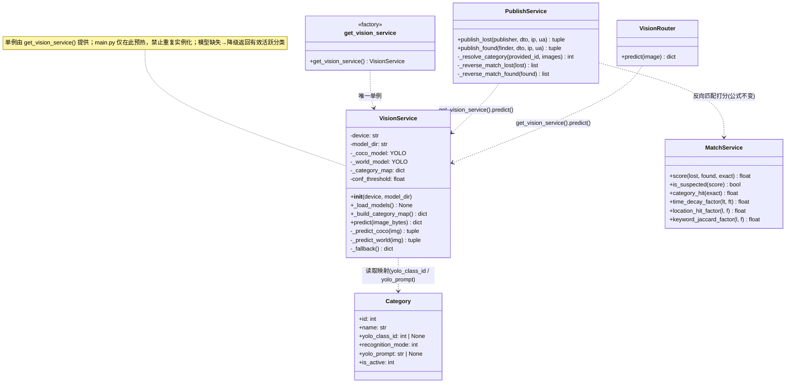
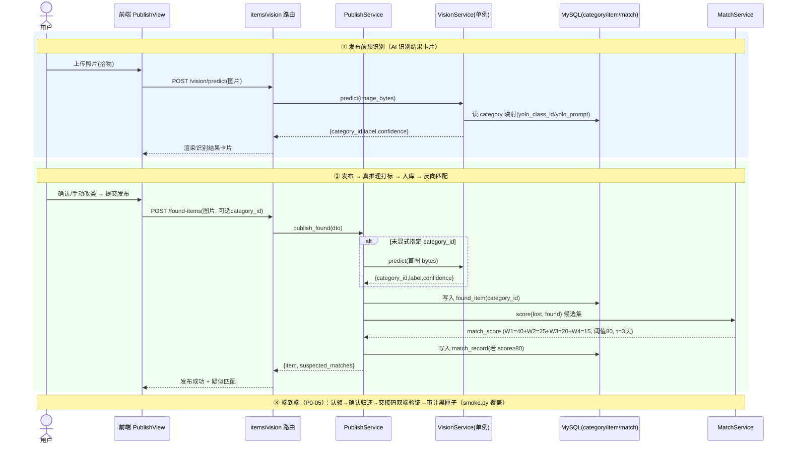
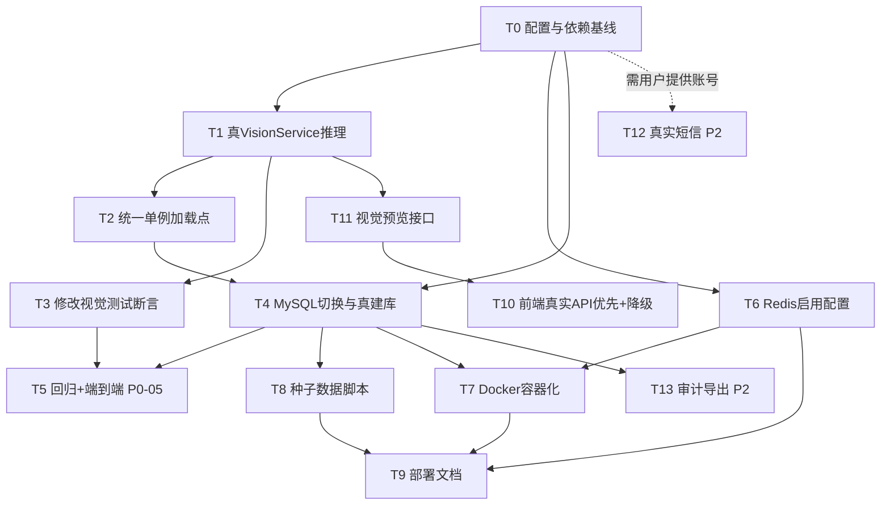

# 增量架构设计文档（Incremental Architecture Design）

| 项 | 内容 |
| --- | --- |
| 系统 | 基于 YOLOv8 的校园失物招领智能匹配系统（四川大学锦江学院本科毕设） |
| 文档定位 | 在已审计落地系统之上，针对《增量 PRD》做**增量架构设计 + 有序任务分解**。**仅含设计与任务，不含实现代码，不修改项目源文件。** |
| 文档版本 | v1.0 |
| 架构师 | 高见远（Gao） |
| 关联文档 | `docs/prd/incremental_prd.md`（需求）、`docs/architecture/class-diagram.mermaid`、`docs/architecture/sequence-diagram.mermaid` |
| 状态 | 待工程师（寇豆码）评审与执行 |

---

## 0. 设计总览（一句话结论）

维持既有 **FastAPI + SQLAlchemy + Vue3/Element Plus** 技术栈；把唯一的视觉桩 `vision_service` 升级为**进程内单例真推理**（YOLOv8n-COCO 9 类 + YOLO-World 零样本 3 类），数据库从 SQLite 切到 **MySQL（本机 9.5 真跑通）**，Redis 仅做**配置化启用 + 进程内内存兜底**，并交付 **Docker 编排 + 幂等种子 + 部署文档**。前端从"强制演示"改为"**真实 API 优先、不可达降级演示**"，发布页新增 AI 识别结果卡片。匹配打分公式/阈值**完全不变**。

> **两条已拍板决策**（详见 §8）：
> - **决策 A（分类 12 vs 13）**：维持 **12 类**（9 COCO + 3 YOLO-World），PRD 中"本子"并入"书籍"(COCO 73)；"笔记本"=COCO 63 作为独立类保留。不动 `seed.py`、不动表结构。
> - **决策 B（Alembic vs create_all）**：本迭代使用 `init_db()` 的 `create_all` 落地 MySQL（幂等、本机可真验证、零迁移风险）；Alembic 作为"正式生产迁移"后续增强列入待明确。

---

## 1. 实现方案 + 框架选型

### 1.1 技术栈（维持 + 增量）

| 层 | 选型 | 说明 |
| --- | --- | --- |
| 后端框架 | FastAPI（维持） | 路由/依赖注入/ lifespan 不变 |
| ORM | SQLAlchemy 2.x（维持） | `create_all` 直接建表，主键已做 `BigInteger().with_variant(Integer,"sqlite")` 跨库兼容 |
| 前端 | Vue3 + Element Plus + Vite（维持） | 仅改 mock 开关逻辑与发布页 |
| **推理** | **`ultralytics`(YOLOv8n + YOLO-World) + `torch` + `torchvision` + `opencv-python-headless` + `numpy`** | **新增**，全部进程内，无独立推理服务 |
| 数据库 | **MySQL 8.0/9.5（本机 9.5）**，驱动 `PyMySQL`（已装） | SQLite 仅作测试/兜底 |
| KV/缓存 | `redis`（包已装）+ 进程内 `_MemoryStore` 兜底 | 启用靠配置，无服务自动降级 |
| 容器化 | `docker-compose`（mysql/redis/backend/frontend） | 交付物，本机不验证 |

### 1.2 视觉推理核心方案（P0-01 / P0-02）

**单例 + 双分支 + 查表反查**，契约 `predict(image_bytes: bytes) -> dict`（`{category_id, label, confidence}`）**对上层零侵入**。

- **加载点唯一化**：仅保留模块级 `get_vision_service()` 作为唯一加载点；`app/main.py` 的 `lifespan` 改为调用 `get_vision_service()` 预热（**删除** `main.py:33` 处 `VisionService()` 重复实例化）。
- **权重位置**：落 `E:/.../失物招领系统/models/weights/`（配置 `YOLO_MODEL_DIR`，严禁 C 盘）。提供 `scripts/download_models.py` 显式下载 `yolov8n.pt` 与 `yolov8s-world.pt` 到该目录；若目录无文件，`__init__` 内 `ultralytics` 也可自动下载（优雅降级，不阻塞启动）。
- **COCO 分支**（9 类，`recognition_mode=0`）：加载 `YOLOv8n`，用 `model.names` 与 `category.yolo_class_id` 建立 `{coco_class_id: category_id}` 映射，检测框按 `yolo_class_id` 反查分类。
- **YOLO-World 分支**（3 类，`recognition_mode=1`）：加载 `yolov8s-world.pt`，调用 `set_classes([yolo_prompt...])` 把校园专属提示词固化；建立 `{yolo_prompt: category_id}` 映射，检测结果按提示词反查分类。
- **合并与择优**：两分支各自取最高置信度候选，全局按 `confidence` 取最优 → 返回 `{category_id, label, confidence}`。
- **降级行为**（模型缺失 / 无检测 / 权重未下载）：返回 `YOLO_FALLBACK_CATEGORY_ID`（默认 0）→ `publish_service._resolve_category` 已有"非活跃/不存在则回退首个活跃分类"逻辑，最终落一个**有效活跃分类 id** + `confidence=0.0` + `label` 取自分类表。
- **分类映射来源**：完全消费 `category` 表已存在的 `yolo_class_id` / `recognition_mode` / `yolo_prompt`，**桩只是没用它们**。

### 1.3 加载时机取舍

- **启动即预热（eager）**：`lifespan` 调用 `get_vision_service()`，在 `init_db` + `seed_categories` 之后加载权重（此时分类表已就绪，可立即构建映射）。CPU 下 YOLOv8n + YOLO-World 加载约数秒，仅在进程启动发生一次。
- **映射惰性兜底（lazy）**：若预热时 DB 未就绪，首次 `predict` 时构建 `category_map` 并缓存（分类极少变动，可缓存）。
- **异常隔离**：权重缺失/加载失败 → `self._coco_model=None`，`predict` 走降级，**绝不抛异常**，保证 56 回归测试与启动稳定。

### 1.4 数据库（P0-03）

- `DATABASE_URL` 由 `sqlite:///./dev.db` 切到 `mysql+pymysql://lf:lf@127.0.0.1:3306/lostfound`（本机 9.5）。
- **建表用 `init_db()` 的 `create_all`**（幂等；`lifespan` 已调用），避免本机无法验证 Alembic 迁移脚本正确性的坑。`deploy/mysql/init.sql` 保留为 DBA 手工建库参考（含分区/外键），**非本迭代主路径**。
- 10 张表全量落地；`id` 用 `BigInteger` 兼容 MySQL；外键/索引随模型定义自动创建。
- **测试策略（关键）**：`tests/conftest.py` 已把 `DATABASE_URL` 强制为 SQLite 测试库且 `REDIS_ENABLED=false`。**回归（56 绿）继续在 SQLite 执行，保证可重复、快速、与 DB 无关**；MySQL 侧通过"应用以 MySQL 启动 + `scripts/smoke.py` 端到端"单独验收（见 §5 T4/T5）。两者共同构成 P0-05 过关闸门。

### 1.5 Redis（P1-01）

- "启用 Redis" = 配置 `REDIS_ENABLED=True` + `REDIS_URL`，**无需重写 `redis_client.py`**；无服务时 `RedisClient.__init__` 自动 `available=False` 走 `_MemoryStore` 兜底，接口行为一致。

### 1.6 前端（P0-04）

- 当前 `utils/demo.ts` 默认 `getDemo()=false`（即真实 API 优先），`demo store.init()` 在"用户从未手动设置"时探测 `/health`，不可达才自动开演示——**核心语义已具备**。增量点：
  1. 网络错误（ECONNREFUSED 等）时**自动切演示 + 全局 Banner 提示**，避免白屏/静默失败。
  2. 发布页新增 **AI 识别结果卡片**（label + 置信度进度条 + 可手动改类）：通过新增后端 `POST /api/v1/vision/predict` 在上传后**预识别**，用户确认或纠偏后再提交发布（`publish_service` 已支持显式 `category_id` 覆盖，零侵入）。
  3. 演示模式下该卡片由 `mockAdapter` 返回确定性占位识别结果。

---

## 2. 文件列表（新建 / 修改，相对项目根）

> 项目根 = `E:/.../失物招领系统`，前端根 = `web/`。

### 2.1 后端

| 操作 | 路径 | 说明 |
| --- | --- | --- |
| **改** | `app/services/vision_service.py` | 桩 → 真推理（双分支 + 映射 + 降级）；保留 `get_vision_service()` 单例 |
| **改** | `app/main.py` | `lifespan` 用 `get_vision_service()` 预热；删除 `VisionService()` 重复实例化；`include_router(vision_router)` |
| **改** | `app/core/config.py` | 新增 `YOLO_COCO_MODEL` / `YOLO_WORLD_MODEL` / `YOLO_CONF_THRESHOLD`；`YOLO_MODEL_DIR` 已存在 |
| **改** | `app/core/seed.py` | 维持 12 类不变（仅确认，无需改；如确需微调提示词在此） |
| **新** | `app/routers/vision.py` | `POST /vision/predict` 预识别接口（支撑前端 AI 卡片） |
| **新** | `app/schemas/vision.py` | 预识别响应 Schema（可选，简单 dict 亦可） |
| **改** | `tests/test_publish_vision.py` | **修改第 18 行断言**（独立任务 T3） |
| **新** | `scripts/download_models.py` | 下载 `yolov8n.pt` / `yolov8s-world.pt` 到 `models/weights/` |
| **改** | `scripts/seed.py` | 增加幂等演示用户 + 示例失物/拾物（P1-03），保持 `seed_categories` 不变 |
| **改** | `requirements.txt` | 新增 `torch` / `torchvision` / `ultralytics` / `opencv-python-headless` / `numpy` |
| **改** | `.env.example` | 增补 MySQL / Redis / 视觉权重配置样例 |
| 参考（不改） | `deploy/mysql/init.sql`、`migrations/0001_initial.py` | DBA 手工建库参考 / 后续生产迁移 |

### 2.2 前端（`web/`）

| 操作 | 路径 | 说明 |
| --- | --- | --- |
| **改** | `src/utils/demo.ts` | 默认真实 API；暴露"强制演示"探测与状态 |
| **改** | `src/stores/demo.ts` | 网络错误自动切演示；新增 `bannerVisible` 状态 |
| **改** | `src/api/request.ts` | 响应拦截：网络错误 → `setDemo(true)` + 触发 Banner |
| **改** | `src/api/mockAdapter.ts` | 新增 `/vision/predict` 路由（演示模式返回占位识别） |
| **新** | `src/api/vision.ts` | `visionApi.predict(file)` 封装 |
| **改** | `src/views/PublishView.vue` | 上传后调 `visionApi.predict` 渲染 AI 识别结果卡片（含置信度进度条 + 手动改类） |
| **新** | `src/components/DemoBanner.vue` | 全局"当前为演示模式"提示条（App.vue 挂载） |
| **改** | `src/App.vue` | 挂载 `DemoBanner`；`demo store.init()` 已在 `main.ts` 调用 |

### 2.3 运维 / 交付物

| 操作 | 路径 | 说明 |
| --- | --- | --- |
| **新** | `Dockerfile` | 后端镜像（python:3.12-slim + CPU torch） |
| **新** | `web/Dockerfile` | 前端构建 + nginx 静态服务 |
| **新** | `web/nginx.conf` | 前端 SPA + 反向代理 `/api` `/uploads` `/health` 到 backend |
| **新** | `docker-compose.yml` | 编排 `mysql` / `redis` / `backend` / `frontend` 四服务 |
| **新** | `docs/deploy.md` | 部署文档（P1-04） |
| **新** | `.dockerignore`（可选） | 构建上下文瘦身 |

---

## 3. 数据结构与接口（Mermaid 类图）

> 完整可渲染文件见 `docs/architecture/class-diagram.mermaid`。



**契约要点**
- `VisionService.predict(image_bytes: bytes) -> dict` 返回固定三键：`{category_id:int, label:str, confidence:float}`。`category_id` 永远落在活跃分类集合内（降级时由 `publish_service` 兜底为首个活跃分类）。
- `Category` 已含映射字段，推理层**只读取、不写回**，零表结构变更。

---

## 4. 程序调用流程（Mermaid 时序图）

> 完整可渲染文件见 `docs/architecture/sequence-diagram.mermaid`。重点画"发布图片 → 真推理 → 入库 → 加权打分"全链路，并含发布前 `vision/predict` 预识别（AI 卡片）。



**不变项强调**：`MatchService.score` 公式、权重 `W1~W4`、阈值 `80`、`τ=3 天` 全部读自 `config`，本迭代**不改动任何一行打分逻辑**。

---

## 5. 任务列表（核心交付 · 有序、含依赖、按实现顺序）

> 规则：覆盖 **P0 全量 + P1 全量**；P2 列建议项。把"修改 `test_publish_vision.py:18` 断言"作为**独立任务 T3** 排入（置于真推理实现之后、回归之前）。每条含：涉及文件、依赖前置、验收点。
> 依赖图见 §5.11（Mermaid）。

### T0 · 配置与依赖基线（P0-03 / P1-01 前置）
- **涉及文件**：`requirements.txt`[改]、`app/core/config.py`[改]、`.env.example`[改]
- **依赖**：无
- **内容**：
  - `requirements.txt` 新增：`torch`(CPU)、`torchvision`、`ultralytics`、`opencv-python-headless`、`numpy`（含注释：torch 用 CPU index 避免拉 CUDA）。
  - `config.py` 新增 `YOLO_COCO_MODEL="yolov8n.pt"`、`YOLO_WORLD_MODEL="yolov8s-world.pt"`、`YOLO_CONF_THRESHOLD=0.25`；保留 `YOLO_DEVICE`/`YOLO_MODEL_DIR`/`YOLO_FALLBACK_CATEGORY_ID`。
  - `.env.example` 增补 `DATABASE_URL=mysql+pymysql://lf:lf@127.0.0.1:3306/lostfound`、`REDIS_ENABLED`、`REDIS_URL`、视觉权重项。
- **验收**：依赖可安装（落 E 盘 venv）；config 字段存在且可被 pydantic 读取；`.env.example` 覆盖 MySQL/Redis/视觉。

### T1 · 真 VisionService 推理实现（P0-01 / P0-02）
- **涉及文件**：`app/services/vision_service.py`[改]、`scripts/download_models.py`[新]
- **依赖**：T0
- **内容**：实现 `__init__` 权重加载（COCO + YOLO-World）、`_build_category_map()`（读 `category` 表的 `yolo_class_id`/`recognition_mode`/`yolo_prompt`）、`predict()` 双分支 + 择优 + `_fallback()`；`download_models.py` 把 `yolov8n.pt`/`yolov8s-world.pt` 下载到 `models/weights/`。
- **验收**：
  1. 签名/返回结构不变；同一字节 → 同一 `category_id`（确定性）。
  2. 真实图片返回 `confidence∈[0,1]` 且成功识别时 `>0`。
  3. 权重缺失/无检测 → 降级为有效活跃分类 + `confidence=0.0`，**不抛异常**。
  4. 权重落 `E:/.../models/weights/`，不写 C 盘。

### T2 · 统一 VisionService 单例加载点（消除重复实例化）
- **涉及文件**：`app/main.py`[改]
- **依赖**：T1
- **内容**：`lifespan` 删除 `app.state.vision = VisionService()`，改为 `app.state.vision = get_vision_service()`（在 `init_db` + `seed_categories` 之后预热）；保留模块级单例为唯一加载点。
- **验收**：进程内仅加载一次模型；`/health` 正常；`get_vision_service() is get_vision_service()`。

### T3 · 修改视觉测试断言（独立任务 · 必做）
- **涉及文件**：`tests/test_publish_vision.py`[改]（第 13–19 行 `test_vision_predict_deterministic_and_confidence`）
- **依赖**：T1
- **内容**（建议改写断言）：
  ```python
  def test_vision_predict_deterministic_and_confidence():
      vs = get_vision_service()
      r1 = vs.predict(PNG)
      r2 = vs.predict(PNG)
      assert r1["category_id"] == r2["category_id"]          # 同字节确定性
      assert 0.0 <= r1["confidence"] <= 1.0                   # 真实区间（成功识别 >0，降级=0）
      assert isinstance(r1["label"], str) and r1["label"]
  ```
  同时确认 `test_vision_predict_category_in_active_set` 仍成立（因降级也返回活跃分类 id）。
- **验收**：换真推理后该测试不再因 `==0.91` 失败；在"有/无权重"两种环境均绿。**此任务不完成则 P0-05 的 56 绿无法达成。**

### T4 · MySQL 切换与真建库（P0-03）
- **涉及文件**：`.env`（用户填 `DATABASE_URL`）、`app/core/database.py`[确认]、`deploy/mysql/init.sql`[参考]、`scripts/seed.py`[改 P1-03 同源]
- **依赖**：T0、T2
- **内容**：以 `DATABASE_URL=mysql+pymysql://...` 启动应用 → `init_db()` 的 `create_all` 在**本机 MySQL 9.5 真建 10 张表**；二次运行幂等；验证 `id` 为 `BIGINT`、外键/索引齐全；`seed_categories` 已落地 12 类。
- **验收**：本机 MySQL 9.5 真建库真跑通；10 表齐全；重复执行不报错；不向 C 盘写数据。

### T5 · 回归测试 + 端到端跑通（P0-05）
- **涉及文件**：`tests/`[运行]、`scripts/smoke.py`[可小改打印 vision 信息]、`tests/conftest.py`[保持 SQLite]
- **依赖**：T3、T4
- **内容**：
  1. **回归闸门**：`pytest` 在 SQLite 执行 → **56 测试全绿**（模型缺失/降级不影响）。
  2. **MySQL 端到端**：以 MySQL 启动应用 + `python scripts/smoke.py` 跑通 注册→登录→发失物(真推理打标)→反向匹配→发拾物→查匹配→认领→确认归还→交接码双端验证→已解决→审计黑匣子。
- **验收**：56 绿；MySQL 下全链路通过；匹配公式/阈值不变；审计可查。

### T6 · Redis 启用配置（P1-01）
- **涉及文件**：`app/core/config.py`[确认]、`app/core/redis_client.py`[不动]、`.env`（设 `REDIS_ENABLED=True`）、`docker-compose.yml`[后续 T7 含 redis 服务]
- **依赖**：T0
- **内容**：通过配置启用 Redis；验证无 Redis 服务时 `RedisClient.available=False` 自动走 `_MemoryStore` 兜底，接口行为一致。
- **验收**：`REDIS_ENABLED=True` 可启用；本机无 Redis → 内存兜底不崩；compose 带 redis 容器。

### T7 · Docker 容器化（P1-02）
- **涉及文件**：`Dockerfile`[新]、`web/Dockerfile`[新]、`web/nginx.conf`[新]、`docker-compose.yml`[新]、`.dockerignore`[可选]
- **依赖**：T4、T6
- **内容**：后端镜像（python:3.12-slim + CPU torch + uvicorn）、前端镜像（node 构建 → nginx，反代 `/api` `/uploads` `/health`）、compose 编排 `mysql`/`redis`/`backend`/`frontend`（网络 + 卷：mysql 数据、`uploads`、`models/weights` 挂载）。
- **验收**：`Dockerfile`/`docker-compose.yml` 语法正确、可 `docker compose config` 校验；**本机无法 `docker compose up` 真验证**（命令不存在），交付物 + 文档注明在用户机器/服务器运行。

### T8 · 种子数据脚本（P1-03）
- **涉及文件**：`scripts/seed.py`[改]、`app/core/seed.py`[确认 12 类]
- **依赖**：T4
- **内容**：在 `seed_categories`（已幂等）基础上，增加幂等写入演示用户（失主/拾得者若干）+ 示例失物/拾物（覆盖多分类与同校区，便于演示与论文佐证）；全表用 `IF NOT EXISTS`/存在性判断保证可重复执行。
- **验收**：MySQL 下可重复执行；`category` 12 类（≤12）；含演示用户与示例记录；二次运行不冲突。

### T9 · 部署文档（P1-04）
- **涉及文件**：`docs/deploy.md`[新]
- **依赖**：T4、T6、T7、T8
- **内容**：环境准备 → 依赖安装（torch/ultralytics/opencv/numpy 约 2GB 落 E 盘）→ 权重下载（`scripts/download_models.py`）→ MySQL 建库（本机 9.5 / compose）→ Redis 启用 → Docker 编排 → 前端真实 API 切换 → 端到端验证清单（56 绿 + smoke.py）。**明确标注**：本机无 docker、无 redis 服务的应对方案。
- **验收**：文档覆盖全部环境；含可执行验证清单；降级路径清晰。

### T10 · 前端真实 API 优先 + 降级（P0-04）
- **涉及文件**：`src/utils/demo.ts`[改]、`src/stores/demo.ts`[改]、`src/api/request.ts`[改]、`src/api/mockAdapter.ts`[改]、`src/views/PublishView.vue`[改]、`src/components/DemoBanner.vue`[新]、`src/App.vue`[改]
- **依赖**：T11
- **内容**：默认真实 API；网络错误自动切演示 + 全局 Banner；发布页 AI 识别结果卡片（调 `visionApi.predict` 渲染 label + 置信度进度条 + 手动改类）；`mockAdapter` 增加 `/vision/predict` 返回占位识别。
- **验收**：后端可达走真实接口；不可达自动降级不白屏且提示；发布页展示真实识别结果并可纠偏；降级模式有可见标识。

### T11 · 后端视觉预览接口（支撑 P0-04 的 AI 卡片）
- **涉及文件**：`app/routers/vision.py`[新]、`app/schemas/vision.py`[新]、`app/main.py`[改 `include_router`]
- **依赖**：T1
- **内容**：`POST /api/v1/vision/predict`（需登录）→ 读首图 bytes → `get_vision_service().predict()` → 返回 `{category_id, label, confidence}`（可选扩展：附建议分类列表供前端手动选择）。
- **验收**：接口返回与 `predict` 契约一致；被 `PublishView` 调用渲染卡片。

### T12 ·（P2-01 建议）真实短信网关
- **涉及文件**：短信服务模块、`app/core/config.py`
- **依赖**：T0；**阻塞项：需用户提供网关账号/Key**（见 §8）
- **内容**：配置化真实网关（如阿里云/腾讯云短信），保留 `DEBUG` 下 `dev_code` 开发路径；不阻断核心流程。
- **验收**：配置账号后可发真实短信；无账号时保持 `dev_code` 路径。

### T13 ·（P2-03 建议）管理员审计导出
- **涉及文件**：`app/routers/admin.py`[新/改]（导出接口）、`web/src/views/AdminView.vue`[改]（导出按钮）
- **依赖**：T4
- **内容**：`GET /admin/audit-logs/export?format=csv|json` 从 MySQL `audit_log` 导出；前端增加导出按钮。
- **验收**：管理员可导出 CSV/JSON；数据来自 MySQL 审计表。

### P2-02 · EXIF/GPS 定位（降级方案，无代码任务）
- **结论**：Web 端浏览器安全限制导致无法读取照片 GPS，**标注为降级**，维持"用户手动选地点层级"（现有 `region_code` 下拉）。**本迭代不新增代码**，仅在 `docs/deploy.md` 注明"未来移动端可补 EXIF/GPS"。

---

## 5.11 任务依赖图（Mermaid）



---

## 6. 依赖包列表（新增进 `requirements.txt`）

```
# ---- 视觉推理（P0-01/P0-02，进程内 YOLOv8n + YOLO-World）----
torch>=2.2,<3.0            # 建议用 CPU index：pip install torch --index-url https://download.pytorch.org/whl/cpu
torchvision>=0.17,<1.0
ultralytics>=8.1,<9.0      # 自动拉取 opencv-python / numpy / pyyaml 等
opencv-python-headless>=4.8,<5.0
numpy>=1.26,<2.0
```
> 注：`ultralytics` 已依赖 `torch`/`opencv`/`numpy`，单独列出便于显式 pin 与 CPU 安装说明。其余既有依赖（`fastapi`/`sqlalchemy`/`pymysql`/`redis`/`pydantic-settings` 等）保持不变。

---

## 7. 共享知识（跨文件约定）

1. **YOLO class ↔ category_id 映射规则**：推理层**只读** `category` 表：
   - `recognition_mode=0`（COCO）：用 `yolo_class_id`（0–79）与模型 `model.names` 反查。
   - `recognition_mode=1`（YOLO-World）：用 `yolo_prompt`（如 `"campus card, student ID"`）经 `set_classes([...])` 固化后反查。
   - 映射在 `VisionService` 内构建并缓存；分类变更极少，无需每次重建。
2. **模型单例唯一加载点**：仅 `app/services/vision_service.py:get_vision_service()`；`app/main.py` 仅在 `lifespan` 预热，**禁止**任何位置再 `VisionService()` 实例化。
3. **权重缺失降级行为**：`predict` 永不抛异常；无模型/无检测 → `category_id=YOLO_FALLBACK_CATEGORY_ID(默认0)` → `publish_service._resolve_category` 兜底为首个活跃分类；`confidence=0.0`；这是 56 回归测试在"无权重"环境也能全绿的关键。
4. **MySQL 连接串格式**：`mysql+pymysql://<user>:<pass>@<host>:3306/<db>`；本机 `127.0.0.1:3306/lostfound`；建表用 `init_db()/create_all`（幂等）。
5. **前端"真实 API 优先 + 不可达降级"开关约定**：`demo` 开关存 `localStorage('lf_demo_mode')`；`getDemo()` 默认 `false`（真实优先）；仅在"用户未手动设置且 `/health` 探测失败"或"网络错误"时自动置 `true`；开启后 `mockAdapter` 拦截请求；UI 须显示"演示模式"标识。
6. **匹配打分不变契约**：`MatchService` 公式 `W1*cat+W2*td+W3*lh+W4*kj`、`W1~W4=40/25/20/15`、阈值 `80`、`τ=3 天`，全部读 `config`，本迭代零改动。
7. **磁盘红线**：权重落 `models/weights/`，上传落 `uploads/`（均配置在 `YOLO_MODEL_DIR`/`UPLOAD_DIR`，项目内 E 盘），**严禁写 C 盘**。
8. **测试环境隔离**：`tests/conftest.py` 强制 SQLite + `REDIS_ENABLED=false`；回归以 SQLite 执行，MySQL 经 `smoke.py` 单独验收。

---

## 8. 待明确事项（含两点拍板 + 需用户决定项）

### 8.1 架构师拍板的两点

**决策 A｜分类 12 类维持，不扩 13 类**
- 维持 `seed.py` 现状：**9 COCO（书包24/手提包26/行李箱28/雨伞25/水杯39/手机67/笔记本63/书籍73/球类32）+ 3 YOLO-World（校园卡/钥匙/玩偶） = 12 类**。
- PRD §0.3 写的"校园专属 4 类（含本子）"与实际 seed 的"3 个 YOLO-World 类"存在差异：本子并入 **"书籍"(COCO 73)**；"笔记本"(COCO 63) 作为"笔记本电脑"独立类保留。此对齐既满足"≤12 类"、又避免新增第 13 类引发的映射/测试扰动，贴合论文口径。
- **不改 `seed.py`、不改 `category` 表**。若用户坚持要独立的"本子"YOLO-World 类（变 13 类），需同步改 `seed.py` + 前端 `SEED_CATEGORIES` + 重新对齐论文，列为后续可选。

**决策 B｜本迭代用 `create_all`，Alembic 作为后续生产迁移**
- 采用 `app/core/database.py:init_db()` 的 `Base.metadata.create_all` 落地 MySQL（幂等、本机 9.5 真跑通、无需验证迁移脚本正确性，规避风险）。`lifespan` 已调用 `init_db()`，零额外改动即可切换。
- `migrations/0001_initial.py`（Alembic，仅建缺失表，幂等）与 `deploy/mysql/init.sql` 保留为 **DBA/正式生产迁移**参考，不纳入本迭代验收主路径。原因：本机无法验证 Alembic 迁移脚本在目标 MySQL 上的正确性，强行上迁移反而引入未验证风险。后续若上生产，再补 Alembic 全量迁移并真机验证。

### 8.2 需用户/工程师后续决定的项

| 项 | 状态 | 说明 |
| --- | --- | --- |
| **真实短信网关账号**（P2-01） | 需用户提供 | 阿里云/腾讯云等短信 API Key、签名、模板；否则保持 `dev_code` 开发路径。T12 阻塞于此。 |
| **训练好的校园专属权重**（P0-02 增强） | 可选用户提供 | 用户把更优的校园权重丢入 `models/weights/` 即可切换，无需改代码（已预留 `YOLO_MODEL_DIR`）。 |
| **YOLO-World 模型尺寸** | 默认 `yolov8s-world.pt` | 若追求更轻量可换更小 world 模型；当前 ultralytics 发布的最小 world 为 s。可在 `config.YOLO_WORLD_MODEL` 调。 |
| **Docker 本机验证** | 本机不可行 | `docker` 命令不存在；交付 `Dockerfile`/`docker-compose.yml`，由用户在自有机器/服务器 `docker compose up` 验证（T7/T9 注明）。 |
| **前端构建 `VITE_API_BASE`** | 部署时设定 | Docker 前端 nginx 反代到 `backend:8000`；本地 dev 经 vite proxy 到 `localhost:8000`，无需改动。 |

---

## 9. 风险与缓解（对齐 PRD §5.3）

- **R1 推理性能/精度（CPU）**：异步/预热加载 + 降级类兜底；`YOLO_DEVICE` 可切 `cuda:0`。发布链路已单图推理，开销可控。
- **R2 分类映射一致性**：seed 固化 `yolo_class_id`/`yolo_prompt`，推理只读反查，`category_id` 稳定。
- **R3 Docker 未真验证**：compose 仅静态交付，部署文档给验证清单，由用户目标环境执行。
- **R4 回归破坏**：T3 显式修断言 + T5 以 SQLite 56 绿为闸门 + MySQL `smoke.py` 双保险；模型缺失降级确保无权重也能全绿。
- **R5 硬盘/依赖体积**：torch/ultralytics 约 2GB 落 E 盘；`requirements.txt` 标注 CPU index，避免拉 CUDA 膨胀。

---

> 文档结束。配套图：`docs/architecture/class-diagram.mermaid`、`docs/architecture/sequence-diagram.mermaid`。
