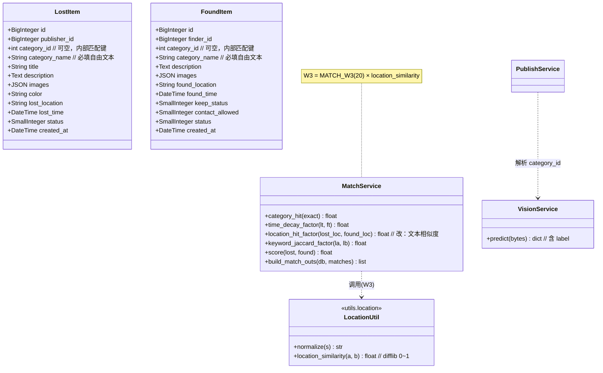
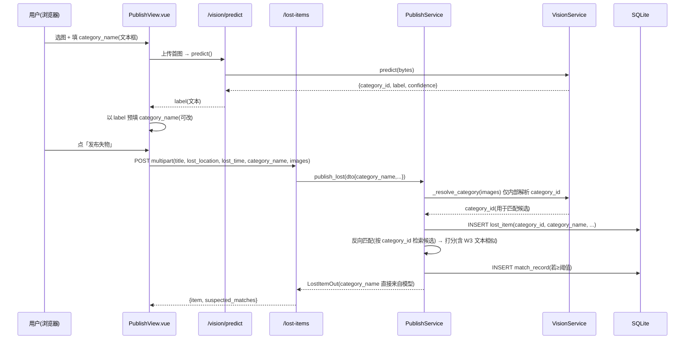
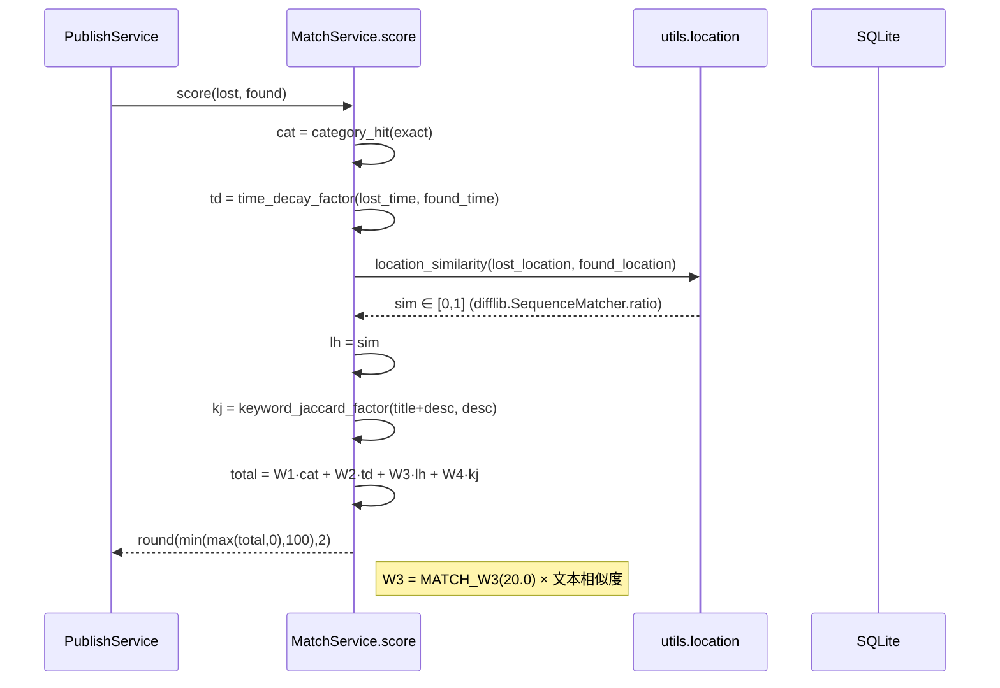
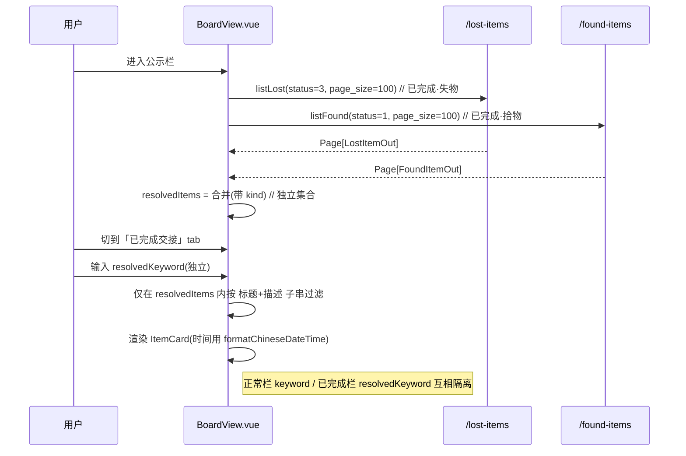

# 失物招领系统 · 增量架构设计 v2（高见远 / 软件架构师）

> 版本：v2 增量（基于既有全量设计 `system_design.md` 与 `incremental_design.md` 之上）
> 语言：中文 ｜ 范围：5 处 P0 变更（A 去校区 / B 失物分类自由文本 / C 拾物分类自由文本 / D 公示栏「已完成交接」独立 tab / E 时间中文显示）
> 前置：产品经理已交付增量 PRD；3 项决策已与用户确认；5 项 PM 待确认问题已由主理人收口（Q1–Q5 已在本文落点）。

---

## 1. 实现方案 + 框架选型

### 1.1 技术栈（沿用，不新增框架）
| 层 | 现状 | 本次是否改动 | 选型说明 |
|---|---|---|---|
| 后端 | FastAPI + SQLAlchemy 2.x + Pydantic v2 + SQLite(dev)/MySQL(prod) | ✅ 模型/路由/服务/Schema | 沿用，无新依赖 |
| 匹配 | `app/services/match_service.py` 加权打分（纯函数） | ✅ W3 重算 | 仅换因子算法，结构不变 |
| 视觉 | `app/services/vision_service.py`（YOLO 进程内单例） | ➖ 仅确认 | `label` 字段已存在，前端消费即可 |
| 前端 | Vue3 + Element Plus + Vite + Axios | ✅ 发布页/公示栏/卡片/工具函数 | 沿用，无新依赖（中文时间用原生实现，不引 moment） |
| 数据迁移 | SQLite（dev.db） | ✅ 新增迁移脚本 | 用 Python 内置 `sqlite3` + `difflib`，**零新增依赖** |

### 1.2 本次涉及的层（沿调用链）
1. **模型层** `app/models/item.py`：去 `region_code`，`category_id` 改可空 FK，新增 `category_name`。
2. **配置层** `app/core/config.py`：删 `DEFAULT_REGION_CODE`；`MATCH_W3` 语义改为「文本地点相似度」权重（值仍为 20.0）。
3. **Schema 层** `app/schemas/item.py` + 前端 `web/src/types/index.ts`：DTO 去 `region_code`/`category_id` 改收 `category_name`；Out 去 `region_code`、读模型 `category_name`。
4. **路由层** `app/routers/items.py`：发布接口改参、列表去 `region_code`/`category_id` 过滤、删 `_category_name` 辅助。
5. **服务层** `app/services/publish_service.py`：构造去 `region_code`、填 `category_name`、`_resolve_category` 仅内部视觉解析。
6. **匹配层** `app/services/match_service.py` + 新增 `app/utils/location.py`：W3 改文本相似度；删 `app/utils/region.py`。
7. **前端视图** `PublishView.vue` / `BoardView.vue` / `ItemCard.vue` + 新增 `web/src/utils/format.ts`。
8. **工具/脚本** `scripts/seed.py`、`scripts/migrate_v2.py`（新增）、`deploy/mysql/init.sql`。

### 1.3 关键设计决策（架构师裁定）
- **D1 · `category_id` 保留但降为「内部匹配键」**：分类对外改为纯自由文本 `category_name`（必填）；`category_id` 仍保留为**可空外键**，仅由视觉服务在发布时内部解析，用于「同类目候选检索」（匹配逻辑不变）。用户不再传 `category_id`，前端不渲染分类下拉。
- **D2 · W3 改用文本地点相似度**（落实 Q1）：`difflib.SequenceMatcher.ratio()` 对归一化后的 `lost_location`/`found_location` 计算相似度 ∈[0,1]，再 ×`MATCH_W3`(20)。公式见 §3.4。
- **D3 · 「已完成交接」tab 数据来源走客户端合并**（落实 D/Q2）：复用既有列表接口 `GET /lost-items?status=3` 与 `GET /found-items?status=1`，前端合并为独立集合并施加**独立关键词**搜索（不做分类筛选）。后端零新增接口，改动最小、与正常栏完全隔离。
- **D4 · 正常公示栏移除旧的固定「分类」下拉**（落实 B/C 自由文本）：原 `categoryFilter` 绑定固定 12 分类 `category_id`，与自由文本矛盾，故移除；正常栏仅保留「范围 + 关键词」。*（见 §8 待确认，非阻塞）*
- **D5 · 中文时间统一走原生映射**：新增 `web/src/utils/format.ts` 的 `formatChineseDateTime`，中文月份/星期写死映射表，禁止英文月份与裸数字（落实 Q3/E）。

---

## 2. 文件列表及相对路径（变更 / 新增 / 删除标注）

### 后端
| 状态 | 路径 | 说明 |
|---|---|---|
| ✏️ 改 | `app/models/item.py` | LostItem/FoundItem 去 `region_code`；`category_id` 改可空 FK；新增 `category_name: String(100) NOT NULL`；索引去 `region_code` |
| ✏️ 改 | `app/core/config.py` | 删 `DEFAULT_REGION_CODE`（L79）；`MATCH_W3` 注释改为「文本地点相似度权重」 |
| ✏️ 改 | `app/schemas/item.py` | DTO 去 `region_code`/`category_id` 改收 `category_name`；Out 去 `region_code`、`category_id` 改 `Optional[int]`、`category_name` 改 `str`；`from_model` 直接读 `item.category_name` |
| ✏️ 改 | `app/routers/items.py` | 发布接口改参（去 `region_code`/`category_id`，收 `category_name`）；列表去 `region_code`/`category_id` 过滤；删 `_category_name` 辅助 |
| ✏️ 改 | `app/services/publish_service.py` | 构造去 `region_code`、填 `category_name`；`_resolve_category` 仅内部视觉解析；`build_match_outs` 调用见下 |
| ✏️ 改 | `app/services/match_service.py` | 删 `region` 导入，改 import `location`；`location_hit_factor` 改收 `lost_location`/`found_location` 返回文本相似度；`build_match_outs` 改读 `item.category_name`（去 `Category` 关联查询） |
| 🆕 新 | `app/utils/location.py` | `location_similarity(a, b) -> float`（0~1），基于 `difflib.SequenceMatcher` |
| 🗑️ 删 | `app/utils/region.py` | 仅被 match_service 使用，W3 重构后无引用，删除 |
| ➖ 确认 | `app/routers/vision.py` + `app/schemas/vision.py` | 响应已含 `label` 字段，无需改动（落点见 §3.3） |
| ➖ 确认 | `app/routers/admin.py` | **Q5 结论**：admin 仅审计导出，未引用 `region_code`；全仓无 `app/routers/stats*` 文件 → **无 region 统计，无需改** |
| 🆕 新 | `scripts/migrate_v2.py` | SQLite 迁移脚本（DROP COLUMN / recreate 双路径 + 可复跑），见 §3.5 / Q4 |
| ✏️ 改 | `deploy/mysql/init.sql` | 去 `region_code` 列与复合索引（`idx_*_cat_status_region`），加 `category_name`，索引改为 `(category_id, status)` |
| ✏️ 改 | `scripts/seed.py` | 示例记录去 `region_code`；`category_id` 改从 `cat` 字典取、并补 `category_name=原分类名`（如 `"书包"`） |

### 前端
| 状态 | 路径 | 说明 |
|---|---|---|
| ✏️ 改 | `web/src/views/PublishView.vue` | 删两处校区 select；失物「物品分类」改 `category_name` 文本框；拾物「确认/修改类别」select 改 `category_name` 文本框并以 `visionResult.label` 预填；reactive/提交 FormData 去 `region_code`/`category_id`、加 `category_name` |
| ✏️ 改 | `web/src/views/BoardView.vue` | `typeFilter` 增「已完成交接」(value=`resolved`)；新增 `resolvedItems` 独立集合 + 独立 `resolvedKeyword` 搜索（仅关键词，无分类）；移除旧的固定 `categoryFilter` 下拉；详情弹窗时间改用 `formatChineseDateTime` |
| ✏️ 改 | `web/src/components/ItemCard.vue` | `timeText` 改用 `formatChineseDateTime`（丢失/拾取时间统一中文） |
| 🆕 新 | `web/src/utils/format.ts` | `formatChineseDateTime(iso) -> "YYYY年M月D日 周X"`（中文月份/星期映射表） |
| ✏️ 改 | `web/src/api/constants.ts` | 删 `DEFAULT_REGION_CODE`、`REGION_OPTIONS`；`SEED_CATEGORIES`/`categoryName()` 确认无引用后移除（前端不再依赖固定分类） |
| ✏️ 改 | `web/src/types/index.ts` | `LostItemOut`/`FoundItemOut` 去 `region_code`、`category_id` 改 `number \| null`、`category_name` 改 `string` |
| ✏️ 改 | `web/src/api/items.ts` | `ItemListParams` 去 `region_code`/`category_id`（保留 `status`） |
| ✏️ 改 | `web/src/api/mockData.ts` + `web/src/api/mockAdapter.ts` | 演示模式去 `region_code`/`category_id`，改 `category_name`（演示自洽） |

### 测试（同步改，见 T-E）
`tests/conftest.py`、`tests/test_errors.py`、`tests/test_qa_e2e.py`、`tests/test_publish_vision.py`、`tests/test_publish_flow.py`（去 `region_code` 改 `category_name`、去 `category_id` 表单）、`tests/test_match.py`（重写 `test_location_hit_factor` 为文本相似度语义；`_item` 辅助改带 `lost_location`/`found_location`）。

---

## 3. 数据结构与接口变更

### 3.1 LostItem / FoundItem 新字段表（diff）

**LostItem（失物）**
| 字段 | 原 | 新（v2） | 说明 |
|---|---|---|---|
| `region_code` | `CHAR(6) NOT NULL` | **删除** | A：校区字段全清 |
| `category_id` | `FK category.id NOT NULL` | `FK category.id NULL`（可空） | 保留为内部匹配键（D1） |
| `category_name` | 无（仅有 Out 层） | **新增 `String(100) NOT NULL`** | B：纯自由文本，必填 |
| `lost_location` / `lost_time` / 其他 | 不变 | 不变 | — |
| 索引 | `idx_lost_cat_status_region(category_id,status,region_code)` | `idx_lost_cat_status(category_id,status)` | 去 region_code |

**FoundItem（拾物）**
| 字段 | 原 | 新（v2） | 说明 |
|---|---|---|---|
| `region_code` | `CHAR(6) NULL` | **删除** | A |
| `category_id` | `FK category.id NOT NULL` | `FK category.id NULL` | 内部匹配键（D1） |
| `category_name` | 无 | **新增 `String(100) NOT NULL`** | C：纯自由文本，必填 |
| `found_location` / `found_time` / 其他 | 不变 | 不变 | — |
| 索引 | `idx_found_cat_status_region(category_id,status,region_code)` | `idx_found_cat_status(category_id,status)` | 去 region_code |

### 3.2 视觉接口返回（Q：vision 返回加 label）
`VisionPredictResponse`（`app/schemas/vision.py`）**已含 `label: str` 字段**（见 L21-24），`app/routers/vision.py` 已回传。
- **结论**：后端无需改。落点 = 前端 `PublishView.vue` 以 `visionResult.label` 预填 `category_name` 文本框（§4 ①）。
- 验收点：`POST /vision/predict` 响应 JSON 含 `label`（文本，非 id）。

### 3.3 公示栏「已完成交接」数据来源 + 独立搜索参数（D / Q2）
- **集合定义**：`已完成 = lost_item WHERE status = 3（已解决） ∪ found_item WHERE status = 1（已解决）`。
- **数据源（D3）**：前端分别调用既有接口
  - `GET /lost-items?status=3&page=1&page_size=100`
  - `GET /found-items?status=1&page=1&page_size=100`
  合并为 `resolvedItems: BoardItem[]`（带 `kind`）。
- **独立搜索参数（Q2）**：该 tab 仅一个独立关键词输入框 `resolvedKeyword`（前端 `ref`），在 `resolvedItems` 集合内按「标题+描述」子串检索；**不做 `category_name` 分类筛选**（P1 再做）。与正常栏的 `keyword`/`typeFilter` 完全隔离（各自独立 state）。
- 后端：本迭代**不新增**接口（最小改动、隔离清晰）。

### 3.4 新增中文时间格式化工具（E / Q3）
`web/src/utils/format.ts`：
```ts
const CN_MONTHS = ['一','二','三','四','五','六','七','八','九','十','十一','十二']
const CN_WEEK = ['日','一','二','三','四','五','六']
export function formatChineseDateTime(iso: string | null | undefined): string {
  if (!iso) return '—'
  const d = new Date(iso)
  if (Number.isNaN(d.getTime())) return '—'
  const y = d.getFullYear(), m = d.getMonth(), day = d.getDate(), w = d.getDay()
  return `${y}年${CN_MONTHS[m]}月${day}日 周${CN_WEEK[w]}`   // 如：2026年七月十七日 周三
}
```
- 卡片与详情弹窗**统一用完整式**「YYYY年M月D日 周X」；禁止英文月份与裸数字（Q3）。
- 落点：`ItemCard.vue` 的 `timeText`、`BoardView.vue` 详情弹窗的时间字段（丢失/拾取/创建时间）均调用此函数。

### 3.5 存量数据迁移（Q4）— `scripts/migrate_v2.py`
**安全做法（可复跑）**：
1. 检查 `sqlite3.sqlite_version`（Python 内置 `sqlite3` 包装的 lib 版本）。
2. **若 ≥ 3.35.0**（支持 `DROP COLUMN`）：
   - `ALTER TABLE <t> DROP COLUMN region_code;`
   - 先 `DROP INDEX IF EXISTS idx_<t>_cat_status_region;`（DROP COLUMN 会自动连带，但显式更稳）
   - `ALTER TABLE <t> ADD COLUMN category_name VARCHAR(100) NOT NULL DEFAULT '';`
   - `UPDATE <t> SET category_name = (SELECT name FROM category WHERE category.id = <t>.category_id) WHERE category_id IS NOT NULL;`
   - 重建 `CREATE INDEX IF NOT EXISTS idx_<t>_cat_status (category_id, status);`
3. **若 < 3.35.0**（recreate 方案）：
   - 建新表 `<t>_new`（不含 `region_code`，含 `category_name`），
   - `INSERT INTO <t>_new (...除 region_code 外..., category_name) SELECT ..., COALESCE((SELECT name FROM category WHERE category.id = <t>.category_id), '') FROM <t>;`
   - `DROP TABLE <t>;` → `ALTER TABLE <t>_new RENAME TO <t>;` → 重建索引。
4. **幂等**：每步前用 `PRAGMA table_info(<t>)` 判断列是否存在，已迁移则跳过；打印迁移摘要。
5. **最简化替代**：直接删除 `dev.db` 后执行 `python scripts/seed.py`（模型已更新，`init_db()` 以新 schema 建表并写种子/演示数据）。脚本 docstring 注明此快捷路径。

### 3.6 类图（变更后核心类，mermaid）


---

## 4. 程序调用流程（时序图）

### ① 发布失物：上传 → 视觉预填 → 自由文本提交 → 存储


### ② 匹配打分：W3 改「文本地点相似」


### ③ 公示栏三范围 + 「已完成交接」独立搜索


---

## 5. 任务列表（有序、含依赖、按实现顺序）

> 编号 T-A … T-E 对应 5 处 PRD 变更；每任务列出「改哪个文件 / 依赖前序 / 验收点」，并覆盖主理人要求的 13 个必含子项。

### T-A · 数据层：去校区 + 新增 category_name + 迁移基建（对应 A，并奠基 B/C）
- **改哪个文件**
  - `app/models/item.py`（去 `region_code`；`category_id` 改可空 FK；新增 `category_name: String(100) NOT NULL`；索引去 `region_code`）
  - `app/core/config.py`（删 `DEFAULT_REGION_CODE`；`MATCH_W3` 注释改「文本地点相似度权重」）
  - `deploy/mysql/init.sql`（去 `region_code` 列+复合索引，加 `category_name`，索引改 `(category_id,status)`）
  - `scripts/migrate_v2.py`【新增，落实 Q4】
- **依赖前序**：无
- **验收点**
  - `python -c "import app.models.item"` 无 ImportError；
  - `python scripts/migrate_v2.py` 对 `dev.db` 成功，迁移后 `PRAGMA table_info` 确认无 `region_code`、有 `category_name`、`category_id` 仍存在；
  - 或删 `dev.db` 后 `python scripts/seed.py` 能按新 schema 建表；
  - `config.py` 中无 `DEFAULT_REGION_CODE`。

### T-B · Schema 层：分类改自由文本字段（对应 B/C 字段面）
- **改哪个文件**
  - `app/schemas/item.py`（`LostItemPublishDTO`/`FoundItemPublishDTO` 去 `region_code`/`category_id`、加 `category_name: str`；`LostItemOut`/`FoundItemOut` 去 `region_code`、`category_id` 改 `Optional[int]`、`category_name` 改 `str`；`from_model` 直接读 `item.category_name`，移除对 `_category_name` 的依赖）
  - `web/src/types/index.ts`（`LostItemOut`/`FoundItemOut` 去 `region_code`、`category_id` 改 `number | null`、`category_name` 改 `string`）
  - `web/src/api/items.ts`（`ItemListParams` 去 `region_code`/`category_id`，保留 `status`）
- **依赖前序**：T-A（模型字段先定）
- **验收点**：后端启动无 pydantic 校验错误；`LostItemOut`/`FoundItemOut` 响应含 `category_name` 且不含 `region_code`；前端类型与后端对齐。

### T-C · 路由/服务/匹配层：发布改参 + vision label 落地 + W3 重算（对应 B/C 接口 + Q1）
- **改哪个文件**
  - `app/routers/items.py`（`create_lost_item`/`create_found_item` 去 `region_code`/`category_id` 表单参数、改收 `category_name: Form(...)`；`list_lost_items`/`list_found_items` 去 `region_code`/`category_id` 查询过滤；删 `_category_name` 辅助，`from_model` 调用去第二参）
  - `app/services/publish_service.py`（构造 `LostItem`/`FoundItem` 去 `region_code`、加 `category_name=dto.category_name`；`_resolve_category` 去掉用户 `provided_id` 入参，仅内部视觉解析；审计 `detail` 沿用解析出的 `category_id`）
  - `app/services/match_service.py`（删 `from app.utils import region`；改 `from app.utils import location`；`location_hit_factor(lost_loc, found_loc)` 改返回 `location.location_similarity`；`score` 中 W3 以 `MATCH_W3 × sim` 计算；`build_match_outs` 改读 `lost.category_name`/`found.category_name`，移除 `Category` 关联查询）
  - `app/utils/location.py`【新增，`location_similarity(a,b)` 基于 `difflib.SequenceMatcher` 归一化相似度(0~1)】
  - `app/utils/region.py`【删除】
  - `app/routers/vision.py` + `app/schemas/vision.py`（确认 `label` 已返回，**无需改**，标注验收）
- **依赖前序**：T-A、T-B
- **验收点**
  - 发布失物/拾物接口仅收 `category_name`，不再有 `region_code`/`category_id` 入参；
  - 匹配打分 W3 随 `lost_location`/`found_location` 文本相似度变化（`difflib` 单测可验）；
  - `app/utils/region.py` 已删且无残留 import；`POST /vision/predict` 响应含 `label`。

### T-D · 前端发布页：去校区 + 自由文本 + 视觉预填（对应 A/B/C 前端面）
- **改哪个文件**
  - `web/src/views/PublishView.vue`（删失物 L143-148 与拾物 L96-101 两处校区 select；失物「物品分类」改 `category_name` 文本框；拾物「确认/修改类别」select 改 `category_name` 文本框并以 `visionResult.label` 预填；`reactive` 去 `region_code`/`category_id` 加 `category_name`；`onSubmitLost`/`onSubmitFound` 的 FormData 去 `region_code`/`category_id`、加 `category_name`）
  - `web/src/api/constants.ts`（删 `DEFAULT_REGION_CODE`、`REGION_OPTIONS`；`SEED_CATEGORIES`/`categoryName()` 确认无引用后移除）
  - `web/src/api/mockData.ts` + `web/src/api/mockAdapter.ts`（演示模式去 `region_code`/`category_id`，改 `category_name` 自洽）
- **依赖前序**：T-B（类型/字段稳定）
- **验收点**：发布页无校区下拉；分类为可编辑文本框且预填视觉 `label`；提交成功且后端仅收 `category_name`；演示模式仍可跑通。

### T-E · 前端公示栏：第三 tab + 独立搜索 + 中文时间 + 测试同步（对应 D/E + 测试）
- **改哪个文件**
  - `web/src/views/BoardView.vue`（`typeFilter` 增「已完成交接」value=`resolved`；新增 `resolvedLostItems`/`resolvedFoundItems` 加载（status 3 / 1）并合并为 `resolvedItems`；新增独立 `resolvedKeyword` 搜索（仅关键词、无分类，落实 Q2）；过滤/分页逻辑与正常栏隔离；**移除旧的固定 `categoryFilter` 下拉**（落实 D4）；详情弹窗时间字段改用 `formatChineseDateTime`）
  - `web/src/components/ItemCard.vue`（`timeText` 改用 `formatChineseDateTime`，丢失/拾取时间统一中文）
  - `web/src/utils/format.ts`【新增，`formatChineseDateTime` 中文月份/星期映射】
  - 测试同步改：`tests/conftest.py`、`tests/test_errors.py`、`tests/test_qa_e2e.py`、`tests/test_publish_vision.py`、`tests/test_publish_flow.py`（去 `region_code` 改 `category_name`、去 `category_id` 表单参数）；`tests/test_match.py`（`_item` 辅助改带 `lost_location`/`found_location`；重写 `test_location_hit_factor` 为文本相似度语义，如「图书馆三楼」vs「图书馆二楼」高相似、「图书馆」vs「食堂」低相似）；并确认 admin/stats 无 region 引用需改（Q5）
- **依赖前序**：T-C（后端接口稳定）、T-D
- **验收点**
  - `pytest` 全绿（78 例同步更新后）；
  - BoardView 三范围搜索隔离，「已完成交接」仅关键词检索且集合 = 失物 status=3 ∪ 拾物 status=1；
  - 卡片与详情弹窗时间为「YYYY年M月D日 周X」中文格式，无英文月份/裸数字。

---

## 6. 依赖包列表
**本次不新增任何后端/前端依赖。**
- 后端：`difflib`（Python 标准库，W3 文本相似度）、`sqlite3`（Python 标准库，迁移脚本）。无需 `pip install`。
- 前端：中文时间用原生 `Date` + 手写映射表实现，**不引入 moment / dayjs / date-fns**。
- `requirements.txt` 无需变动。

---

## 7. 共享知识（跨文件约定）

1. **中文星期/月份映射表唯一来源**：`web/src/utils/format.ts` 的 `CN_MONTHS` / `CN_WEEK`。任何需中文时间的组件统一调用 `formatChineseDateTime`，禁止在组件内散写 `getMonth()+1 + '月'` 之类。
2. **`category_name` 非空校验规则**：
   - 前端：失物「分类」文本框必填（视觉 `label` 预填后用户可改，提交前校验非空）；
   - 后端：`category_name: str = Form(...)`（必填），`publish_service` 收到后 `strip()`，空串则视作参数错误（返回 422/ParamError）；拾物同理（视觉预填保证非空）。
   - `category_id` **不再面向用户**，仅由 `VisionService` 在发布时内部解析，用于匹配候选检索。
3. **W3 文本相似度归一化口径（0~1）**：
   - `location_similarity(a, b) = difflib.SequenceMatcher(None, normalize(a), normalize(b)).ratio()`；
   - `normalize` = 去首尾空格、转小写、合并内部连续空白；
   - 两者皆为空 → `0.0`（无地点信息，不给分）；仅其一为空 → `0.0`；
   - 打分贡献 = `MATCH_W3(20.0) × sim`，与旧 `location_hit` 同属 [0,1]×W3，权重值不变。
4. **视觉 `label` 已存在**：前端只用 `label` 预填 `category_name`；响应中的 `category_id` 前端忽略（保留无害，仅供后端内部解析复用）。
5. **「已完成交接」隔离约定**：该 tab 的搜索状态（`resolvedKeyword`）与正常栏（`keyword`/`typeFilter`）完全独立；数据来自既有 `status` 过滤列表接口，本期不新增后端接口。
6. **迁移脚本幂等约定**：`scripts/migrate_v2.py` 每次运行前用 `PRAGMA table_info` 判断列存在性，已迁移则跳过；可反复执行；删除 `dev.db` 后 `python scripts/seed.py` 为等效快捷路径。

---

## 8. 待明确事项
1. **（建议性、非阻塞）正常公示栏旧的固定「分类」下拉是否移除** —— 本设计按 D4 建议**移除**（自由文本分类下固定 12 分类下拉已无意义）。若产品希望保留，请在 P1 改为「按 `category_name` 子串筛选」，本期不动。请产品确认。
2. 正常栏搜索本期**不做** `category_name` 子串/相似筛选（属 P1，与 Q2 的「已完成」tab 一致）。
3. 其余 5 项 PM 待确认问题（Q1–Q5）均已按主理人收口执行，无新增阻塞。
> 除上述第 1 项需产品点头确认外，其余**无**待明确。
