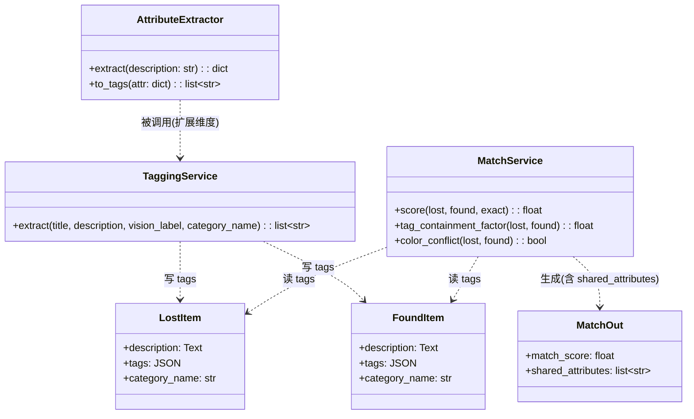
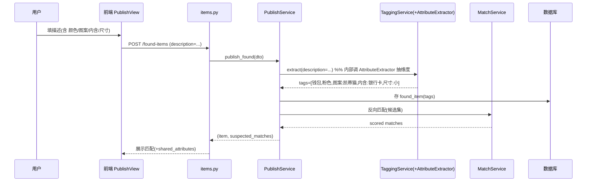

# 三重融合匹配架构设计（系统识别 + 拾者描述 + 失者描述）

> 作者：主理人齐活林（架构师 agent `software-architect` 在当前环境未注册，设计由主理人代拟并落地，供工程师实现、QA 验证）
> 日期：2026-07-20
> 约束：**不接任何大模型（LLM）**。属性提取用 `jieba` 中文分词 + 同义词词典（离线、零成本、可解释、确定性）。

---

## 1. 背景与现状（已核实代码）

现有系统**已经具备三重信号的雏形**，本设计是"扩展"而非"重写"：

| 信号 | 现状 | 代码位置 |
|------|------|---------|
| **S 系统识别** | 拾物图经 `VisionService`(best.pt) 识别 → `vision_label` 写入 `tags`；`category_name` 驱动 `category_hit` | `app/services/vision_service.py`、`app/services/tagging_service.py` |
| **F 拾者描述** | `FoundItem.description`(选填) 经 `TaggingService.extract` 抽成 `tags` | `app/models/item.py:93`、`app/services/tagging_service.py` |
| **L 失者描述** | `LostItem.description`(必填) 经 `TaggingService.extract` 抽成 `tags` | `app/models/item.py:49` |

**现有打分引擎**（`app/services/match_service.py`）已用 `tags` 做核心匹配：
- `tag_containment_factor`：`|lost.tags ∩ found.tags| / |lost.tags|`（失物查询命中率）
- `color_conflict`：双方都显式指定颜色且不相交 → 强制 score=0
- `category_hit`：类目精确 1.0 / 父级 0.5
- 综合：`score = w_photo·photo + w_tag·containment + w_cat·cat + w_time·time`（权重读自 config）

**核心缺口**：`TaggingService` 当前是**子串匹配固定词表**，覆盖不了用户自由描述里的
`hellokitty/凯蒂猫`、`银行卡`、`小巧/巴掌大` 等，也没有"图案/内含物/尺寸"这类属性维度。

→ **本设计的唯一实质新增**：用 `jieba` 分词 + 同义词词典，把描述文本抽成**带维度的结构化标签**
（图案/内含/尺寸 + 同义词归一化），回写进现有 `tags`，使现有打分引擎自动获得"文本重合度"信号。

---

## 2. 属性 Schema（JSON）

```json
{
  "category": "钱包",            // 与现有 noun 对齐
  "color": "粉",                 // 归一化后（粉色/粉红→粉）
  "pattern": ["凯蒂猫"],         // 图案（hellokitty/凯蒂猫→凯蒂猫）
  "contents": ["银行卡"],        // 内含物（银行卡/卡→银行卡）
  "size": "小"                   // 尺寸（小巧/巴掌大/迷你→小）
}
```

**落库为 tags 时的前缀约定**（避免与颜色/名词混淆，且不影响 `color_conflict` 判定）：
- 名词/类目：纯文本，如 `钱包`、`钥匙`
- 颜色：纯文本，如 `粉色`（保留，供 `color_conflict` 识别）
- 图案：`图案:` 前缀，如 `图案:凯蒂猫`
- 内含物：`内含:` 前缀，如 `内含:银行卡`
- 尺寸：`尺寸:` 前缀，如 `尺寸:小`

---

## 3. 同义词词典（扩展 `tagging_service`）

在 `app/services/tagging_service.py` 新增三张表 + 归一化映射（jieba 分词后逐 token + 原文子串双重匹配）：

```python
# 图案（pattern）
PATTERN_WORDS = {
    "凯蒂猫": "凯蒂猫", "hellokitty": "凯蒂猫", "hello kitty": "凯蒂猫",
    "kitty": "凯蒂猫", "卡通": "卡通", "条纹": "条纹", "格子": "格子",
    "纯色": "纯色", "花纹": "花纹",
}
# 内含物（contents）
CONTENTS_WORDS = {
    "银行卡": "银行卡", "储蓄卡": "银行卡", "信用卡": "银行卡", "卡": "银行卡",
    "身份证": "身份证", "学生证": "学生证", "校园卡": "校园卡", "饭卡": "校园卡",
    "钥匙": "钥匙", "现金": "现金", "零钱": "现金", "耳机": "耳机",
    "数据线": "数据线", "充电宝": "充电宝",
}
# 尺寸（size）
SIZE_WORDS = {
    "小巧": "小", "巴掌大": "小", "迷你": "小", "很小": "小", "小": "小",
    "大": "大", "巨大": "大", "超大": "大",
}
# 颜色归一化扩展（COLOR_WORDS 已有「粉色」，补口语）
COLOR_NORM = {"粉": "粉色", "粉红": "粉色", "浅粉": "粉色"}
```

> 注：jieba 用于把"巴掌大""hellokitty"等切成可匹配 token；同时保留子串匹配以兜底（如"hellokitty图案"含"hellokitty"）。

---

## 4. 融合打分公式（复用现有引擎，验证可行）

不新造打分函数，沿用 `MatchService.score`。三重信号如何汇入：
- **S 系统识别** → `category_hit`（类目一致=1.0）+ `tags` 含 `vision_label`
- **F 拾者描述 / L 失者描述** → 经 `AttributeExtractor` 抽成维度标签，进入 `tags`
- 文本重合度 = `tag_containment_factor`（失物 tags 被拾物 tags 命中比例）

**用户例子手算验证**（设定 F=拾者, L=失者；沿用现有权重 w_tag=40, w_cat=25, w_photo=20, w_time=15，time/photo 假设中性≈给满命中情景）：

| 项 | 提取 tags | lost∩found / |lost| | category_hit | 结论 |
|----|----------|----------------|--------------|------|
| F 拾者：钱包+hellokitty+粉色+银行卡+小巧 | `[钱包, 粉色, 图案:凯蒂猫, 内含:银行卡, 尺寸:小]` | — | — | 基准 |
| L1 失者：钱包+蓝色+很小 | `[钱包, 蓝色, 尺寸:小]` | {钱包,尺寸:小}=2 / 3 = **0.67** | 1.0 | 中 |
| L2 失者：粉色钱包+银行卡+凯蒂猫 | `[钱包, 粉色, 图案:凯蒂猫, 内含:银行卡]` | {钱包,粉色,图案:凯蒂猫,内含:银行卡}=4 / 4 = **1.0** | 1.0 | 高 |

→ **L2(1.0 包含) ≫ L1(0.67 包含)**，符合用户直觉"失者2匹配度高很多"。证明现有引擎 + 维度标签即可实现三重融合，**无需新打分函数、无需 LLM**。

（可选增强，非必需：若需把"系统识别"单独加权，可加 `system_agree` 因子；默认先不动现有权重，通过 config `MATCH_W_*` 调参。）

---

## 5. 文件清单（新增 / 修改）

### 新增
- `app/core/attribute_extractor.py` — `AttributeExtractor` 类：`extract(description:str)->dict`（jieba + 词典 → 属性 dict），及 `to_tags(attr:dict)->list[str]`（按前缀约定转 tags）。
- `tests/test_attribute_extractor.py` — 单元测试（覆盖用户例子 + 边界）。
- `tests/test_triple_match.py` — 集成测试：构造 F/L1/L2 三条记录，断言 L2 得分 > L1。

### 修改
- `app/services/tagging_service.py` — 接入 `AttributeExtractor`：在 `extract()` 末尾补充 pattern/contents/size 维度标签 + 颜色归一化（保持现有 noun/color/location/vision 顺序与降级铁律）。
- `app/schemas/match.py` — `MatchOut` 增加 `shared_attributes: list[str]` 字段；`from_model` 计算 `lost.tags ∩ found.tags` 交集返回（可解释性：UI 展示"共享：钱包/粉色/图案:凯蒂猫/内含:银行卡"）。
- `app/services/match_service.py` — `build_match_outs` 传入 lost/found 的 `tags` 供 `MatchOut.from_model` 算 `shared_attributes`（或在此直接计算后塞入）。
- `web/src/views/MatchesView.vue` — 匹配卡片展示 `shared_attributes`（如 chips：「钱包」「粉色」「图案:凯蒂猫」「内含:银行卡」）。
- `web/src/views/PublishView.vue` — 描述输入框增加引导文案（提示填写 颜色/图案/内含物/尺寸 提升匹配率）；字段已存在，仅增强 UI 提示。
- `requirements.txt` / 依赖管理 — 增加 `jieba`（在 `.venv` 安装）。

### 不需要改
- `app/services/match_service.py` 的 `score()` 主逻辑（复用）。
- `app/models/item.py`（`description` + `tags` 字段已存在，无需加列）。
- 数据库迁移（dev SQLite 已含 `tags` JSON 列；prod 若需加 `shared_attributes` 系计算字段，不落库）。

---

## 6. 类图（Mermaid）



## 7. 时序图：发布→抽取→匹配（Mermaid）



---

## 8. 任务列表（有序 + 依赖，给工程师）

1. **T1 装依赖**：在 `.venv` 安装 `jieba`；确认 `pytest` 仍可用。*(无依赖)*
2. **T2 写 `attribute_extractor.py`**：`AttributeExtractor.extract` + `to_tags`，按 §3 词典。*(依赖 T1)*
3. **T3 单元测试 `test_attribute_extractor.py`**：覆盖用户例子（钱包/凯蒂猫/银行卡/小巧）+ 边界（空串、无匹配、英文混排）。*(依赖 T2)*
4. **T4 改 `tagging_service.py`**：`extract()` 接入 `AttributeExtractor`，补充 pattern/contents/size 维度标签 + 颜色归一化；保持降级铁律（永不抛异常）。*(依赖 T2)*
5. **T5 改 `schemas/match.py`**：`MatchOut` 加 `shared_attributes` + `from_model` 计算交集。*(无依赖)*
6. **T6 改 `match_service.build_match_outs`**：传入 lost/found `tags` 供 `from_model` 算 `shared_attributes`。*(依赖 T5)*
7. **T7 集成测试 `test_triple_match.py`**：构造 F/L1/L2 记录（用 `TaggingService` 抽 tags + 直接建模型对象），断言 `score(L2) > score(L1)` 且 `shared_attributes` 正确。*(依赖 T4,T6)*
8. **T8 前端 `MatchesView.vue`**：渲染 `shared_attributes` chips。*(依赖 T5)*
9. **T9 前端 `PublishView.vue`**：描述框引导文案。*(无依赖)*
10. **T10 全量回归**：`pytest tests/` 全绿；`vue-tsc --noEmit` 通过。*(依赖 T3,T7,T8,T9)*

---

## 9. 依赖包
- `jieba`（中文分词，纯 Python，离线）。安装：`.venv/Scripts/pip install jieba`。

## 10. 共享知识（跨文件约定）
- **tag 前缀**：图案=`图案:`、内含=`内含:`、尺寸=`尺寸:`；名词/颜色无前缀。
- **score 范围**：0–100，`settings.MATCH_THRESHOLD` 判定疑似（默认 80）。
- **存储**：`tags` 为 JSON 数组字符串存 SQLite；`shared_attributes` 为计算字段，不落库。
- **降级铁律**：所有抽取函数永不抛异常，缺失即返回已抽到的（可能空数组）。
- **前后端字段对齐**：`MatchOut.shared_attributes: string[]`。

## 11. 待明确事项（请用户/工程师拍板）
1. `FoundItem.description` 当前为**选填**——是否改为"建议必填"以提升匹配？还是保持选填、仅提示？
2. 现有 `MATCH_THRESHOLD=80` 偏严；三重融合后是否下调（如 60）以放出更多候选？可在 config 调。
3. `COLOR_WORDS` 已有「粉色」，归一化 `粉/粉红→粉色` 是否足够？是否需要更多口语色（如"藕色""雾霾蓝"）？
4. prod MySQL 是否需要把 `shared_attributes` 物化？默认不物化（计算字段）。
