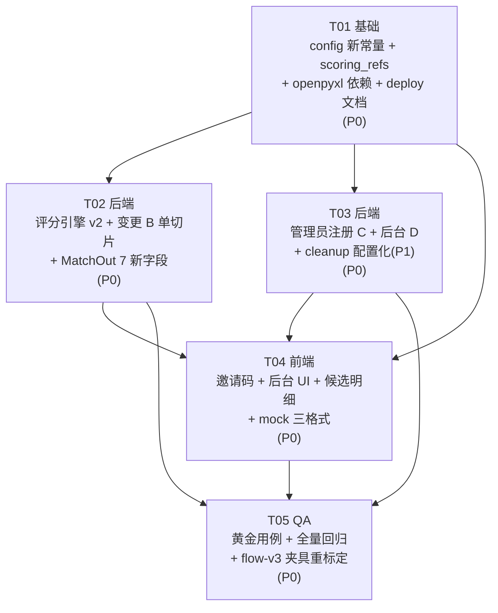

# v10 增量架构设计（评分引擎 v2 + 候选排序修正 + 管理员注册与后台）

| 项 | 内容 |
| --- | --- |
| 文档性质 | **增量设计** —— 仅描述相对 flow-v3 的变更，未提及部分一律保持 flow-v3 现状 |
| 基线版本 | flow-v3（已交付：keep1 单向进池 + 低分阈值 60 + 删除低分不打扰 + keep1 守卫） |
| 上游输入 | `docs/prd/v10_scoring_admin_incremental_prd.md`（715 行）+ 产品经理拍板的 5 个待决点 + Q10 产品级风险 |
| 技术栈 | 后端 FastAPI + SQLAlchemy 2.0 + Pydantic v2；前端 Vue3 + Element Plus + Vite |
| 关联图 | `v10_scoring_admin_class-diagram.mermaid`、`v10_scoring_admin_sequence-diagram.mermaid` |
| 新增依赖 | **仅 `openpyxl>=3.1,<4.0`**（xlsx）；md 导出零依赖（纯 f-string） |

---

## 1. 实现方案概述

### 1.1 四个变更一句话

| 变更 | 一句话 |
| --- | --- |
| **A** | 评分引擎重构为 `20·分类 + 70·文字(量词15/颜色20/状态10/地点15/关键词10) + 10·时间(τ=15)`；文字 70 拆 5 子维度，地点并入文字；颜色引入合类表 |
| **B** | 候选输出由「硬截断前 10」改为「前 10 条 + 所有 ≥80 疑似全列」，单切片 `scored[:max(MATCH_TOP_N, 疑似数)]` 即可实现 |
| **C** | 注册页加「管理员邀请码」输入框，与环境变量 `ADMIN_APPLY_CODE` 比对命中即注册为管理员（无报错、无格式校验） |
| **D** | 管理员后台补齐：用户列表、匹配详情（双方信息 + 结构化对话）、按范围/格式（xlsx/md/csv）导出、留存查询放开（`all_time=true`） |

### 1.2 架构决策（回应产品经理的 5 个拍板点）

> 以下 5 处我作为架构师**已拍板**，结论直接进设计；理由均给出，便于后续追溯。

| # | 待决点 | 我的决定 | 理由 |
| --- | --- | --- | --- |
| **Q2 + Q3** | xlsx / md 依赖 | **xlsx 用 `openpyxl>=3.1,<4.0`；md 用纯 f-string 拼装，零新增依赖** | openpyxl 轻量、是 pandas 的 Excel 后端本身（引 pandas 会拖 numpy 生态）；md 是"生成"不是"解析"，标准库足够，强依赖无必要。实测两者均未安装，故仅把 openpyxl 写进 requirements.txt |
| **Q4** | 留存策略 | **P0 只做查询层**（`GET /admin/matches?all_time=true` 不加时间窗）；**清理层配置化留 P1**（config 新增 `ADMIN_RETENTION_DAYS=270`，`CleanupService` 改读配置，**默认值保持 270 不变**）；**不**直接把默认提到 1095 | 同 PM 建议。P0 方案零风险、不动既有 cleanup 用例前提；激进提 1095 会破坏现有 cleanup 单测。另确认 `run_once` 从不清理 `audit_log`（D-7）→ 审计天然长期留存，文档化即可 |
| **Q13** | `MATCH_TOP_N` 改名 | **保留变量名**，仅把 docstring/注释更新为「普通候选保底条数（疑似全列不受此限）」 | 改名需同步改 publish_service.py（5 处）、mockAdapter.ts、多个测试，波及面大且无语义收益；保留名 + 清晰注释成本最低，且 `match_service.py` 不再直接引用该常量（只 publish_service 用） |
| **变更 B 简化** | 5 处 TOP_N 改造 | **采纳**单切片 `scored[:max(MATCH_TOP_N, 疑似数)]`，不两次遍历/集合并 | 已按分降序排序，疑似（≥80）必在数组前部，等价性成立（见 §2.1 证明）。**L368-369 keep1 早退绝对保留**，L344/378/383/405/415 按 §6 T02 改造 |
| **变更 A 模块归属** | COLOR_FAMILY / STATE_WORD_PAIRS / 地点四级抽取放哪 | **新建独立模块 `app/services/scoring_refs.py`** 承载全部"评分参考数据集 + 子维度分类器"，`match_service.py` 只消费、不堆数据 | `match_service.py` 已 660 行且是*打分算法*主体；色系/反义词/地点层级是*参考数据与分类逻辑*，塞进去会失控。也不塞进 `tagging_service.py`——那是*标签抽取*层（持有 COLOR_WORDS/LOCATION_WORDS 原始词表），职责是"抽词"不是"评分判定"。新模块名 `scoring_refs` 比 `color_family.py`/`place_service.py` 更贴切（状态反义词对不归色也不归地点） |

### 1.3 对 PRD §8 其余待决点的采纳（默认建议，无需回问即可开工）

| PRD 项 | 采纳的默认 | 说明 |
| --- | --- | --- |
| Q5 量词中间档 | 同量词数量不同=8；量词不同数量不同=2；候选缺量词=3 | 写入 `scoring_refs.py` 常量，便于 P1 调参 |
| Q6 彩色/黑白/邻接 | `彩色`=通配（不冲突+10）；`黑白`=黑∪白；邻接对=灰↔银、棕↔黄、粉↔红、紫↔蓝、金↔黄 | 写入 `COLOR_ADJACENCY` |
| Q7 「其他」类路径 | 统一走 v2：双方均其他时 `photo_category=10`（中性），文字 70 + 时间 10 不变；取消 `20·photo+80·tag` 特殊路径 | 在 `score`/`score_detail` 中删除 `_is_other` 分支 |
| Q8 时间缺失 | 任一侧缺时间 → 中性 5.0 分 | 沿用 flow-v2 Q6 口径 |
| Q9 时间 τ | **以公式为准**：`10·exp(-Δ/15)`，τ=15.0；30 天=1.35 | 不追 1.8 |
| Q11 详情接口 | **不硬限制** `status==2`，UI 默认从"已完成"进入 | — |
| Q12 明文隐私 | 管理员侧 `phone` 明文 + 每次查询/导出写审计 + 前端顶部合规提示 | 与现有取证导出口径一致 |

### 1.4 ⚠️ Q10 产品级风险与决策（用户已拍板：启用归一化）

**风险（背景）**：演算示例反推"失主未提供的子维度记 0 分"→ 总分被失主描述完整度封顶；示例"几乎完美"的 C 仅 78 分 < 80 → `suspected(≥80)` 极难触发，**变更 B 的"疑似全列"大概率长期为空集**，功能形同虚设。

**决策（✅ 已定，用户拍板）**：**启用归一化** —— 失主未填维度不计入分母、按"失主**实际提供**的子维度"归一到 100、疑似阈值 80 保留不变。该决策直接解决 §A.3.1 的封顶问题，变更 B 的「疑似全列」在归一化后才有实际命中可能。本设计预留的 `MATCH_NORMALIZE` 插入点（见 §2.3）即从"预留骨架"升级为"默认生效"，**无返工**。

**实现落点**：

1. **config 默认 `MATCH_NORMALIZE = True`**（用户明确"启用"，故默认值即反映决策、开箱即生效）。仍可被环境变量 `MATCH_NORMALIZE=false` 覆盖回退（异常时降级用），但默认开启。
2. 归一化口径：`provided_max = Σ(失主侧该子维度提供了信息 ? 该子维度满分 : 0) + (photo_category 有类目 ? 20 : 0) + (时间双方都有 ? 10 : 0)`，`total` 归一到 `100 * total / provided_max`（裁剪 0–100）。
3. **测试侧**：AC-A1~A3（45/69/78）仍作为**原始口径**黄金用例固化；**另需新增归一化口径黄金用例**（同输入在 `MATCH_NORMALIZE=True` 下应达 ≥80，验证"疑似全列"确有命中），列入 T05。flow-v3 低分(<60)测试夹具重标定照旧（见 §2.5、§9 回归点 1）。

---

## 2. 关键架构发现与取舍

### 2.1 变更 B 单切片等价性证明

`scored` 已按 `(-score, id)` 降序。`疑似数 S = |{p : p.score >= MATCH_THRESHOLD}|`，因降序，疑似项必占据位置 `0..S-1`，位置 `S` 起全部 `<80`。

- 前 10 条 = `scored[:10]`
- 疑似全列 = `scored[:S]`
- 并集 = `scored[:max(10, S)]`（因 `scored[:max(10,S)]` 同时覆盖位置 `0..9` 与 `0..S-1`）

**故单切片 `scored[:max(MATCH_TOP_N, 疑似数)]` 严格等价于「前 10 ∪ 疑似全列」，无需两次遍历或集合并。** 5 处改造统一为：先算 `suspect_n = sum(1 for s,_ in scored if s >= settings.MATCH_THRESHOLD)`，`cut = max(settings.MATCH_TOP_N, suspect_n)`，再 `scored[:cut]`。

**反向路径（L378）特殊点**：`existing >= MATCH_TOP_N` 时不能整条 `continue`，改为「本对 `score < MATCH_THRESHOLD` 才 `continue`」——即已超保底条数且非疑似则跳过（维持"不打扰"），疑似仍允许追加。

**刷新路径（L405/415）特殊点**：`existing >= MATCH_TOP_N` 时**不 `return []`**，改为对 `scored[:cut]` 中 `found_id ∉ 已存在集合` 的候选补入（疑似必在 `cut` 内，故必补；`<80` 且位置 >10 者已被切片排除）。

### 2.2 变更 A 模块化：`scoring_refs.py`

`app/services/scoring_refs.py`（全新）承载：

| 内容 | 形式 | 说明 |
| --- | --- | --- |
| `COLOR_FAMILY` | `dict[str,str]` | 词→色系（覆盖裸色字「黑/白/灰...」+带色字），扩表自 `tagging_service.COLOR_WORDS` |
| `COLOR_ADJACENCY` | `set[frozenset]` | 近似色邻接对（灰↔银、棕↔黄、粉↔红、紫↔蓝、金↔黄） |
| `STATE_WORD_PAIRS` | `dict[str,str]` | 反义词对（新↔旧、完好↔破损...） |
| `CAMPUS_WORDS` | `list[str]` | 校区词（补 `tagging_service.LOCATION_WORDS` 缺失的「XX校区」） |
| `ROOM_RE` | 正则 `\d{3,4}` | 房间号抽取（如 402、A402） |
| 子维度权重/层级分值 | 模块常量 | `QTY_SAME=15 / QTY_DIFF_MEASURE=5 / QTY_SAME_DIFF_COUNT=8 / QTY_DIFF_DIFF_COUNT=2 / QTY_MISSING_CAND=3`、`COLOR_SAME=20 / COLOR_NEAR=10`、`STATE_W=10`、`PLACE_ROOM=14 / PLACE_FLOOR=13 / PLACE_BUILDING=10 / PLACE_CAMPUS=6 / PLACE_ALL=15`、`KEYWORD_W=10` |
| `classify_qty / classify_color / classify_state / classify_place / keyword_score` | 函数 | 输入两侧 tag 集，输出 `(子分, signal?)`；`match_service.py` 调用 |

`tagging_service.py` **不改职责**，仅其 `COLOR_WORDS/LOCATION_WORDS/NOUN_SET` 继续作为"抽词"原始词表被复用；`scoring_refs` 在其之上做"评分判定"。无循环依赖（`scoring_refs` 不反向 import `match_service`）。

### 2.3 归一化开关插入点（Q10 应对）

`match_service.py` 的 `score` / `score_detail` 新增参数 `normalize: bool | None = None`，语义：

- `normalize is None` → 取 `settings.MATCH_NORMALIZE`（**默认 `True`，用户拍板启用**）
- `normalize == True` → 计算 `provided_max = Σ(失主侧该子维度提供了信息 ? 该子维度满分 : 0) + (photo_category 有类目 ? 20 : 0) + (时间双方都有 ? 10 : 0)`，把原始 `total` 归一到 `100 * total / provided_max`（裁剪 0–100）

**插入点**：在 `score_detail` 算出 `qty/color/state/place/keyword/photo_category/time` 六项后、返回 `total` 前插入 `if normalize: total = _normalize(...)`。Q10 用户拍板**启用归一化**后，`settings.MATCH_NORMALIZE=True` → 该分支**默认生效**（原始总分按已填维度归一到 100）；可通过环境变量 `MATCH_NORMALIZE=false` 回退到未归一化口径。**R-P1-4 已在此提前落地为配置位 + 代码骨架，且现已置为生效。**

### 2.4 评分引擎 v2 重构结构（match_service.py）

`score` / `score_detail` 重写为：

```
photo_category = 20 if cat==exact else 10 if cat==parent else 0 if cat==none else 10(missing)
qty, _        = classify_qty(lost_tags, found_tags)
color, c_sig  = classify_color(lost_tags, found_tags)   # c_sig = "color_conflict" or None
state, s_sig  = classify_state(lost_tags, found_tags)   # s_sig = "state_conflict" or None
place, _      = classify_place(lost_tags, found_tags)
keyword       = keyword_score(lost_tags, found_tags)
time          = 10*exp(-Δdays/τ) 或 缺失→5.0
total = photo_category + qty + color + state + place + keyword + time   # = 20+70+10
signals = [s for s in (c_sig, s_sig) if s]
# 归一化插入点（§2.3）
```

- **删除** `_is_other` 分支与 `20·photo+80·tag` 路径（Q7）；「其他」类走同一公式，`photo_category` 双方均其他时记 10 中性。
- `photo_sim_factor*` / `text_match_rate` 旧的"照片相似度加权 15"路径移除——`photo_category` 改由 `category_hit` 映射（语义变更，见 PRD A.3.2）。`text_match_rate` 旧键保留为 `text/70`（向后兼容 C-1）。
- `is_suspected` 不变（仍用 `MATCH_THRESHOLD=80`）。
- `score_detail` 返回键扩展见 §4.4。

### 2.5 flow-v3 护栏在 v10 下如何保持（最高优先级）

| 护栏 | v10 下保持方式 |
| --- | --- |
| G-1 keep1 单向 | `publish_service.py:368-369` 早退**不动**；`_recall_lost_candidates` 的 keep1 放开**不动**（flow-v3 已删过滤） |
| G-2 keep1 守卫 | `confirm-return`/`claim` 对 keep1 的 422 **不动**（match.py，本次未触碰） |
| G-3 低分 60 | `MATCH_LOW_SCORE=60` **不动**；前端弱化展示逻辑不动 |
| G-4 删除低分不打扰 | 不变；变更 B 的疑似追加只在 `score>=80` 突破 top10，低分永不超过 |
| G-5 keep1 申请即完成/撤回 | `complete_keep1_claim`/`revoke_keep1_claim`/`_exists_match` 排除终态 **不动** |

> **⚠️ 唯一需主动处理的关联项**：变更 A 重算所有分数 → 哪些候选落在 <60 弱化区间会变。flow-v3 的低分相关**测试夹具分数需重新标定**（逻辑不变，输入数据重算），列入 T05 回归点 1。

### 2.6 契约兼容策略

- `score_detail` 旧键 `photo/category/text/text_match_rate/location/time/appearance/feature/total` **全部保留**，按 PRD A.3.10 映射（`category`/`appearance`/`feature` 恒 0.0，`photo`=`photo_category`，`location`=`place`，`text`=五子维度之和）。旧 JSON 消费者不断裂（C-1）。
- `MatchOut` 新 7 字段全部 `Optional`（C-2）。
- 旧权重 `MATCH_W_*` 全部保留并标 deprecated，`config.py` 新增 `MATCH_W2_*` 系列（C-7）；`TIME_DECAY_TAU_DAYS=3.0` 保留，`MATCH_TIME_TAU_DAYS=15.0` 新增供 v2（C-8）。
- `POST /admin/export` 默认 `scope="all"`、`format="csv"` → 老前端只传 `ids` 行为不变（C-3）。
- `GET /admin/matches` 默认 `all_time=False` → 保持 270 天窗（C-4）。
- `UserCreate.admin_code` 可选 → 老客户端 `role=0`（C-5）。`UserOut` 不改（脱敏），管理员明文走新 `AdminUserOut`（C-6）。

---

## 3. 文件列表（相对项目根）

### 3.1 后端

| 文件 | 类型 | 改动摘要 |
| --- | --- | --- |
| `app/core/config.py` | 修改 | 新增 `MATCH_W2_PHOTO_CAT=20`、`MATCH_W2_QTY=15`、`MATCH_W2_COLOR=20`、`MATCH_W2_STATE=10`、`MATCH_W2_PLACE=15`、`MATCH_W2_KEYWORD=10`、`MATCH_TIME_TAU_DAYS=15.0`、`MATCH_NORMALIZE=False`、`ADMIN_APPLY_CODE="110"`、`ADMIN_RETENTION_DAYS=270`（清理层 P1 读取）；旧 `MATCH_W_*` 标 deprecated |
| `app/services/scoring_refs.py` | **新增** | 色系表/邻接/反义词对/校区词/房间正则 + 5 子维度分类器函数 + 子维度权重常量 |
| `app/services/match_service.py` | 修改 | `score`/`score_detail` 重写为 v2（5 子维度 + photo_category + time τ + normalize 插入点）；删除 `_is_other` 分支；`build_match_outs` 透传 7 新键 |
| `app/services/publish_service.py` | 修改 | 5 处 TOP_N → 单切片 `max(MATCH_TOP_N, 疑似数)`（L344/378/383/405/415）；L368-369 keep1 早退保持；docstring 更新 `MATCH_TOP_N` 语义 |
| `app/services/cleanup.py` | 修改（P1） | `ADMIN_RETENTION_DAYS` 由类常量改为读 `settings.ADMIN_RETENTION_DAYS`（默认 270） |
| `app/schemas/match.py` | 修改 | `MatchOut` 加 7 个 Optional 明细字段 |
| `app/schemas/user.py` | 修改 | `UserCreate.admin_code: Optional[str]`；新增 `AdminUserOut`（phone 明文） |
| `app/services/auth_service.py` | 修改 | `register` 按 `admin_code` 比对 `ADMIN_APPLY_CODE` 决定 `role`，命中写 `register_admin` 审计 |
| `app/routers/admin.py` | 修改 | `GET /admin/users`、`GET /admin/matches/{id}/detail`、`POST /admin/export` 扩 scope+format、`GET /admin/matches?all_time=` |
| `app/services/admin_export_service.py` | **新增** | 取证行/结构化对话构建 + csv/xlsx/md 三格式（xlsx 用 openpyxl，md 用 f-string）；供路由与导出复用 |
| `requirements.txt` | 修改 | 新增 `openpyxl>=3.1,<4.0` |
| `docs/deploy.md` | 修改 | 增补 `ADMIN_APPLY_CODE` 生产必须覆盖说明 |

### 3.2 前端

| 文件 | 类型 | 改动摘要 |
| --- | --- | --- |
| `web/src/views/LoginView.vue` | 修改 | 注册 Tab 加「管理员邀请码（选填）」表单项（无 rules）+ 辅助文案；`onRegister` 带 `admin_code` |
| `web/src/views/AdminView.vue` | 修改 | 注册用户区块 + 匹配详情抽屉 + 导出范围/格式选择 + `all_time` 开关 |
| `web/src/views/MatchesView.vue` | 修改 | 维度明细改版（分类20/文字70 五子项/时间10）+ 颜色冲突角标；低分/keep1/我不领走逻辑保持 |
| `web/src/types/index.ts` | 修改 | 注册请求加 `admin_code`；`MatchOut` 加 7 明细；新增 `AdminUser`/`AdminMatchDetail` |
| `web/src/api/auth.ts` | 修改 | `register` 入参加 `admin_code` |
| `web/src/api/admin.ts` | 修改 | `listUsers()`/`getMatchDetail(id)`；`exportMatches(ids,scope,format)` 三格式；`listAdminMatches` 支持 `all_time` |
| `web/src/api/mockAdapter.ts` | 修改 | `handleRegister` 识别 `admin_code`；`buildMockMatchOut` 明细改 v2 比例；候选 `slice` 改疑似全列；新增 `/admin/users`、`/admin/matches/{id}/detail` 路由；`exportMatches` 支持 scope/format |

### 3.3 测试与文档

| 文件 | 类型 | 改动摘要 |
| --- | --- | --- |
| `tests/test_scoring_v2.py` | **新增** | AC-A1~A3 黄金用例（45/69/78）+ AC-A4~A11 全维度断言 |
| `tests/test_candidate_order.py` | **新增** | AC-B1~B9（疑似全列 / keep1 回归） |
| `tests/test_admin.py` | **新增** | AC-C1~C9（注册邀请码）、AC-D1~D12（用户/详情/导出/留存） |
| `tests/test_flow_v3.py` 等 | 修改 | 低分(<60)夹具分数重标定（G-5 关联） |
| `tests/test_match.py` | 修改 | 旧五维权重断言按 v2 重算（T-1~T-6） |

> **无 schema 迁移**：`user.role` 已存在（Q1 关闭）→ 不需要 alembic 版本（M-1）。

---

## 4. 数据结构与接口影响

### 4.1 数据库 Schema

**零变更**（M-1）。无新增表/列/索引/迁移。

### 4.2 配置项

| 常量 | 值 | 位置 | 使用方 |
| --- | --- | --- | --- |
| `MATCH_W2_PHOTO_CAT` | 20.0（新） | config + scoring_refs 引用 | `photo_category` |
| `MATCH_W2_QTY/COLOR/STATE/PLACE/KEYWORD` | 15/20/10/15/10（新） | config | 文字五子维度 |
| `MATCH_TIME_TAU_DAYS` | 15.0（新） | config | 时间衰减 τ |
| `MATCH_NORMALIZE` | **True（新，Q10 用户拍板启用）** | config | `score` normalize 分支（**默认生效**：按失主已填维度归一到 100；可被环境变量 `MATCH_NORMALIZE=false` 回退） |
| `ADMIN_APPLY_CODE` | "110"（新） | config + auth_service | 管理员注册 |
| `ADMIN_RETENTION_DAYS` | 270（新，P1 读） | config + cleanup | 清理层留存 |
| `MATCH_THRESHOLD` / `MATCH_LOW_SCORE` / `MATCH_TOP_N` | 80 / 60 / 10（不变） | config | suspected / 低分视觉 / 普通保底条数 |

### 4.3 API 契约变化

| 接口 | 变化 | 说明 |
| --- | --- | --- |
| `POST /lost-items` / `POST /found-items` | **行为变化** | `suspected_matches` 分数按 v2 重算；疑似判定仍 ≥80 |
| `GET /lost-items/{id}/matches` 等 | **行为变化** | 候选排序按 v2 + 变更 B 疑似全列 |
| `POST /admin/users`(GET) | **新增** | 注册用户列表（明文 phone）+ 审计 `admin_list_users` |
| `GET /admin/matches/{id}/detail` | **新增** | 双方信息 + 结构化对话 + 分数明细；审计 `admin_view_match_detail` |
| `POST /admin/export` | **扩展** | `scope`(profile/conversation/all) + `format`(csv/xlsx/md)；老调用兼容 |
| `GET /admin/matches` | **扩展** | `all_time: bool=False`；true 不加时间窗 |
| `POST /auth/register` | **扩展** | 请求体加 `admin_code`（可选）；命中→role=1 + 审计 |
| 变更 C/D 其余 | — | `require_admin` 守卫已就位，无需改 |

### 4.4 score_detail 新键 + 旧键映射（A.3.10）

**新键**：`photo_category`(0-20)、`qty`(0-15)、`color`(0-20)、`state`(0-10)、`place`(0-15)、`keyword`(0-10)、`signals`(list)。

**旧键（保留映射）**：`photo`=`photo_category`；`category`=恒 0.0；`text`=五子维度之和；`text_match_rate`=`text/70`；`location`=`place`；`time`=0-10；`appearance`/`feature`=恒 0.0；`total`=0-100。

### 4.5 类图 / 时序图

见 `v10_scoring_admin_class-diagram.mermaid` 与 `v10_scoring_admin_sequence-diagram.mermaid`。

---

## 5. 依赖包列表

| 层 | 变化 |
| --- | --- |
| Python (`requirements.txt`) | 新增 `openpyxl>=3.1,<4.0` |
| Node (`web/package.json`) | 无 |
| 数据库迁移 | 无 |

---

## 6. 任务列表（按实现顺序，含依赖）

> **依赖约束**：T01 是基础（配置 + 参考数据集 + 依赖声明），T02（评分）/T03（管理员）/T04（前端）均依赖 T01；T04 同时依赖 T02（MatchesView 用新明细）、T03（AdminView 用新接口）；T05（测试）依赖 T02/T03/T04。

### T01 · 基础：配置 + 评分参考数据集 + 依赖声明

- **优先级**：P0
- **依赖**：无
- **源文件**：`app/core/config.py`、`app/services/scoring_refs.py`（新）、`requirements.txt`、`docs/deploy.md`
- **内容**：
  1. `config.py` 新增 §4.2 全部新常量（权重/τ/**`MATCH_NORMALIZE=True`（Q10 启用）**/`ADMIN_APPLY_CODE`/`ADMIN_RETENTION_DAYS`）；旧 `MATCH_W_*` 标 `[deprecated]`。
  2. 新建 `scoring_refs.py`：`COLOR_FAMILY`/`COLOR_ADJACENCY`/`STATE_WORD_PAIRS`/`CAMPUS_WORDS`/`ROOM_RE` + 子维度权重常量 + `classify_qty/color/state/place/keyword_score` 五个函数（含 `color_conflict`/`state_conflict` 信号返回）。
  3. `requirements.txt` 追加 `openpyxl>=3.1,<4.0`。
  4. `docs/deploy.md` 增补 `ADMIN_APPLY_CODE` 生产覆盖说明（默认 110 仅演示）。
- **验收**：`python -c "import app.core.config as c; s=c.settings; print(s.MATCH_W2_PHOTO_CAT, s.MATCH_TIME_TAU_DAYS, s.MATCH_NORMALIZE, s.ADMIN_APPLY_CODE)"` 输出 `20.0 15.0 True 110`；`import openpyxl` 成功。

### T02 · 后端：评分引擎 v2 + 候选排序 B + 契约扩展

- **优先级**：P0
- **依赖**：T01
- **源文件**：`app/services/match_service.py`、`app/services/publish_service.py`、`app/schemas/match.py`
- **内容**：
  1. `match_service.py`：`score`/`score_detail` 重写（§2.4），删除 `_is_other` 分支；`build_match_outs` 透传 7 新键；`normalize` 参数插入点（§2.3）。
  2. `publish_service.py`：5 处 TOP_N 改单切片（§2.1）；L368-369 keep1 早退不动；docstring 更新 `MATCH_TOP_N` 语义为「普通保底条数」。
  3. `schemas/match.py`：`MatchOut` 加 7 个 Optional 明细字段。
- **验收**：AC-A1~A3（45/69/78）通过；AC-B1（12 疑似→12 条）、AC-B7（keep1 反向不生成）、AC-B8（keep1 正向召回）通过；`is_suspected` 仍 ≥80。

### T03 · 后端：管理员注册 C + 后台 D

- **优先级**：P0
- **依赖**：T01
- **源文件**：`app/services/auth_service.py`、`app/schemas/user.py`、`app/routers/admin.py`、`app/services/admin_export_service.py`（新）、`app/services/cleanup.py`（P1）
- **内容**：
  1. 变更 C：`auth_service.register` 按 `admin_code` 比对 `ADMIN_APPLY_CODE` 决定 `role`（填错静默 role=0）；命中写 `register_admin` 审计；`UserCreate.admin_code` 可选；`AdminUserOut` 明文 phone。
  2. 变更 D：`GET /admin/users`（模糊+过滤+分页+审计）、`GET /admin/matches/{id}/detail`（双方+结构化对话+审计）、`POST /admin/export` 扩 scope+format（csv 沿用、xlsx 用 openpyxl、md 用 f-string）、`GET /admin/matches?all_time=`。取证/对话逻辑抽到 `admin_export_service.py`。
  3. P1：`cleanup.py` 的 `ADMIN_RETENTION_DAYS` 改读 `settings.ADMIN_RETENTION_DAYS`（默认 270）。
- **验收**：AC-C1~C9、AC-D1~D12 通过；`audit_log` 永不清理的事实写入 `docs/deploy.md`/`cleanup.py` 注释。

### T04 · 前端：注册邀请码 + 后台 UI + 候选明细改版 + mock

- **优先级**：P0
- **依赖**：T01、T02、T03
- **源文件**：`web/src/views/LoginView.vue`、`web/src/views/AdminView.vue`、`web/src/views/MatchesView.vue`、`web/src/types/index.ts`、`web/src/api/auth.ts`、`web/src/api/admin.ts`、`web/src/api/mockAdapter.ts`
- **内容**：
  1. `LoginView.vue` 邀请码表单项 + `onRegister` 带 `admin_code`。
  2. `AdminView.vue` 用户区块 + 详情抽屉 + 导出范围/格式 + `all_time` 开关 + 合规提示。
  3. `MatchesView.vue` 维度明细改版（分类20/文字70 五子项/时间10）+ 颜色冲突角标；**低分/keep1/我不领走逻辑严格保持 flow-v3**（§2.5 G-3/G-4）。
  4. `types/index.ts` + `api/auth.ts` + `api/admin.ts` 类型/接口扩展。
  5. `mockAdapter.ts`：`handleRegister` 识别 `admin_code`；`buildMockMatchOut` 明细改 v2；候选 `slice` 改疑似全列；新增 `/admin/users`、`/admin/matches/{id}/detail` 路由；`exportMatches` 支持 scope/format。
- **验收**：`npm run build` 通过；真实模式与 mock 模式走查 §PRD 7.x 全部 UI 点；颜色冲突角标在 `signals` 含 `color_conflict` 时显示。

### T05 · QA：黄金用例 + 全量回归 + flow-v3 夹具重标定

- **优先级**：P0
- **依赖**：T02、T03、T04
- **源文件**：`tests/test_scoring_v2.py`（新）、`tests/test_candidate_order.py`（新）、`tests/test_admin.py`（新）、`tests/test_match.py`、`tests/test_flow_v3.py` 等
- **内容**：
  1. **黄金用例（原始口径）**：AC-A1~A3（45/69/78）固化进 `test_scoring_v2.py`，作为 `MATCH_NORMALIZE` **关闭**时的基准，任何后续调参不得破坏。
  2. **归一化黄金用例（✅ Q10 已启用，重点）**：用同一组 AC-A1~A3 输入，在 `MATCH_NORMALIZE=True`（默认）下断言 C 经归一化后 `total ≥ 80`（即"几乎完美匹配"从 78 归一到 ≥80），验证变更 B「疑似全列」确有实际命中——这是归一化上线的核心验收。
  3. **变更 B 回归**：AC-B1~B9（疑似全列 + keep1 单向性 G-1 护栏）。
  4. **变更 C/D**：AC-C1~C9、AC-D1~D12。
  5. **⚠️ flow-v3 夹具重标定**：因变更 A 重算所有分数，重算 `test_flow_v3.py` 等低分(<60)相关夹具的输入数据，使断言仍落在 <60 区间（逻辑不变，仅重算分数，见 §2.5）。
  6. **旧权重断言重算**：T-1~T-6 全部按 v2 重算期望值。
  7. **归一化开关可回退**：环境变量 `MATCH_NORMALIZE=false` 时回到原始 45/69/78 口径（降级路径验证）。
- **验收**：`pytest tests/ -q` 全绿；`npm run build` 通过；QA 报告覆盖 §9 全部回归点。

### 6.1 任务依赖图



---

## 7. 共享知识（跨文件约定，工程师必读）

1. **`MATCH_TOP_N` 现在是「普通候选保底条数」，不是硬上限。** 疑似（≥80）永远全列。所有截断逻辑统一为 `scored[:max(MATCH_TOP_N, 疑似数)]`，禁止出现"候选数恒 ≤10"的断言。
2. **keep1 早退（publish_service.py:368-369）是 flow-v3 护栏，v10 一律不动。** 任何"简化"都不得删除它。
3. **`scoring_refs.py` 是评分参考数据唯一归宿。** 色系/反义词/地点层级/子维度权重都在这里；`match_service.py` 只调用不堆数据；不要把这些表塞回 `tagging_service.py`（那是抽词层）。
4. **`MATCH_NORMALIZE=True` 是当前默认（Q10 用户拍板启用）。** `score` 的 normalize 分支**默认生效**——按失主已填维度归一到 100，使"疑似全列"在描述不完整时仍有命中。仍可用环境变量 `MATCH_NORMALIZE=false` 回退到原始口径（降级用）。**不要改算法，只动开关。**
5. **「其他」类不再特殊。** v2 统一公式，`photo_category` 双方均其他时记 10 中性，删除旧的 `20·photo+80·tag` 路径。
6. **旧 `score_detail` 键必须保留映射**（category/appearance/feature 恒 0.0，photo=photo_category，location=place）。JSON 消费者不能断。
7. **xlsx 用 openpyxl，md 用 f-string。不要引 pandas。** md 导出零依赖。
8. **管理员 `phone` 明文返回必须每次写审计**（`admin_list_users`/`admin_view_match_detail`/`admin_export`）；不要复用脱敏的 `UserOut`，走新 `AdminUserOut`。
9. **`admin_code` 填错必须静默 role=0，响应体与不填完全一致**（防试探）；不报错、不提示。
10. **变更 A 改变所有分数 → flow-v3 低分(<60)测试夹具必须重算**，不要因为"逻辑没变"就忽略分数重算导致的断言漂移。

---

## 8. 待明确事项

| # | 事项 | 我的建议 | 状态 |
| --- | --- | --- | --- |
| **U1（最高优先，Q10）** | 疑似阈值 80 维持 / 下调 / 启用归一化 | **✅ 已定（用户拍板：启用归一化，归一到 100，阈值 80 保留）**。config `MATCH_NORMALIZE=True` 默认生效，仍可被环境变量回退 | ✅ 已定（用户拍板） |
| Q5/Q6/Q7/Q8/Q9/Q11/Q12 | 见 §1.3 采纳默认 | 已采纳 PRD 建议默认，可开工 | ✅ 已采纳 |
| Q4 激进方案 | 默认提到 1095 | 不采纳（破坏 cleanup 单测），走 P0 查询层 + P1 配置化 | ✅ 已定 |
| 变更 A 模块 | 放哪 | 新建 `scoring_refs.py` | ✅ 已定（见 §1.2） |

---

## 9. 关联回归点清单（必须逐条验证）

| # | 回归点 | 验证方式 | 关联用例 |
| --- | --- | --- | --- |
| 1 | **flow-v3 低分(<60)夹具重标定** | 变更 A 重算分数后，`test_flow_v3.py` 低分相关断言仍落 <60 区间（仅重算输入数据） | T05 §6(4) |
| 2 | keep1 单向（G-1） | 发布 keep1 拾物→失主侧召回得到候选、拾得者侧不反向生成 | AC-B7 / AC-B8 |
| 3 | keep1 守卫（G-2） | confirm-return/claim 对 keep1 → 422 | flow-v3 用例 |
| 4 | 低分 60（G-3）/ 删低分不打扰（G-4） | 前端弱化展示、虚线卡片、二次确认口径不变 | 人工走查 |
| 5 | keep1 申请即完成/撤回（G-5） | complete_keep1_claim/revoke_keep1_claim/_exists_match 不变 | flow-v3 用例 |
| 6 | 疑似全列 | 12 疑似→12 条候选 | AC-B1 |
| 7 | 普通保底 | 3 疑似+12 低分→10 条 | AC-B2 |
| 8 | 已超 10 条仍补疑似 | existing=10 + 新 95 分→+1 条；40 分→不补 | AC-B4 / AC-B5 |
| 9 | 刷新补疑似 | refresh 在 existing=10 时仍补 ≥80 | AC-B6 |
| 10 | 排序稳定 | 同分按 id 升序，多次一致 | AC-B9 |
| 11 | 黄金用例 | 45/69/78 与 C>A>B 排序 | AC-A1~A4 |
| 12 | 管理员注册 | 不填/填错→role=0；填对→role=1 + 审计 | AC-C1~C5 |
| 13 | 后台导出 | xlsx 双 Sheet / md 小节 / csv 兼容老调用 | AC-D5~D8 |
| 14 | 留存放开 | all_time=true 跨 270 天窗；false 与 v7 一致 | AC-D10 |
| 15 | 归一化默认生效（✅ Q10） | `MATCH_NORMALIZE=True`（默认）：AC-A1~A3 同输入下 C 经归一化 `total ≥ 80`、疑似全列确有命中；`MATCH_NORMALIZE=false` 回退到 45/69/78 原始口径 | T05 §6(2)/(7) |

---

## 10. 变更影响面小结

| 维度 | 规模 |
| --- | --- |
| 后端改动文件 | 11（config / scoring_refs 新 / match_service / publish_service / cleanup / schemas×2 / auth_service / admin / admin_export 新 / requirements） |
| 前端改动文件 | 7（LoginView / AdminView / MatchesView / types / auth.ts / admin.ts / mockAdapter） |
| 数据库迁移 | 0 |
| 新增依赖 | 1（openpyxl） |
| 测试 | 3 新文件 + 旧五维断言重算 + flow-v3 夹具重标定 |
| 最大风险 | ~~U1（Q10 阈值/归一化）~~ **已解除**：用户拍板启用归一化（`MATCH_NORMALIZE=True` 默认生效），变更 B「疑似全列」在归一化后具备实际命中；`suspected` 阈值 80 保留不变 |
| 不可破坏项 | flow-v3 全部护栏 G-1~G-5（§2.5） |
