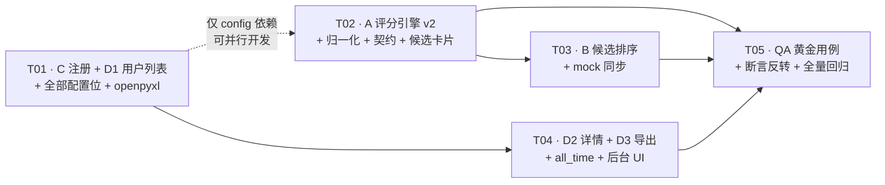

# v10 增量架构设计 R2（用户拍板 Q10 归一化后的修订版）

> 状态：**R2 取代 R1**（`v10_scoring_admin_incremental_design.md`，2026-08-05 23:22 由 software-architect 产出）。
> R1 在用户拍板前把归一化设计为 `MATCH_NORMALIZE=False` 的预留开关；用户已于本轮拍板 **Q10 = 启用归一化**，
> 故 R2 将归一化提升为 **P0 主路径（默认 True）**，并补齐 R1 未覆盖的归一化算法细节、防爆护栏与黄金用例重标定。
> R1 的其余结论（变更 B 单切片等价性、openpyxl、md 纯 f-string、Q4 方案 A）**R2 全部沿用**，不重复论证。

| 项 | 内容 |
| --- | --- |
| 文档 | v10 增量架构设计 + 任务分解（R2） |
| 作者 | 高见远（software-architect-2） |
| 基线 | flow-v3 已合入的代码（keep1 进匹配池 + 低分 60 + 删低分不打扰 + keep1 守卫） |
| 输入 PRD | `docs/prd/v10_scoring_admin_incremental_prd.md`（715 行） |
| 语言 | 简体中文 |
| 现状核对 | 本文所有行号均已**实际 Read 核对**，非记忆 |

---

## 0. R2 相对 R1 的差异（team-lead 与工程师只看这一节即可知道改了什么）

| # | 项 | R1 | R2（本文） |
| --- | --- | --- | --- |
| Δ1 | 归一化 | `MATCH_NORMALIZE=False`，预留分支恒不触发 | **`MATCH_NORMALIZE=True` 默认开启**，是 P0 主路径 |
| Δ2 | 归一化分母 | 「失主提供的子维度满分之和」，未定义 provided 判定与边界 | 给出 **7 维 provided 判定表 + 只依赖失主侧的铁律 + 防爆下限 `MATCH_NORM_MIN_WEIGHT`** |
| Δ3 | 黄金用例 | AC-A1~A3 = 45 / 69 / 78（原始分） | **45/69/78 降级为 `raw_total`；`total`/`match_score` = 56.25 / 86.25 / 97.5**（k=1.25） |
| Δ4 | 疑似阈值 | 存疑，建议回问是否下调 | **维持 80 不变**（归一化后 B/C 自然越线，变更 B 不再是空集功能） |
| Δ5 | score_detail | 7 新键 | 7 新键 **+ `raw_total` + `norm_factor` + `provided_dims`**（可解释性与可测性） |
| Δ6 | flow-v3 低分夹具 | 提示需重标定 | 给出**重标定口径**（归一化后 A=56.25 < 60 落入弱化区）与 QA 具体做法 |
| Δ7 | 任务分解 | T01~T05（配置/后端A+B/后端C+D/前端/QA） | **T01~T05 重排为按交付批次**（C+D1 → A → B → D 剩余 → QA），并标注 A 与 C 可并行、mockAdapter.ts 热点串行 |

> 若 team-lead 决定只保留一份文档，建议把本文提升为 `v10_scoring_admin_incremental_design.md`，R1 归档为 `_r1`。
> **不要两份同时给工程师**——归一化默认值相反，会导致黄金用例断言互相矛盾。

---

## 1. 实现方案概述

### 1.1 四个变更一句话

| 变更 | 一句话 | 主战场 |
| --- | --- | --- |
| A 评分引擎 v2 | 五维标量 → 「分类 20 + 文字 70（量词/颜色/状态/地点/其他）+ 时间 10」七子维度，**再按失主实际填写的维度归一到 100** | `match_service.py` |
| B 候选排序 | 硬截断 top10 → 「普通保底 10 + 疑似（≥80）全列」，**5 处**改造 | `publish_service.py` |
| C 管理员注册 | 注册页加邀请码，命中 `ADMIN_APPLY_CODE` 静默升管理员 | `auth_service.py` + `LoginView.vue` |
| D 管理员后台 | 用户列表 + 匹配详情（含对话）+ xlsx/md 导出 + `all_time` 查询 | `admin.py` + 新建 `admin_export_service.py` |

### 1.2 核心技术难点

1. **归一化的可比性**（本轮最大陷阱）：归一化系数若依赖候选侧，同一件失物的不同候选会用不同分母，分数不可比、排序会错乱。→ **铁律：k 只由失主侧决定**（§2.2）。
2. **子维度抽取的互斥性**：量词/颜色/状态/地点四类必须从文字里**先切走**，剩余才是「其他关键词」的分母；切不干净会导致黄金用例 45/69/78 对不上。→ **单次流水线抽取 + 残余集合**（§2.3）。
3. **归一化后的分数爆炸**：失主只填类目时 k=100/20=5，任意同类目候选直接满分。→ **`MATCH_NORM_MIN_WEIGHT` 下限护栏**（§2.2.4）。
4. **变更 A 与 flow-v3 低分逻辑耦合**：A 改变全部分数 → 哪些候选落入 <60 弱化区随之改变。→ 逻辑不动、**夹具重标定**（§9）。
5. **契约不能断**：`score_detail` 旧键 9 个消费者（前端 + 存量测试）→ 新旧键并存映射（§4.4）。

### 1.3 沿用 R1 的既有决策（不再论证）

| 问题 | 决策 |
| --- | --- |
| Q2 xlsx 库 | **openpyxl**（`>=3.1,<4.0`），不引 pandas |
| Q3 md 生成 | **纯 f-string 拼装**，零新增依赖 |
| Q4 留存更久 | **方案 A（P0 查询层 `all_time`）** + P1 `ADMIN_RETENTION_DAYS` 配置化（默认仍 270，不破坏 cleanup 单测） |
| Q7 「其他」类 | **统一走 v2 公式**，双方均为「其他」时 `photo_category=10`（中性），取消 `20·photo+80·tag` 特殊路径 |
| Q11 详情状态限制 | **不硬限制** `status==2`，UI 默认从已完成进入 |
| Q13 `MATCH_TOP_N` 改名 | **不改名**，仅更新 docstring 为「普通候选保底条数」 |
| M-1 数据库迁移 | **无**（`User.role` 已存在，`app/models/user.py:34` 含 `idx_user_role`） |

---

## 2. 变更 A：评分引擎 v2 + Q10 归一化（本轮技术核心）

### 2.1 原始分（raw）公式

```
raw_total = photo_category(0~20)
          + qty(0~15) + color(0~20) + state(0~10) + place(0~15) + keyword(0~10)   # 文字 70
          + time(0~10)
```

各子维度评分规则**完全按 PRD §A.3.2 ~ A.3.8 落地**，不做改动（量词 15/8/5/2/3 五档、颜色 20/10/0、状态 10/比例/0、地点 15/14/13/10/6/0、关键词 `10×命中/残余数`、时间 `10·exp(-Δ/15)`）。

### 2.2 归一化（Q10 用户拍板，P0 主路径）

#### 2.2.1 一句话

> **失主没填的维度，既不扣分也不进分母；只把「失主实际填了的维度」重新归一到 100。**

```
k         = 100 / max( W_provided , MATCH_NORM_MIN_WEIGHT )
total     = round( clamp( raw_total * k , 0 , 100 ) , 2 )
```

其中 `W_provided = Σ(该维度 provided ? 该维度满分 : 0)`。

#### 2.2.2 「失主填了哪些维度」判定表（唯一口径，工程师照抄）

| 维度 | 满分 | `provided` 判定（**只看失主侧**） |
| --- | --- | --- |
| `photo_category` | 20 | `lost.category_name` 非空 → True（`category_name` 为必填，实际恒 True） |
| `qty` | 15 | 失主侧抽出 ≥1 个 `(数量, 量词)` 二元组 |
| `color` | 20 | 失主侧色系集合非空 |
| `state` | 10 | 失主侧状态词集合非空 |
| `place` | 15 | 失主侧地点层级集合非空（校区/楼/楼层/房间任一） |
| `keyword` | 10 | 失主侧**残余 token 集合**非空（已扣除量词/颜色/状态/地点/NOUN_SET/category_name/停用词） |
| `time` | 10 | `lost.lost_time is not None`（**只看失主侧**，见 2.2.3） |

#### 2.2.3 ⚠️ 铁律：k 只由失主侧决定（本设计最重要的一条约束）

**归一化系数 k 必须与候选侧无关。** 理由：

1. **可比性**：同一件失物的 N 个候选若各自算分母，分数不在同一标尺上，`scored.sort()` 出来的顺序不代表相似度顺序，变更 B 的「≥80 疑似全列」也会随机误判；
2. **单调性**：k 对该失物是常数 → `total = raw_total × k` 是严格单调变换 → **归一化不改变候选相对排序**，变更 A 与变更 B 可以独立验证（这正是 PRD 交付顺序把 A 排在 B 前面的前提）；
3. **性能**：k 每件失物只算一次，可缓存，打分循环内 O(1)。

由此推出 `time` 维度的处理（PRD §A.3.8 与 Q8 的落地细化）：

| 情形 | `time` provided | `time` 得分 |
| --- | --- | --- |
| `lost_time` 有、`found_time` 有 | True（进分母 10） | `10·exp(-Δ/15)` |
| `lost_time` 有、`found_time` 无 | **True（进分母 10）** | **5.0 中性**（候选没填，不该改变失主的标尺） |
| `lost_time` 无 | **False（不进分母）** | 0（不计入） |

> 同理：颜色/量词/地点/状态/关键词「失主有、候选无」→ 维度 **provided=True 进分母**，得分按各自规则（颜色 0 不冲突、量词 3、地点 0、状态 0、关键词 0）。这与 PRD §A.3.1「失主未提供 → 0 分」并不矛盾：PRD 说的是**失主未提供**，本表说的是**候选未提供**，两者是不同的判定对象。

#### 2.2.4 防爆护栏 `MATCH_NORM_MIN_WEIGHT`（R2 新增，R1 缺失）

不加护栏时 k 上界 = 100/20 = **5.0**：一条只有类目、什么都没写的失物，任意同类目候选 `raw=20 → total=100`，直接被判疑似并全列输出，是严重误报。

```
k = 100 / max(W_provided, MATCH_NORM_MIN_WEIGHT)      # MATCH_NORM_MIN_WEIGHT: float = 50.0
```

| 失主描述完整度 | `W_provided` | 实际分母 | 满分候选可得 |
| --- | --- | --- | --- |
| 仅类目（纯图失物） | 20 | 50 | **40** |
| 类目 + 时间 | 30 | 50 | **60** |
| 类目 + 颜色 + 时间 | 50 | 50 | 100 |
| 类目 + 量词 + 颜色 + 地点 + 时间（黄金用例） | **80** | 80 | **100**（k=1.25） |
| 七维全填 | 100 | 100 | 100（**k=1.0**，用户要求的边界，✅ 满足） |

> 任何 ≤80 的 `MATCH_NORM_MIN_WEIGHT` 取值都**不影响黄金用例**。默认 50.0，config 可调；保守可调到 65，激进可调到 40。

#### 2.2.5 边界与降级

| 边界 | 处理 |
| --- | --- |
| `W_provided == 0`（理论不出现，`category_name` 必填） | `k = 1.0`，`total = raw_total`，不抛异常 |
| `MATCH_NORMALIZE = False`（保留 kill switch） | `k = 1.0`，退回纯 raw 分（R1 行为），供 A/B 与回滚 |
| `raw_total * k > 100` | `clamp` 到 100 |
| 「其他」类（双方均为「其他」） | `photo_category=10` 且 **provided=True 进分母 20**（类目无判别力但失主确实"填了"类目）；其余维度同普通类 |

### 2.3 子维度抽取流水线（保证黄金用例可复现）

`MatchService.extract_features(item, is_lost) -> ItemFeatures`，**单次遍历、命中即消费**，顺序不可调换：

```
原始文本 = title(仅失物侧) + description + tags + appearance + features + location
   ↓ 1) 房间号     regex  [A-Za-z]?\d{3,4}         → place.room      （消费该片段）
   ↓ 2) 地点词     LOCATION_WORDS_V2（长→短）      → place.campus/building/floor
   ↓ 3) 颜色词     COLOR_FAMILY keys（长→短）      → colors（色系 key）
   ↓ 4) 量词       _QTY_PREFIX_RE / _QTY_SUFFIX_RE → qty {(num:int, cls:str)}
   ↓ 5) 状态词     STATE_WORDS                     → states（归一到标准词）
   ↓ 6) 残余       扣除 NOUN_SET ∪ {category_name} ∪ _STOPWORDS_V2 → keywords
```

**必须长词优先**（否则黄金用例必错）：`黑白` 先于 `黑`、`银灰` 先于 `银`/`灰`、`浅红` 先于 `红`、`十二楼` 先于 `二楼`。

**`_STOPWORDS` 必须扩充**（否则 `keyword` 维度会被误判为 provided，分母从 80 变 90，黄金用例全错）：
`掉落 / 丢了 / 不见了 / 落在 / 遗失 / 大概 / 好像 / 附近 / 左右 / 大约 / 可能 / 应该 / 记得`。

### 2.4 黄金用例逐维验算（R2 重标定，QA 直接照抄）

**失物**：`一串黑色钥匙，教学楼四楼402掉落`（类目=钥匙，同日）

抽取结果：`qty={(1,串)}`、`colors={黑系}`、`states=∅`、`place={building:教学楼, floor:四楼, room:402}`、`keywords=∅`（钥匙∈NOUN_SET、掉落∈停用词）

→ provided = {photo_category 20, qty 15, color 20, place 15, time 10} → **W_provided = 80** → **k = 100/80 = 1.25**

| 候选 | photo_cat | qty | color | state | place | keyword | time | **raw_total** | **total (×1.25)** | suspected |
| --- | --- | --- | --- | --- | --- | --- | --- | --- | --- | --- |
| A `一把银色钥匙，教学楼` | 20 | 5（量词异·数量同） | 0（黑 vs 灰银系，跨系）| 0 | 10（最深=楼/场所） | 0 | 10 | **45** | **56.25** | false |
| B `一把黑色钥匙，402` | 20 | 5 | 20（同系） | 0 | 14（最深=房间） | 0 | 10 | **69** | **86.25** | **true** |
| C `一串钥匙，四楼，黑` | 20 | 15（全同） | 20 | 0 | 13（最深=楼层） | 0 | 10 | **78** | **97.5** | **true** |

- 排序 **C(97.5) > B(86.25) > A(56.25)**，与 PRD AC-A4 的相对顺序一致；
- `signals`：A 含 `color_conflict`，B/C 为空；
- **A = 56.25 < `MATCH_LOW_SCORE`(60) → 落入 flow-v3 低分弱化区**（虚线卡片 + 二次确认）。这是变更 A 对 flow-v3 的唯一可见外溢，逻辑不变、仅夹具重标定，见 §9。

> ⚠️ **对用户口述「C = 100 分」的口径澄清**：用户示例中的「C 全中」是指*若*所提供维度全部满分。按 PRD §A.3.6 的地点四级表，C 只写了「四楼」，未命中失主提供的「教学楼」与「402」，故 `place=13/15` 而非满分 → **C = 97.5 而非 100**。
> 100 分在本设计下**是可达的**（同一失物若出现「一串黑色钥匙，教学楼四楼402」的候选：20+15+20+15+10=80 → ×1.25 = 100.0），归一化恢复满分上限的目标已达成。
> 若用户坚持 C 必须等于 100，唯一改法是把地点评分从「按最深层级」改为「按命中层级占比且单层命中即满分」，**会同时破坏 AC-A1/A2（A 的 10 分、B 的 14 分）**，不建议。已列入 §10 待明确 U1。

### 2.5 `MATCH_TOP_N` / 阈值 / 归一化 三者关系（澄清一个易错点）

- `MATCH_THRESHOLD = 80` **维持不变**，判定对象是**归一化后的 `total`**；
- 归一化是失物内常数倍变换 → **不改变同一失物内候选的排序**，只改变有多少条越过 80 线；
- 变更 B 的「疑似全列」因此从 R1 的「大概率空集」变为**真实生效**（黄金用例里 B/C 两条即为疑似）。

---

## 3. 变更 B：候选排序修正（5 处精确改造规则）

### 3.1 统一切片助手（新增，`publish_service.py` 模块级私有函数）

```
def _cut_with_suspects(scored, base_n) -> list:
    """scored 已按 (-score, id) 降序。返回「前 base_n 条 + 其后所有 ≥ MATCH_THRESHOLD 的疑似」。

    等价于 scored[: max(base_n, 疑似条数)]，单切片、无需两次遍历（沿用 R1 §2.1 等价性证明）。
    上限：min(n, max(MATCH_TOP_N, MATCH_SUSPECT_MAX)) 防候选爆炸。
    """
    n = base_n
    while n < len(scored) and scored[n][0] >= settings.MATCH_THRESHOLD:
        n += 1
    cap = max(settings.MATCH_TOP_N, settings.MATCH_SUSPECT_MAX)
    return scored[: min(n, cap)]
```

> `MATCH_SUSPECT_MAX = 50` 由 PRD P1 提前到 P0（成本 1 行，收益是防御极端数据）。`cap` 用 `max(...)` 兜底，避免有人把 `MATCH_SUSPECT_MAX` 配成 <10 反而砍掉保底 10 条。

### 3.2 五处改造点（行号已核对当前 flow-v3 代码）

| # | 位置 | 现状 | 改造后 | 关键注意 |
| --- | --- | --- | --- | --- |
| **B-1** | `publish_service.py:344` `_reverse_match_lost` | `for score, f in scored[: settings.MATCH_TOP_N]:` | `for score, f in _cut_with_suspects(scored, settings.MATCH_TOP_N):` | 最简单的一处，直接替换 |
| **B-2** | `publish_service.py:375-379` `_reverse_match_found` | 先 `existing = count(...)`，`if existing >= MATCH_TOP_N: continue`（**尚未打分**） | **必须先打分再判**：`s = self._matcher.score(l, found)`；`if existing >= settings.MATCH_TOP_N and s < settings.MATCH_THRESHOLD: continue`；否则 `scored.append((s, l))` | ① 语句顺序**必须**调整（现状是先 count 后 score，跳过时省了打分）；② 已满 10 条且本对 <80 → 跳过（维持「不打扰」，G-4）；③ ≥80 → 允许追加（AC-B4） |
| **B-3** | `publish_service.py:383` `_reverse_match_found` | `for score, l in scored[: settings.MATCH_TOP_N]:` | `for score, l in _cut_with_suspects(scored, settings.MATCH_TOP_N):` | 语义是「一件拾物最多喂给几件失物」，同样放开疑似，保持对称 |
| **B-4** | `publish_service.py:405-406` `refresh_lost_candidates` | `if existing >= settings.MATCH_TOP_N: return []` | **删除该早退**，改为算出 `quota = max(0, settings.MATCH_TOP_N - existing)` 后继续走打分 | existing=10 时 quota=0，由 B-5 只补 ≥80 的（AC-B6） |
| **B-5** | `publish_service.py:415` `refresh_lost_candidates` | `for score, f in scored[: settings.MATCH_TOP_N - existing]:` | `for score, f in _cut_with_suspects(scored, quota):` | `quota` 已在 B-4 处夹 0 下限，避免负数切片（现状 `MATCH_TOP_N - existing` 为负时 Python 切片会静默返回空，改造后必须显式 0） |
| **B-6** | `web/src/api/mockAdapter.ts:227-231 / 251-255` | `.slice(0, maxCount)` | 新增 `cutWithSuspects(scored, maxCount)`（同款逻辑，TS 版） | 演示态口径必须与后端一致（AC-B10） |

### 3.3 不得触碰的 flow-v3 守卫（G-1，最高优先级）

```
_reverse_match_found()  第 368-369 行：
    if int(found.keep_status) == int(KeepStatus.NOT_KEEPING):
        return []          # ← 【禁止删除】keep1 单向，拾物侧不反向生成候选

_recall_lost_candidates()  第 292-307 行：
                           # ← 【禁止加回】keep_status 过滤，keep1 必须能被失主正向召回
```

改造 B-2 时会大幅重写 `_reverse_match_found` 的循环体，**极易连带删掉开头的早退**。工程师提交前必须自查这两行。

### 3.4 `MATCH_TOP_N` 语义变更的文档同步

`config.py:94` 注释、`_reverse_match_lost`/`_reverse_match_found`/`refresh_lost_candidates` 三处 docstring 中的「候选上限 / 总量仍 ≤ MATCH_TOP_N / 保证每件失物候选 ≤10」表述**全部改为**「普通候选保底条数；≥MATCH_THRESHOLD 的疑似不受此限」。变量名不改（Q13）。

---

## 4. 变更 C：管理员注册（邀请码）

### 4.1 链路

```
LoginView.vue(regForm.admin_code)
   → api/auth.ts register({..., admin_code})
   → POST /api/v1/auth/register  (UserCreate.admin_code)
   → AuthService.register  比对 settings.ADMIN_APPLY_CODE
   → role = 1 / 0（静默）→ create_access_token(user.id, user.role) 已透传 role
   → 命中时 write_audit(action="register_admin")
```

### 4.2 后端改动点

| 文件 | 行 | 改动 |
| --- | --- | --- |
| `app/core/config.py` | 新增（现**无任何 ADMIN 配置位**） | `ADMIN_APPLY_CODE: str = "110"`；pydantic-settings `case_sensitive=False`，环境变量 `ADMIN_APPLY_CODE` 自动生效，无需额外代码 |
| `app/schemas/user.py` | `UserCreate`（L12-19）末尾 | `admin_code: Optional[str] = Field(None, max_length=128, description="管理员邀请码（选填）")`。**不加 min_length / pattern / 任何校验器**（AC-C9：错码响应体必须与不填完全一致） |
| `app/services/auth_service.py` | `register()` L66-83 | `role=0` 硬编码 → 见下方判定；命中时在 `self.db.commit()`（L81）**之前**写审计 |

判定（**用 `secrets.compare_digest` 做常量时间比较，防时序侧信道**；`secrets` 已在该文件 L8 导入）：

```
supplied = (data.admin_code or "").strip()
expected = (settings.ADMIN_APPLY_CODE or "").strip()
is_admin = bool(expected) and secrets.compare_digest(supplied, expected)
role = 1 if is_admin else 0
```

> `bool(expected)` 护栏必须有：若运维把 `ADMIN_APPLY_CODE` 配成空串，不加护栏时「不填邀请码」会命中空串 → 全员管理员，是严重越权漏洞。

审计：`write_audit(db, user_id=user.id, action="register_admin", target_type="user", target_id=user.id, detail=f"student_no={user.student_no}")`（`app/services/audit_service.py:12` 的 `write_audit` 不提交，由 register 的 commit 统一提交，天然同事务）。

### 4.3 前端改动点（**注册在 `LoginView.vue`，不存在 RegisterView.vue**）

| 位置 | 改动 |
| --- | --- |
| `LoginView.vue:147-153` `regForm` | 增加 `admin_code: ''` |
| `LoginView.vue:154-168` `regRules` | **不增加任何 rule** |
| `LoginView.vue:92-94`（真实姓名 form-item）之后、注册按钮（L95）之前 | 插入 `<el-form-item label="管理员邀请码（选填）" prop="admin_code">` + `<el-input :prefix-icon="Key" placeholder="无邀请码请留空" />` + 下方 `<p class="lf-muted">仅管理员需填写；填写错误不影响正常注册</p>` |
| `LoginView.vue:115-121` icon 导入 | 增加 `Key` |
| `LoginView.vue:248-254` `onRegister` payload | 增加 `admin_code: regForm.admin_code || null` |
| `web/src/api/auth.ts` | `register` 入参类型加 `admin_code?: string \| null` |
| `web/src/types/index.ts` | 注册请求类型加 `admin_code` |
| `web/src/api/mockAdapter.ts:282-294` `handleRegister` | `role: b.admin_code === '110' ? 1 : currentMockRole` |
| `docs/deploy.md` | 增补：生产必须设 `ADMIN_APPLY_CODE=<强口令>`，默认 `110` 仅供演示 |

### 4.4 ⚠️ 演示态角色不生效的坑（R1 未提，工程师必看）

`onRegister`（L255）走的是 `auth.login(res.token, res.user)`，**用的是接口返回的 `res.user`**，而 `res.user.role` 在 mock 中由 `handleRegister` 决定 → 改 mock 即可生效，AC-C8 成立。
但 **`onLogin`（L210）走的是 `buildUserFromToken`**，其中演示分支（L185-196）**硬编码 `role: 0`**。因此「mock 注册成管理员 → 退出 → 再登录」会掉回普通用户。
处理：本轮**不改 `onLogin`**（不在需求范围），但需在 `AC-C8` 的测试步骤中注明「注册后直接验证侧边栏，不要中途登出」；若 QA 认为体验不可接受，作为 P1 记入 `docs/roadmap_pending.md`。

---

## 5. 变更 D：管理员后台

### 5.1 新建 `app/services/admin_export_service.py`（取证能力下沉）

把 `admin.py` 现有的 `_build_conversation`(L122-141) 与 `_build_forensic_row`(L144-171) 迁入，并扩展：

| 函数 | 职责 |
| --- | --- |
| `build_conversation(db, match_id) -> str` | 扁平单行（导出用，行为与现状**完全一致**） |
| `build_conversation_rows(db, match_id) -> list[dict]` | **新增**结构化 `[{sent_at, sender_role, role_label, content}]`（详情接口用），无会话 → `[]` |
| `build_forensic_row(db, match)` | 全量取证行（= 现状 `_FORENSIC_FIELDS`） |
| `build_profile_row(db, match)` | **新增** `scope=profile` 用：`match_id` + 双方 `student_no/phone/real_name` + 物品摘要 + `completed_at` |
| `render_csv / render_xlsx / render_md` | 三种格式渲染器，返回 `(bytes, media_type, filename)` |

> **兼容保护**：`admin.py` 中保留 `_build_conversation = admin_export_service.build_conversation`、`_build_forensic_row = admin_export_service.build_forensic_row` 两行薄别名。已核查 `tests/` 目录当前无直接导入这两个私有函数，但保留成本为 0，避免 `test_v7_admin_export.py` 后续引用断裂。

### 5.2 接口清单

| 接口 | 方法 | 关键点 |
| --- | --- | --- |
| `/admin/users` | GET | `keyword`(student_no/phone/real_name LIKE) + `role` + `status` + `page/page_size`，`id` 降序，返回 `Page[AdminUserOut]`；审计 `admin_list_users` |
| `/admin/matches/{match_id}/detail` | GET | 返回 `{match, lost_user, found_user, conversation[]}`；不存在 → 404；不限制 `status==2`（Q11）；审计 `admin_view_match_detail` |
| `/admin/export` | POST | 请求体扩 `scope: "profile"\|"conversation"\|"all" = "all"`、`format: "csv"\|"xlsx"\|"md" = "csv"`；审计 `admin_export` |
| `/admin/matches` | GET | 新增 `all_time: bool = Query(False)`；`False` 保持 `admin.py:191` 的 `expires_at > now-270d`；`True` **跳过**两个 `.filter(...expires_at > cutoff)` |

### 5.3 Schema 落点

| Schema | 文件 | 说明 |
| --- | --- | --- |
| `AdminUserOut` | `app/schemas/user.py`（新增） | `id/student_no/phone(**明文**)/real_name/role/status/credit_score/created_at`。**禁止复用 `UserOut`** —— 其 `from_model`（L77-90）会 `desensitize_phone` |
| `AdminConversationItem` / `AdminMatchDetailOut` | `app/schemas/admin.py`（**新建**） | 详情响应结构 |
| `AdminExportRequest` | `app/routers/admin.py:174-177`（**就地扩展**，不迁移） | 加 `scope`/`format` 两个带默认值的字段 → 老前端只传 `ids` 时行为与 v7 完全一致（AC-D8） |

### 5.4 导出实现要点

**xlsx（openpyxl）**
- **惰性导入**：`try: from openpyxl import Workbook except ImportError:` → 返回 `400 + {"code":9001,"message":"服务器未安装 openpyxl，无法导出 xlsx"}`（AC-D12，禁止 500 堆栈）；
- `scope=all` → 两个 Sheet：`个人信息` / `对话记录`；`profile` / `conversation` → 单 Sheet；
- 首行加粗（`Font(bold=True)`）、`freeze_panes="A2"`、列宽按该列最长值近似自适应（上限 60）；
- 输出：`Workbook.save(BytesIO())` → `Response(content=bio.getvalue(), media_type="application/vnd.openxmlformats-officedocument.spreadsheetml.sheet")`。

**md（纯 f-string，零依赖）**
- 每条匹配一节 `## 匹配 #<id>`；个人信息用 Markdown 表格；对话用有序列表 `1. [时间] 角色：内容`；
- 内容需转义 `|` 与换行（`content.replace("|", "\\|").replace("\n", " ")`），否则表格会被撑破；
- `media_type="text/markdown; charset=utf-8"`。

**通用**
- 文件名 `forensic_matches_{scope}_{YYYYMMDD}.{ext}`；
- 非法 `format`/`scope` → 400 + `code 9001`（沿用 `admin.py:219-224` 现有错误体写法）。

### 5.5 留存更久（Q4 方案 A）

- **P0 查询层**：`GET /admin/matches?all_time=true` 不加时间窗（§5.2）；前端后台默认传 `all_time=true`，顶部 `el-switch`「仅看近 1 年」可切回。
- **P1 清理层**：`config.py` 加 `ADMIN_RETENTION_DAYS: int = 270`；`cleanup.py:31` 的类常量改为 `ADMIN_RETENTION_DAYS = settings.ADMIN_RETENTION_DAYS`。
  **保持类属性形态**（不要改成实例属性或直接在 `run_once` 里读 config）——`run_once`(L43) 已用 `self.ADMIN_RETENTION_DAYS`，且存量测试可能 monkeypatch 该类属性；默认值仍 270 → `test_v7_cleanup_fk_order.py` 零回归。
- **文档化**：`cleanup.run_once` **从不清理 `audit_log`** → 管理员审计天然长期留存；`AUDIT_RETENTION_DAYS=365` 为预留配置，本轮不启用。需写进 `docs/deploy.md`。

### 5.6 前端 `AdminView.vue`

用户区块（顶部，含搜索/角色/状态/分页 + `el-alert` 合规提示）→ 匹配表格加「查看详情」列 + `el-switch` 留存开关 → `el-drawer` 详情抽屉（双栏信息卡 + 对话气泡 + 分数明细条）→ 导出区加 `scope`/`format` 两个 `el-radio-group`。
`web/src/api/admin.ts` 新增 `listUsers()` / `getMatchDetail(id)`，`exportMatches(ids, scope, format)` 按格式设置正确的 `responseType:'blob'` 与扩展名，`listAdminMatches` 支持 `all_time`。

---

## 6. 文件列表（相对项目根）

### 6.1 后端

| 文件 | 类型 | 改动摘要 | 所属任务 |
| --- | --- | --- | --- |
| `app/services/color_family.py` | **新增** | `COLOR_FAMILY: dict[str, frozenset[str]]`（13 色系，兼容裸色字与带「色」字）+ `ADJACENT_FAMILIES` + `COLOR_WORDS_V2`（长→短）+ `color_families_of()` + `color_score()`。**颜色合类表的单一事实源** | T02 |
| `app/services/scoring_refs.py` | **新增** | 量词表/`QTY_CLASSIFIERS`、`CN_NUM_MAP`（一二两三…→int）、`STATE_WORD_PAIRS`（新↔旧等 6 组）、`STATE_WORDS`、`ROOM_RE`、`CAMPUS_RE`、`LOCATION_LEVELS`（校区/楼/楼层/房间分桶）、扩充版 `STOPWORDS_V2`。**评分参考数据单一事实源** | T02 |
| `app/services/match_service.py` | **修改（深改）** | 新增 `ItemFeatures` + `extract_features()` + 7 个子维度打分函数 + `_normalize_factor()`；`score()`/`score_detail()` 按 v2 公式重写并归一化；`score_detail` 加 7 新键 + `raw_total`/`norm_factor`/`provided_dims`/`signals`，旧键按 §7.1 映射；`build_match_outs` 透传新字段；实例级 `_feature_cache` | T02 |
| `app/services/tagging_service.py` | **修改（小）** | `LOCATION_WORDS` 扩「XX校区」模式词；`COLOR_WORDS` 保持不动（v2 走 `color_family.py`，避免影响既有 tag 抽取行为） | T02 |
| `app/schemas/match.py` | **修改** | `MatchOut` 新增 7 个 `Optional` 明细字段 + `signals: list[str] = []` + `raw_total`/`norm_factor`；`from_model` 增加同名形参（全部带默认值，老调用不断） | T02 |
| `app/core/config.py` | **修改** | 新增 `MATCH_W2_PHOTO_CAT=20 / _QTY=15 / _COLOR=20 / _STATE=10 / _PLACE=15 / _KEYWORD=10 / _TIME=10`、`MATCH_TIME_TAU_DAYS=15.0`、**`MATCH_NORMALIZE=True`**、**`MATCH_NORM_MIN_WEIGHT=50.0`**、`MATCH_SUSPECT_MAX=50`、`ADMIN_APPLY_CODE="110"`、`ADMIN_RETENTION_DAYS=270`；旧 `MATCH_W_*`/`MATCH_W1~W4` 保留并标 `[deprecated]` | T01/T02 |
| `app/services/publish_service.py` | **修改** | 新增 `_cut_with_suspects()`；5 处改造（L344 / L375-379 / L383 / L405-406 / L415）；docstring 同步 | T03 |
| `app/schemas/user.py` | **修改** | `UserCreate` 加 `admin_code`；新增 `AdminUserOut`（phone 明文） | T01 |
| `app/services/auth_service.py` | **修改** | `register()` L66-83：role 由邀请码决定 + `register_admin` 审计 | T01 |
| `app/routers/auth.py` | **不改** | `register` 直接透传 `UserCreate`，无需改动（已核对 L27-36） | — |
| `app/schemas/admin.py` | **新增** | `AdminConversationItem` / `AdminMatchDetailOut` | T01/T04 |
| `app/services/admin_export_service.py` | **新增** | 取证行构建 + 结构化对话 + csv/xlsx/md 三渲染器 | T04 |
| `app/routers/admin.py` | **修改** | 新增 `GET /admin/users`（T01）、`GET /admin/matches/{id}/detail`（T04）；`POST /admin/export` 扩 scope/format（T04）；`GET /admin/matches` 加 `all_time`（T04）；四处审计埋点 | T01/T04 |
| `app/services/cleanup.py` | **修改（小）** | L31 `ADMIN_RETENTION_DAYS = settings.ADMIN_RETENTION_DAYS`（默认仍 270） | T04 |
| `requirements.txt` | **修改** | 新增 `openpyxl>=3.1,<4.0`（已实测未安装） | T01 |

### 6.2 前端

| 文件 | 类型 | 改动摘要 | 所属任务 |
| --- | --- | --- | --- |
| `web/src/views/LoginView.vue` | **修改** | regForm/表单项/icon/onRegister 四处（§4.3） | T01 |
| `web/src/api/auth.ts` | **修改** | `register` 入参加 `admin_code?` | T01 |
| `web/src/types/index.ts` | **修改** | 注册请求加 `admin_code`；`MatchOut` 加 7 明细 + `signals`；新增 `AdminUser`/`AdminMatchDetail`/`ExportScope`/`ExportFormat` | T01/T02/T04 |
| `web/src/api/mockAdapter.ts` | **修改（4 个任务的公共热点）** | ① `handleRegister`(L282) 识别 `admin_code`（T01）② `buildMockMatchOut`(L172-210) 明细改 v2 比例（T03）③ `genCandidatesForLost/Found`(L227-231/251-255) slice → `cutWithSuspects`（T03）④ 新增 `/admin/users`、`/admin/matches/{id}/detail` mock 路由 + `exportMatches` 支持 scope/format（T04） | T01/T03/T04 |
| `web/src/views/MatchesView.vue` | **修改** | 明细展示改「分类 20 / 文字 70（5 子项可展开）/ 时间 10」；`signals` 含 `color_conflict` → 红色角标「大概率非同一物品」；**flow-v3 低分弱化/虚线/二次确认逻辑一行不动** | T02 |
| `web/src/views/AdminView.vue` | **修改（大）** | 用户区块 + 详情抽屉 + 导出范围/格式 + 留存开关（§5.6） | T04 |
| `web/src/api/admin.ts` | **修改** | `listUsers` / `getMatchDetail` / `exportMatches(scope,format)` / `listAdminMatches(all_time)` | T04 |

### 6.3 测试与文档

| 文件 | 类型 | 说明 | 所属任务 |
| --- | --- | --- | --- |
| `tests/test_v10_scoring_v2.py` | **新增** | 黄金用例 A/B/C + 归一化边界 + 颜色合类 + 时间衰减 + 地点四级 | T05 |
| `tests/test_v10_suspect_all.py` | **新增** | AC-B1~B6、B9 候选条数 | T05 |
| `tests/test_v10_admin.py` | **新增** | AC-C1~C5/C9、AC-D1~D12 | T05 |
| `tests/test_mymatch_top10.py` | **修改（反转）** | L137 / L172 / L261 / L442 / L463 / L471 六处 `<= MATCH_TOP_N` / `== MATCH_TOP_N` 硬上限断言 → 「<80 时 ≤10；≥80 可 >10」 | T05 |
| `tests/test_flow_v2.py`、`tests/test_match.py`、`tests/test_v8_qa_independent.py`、`tests/test_v3_incremental.py`、`tests/test_v4_auto_match.py` | **修改** | 五维公式/`text_match_rate`/`location_factor`/`photo_sim_factor` 相关断言按 v2 + 归一化重算（T-1~T-4、T-6） | T05 |
| `docs/architecture/v10_scoring_admin_r2_class-diagram.mermaid` | **新增** | 类图 | T01 |
| `docs/architecture/v10_scoring_admin_r2_sequence-diagram.mermaid` | **新增** | 时序图 | T01 |
| `docs/deploy.md` | **修改** | `ADMIN_APPLY_CODE` 生产必改；`audit_log` 永不自动清理的说明 | T04 |

---

## 7. 数据结构与接口契约影响

### 7.1 `score_detail` 新键 + 旧键映射（唯一权威表）

| 键 | 新/旧 | 值域 | 说明 |
| --- | --- | --- | --- |
| `photo_category` | **新** | 0–20 | 系统分类一致性（同 20 / 近似 10 / 不同 0 / 缺失或双方「其他」10） |
| `qty` | **新** | 0–15 | 量词一致性 |
| `color` | **新** | 0–20 | 颜色合类一致性 |
| `state` | **新** | 0–10 | 状态/形容词 |
| `place` | **新** | 0–15 | 地点四级 |
| `keyword` | **新** | 0–10 | 其他关键词 |
| `signals` | **新** | `list[str]` | `color_conflict` / `state_conflict` 子集 |
| `raw_total` | **新（R2）** | 0–100 | **归一化前**原始总分（黄金用例 45/69/78 断言此键） |
| `norm_factor` | **新（R2）** | ≥1.0 | 归一化系数 k（黄金用例 = 1.25） |
| `provided_dims` | **新（R2）** | `list[str]` | 失主实际填写的维度名（可解释 + 可测） |
| `photo` | 旧 | 0–20 | **= `photo_category`** |
| `category` | 旧 | 恒 `0.0` | deprecated 占位（已并入 photo） |
| `text` | 旧 | 0–70 | `= qty+color+state+place+keyword` |
| `text_match_rate` | 旧 | 0–1 | **语义变更**：`= text / 70` |
| `location` | 旧 | 0–15 | **= `place`**；前端注明「已含在文字 70 内」 |
| `time` | 旧 | 0–10 | 时间 |
| `appearance` / `feature` | 旧 | 恒 `0.0` | 沿用 |
| `tag_match_rate` / `is_other` / `shared_text` | 旧 | — | 沿用；`is_other=True` 时不再走特殊公式（Q7） |
| `total` | 旧 | 0–100 | **归一化后**总分，与 `match_score` 一致 |

> 子维度明细键返回的是**原始分**（与 PRD 明细表、AC-A1~A3 一致），只有 `total` 是归一化后的。这样前端能同时展示「各维度得了多少 / 你的描述完整度把上限抬到了多少」。

### 7.2 API 契约变化（全部向后兼容）

| 接口 | 变化 | 兼容性 |
| --- | --- | --- |
| `POST /auth/register` | 请求体加 `admin_code?`（Optional） | 老客户端不传 → `role=0`（C-5） |
| `GET /admin/matches` | Query 加 `all_time: bool = False` | 不传 → 270 天窗，v7 AC 不回归（C-4） |
| `POST /admin/export` | Body 加 `scope="all"` / `format="csv"` | 只传 `ids` → 与 v7 完全一致（C-3 / AC-D8） |
| `GET /admin/users` | **新增** | — |
| `GET /admin/matches/{id}/detail` | **新增** | — |
| `MatchOut` | 加 10 个 Optional 字段 | 老前端不读不报错（C-2） |

### 7.3 数据库

**无 schema 变更、无 Alembic migration**（`User.role` 已存在）。
存量 `match_record.match_score` 按旧公式计算，与新公式**不可比**：不做批量回算，后台加一行说明「v10 前的历史分数按旧公式计算」；失主点「刷新候选」自然获得新分（M-2）。

---

## 8. 依赖包

| 包 | 版本 | 用途 | 状态 |
| --- | --- | --- | --- |
| `openpyxl` | `>=3.1,<4.0` | xlsx 导出（D-3） | **新增**（已实测未安装） |
| 其余 | — | — | 无新增；md 用 f-string、归一化用标准库 `math.exp` |

安装：`pip install "openpyxl>=3.1,<4.0"`（不引 pandas —— 未安装、体积大，其 Excel 后端本身就是 openpyxl）。

---

## 9. 任务列表（有序，含依赖）

> 遵循 PRD §10 交付顺序：**C + D(users) → A → B → D(剩余) → 全量回归**。
> team-lead 提出的 T_A~T_E 标签与本任务号的映射见 §9.7。

### T01 · 管理员注册 C + 用户列表 D1 + 全部配置位 + 依赖声明【P0，无依赖，可与 T02 并行】

**源文件**：`app/core/config.py`、`app/schemas/user.py`、`app/services/auth_service.py`、`app/routers/admin.py`、`app/schemas/admin.py`(新)、`requirements.txt`、`web/src/views/LoginView.vue`、`web/src/api/auth.ts`、`web/src/types/index.ts`、`web/src/api/mockAdapter.ts`(仅 `handleRegister`)、两个 mermaid 图

**内容**：
1. `config.py` 一次性补齐**本轮全部新配置位**（评分 7 权重 + τ + `MATCH_NORMALIZE=True` + `MATCH_NORM_MIN_WEIGHT=50` + `MATCH_SUSPECT_MAX=50` + `ADMIN_APPLY_CODE` + `ADMIN_RETENTION_DAYS`），旧 `MATCH_W_*` 标 deprecated —— **配置集中在第一个任务落地，后续任务只读不加**，避免多人改同一文件；
2. `requirements.txt` 加 `openpyxl` 并实际安装；
3. 变更 C 全链路（§4）；
4. `GET /admin/users` + `AdminUserOut` + `admin_list_users` 审计（纯新增接口，零回归面）。

**验收**：`python -c "from app.core.config import settings as s; print(s.MATCH_W2_PHOTO_CAT, s.MATCH_TIME_TAU_DAYS, s.MATCH_NORMALIZE, s.MATCH_NORM_MIN_WEIGHT, s.ADMIN_APPLY_CODE)"` → `20.0 15.0 True 50.0 110`；`import openpyxl` 成功；AC-C1~C9、AC-D1/D2 通过。

---

### T02 · 评分引擎 v2 + 归一化 + 契约扩展 + 候选卡片改版【P0，依赖 T01 的 config；与 T01 可并行开发，合入时 config 以 T01 为准】

**源文件**：`app/services/color_family.py`(新)、`app/services/scoring_refs.py`(新)、`app/services/match_service.py`、`app/services/tagging_service.py`、`app/schemas/match.py`、`web/src/views/MatchesView.vue`、`web/src/types/index.ts`(MatchOut 部分)

**内容**：
1. 两个参考数据模块（颜色合类表 / 量词·状态·地点·停用词）；
2. `extract_features` 流水线（§2.3）+ 7 个子维度打分 + 归一化（§2.2）；
3. `score` / `score_detail` 重写；`score_detail` 输出 §7.1 全部键；
4. `MatchOut` + `build_match_outs` 透传；
5. 前端候选卡片明细改版 + `color_conflict` 红色角标（**flow-v3 低分弱化逻辑一行不动**）。

**验收**：黄金用例 A/B/C 的 `raw_total` = 45/69/78 且 `total` = 56.25/86.25/97.5、`norm_factor`=1.25；AC-A5~A11 通过。

---

### T03 · 候选排序修正 B + mock 同步【P0，依赖 T02（分数口径必须先稳定）】

**源文件**：`app/services/publish_service.py`、`web/src/api/mockAdapter.ts`（`buildMockMatchOut` + 两处 `genCandidates*`）

**内容**：§3 的 `_cut_with_suspects` + 5 处改造 + mock 三处同步 + docstring 语义更新。

**验收**：AC-B1~B10 通过；**提交前自查 `_reverse_match_found` 开头 keep1 早退与 `_recall_lost_candidates` 无 keep_status 过滤两行仍在**。

---

### T04 · 后台详情 D2 + 多格式导出 D3 + all_time + 后台 UI【P0，依赖 T01（config/openpyxl/schemas/admin.py）】

**源文件**：`app/services/admin_export_service.py`(新)、`app/routers/admin.py`、`app/services/cleanup.py`、`app/schemas/admin.py`、`web/src/views/AdminView.vue`、`web/src/api/admin.ts`、`web/src/api/mockAdapter.ts`(admin 路由部分)、`docs/deploy.md`

**内容**：§5 全部（取证服务下沉 + 详情接口 + scope/format 导出 + `all_time` + `ADMIN_RETENTION_DAYS` 配置化 + 后台 UI + 部署文档）。

**验收**：AC-D3~D12 通过；`test_v7_admin_export.py`、`test_v7_cleanup_fk_order.py`、`test_v7_expiry_filter.py` 零回归。

---

### T05 · QA：黄金用例固化 + 存量断言反转 + flow-v3 夹具重标定 + 全量回归【P0，依赖 T02/T03/T04】

**源文件**：`tests/test_v10_scoring_v2.py`(新)、`tests/test_v10_suspect_all.py`(新)、`tests/test_v10_admin.py`(新)、`tests/test_mymatch_top10.py`、`tests/test_flow_v2.py`、`tests/test_match.py`、`tests/test_v8_qa_independent.py`、`tests/test_v3_incremental.py`、`tests/test_v4_auto_match.py`

**内容**：
1. **黄金用例固化**（最高优先级，任何后续调参不得破坏）：A/B/C 三条，断言 `raw_total` 与 `total` 双口径；
2. **T-5 断言反转**：`test_mymatch_top10.py` 六处硬上限（L137/L172/L261/L442/L463/L471）；
3. **flow-v3 低分夹具重标定**（§10.2）；
4. T-1~T-4、T-6 存量断言重算；T-7 cleanup 无需改（方案 A）；
5. **G-1~G-5 护栏用例逐条跑通**；
6. 归一化专项：`k=1.0`（七维全填）、`MATCH_NORM_MIN_WEIGHT` 生效（仅类目 → ≤40 分）、`MATCH_NORMALIZE=False` 回退等价 raw。

### 9.6 任务依赖图



### 9.7 与 team-lead 提出的 T_A~T_E 标签映射

| team-lead 标签 | 本文任务 | 说明 |
| --- | --- | --- |
| T_A 评分引擎 v2 | **T02** | 含颜色表、归一化 |
| T_B 候选排序修正 | **T03** | 含 mock `buildMockMatchOut` 同步 |
| T_C 管理员注册 | **T01** | 与 T_D1 合并（同为第 1 批、改动面小） |
| T_D1 `GET /admin/users` | **T01** | 同上 |
| T_D2 匹配详情 + 对话 | **T04** | 与 T_D3 合并（同一 `admin_export_service.py`，拆开会造成同文件并行冲突） |
| T_D3 导出 xlsx + md | **T04** | 同上 |
| T_E QA 测试 | **T05** | — |

> **合并理由**：T_C/T_D1 都只碰「新增接口 + 配置 + 注册链路」，且都要改 `mockAdapter.ts`；T_D2/T_D3 共用 `admin_export_service.py` 与 `admin.py` 的同一批 import。拆成 6~7 个任务会让 3 个文件被多任务并行编辑，冲突成本大于并行收益。

### 9.8 ⚠️ 并行冲突热点（排期必读）

| 文件 | 被几个任务改 | 处置 |
| --- | --- | --- |
| **`web/src/api/mockAdapter.ts`** | **T01 / T03 / T04 共 3 个** | **禁止并行**，必须按 T01 → T03 → T04 串行合入；每个任务只改自己那几行（T01 仅 `handleRegister` L282；T03 仅 L172-210 + L227-231/251-255；T04 仅新增 admin 路由 + `exportMatches`） |
| `app/routers/admin.py` | T01（users）/ T04（detail+export+all_time） | T01 先合，T04 后合 |
| `app/core/config.py` | T01 一次性写全 | T02/T03/T04 **只读不加**，如需新配置回到 T01 补 |
| `web/src/types/index.ts` | T01 / T02 / T04 | 各自追加独立 interface，冲突面小；仍建议按任务序合入 |

---

## 10. 共享知识（跨文件约定，工程师必读）

1. **归一化口径唯一**：`k = 100 / max(W_provided, MATCH_NORM_MIN_WEIGHT)`，**`W_provided` 只由失主侧决定**。任何地方都不得引入候选侧变量参与分母，否则同一失物的候选不可比、排序失真。
2. **归一化是失物内常数倍变换**：不改变同一失物内候选的相对顺序。因此变更 A 与变更 B 可独立验证，也因此「先做 A 再做 B」的交付顺序成立。
3. **颜色合类表单一事实源 = `app/services/color_family.py`**。禁止在 `match_service.py` / `tagging_service.py` / 前端各写一份。前端如需展示色系名，通过 `score_detail.signals` 与后端明细，不自行判色。
4. **子维度明细返回原始分，`total` 返回归一化分**。前端展示「分类 20 / 文字 70 / 时间 10」用的是原始分刻度；进度条百分比请用 `子维度分 / 该维度满分`，**不要**用 `子维度分 / total`。
5. **`suspected` 仍是 `total >= MATCH_THRESHOLD(80)`**，阈值本轮不动。
6. **`MATCH_LOW_SCORE = 60` 仅前端使用**。后端业务代码**不得引用**（`config.py:90-93` 已有明确注释），本轮继续遵守。
7. **`MATCH_TOP_N` 语义 = 普通候选保底条数**（不再是硬上限）。`MATCH_SUSPECT_MAX = 50` 是疑似追加的总量护栏。
8. **无魔法数字**：所有权重 / τ / 归一化下限 / 层级分值 / 量词档位分值必须来自 `config` 或 `scoring_refs.py` / `color_family.py` 模块常量（AC-A11）。
9. **审计四埋点**：`register_admin` / `admin_list_users` / `admin_view_match_detail` / `admin_export`，统一用 `app/services/audit_service.py:12` 的 `write_audit`（不自行 commit，随调用方事务）。
10. **管理员侧手机号明文**：走 `AdminUserOut` / 取证行，**绝不复用 `UserOut`**（后者 `from_model` 会脱敏）。前端后台需展示合规提示。
11. **错误体格式**：管理后台非法参数沿用 `{"code": 9001, "message": "..."}` + HTTP 400（`admin.py:219-224` 现有写法）。
12. **时间统一朴素 UTC**：沿用 `admin.py:106-108` / `cleanup.py:23-25` 的 `_now()`，禁止混入 aware datetime。
13. **`extract_features` 结果缓存在 `MatchService` 实例上**（`dict[(kind, id)] -> ItemFeatures`）。`PublishService` 已复用同一个 `self._matcher` 实例，打分 N 个候选时失主侧只抽取一次。实例生命周期 = 单次请求，无跨请求脏读风险；**不要**用模块级 `lru_cache`（ORM 对象不可哈希且会跨请求泄漏）。
14. **长词优先**：颜色/地点词表遍历必须按长度降序，否则 `黑白`→`黑`、`银灰`→`银`、`十二楼`→`二楼` 会误切。

---

## 11. 待明确事项

| # | 问题 | 我的判断 / 默认取值 | 需谁拍板 |
| --- | --- | --- | --- |
| **U1** | 用户口述「C = 100 分」，按 PRD 地点四级表实算为 **97.5** | **建议采纳 97.5**：C 确实没命中失主写的「教学楼」和「402」，97.5 已充分表达「几乎完美」且远超 80 疑似线；改成 100 需推翻地点分级表并连带破坏 AC-A1/A2。**已在 §2.4 完整举证** | 用户（team-lead 转达） |
| **U2** | `MATCH_NORM_MIN_WEIGHT` 默认值 | **默认 50.0**（仅类目的纯图失物封顶 40 分，类目+时间封顶 60 分）。任何 ≤80 的取值都不影响黄金用例；保守可 65，激进可 40 | 架构师已定，可由用户微调 |
| **U3** | 量词中间档分值 | 采纳 PRD 建议：量词同/数量异 = **8**；量词异/数量异 = **2**；候选缺量词 = **3**（用户只锁定了 15 与 5 两档） | 用户（不回也可开工，已配置化） |
| **U4** | 「彩色」「黑白」归类 | `彩色` = 通配（与任意色系**不冲突**，给近似分 **10**）；`黑白` = 同时归入 黑系 ∪ 白系（任一命中即同系 20）。邻接对：灰银↔白、棕↔黄、粉↔红、紫↔蓝、金↔黄（`灰↔银` 已在 R2 合为同一「灰/银系」，不再需要邻接） | 用户（已给默认值） |
| **U5** | 30 天时间分 1.35 vs 任务书的 1.8 | **以公式 `10·exp(-30/15)=1.35` 为准**（τ=15 由用户拍板）。若坚持 1.8 需 τ≈17.5 | 用户（PRD Q9 未闭环） |
| **U6** | 时间缺失中性分 | 失主有、候选无 → **5.0 且进分母**；失主无 → **维度不进分母**（§2.2.3）。这是 R2 对 PRD Q8「一律 5.0 中性」的必要细化 | 架构师已定 |
| **U7** | mock 演示态「注册管理员后登出再登录会掉回普通用户」 | 本轮**不修**（`onLogin` 的 `buildUserFromToken` 演示分支硬编码 role:0，不在需求范围）。AC-C8 验证时不要中途登出；如需修，记 P1 | QA / team-lead |
| **U8** | R1 与 R2 两份 v10 设计并存 | **建议 R2 提升为正式版**，R1 改名 `_r1` 归档。**绝不可两份同时下发**（`MATCH_NORMALIZE` 默认值相反） | team-lead |

---

## 12. 关联回归点清单（逐条验证，不得遗漏）

### 12.1 flow-v3 五大护栏（G-1 ~ G-5，最高优先级）

| # | 护栏 | 验证方式 | 本轮风险点 |
| --- | --- | --- | --- |
| **G-1** | keep1 单向进池 | ① keep1 拾物发布 → 不反向生成候选；② keep1 拾物仍能被失主正向召回出现在候选中 | **高**：T03 重写 `_reverse_match_found` 循环体（L368-394）时极易连带删除开头早退；`_recall_lost_candidates` 也不得加回 `keep_status` 过滤 |
| **G-2** | keep1 守卫 | `claim` 对 keep1 → 422；`confirm-return` 对 keep1 → 422；前端拾得者侧不渲染「确认归还/拒绝」 | 低（`routers/match.py` 本轮不改） |
| **G-3** | 低分阈值 60 | `MATCH_LOW_SCORE=60.0` 不变；前端弱化/虚线/二次确认口径不变 | **中**：T02 改 `MatchesView.vue` 时不得动低分分支 |
| **G-4** | 删除低分不打扰 | 已满 10 条且新对 <80 → 不新增（AC-B5） | **高**：T03 的 B-2/B-5 改造必须保留 `< MATCH_THRESHOLD` 才跳过的条件，**低分永远不突破 top10** |
| **G-5** | keep1 申请即完成 / 撤回 | `complete_keep1_claim` / `revoke_keep1_claim` 行为不变；`_exists_match` 排除终态 `{2,3,6}`（`publish_service.py:429-450`）不变 | 低（T03 不碰该函数） |

### 12.2 flow-v3 低分夹具重标定（变更 A 的唯一外溢，QA 必做）

**根因**：变更 A 改变了**所有**候选的分数 → 哪些候选落在 `<60` 弱化区间随之改变；flow-v3 的低分相关测试**逻辑正确但输入数据已失效**。

**重标定做法**（不要改断言逻辑，只改夹具数据）：
1. 找出所有依赖「构造一个低分候选」的用例（`test_v3_incremental.py` / `test_flow_v2.py` / `test_mymatch_top10.py` 中断言 `match_score < 60` 或验证弱化展示的）；
2. 按 v2 + 归一化重算：想造 **<60** 的候选，最省事的构造是**跨色系冲突 + 只命中楼/场所级地点 + 量词不同**（即黄金用例的候选 A 形态，`total=56.25`）；想造 **≥80**，用候选 B/C 形态（86.25 / 97.5）；
3. 建议在 `tests/conftest.py` 增加两个共享夹具 `low_score_pair()` / `suspect_pair()`，后续调参只需改一处；
4. **断言值写 `pytest.approx(..., abs=0.01)`**，归一化后普遍出现 `.25` / `.5` 小数，硬等号会脆。

### 12.3 其余存量回归

| 范围 | 处置 |
| --- | --- |
| T-1 五维公式断言 | 全部按 v2 + 归一化重算 |
| T-2 `text_match_rate` | 语义 50 分覆盖率 → `text/70`，断言改 |
| T-3 `location_factor` | difflib 路径被四级层次替换，旧断言失效 → 改写为 `place` 分级断言 |
| T-4 `photo_sim_factor*` / CLIP / phash | 不再参与总分 → 「照片影响分数」类断言删除或标 `skip`（P2 tie-breaker 前不恢复） |
| T-5 `MATCH_TOP_N=10` 硬上限 | `test_mymatch_top10.py` 六处反转（§6.3） |
| T-6 「其他」类 `20·photo+80·tag` | 按 Q7 改写为 v2 统一路径（`photo_category=10` 中性） |
| T-7 cleanup 用例 | **无需改**（方案 A，默认仍 270） |
| v7 后台用例 | `test_v7_admin_export.py`（`POST /admin/export` 只传 ids）、`test_v7_expiry_filter.py`（`GET /admin/matches` 不传 all_time）必须**零改动通过** |
| 认证用例 | `test_auth.py` 注册用例不传 `admin_code` 必须零改动通过（C-5） |

---

## 13. 变更影响面小结

| 项 | 数值 |
| --- | --- |
| 后端新增文件 | 4（`color_family.py` / `scoring_refs.py` / `admin_export_service.py` / `schemas/admin.py`） |
| 后端修改文件 | 10 |
| 前端修改文件 | 7（**`mockAdapter.ts` 为 3 任务热点**） |
| 新增接口 | 2（`GET /admin/users`、`GET /admin/matches/{id}/detail`） |
| 扩展接口 | 3（`POST /auth/register`、`POST /admin/export`、`GET /admin/matches`） |
| 数据库迁移 | **0** |
| 新增依赖 | 1（`openpyxl`） |
| 新增配置位 | 12 |
| 最大技术风险 | T03 改 `_reverse_match_found` 时误删 keep1 早退（G-1） → 已在 §3.3 列为提交自查项 |
| 最大产品风险 | U1（C=97.5 vs 用户口述 100）→ 已在 §2.4 完整举证，不阻塞开工 |


