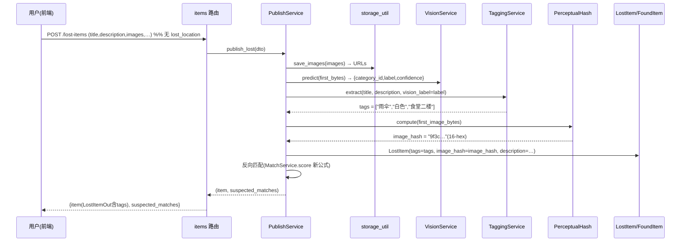
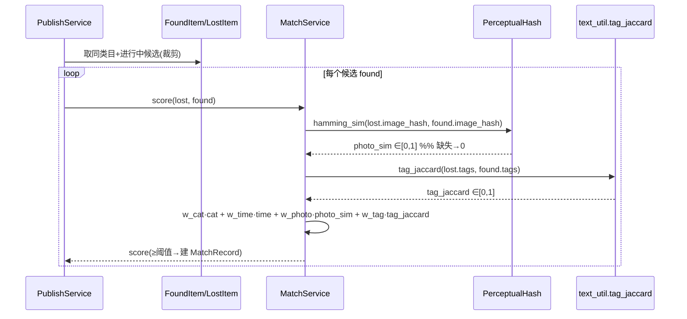
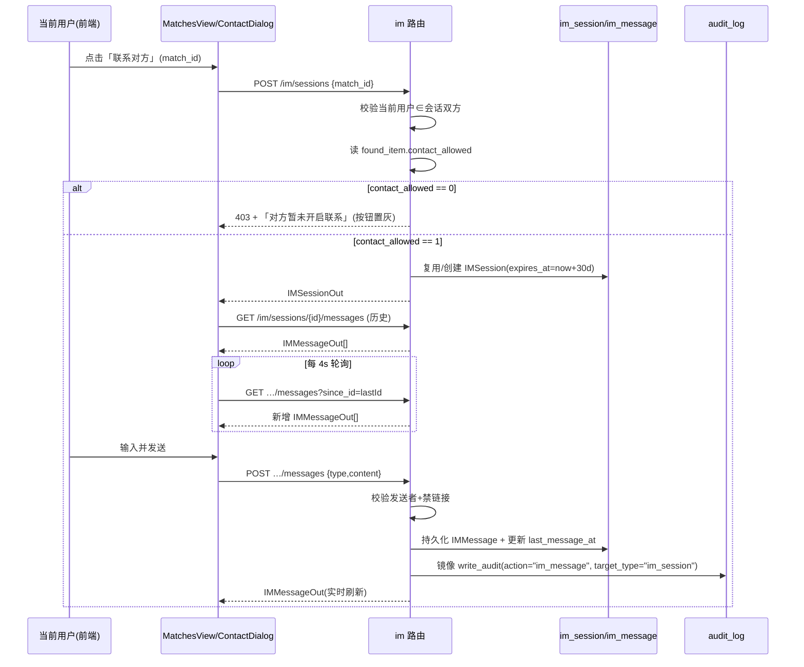
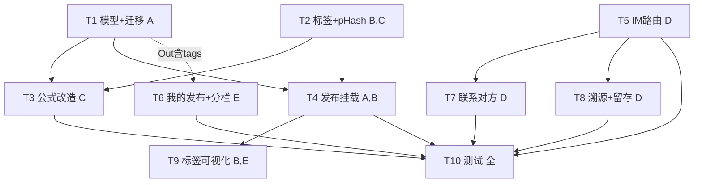

# v3 增量架构设计 + 任务分解（Incremental Architecture & Tasks）

| 项 | 内容 |
| --- | --- |
| 系统 | 基于 YOLOv8 的校园失物招领智能匹配系统 |
| 文档定位 | **增量设计**：仅描述在 v2 已落地基线之上的变更；不另起技术栈、不修改源码（本文档只产出设计） |
| 架构师 | 高见远（software-architect-2） |
| 技术栈（沿用，禁止更换） | 前端 **Vue3 + Element Plus + Vite + Pinia + Axios**；后端 **FastAPI + SQLAlchemy 2.x + SQLite/MySQL + Redis(可选) + JWT**；IM 用**前端轮询**（非 WebSocket） |
| 配套 PRD | `docs/prd/v3_incremental_prd.md` |
| 勘察基准 | 实地 Read/Glob/Grep 于 `app/`、`web/src/`、`migrations/` |

---

## 0. 实地勘察结论（设计依据，引用真实路径/行号）

| # | 事实 | 证据（文件:行） | 对设计的影响 |
| --- | --- | --- | --- |
| F1 | `LostItem.lost_location` 为 **NOT NULL** 文本列；`FoundItem.found_location` 为 nullable | `app/models/item.py:52`、`app/models/item.py:84` | 硬删需先合并进 `description`，且 SQLite 走 `batch_alter_table` |
| F2 | `FoundItem.contact_allowed` **已落地**（默认 1） | `app/models/item.py:87` | D 需求门控可直接复用，无需新增字段（Q5 拍板见 §7） |
| F3 | `im_session` / `im_message` 两张表 **已存在且字段齐全**（`match_id`/`lost_user_id`/`finder_user_id`/`sender_role`/`content` 等） | `app/models/im.py:22-86` | D 需求**复用表**，不新建 `messages` 表 |
| F4 | `app/schemas/im.py` **已存在**（IMSessionCreate/Out、IMMessageCreate/Out） | `app/schemas/im.py:1-46` | 仅缺**路由**，`app/routers/im.py` 需新建 |
| F5 | **无 `app/routers/im.py` 路由**，`main.py` 未装配 im 路由 | `app/main.py:22,60`（仅 auth/items/match/vision/admin） | 必须新建并注册 `im.router` |
| F6 | **无 `GET /users/me/items` 端点**（PRD 误以为可复用） | grep `users/me` 为空 | E 需求需新建该端点（归属 items 路由） |
| F7 | 状态枚举：**LostItem** 0待匹配/1匹配中/2待认领/3已解决；**FoundItem** 0待认领/1已解决；**MatchRecord** 0待认领/1认领中/2已完成/3已拒绝 | `app/schemas/common.py:59-76` | Q10 状态映射依据（§7） |
| F8 | 发布链路：`PublishService.publish_lost/found` 调 `get_vision_service().predict(first_bytes)` 得 `{category_id,label,confidence}`，再反向匹配 | `app/services/publish_service.py:46,139-154` | B 需求：在发布处挂载 `TaggingService` + 计算 `image_hash` |
| F9 | 匹配公式：`score=W1·cat+W2·time+W3·location+W4·keyword`，`location_hit_factor` 来自 `app.utils.location` | `app/services/match_service.py:36-63,15` | C 需求：删 W3(location) 与 W4(keyword)，改 photo+tag |
| F10 | 迁移机制为 **Alembic**（`render_as_batch=True`，已有 `0001_initial.py`）；`init_db()` 的 `create_all` 仅新增不删列 | `migrations/env.py:32,50`、`app/core/database.py:55-62` | A 需求：新增 `0002_v3_incremental.py` 才是删列正道；旧 `dev.db` 须 `alembic upgrade head` |
| F11 | 前端导航 `NAV_ITEMS` 与路由无「我的发布」；`MatchesView` 无「联系对方」按钮 | `web/src/router/index.ts:13-19`、`web/src/views/MatchesView.vue` | E/D 前端需新增页面、路由项、按钮、对话框 |
| F12 | 前端类型 `LostItemOut.lost_location`、`FoundItemOut.found_location` 仍存在；无 `tags`/`image_hash`/`IM*` 类型 | `web/src/types/index.ts:60-102` | 类型层需同步删 location、加 tags、加 IM 类型 |

> **结论**：PRD 五条需求全部可落地；唯一与 PRD 描述不符的是 **im 路由与 `users/me/items` 尚未存在**（PRD 假设已在），本设计按"新建"处理，不影响范围。

---

## 1. 增量实现方案 + 框架选型

**架构风格**：沿用既有「路由层（FastAPI Router）→ 服务层（Service）→ ORM（SQLAlchemy）」分层；前端「View + Pinia Store + api 适配器」分层。本次为**增量增强**，不引入新框架、不引入新进程。

**关键选型决策（毕业设计·CPU-only·易部署·务实优先）**：

1. **照片相似度 = 感知哈希 pHash（自实现，零新增依赖）**
   - 复用既有 **Pillow**（`vision_service` 已 `from PIL import Image`），**不引入 `imagehash` 库、不引 numpy/scipy**。
   - 算法：灰度 → 32×32 LANCZOS → 2D-DCT（纯 Python/math 实现）→ 取左上 8×8 → 中值阈值 → 64-bit 哈希串（16-hex）。
   - 发布时计算并持久化 `image_hash`；匹配时读双方预存哈希算 **Hamming 距离 → 相似度 = 1 − dist/64 ∈ [0,1]**；任一缺失→降级 `0.0`（不阻塞）。
   - 理由：CPU 零负担、确定性可复现、易部署、无第三方风险。

2. **标签抽取 = 中文规则（词典/子串匹配，零推理）**
   - 颜色词表 + 校园地点词表（含楼层词）+ 视觉 `label`（即 `category.name`）三者合并、归一去重（set + 保序）。
   - 标题与描述**都参与**（Q8）；视觉 label 已含类目时与描述去重（Q9）。

3. **实时通信 = 前端轮询（非 WebSocket）**
   - 新增 `GET /im/sessions/{id}/messages?since_id=` 供前端每 3–5s 拉取；发消息走 `POST`。
   - 理由：毕设语境下轮询零运维、易部署，避免 ASGI WebSocket 生命周期复杂度。

4. **匹配公式替换（C）**
   - `score = w_photo·photo_sim + w_tag·tag_jaccard + w_cat·category_hit + w_time·time_decay`
   - 候选集已按 `category_id + status` 裁剪（见 `publish_service._reverse_match_*`），photo/tag 仅对裁剪后候选运算，性能可控（P1-C4）。

5. **留存与溯源（D/Q7）**：`IM_RETENTION_DAYS` 由 7 → **30**；每条消息**镜像到 `audit_log`**（`action="im_message"`，落 `target_type="im_session"`），用于冒领溯源。

---

## 2. 文件列表及相对路径（标注 `[新增]/[变更]/[删除]`）

### 2.1 后端

| 文件 | 标记 | 变更说明 |
| --- | --- | --- |
| `app/models/item.py` | `[变更]` | `LostItem` 删 `lost_location`（:52）、`FoundItem` 删 `found_location`（:84）；两表各新增 `tags: Mapped[list\|None]`(JSON) 与 `image_hash: Mapped[str\|None]`(String(16))；保留 `contact_allowed`(:87) |
| `app/models/im.py` | `[复用]` | 不改（IMSession/IMMessage 已齐备） |
| `app/models/match.py` | `[复用]` | 不改（仅打分逻辑变，表结构不变） |
| `app/core/config.py` | `[变更]` | 新增 `MATCH_W_PHOTO/W_TAG/W_CAT/W_TIME`（默认 30/30/25/15）；`MATCH_W1~W4` 标记 deprecated（保留不删，避免外部引用断裂）；`IM_RETENTION_DAYS` 7→30（:85）；`MATCH_THRESHOLD` 沿用 80 |
| `app/schemas/item.py` | `[变更]` | `LostItemPublishDTO`/`FoundItemPublishDTO` 删 `lost_location`/`found_location`（:21-43）；`LostItemOut`/`FoundItemOut` 删 `lost_location`/`found_location`，新增 `tags: list[str] = []`（:47-114） |
| `app/schemas/im.py` | `[复用]` | 不改（已齐备） |
| `app/schemas/match.py` | `[变更]` | `MatchOut.from_model` 透传 `tags`（可选，供前端展示） |
| `app/services/publish_service.py` | `[变更]` | 发布时调用 `TaggingService.extract(...)` 写 `tags`、调用 `PerceptualHash.compute(first_bytes)` 写 `image_hash`；不再传 `lost_location`/`found_location`（:48-59, :94-105） |
| `app/services/tagging_service.py` | `[新增]` | 中文规则标签抽取：`extract(title, description, vision_label) -> list[str]`；内置 `COLOR_WORDS`/`LOCATION_WORDS` 词表（Q11 预留 admin 维护入口） |
| `app/services/perceptual_hash.py` | `[新增]` | 纯 Pillow 自实现 pHash：`compute(image_bytes)->str(16-hex)`、`hamming_sim(h1,h2)->float[0,1]` |
| `app/services/match_service.py` | `[变更]` | `score()` 用新四项权重；删 `location_hit_factor`（:36-38）；新增 `photo_sim_factor`（读 `image_hash`）、`tag_jaccard_factor`（读 `tags`）；删 `from app.utils import location`（:15） |
| `app/utils/text.py` | `[变更]` | 新增 `tag_jaccard(tags_a, tags_b)->float`（基于集合 Jaccard，与 `jaccard` 复用） |
| `app/utils/location.py` | `[删除]` | W3 地点因子移除后不再被引用，可删除（或保留空壳，无害） |
| `app/routers/items.py` | `[变更]` | `create_lost_item`/`create_found_item` 移除 `lost_location`/`found_location` 入参（:56-132）；新增 `GET /users/me/items`（E 需求，"我的发布"后端） |
| `app/routers/im.py` | `[新增]` | IM 路由：`POST /im/sessions`（创建/复用+门控）、`GET /im/sessions/{id}/messages`（轮询历史）、`POST /im/sessions/{id}/messages`（发消息+鉴权+禁链+镜像 audit） |
| `app/main.py` | `[变更]` | 导入并 `include_router(im.router)`（:22, :60 之间） |
| `app/routers/match.py` | `[复用]` | 不改（`GET /matches?status=` 已支持分栏） |
| `app/schemas/common.py` | `[变更]` | `AuditAction` 新增 `IM_MESSAGE = 6`（用于镜像，可选，亦可直传字符串 "im_message"） |
| `migrations/versions/0002_v3_incremental.py` | `[新增]` | Alembic 迁移：先合并 location→description，再 `batch_alter_table` 加 `tags`/`image_hash`、删 `lost_location`/`found_location` |

### 2.2 前端

| 文件 | 标记 | 变更说明 |
| --- | --- | --- |
| `web/src/views/MyPublishView.vue` | `[新增]` | E："我的发布"页，失物+拾物混合，按「进行中/已完成」分栏，卡片含类型徽标+标题+状态+tags |
| `web/src/router/index.ts` | `[变更]` | `NAV_ITEMS` 增加「我的发布」项（:13-19）；`routes` 增加 `/mypublish` 子路由（:45-49 附近） |
| `web/src/views/MatchesView.vue` | `[变更]` | E2：顶部「进行中/已完成」两 Tab（按 `status` 分）；D1：每条匹配加「联系对方」按钮 → 弹出 `ContactDialog` |
| `web/src/views/ContactDialog.vue` | `[新增]` | D：临时会话对话框（气泡左右分+输入框+发送+轮询加载历史） |
| `web/src/views/PublishView.vue` | `[变更]` | A：删失物「丢失地点」必填框（:140-142 及校验 :326、提交 :343）；删拾物「拾得地点」框（:85-87、:296）；地点语义并入描述 |
| `web/src/api/items.ts` | `[变更]` | 新增 `myPublished(): Promise<MyPublishResult>`（调 `GET /users/me/items`） |
| `web/src/api/im.ts` | `[新增]` | `imApi`：`createSession(matchId)`、`getMessages(sessionId, sinceId?)`、`sendMessage(sessionId, body)` |
| `web/src/api/match.ts` | `[复用]` | 不改（`myMatches` 已支持 status 过滤） |
| `web/src/types/index.ts` | `[变更]` | `LostItemOut`/`FoundItemOut` 删 `lost_location`/`found_location`、加 `tags: string[]`；新增 `IMSessionOut`/`IMMessageOut`/`MyPublishResult` |
| `web/src/api/constants.ts` | `[变更]` | 新增 `IM_POLL_INTERVAL_MS = 4000` 常量（轮询间隔） |
| `web/src/components/ItemCard.vue` | `[变更]` | P2-B1：卡片展示 `tags` chips（E/B 展示用） |

---

## 3. 数据结构和接口（Mermaid classDiagram）

```mermaid
classDiagram
    %% ===== 图例：<<变更>> 改动字段 / <<新增>> 新类或新字段 / <<复用>> 原样复用 =====

    class LostItem {
        <<变更>>
        +BigInteger id
        +int publisher_id
        +int category_id
        +str category_name
        +str title
        +Text description
        +JSON images
        +str color
        -str lost_location  %% 删除
        +DateTime lost_time
        +SmallInt status   %% 0待匹配/1匹配中/2待认领/3已解决
        +DateTime created_at
        +JSON tags         %% 新增
        +str image_hash    %% 新增(16-hex)
    }

    class FoundItem {
        <<变更>>
        +BigInteger id
        +int finder_id
        +int category_id
        +str category_name
        +Text description
        +JSON images
        -str found_location  %% 删除
        +DateTime found_time
        +SmallInt keep_status
        +SmallInt contact_allowed  %% 复用(门控)
        +SmallInt status   %% 0待认领/1已解决
        +DateTime created_at
        +JSON tags         %% 新增
        +str image_hash    %% 新增(16-hex)
    }

    class MatchRecord {
        <<复用>>
        +BigInteger id
        +int lost_id
        +int found_id
        +Numeric match_score   %% 新公式重算
        +SmallInt status       %% 0待认领/1认领中/2已完成/3已拒绝
        +Text claim_reason
        +str code
        +DateTime created_at
    }

    class IMSession {
        <<复用>>
        +BigInteger id
        +int match_id
        +int lost_user_id
        +int finder_user_id
        +SmallInt status
        +DateTime created_at
        +DateTime last_message_at
        +DateTime expires_at   %% 由 IM_RETENTION_DAYS 设定
    }

    class IMMessage {
        <<复用>>
        +BigInteger id
        +int session_id
        +int sender_id
        +SmallInt sender_role  %% 0失主/1拾得者
        +SmallInt content_type %% 0文字/1模板
        +str content
        +DateTime sent_at
    }

    class AuditLog {
        <<复用>>
        +action : str
        +target_type : str
        +target_id : int
        +detail : str
    }

    class TaggingService {
        <<新增>>
        +list~str~ COLOR_WORDS
        +list~str~ LOCATION_WORDS
        +extract(title, description, vision_label) list~str~
    }

    class PerceptualHash {
        <<新增>>
        +compute(image_bytes) str
        +hamming_sim(h1, h2) float
    }

    class MatchService {
        <<变更>>
        +score(lost, found) float
        +photo_sim_factor(lost, found) float
        +tag_jaccard_factor(lost, found) float
        +category_hit(exact) float
        +time_decay_factor(lt, ft) float
    }

    class ItemsRouter {
        <<变更>>
        +POST /lost-items
        +POST /found-items
        +GET /users/me/items  %% 新增(E)
    }

    class IMRouter {
        <<新增>>
        +POST /im/sessions
        +GET /im/sessions/{id}/messages
        +POST /im/sessions/{id}/messages
    }

    class MatchRouter {
        <<复用>>
        +GET /matches?status=
        +POST /matches/{id}/claim
    }

    LostItem "1" --> "0..*" MatchRecord : lost_id
    FoundItem "1" --> "0..*" MatchRecord : found_id
    MatchRecord "0..1" --> "1" IMSession : match_id
    IMSession "1" --> "0..*" IMMessage : session_id
    MatchRecord ..> AuditLog : 镜像(D)
    TaggingService ..> PerceptualHash : 复用(图片)
    ItemsRouter ..> TaggingService : 发布挂载(B)
    ItemsRouter ..> PerceptualHash : 发布算哈希(C)
    ItemsRouter ..> MatchService : 反向匹配
    IMRouter ..> IMSession : CRUD
    IMRouter ..> IMMessage : CRUD
    IMRouter ..> AuditLog : 镜像消息
    MatchRouter ..> MatchService : 打分
```

### 3.1 关键接口概要（请求/响应）

**发布（变更）**
- `POST /api/v1/lost-items` (multipart)：入参**移除** `lost_location`；其余 `title,description,category_name,lost_time,color,images`。响应 `LostItemOut`（含 `tags`）。
- `POST /api/v1/found-items` (multipart)：入参**移除** `found_location`；其余 `keep_status,category_name,images,description,found_time,contact_allowed`。

**我的发布（新增）**
- `GET /api/v1/users/me/items` → `{ lost: LostItemOut[], found: FoundItemOut[] }`（当前用户 publisher/finder 全部发布）。

**IM（新增）**
- `POST /api/v1/im/sessions` body `{match_id:int}` → `IMSessionOut`；若 `found_item.contact_allowed==0` 返回 403 + 提示「对方暂未开启联系」。
- `GET /api/v1/im/sessions/{id}/messages?since_id=&limit=` → `IMMessageOut[]`（轮询；`since_id` 增量拉取）。
- `POST /api/v1/im/sessions/{id}/messages` body `{type:"text"|"template", content:str}` → `IMMessageOut`；校验发送者 ∈ 会话双方、禁链接（正则拒绝 http/url）、写库并镜像 `audit_log`。

**匹配（复用 + 公式变更）**
- `GET /api/v1/matches?status=` 仍可用；`MatchOut.match_score` 由新公式给出。

---

## 4. 程序调用流程（Mermaid sequenceDiagram）

### 4.1 发布：打标签 + 算感知哈希（需求 B + C 数据准备）



### 4.2 匹配：照片相似度 + 标签 Jaccard（需求 C）



### 4.3 「联系对方」：轮询对话流（需求 D + Q6/Q7）



---

## 5. 任务列表（有序、含依赖、按实现顺序，标注 P0/P1/P2 与需求字母）

> 依赖关系以「模型字段就绪 → 服务 → 路由 → 前端」为主线；IM 路由表已存在可独立推进。

| 任务 | 名称 | 来源文件 | 依赖 | 优先级 / 需求 |
| --- | --- | --- | --- | --- |
| **T1** | 数据层迁移与模型字段变更（删 location + 加 tags/image_hash） | `app/models/item.py`、`migrations/versions/0002_v3_incremental.py` | 无 | **P0 / A** |
| **T2** | 标签与感知哈希基础服务 | `app/services/tagging_service.py`、`app/services/perceptual_hash.py`、`app/utils/text.py`(+`tag_jaccard`)、`app/utils/location.py`[删] | 无 | **P0 / B,C** |
| **T3** | 配置与匹配公式改造（新四项权重 + 候选裁剪 + 删 location 因子） | `app/core/config.py`、`app/services/match_service.py` | T1, T2 | **P1 / C** |
| **T4** | 发布链路挂载打标签 + 算哈希（去 location 入参） | `app/routers/items.py`、`app/schemas/item.py`、`app/services/publish_service.py` | T1, T2 | **P0 / A,B** |
| **T5** | IM 路由与鉴权/门控/留存（前端轮询后端） | `app/routers/im.py`、`app/main.py`、`app/schemas/common.py`(AuditAction+IM_MESSAGE) | 无（表已存在） | **P0 / D** |
| **T6** | 「我的发布」页 + 路由 + 后端端点 + 「我的匹配」分栏 | `web/src/views/MyPublishView.vue`、`web/src/router/index.ts`、`web/src/api/items.ts`、`app/routers/items.py`(+`GET /users/me/items`)、`web/src/views/MatchesView.vue`(分栏)、`web/src/types/index.ts` | T1(Out 含 tags) | **P0 / E** |
| **T7** | 「联系对方」对话框 + 轮询 + 门控禁用 | `web/src/views/ContactDialog.vue`、`web/src/api/im.ts`、`web/src/types/index.ts`(+IM 类型)、`web/src/views/MatchesView.vue`(按钮) | T5 | **P0 / D** |
| **T8** | 冒领溯源镜像 + 留存清理 + 禁链接强化 | `app/routers/im.py`(镜像/清理)、`app/core/config.py`(IM_RETENTION_DAYS=30) | T5 | **P1 / D** |
| **T9** | 标签可视化/筛选 + 标题参与抽取（体验增强） | `web/src/components/ItemCard.vue`、`app/services/tagging_service.py`(标题已含) | T4 | **P2 / B,E** |
| **T10** | 回归测试与联调（迁移/公式/IM/分栏/对话框） | `tests/`(+`test_v3_*.py`)、前端联调 | T1–T9 | **P0 / 全** |

**依赖图（Mermaid）**：



---

## 6. 依赖包列表

| 包 | 是否新增 | 说明 |
| --- | --- | --- |
| `Pillow` | **否（已有）** | `vision_service` 已用 `from PIL import Image`；pHash 复用其 `Image`/`resize`/`convert` |
| `imagehash` | **否（决策不引入）** | 二选一中的备选；为「零新增依赖、易部署」**放弃**，改用纯 Pillow 自实现 pHash |
| `numpy` / `scipy` | **否（不引入）** | DCT 用纯 Python/math 实现（32×32 矩阵极小，开销可忽略） |
| `fastapi` / `sqlalchemy` / `alembic` / `pydantic-settings` / `element-plus` / `axios` / `vue-router` / `pinia` | **否（已有）** | 沿用既有栈 |

**结论：本增量无需新增任何第三方依赖。**

---

## 7. 11 个 PRD 待确认问题拍板（默认值 + 理由）

| Q | 问题 | 拍板默认值 | 理由 |
| --- | --- | --- | --- |
| **Q1** | 地点列硬删 vs 保留空列 | **硬删** `lost_location`/`found_location` + 写迁移（存量并入 `description`，行级 `UPDATE … SET description = description \|\| '[地点] ' \|\| lost_location` 后再 `batch_alter_table` 删列） | 简化模型、消除歧义；地点语义保留在描述与标签中（F1/F10） |
| **Q2** | 照片相似度算法 | **感知哈希 pHash**（自实现，Pillow 复用）；发布算 `image_hash` 持久化，匹配按 Hamming→相似度∈[0,1]；缺失降级 0.0 | CPU 零负担、零新增依赖、确定性可复现、易部署（§1 决策 1） |
| **Q3** | 权重与阈值 | 新四项 `MATCH_W_PHOTO=30 / W_TAG=30 / W_CAT=25 / W_TIME=15`，阈值沿用 **80**；旧 `MATCH_W1~W4` 标 deprecated（保留防引用断裂） | 四项之和=100，权重直观；阈值不变避免匹配量突变（F9） |
| **Q4** | 关键词提权幅度 | 由 `W_TAG=30` 承载（原 W4=15 上调至 30），类别/时间相应下调，总分不变 | 标签 Jaccard 取代纯文本关键词，权重翻倍体现"提权"（§1 决策 4） |
| **Q5** | 联系门控语义 | v3 **仅用 `found_item.contact_allowed`** 作唯一门控；无论失主或拾得者点「联系对方」，均取该值；为 0 时按钮置灰 | 单一开关、最简化；`lost_item.contact_allowed`（P2-D2）本期不做（F2/F5） |
| **Q6** | 实时机制 | **前端轮询**（每 4s `GET /im/sessions/{id}/messages?since_id=`），不引 WebSocket | 毕设易部署、零运维；轮询量级小（F11） |
| **Q7** | 留存与溯源 | `IM_RETENTION_DAYS` 7→**30**；每条消息**镜像 `audit_log`**（`action="im_message"`, `target_type="im_session"`），留存期满仅清理 `im_message`/`im_session`，`audit_log` 按 `AUDIT_RETENTION_DAYS=365` 长期留存 | 双保险：会话期内可查 + 审计长期溯源防冒领（F3/audit_service 签名） |
| **Q8** | 标签抽取范围 | **标题 + 描述都参与**（失物有 title+description；拾物无 title，取 vision_label+description） | 提升召回；视觉 label 与文本去重统一（F8） |
| **Q9** | 抽取方式 | **中文规则**（种子分类词取自 `category.name`/视觉 label + 颜色词表 + 校园地点词表，子串匹配），零推理成本 | 准确率高、可解释、CPU-only（§1 决策 2） |
| **Q10** | 「我的发布」状态映射 | 依据枚举（F7）：**LostItem** 进行中={0,1,2}，已完成={3(已解决)}；**FoundItem** 进行中={0(待认领)}，已完成={1(已解决)}；**MatchRecord** 进行中={0,1}，已完成={2,3} | 直接用现有 status 枚举二分，无需新字段（§3.1） |
| **Q11** | 地点词表来源 | 先用**通用地点词 + 楼层词**占位（内置 `LOCATION_WORDS` 常量），**预留 admin 维护入口**（后续可在 `admin` 路由暴露常量管理，本期仅留常量表） | 务实起步、可演进；不阻塞 v3 上线 |

---

## 8. 共享知识（跨文件约定）

1. **`tags` JSON 格式**：`list[str]`，示例 `["雨伞","白色","食堂二楼"]`；顺序=「类目/视觉label → 颜色 → 地点」保序去重；空时存 `[]`（不存 null）。
2. **`image_hash` 格式**：16 位十六进制字符串（64-bit pHash），例 `"9f3c2a71b8e0d415"`；仅后端使用，不进前端 Out（除非调试需要）。
3. **状态枚举映射**（前后端必须一致，见 `app/schemas/common.py` 与 `web/src/api/constants.ts`）：
   - LostItem：`0待匹配/1匹配中/2待认领/3已解决`
   - FoundItem：`0待认领/1已解决`
   - MatchRecord：`0待认领/1认领中/2已完成/3已拒绝`
   - 分栏：进行中 = Lost{0,1,2}/Found{0}/Match{0,1}；已完成 = Lost{3}/Found{1}/Match{2,3}
4. **config 新键命名**：`MATCH_W_PHOTO` / `MATCH_W_TAG` / `MATCH_W_CAT` / `MATCH_W_TIME`；旧 `MATCH_W1~W4` deprecated。
5. **前后端字段命名一致性**：删除 `lost_location`/`found_location` 后，前后端类型同步移除；新增 `tags` 两端均为 `string[]`；IM 类型对齐 `app/schemas/im.py`（IMSessionOut/IMMessageOut）。
6. **统一响应体**：所有接口返回 `{code,message,data}`（`StandardResponse`），IM 路由同样遵循。
7. **门控约定**：`contact_allowed==0` → 前端按钮 `disabled` + tooltip「对方暂未开启联系」；后端 `POST /im/sessions` 返回 403。
8. **镜像审计**：IM 消息一律 `audit_service.write_audit(action="im_message", target_type="im_session", target_id=session.id, detail=content)`，由调用方事务统一提交。
9. **防骚扰**：`POST /im/sessions/{id}/messages` 服务端正则拒绝含 `http(s)://`、`<a ` 等链接内容，返回 400。

---

## 9. 待明确事项 / 需主理人确认点（阻塞或风险）

1. **存量数据 `tags`/`image_hash` 回填？**（非阻塞）迁移只删列+加空列，**已有记录 `tags=null`/`image_hash=null`** → 匹配时该因子降级为 0。是否需要在迁移中对已有 `found_item`（有图）回溯计算 `image_hash`？当前拍板：**不回溯**（仅新发布生效），如主理人认为需回溯请确认（需读盘+PIL，迁移较重）。
2. **`init_db()` 与 Alembic 的一致性**：开发期 `main.py` 走 `create_all`，**不会删除旧 `lost_location` 列**。已有 `dev.db` 必须执行 `alembic upgrade head` 才能生效；否则旧列残留、`create_all` 新建库无旧列。建议：开发流程统一改为「模型变更 → 写迁移 → `alembic upgrade head`」。请主理人确认是否在本迭代强制改用 Alembic 作为建表唯一入口（停用 `init_db` 的 `create_all`）。
3. **`MATCH_W1~W4` 是否物理删除**：本文档拍板"保留并标 deprecated"。若主理人要求彻底删除，需同步检查是否有 admin/脚本引用（当前仅 `match_service` 引用，已迁）。
4. **Q5 方向性歧义**：当前拍板「无论哪方点都看 `found_item.contact_allowed`」。若主理人认为拾得者→失主方向应**始终可联系**（因失主无开关），可改为「门控仅作用于 失主→拾得者 方向」。请确认采用哪种语义。
5. **`LOCATION_WORDS` 词表内容**：本文档给占位词（食堂/图书馆/教学楼/宿舍/操场/校门/超市/快递/行政楼/体育馆 + 一楼~十二楼/层）。真实校园地点清单若由产品提供，请在 T2 前给到，否则用占位词上线。
6. **轮询间隔**：默认 4s（见 `IM_POLL_INTERVAL_MS`）。若主理人偏好 3s 或 5s 请告知，仅常量调整。

---

> 文档结束。所有设计均基于实地勘察的真实文件路径与行号，未改动任何源码。任务 T1–T10 已按依赖排序，可直接移交工程（software-engineer 系列）按 P0→P1→P2 实施。
