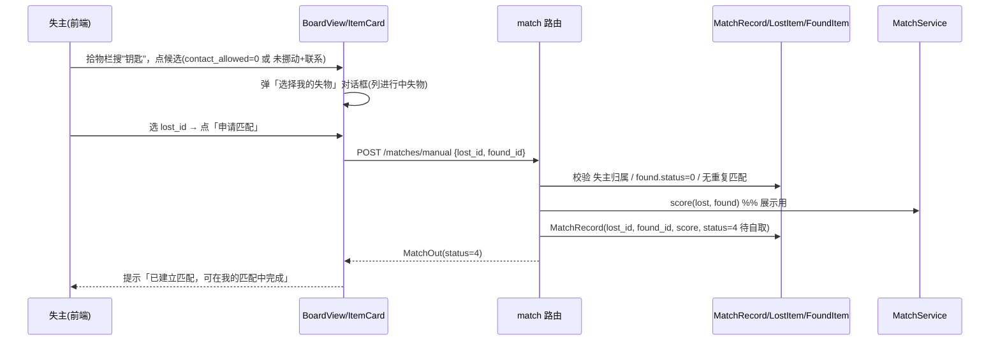
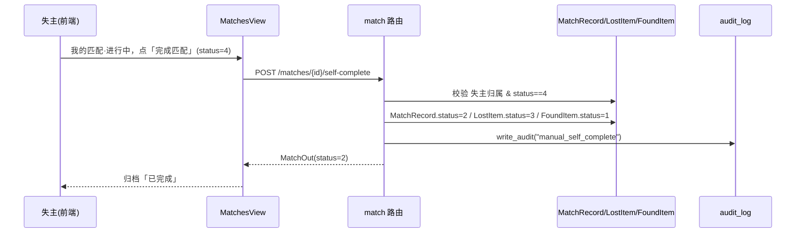
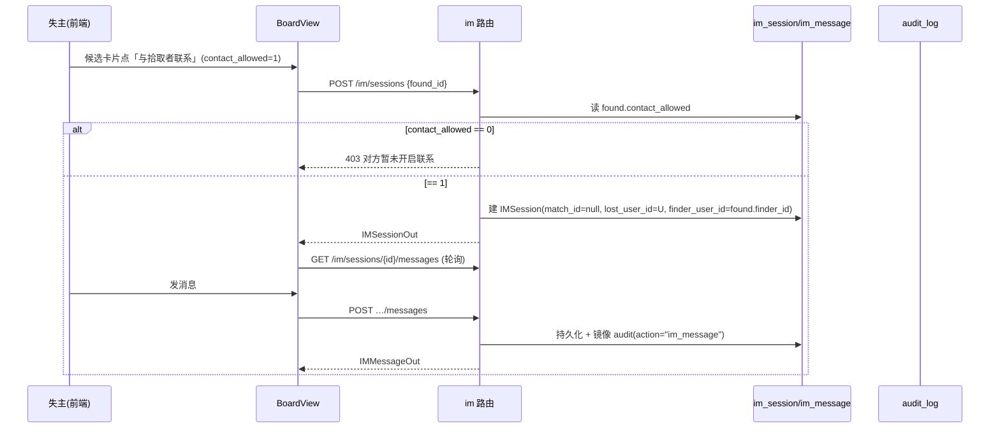
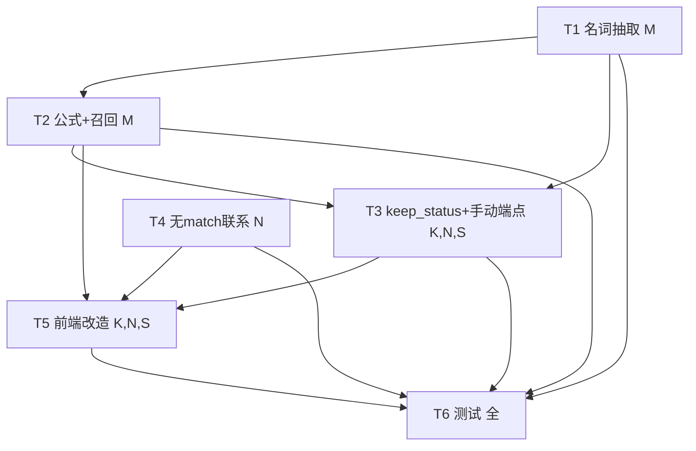

# v4 增量架构设计 + 任务分解（Incremental Architecture & Tasks）

| 项 | 内容 |
| --- | --- |
| 系统 | 基于 YOLOv8 的校园失物招领智能匹配系统 |
| 文档定位 | **增量设计**：仅在 v3 已落地基线之上描述变更；不另起技术栈、不修改源码（本文档只产出设计） |
| 架构师 | 高见远（software-architect） |
| 技术栈（沿用，禁止更换） | 前端 **Vue3 + Element Plus + Vite + Pinia + Axios**；后端 **FastAPI + SQLAlchemy 2.x + SQLite/MySQL + JWT**；IM **前端轮询**（非 WebSocket） |
| 配套 PRD | `docs/prd/v4_incremental_prd.md`（含 §5 Q1–Q8 及建议默认） |
| 勘察基准 | 实地 Read 于 `app/`、`web/src/`、`migrations/`（行号见正文 F 标注） |

---

## 0. 实地勘察结论（设计依据，引用真实路径/行号）

| # | 事实 | 证据 | 对设计的影响 |
| --- | --- | --- | --- |
| F1 | `tagging_service.extract` 仅抽 视觉label→颜色→地点，**不抽物品名词** | `app/services/tagging_service.py:73-87`；常量 `COLOR_WORDS:17`、`LOCATION_WORDS:25` | 须增补 `ITEM_NOUN_WORDS` 并前置抽取优先级（名词>颜色>地点>视觉label） |
| F2 | 匹配公式 `score = W_PHOTO·photo + W_TAG·tag_jaccard + W_CAT·cat + W_TIME·time`，权重 `30/30/25/15`，阈值 80 | `app/services/match_service.py:65-84`；`app/core/config.py:73-77` | `tag_jaccard`（对称）须改为 **containment（查询命中率）**；W_TAG 提至 40、W_PHOTO 降到 20 |
| F3 | 候选召回**按 `category_id` 主键过滤** | `app/services/publish_service.py:174-181`（lost）、`:203-212`（found） | 纯文字失物 `category_id` 由视觉降级为 fallback（≠候选真实类目）→ AC1/AC2 漏检；须改为「共享名词 tag 召回 + 类目精排」 |
| F4 | 纯文字失物 `category_id` 解析：无图→`first_bytes=b""`→`vision.predict` 降级→`_category_from_vision` 返回 fallback 类目 | `app/services/publish_service.py:39-50,63-65`；`app/services/vision_service.py:150-151,242-256` | 须新增「按 `category_name`/提取名词回退 `Category.id`」解析，确保同类目 `cat=1.0` |
| F5 | `IMSession.match_id` **已可空**（`nullable=True`） | `app/models/im.py:28-32` | 无 match 的联系会话**无需新增 `found_id` 列**：创建时以 `found_id` 入参校验 `contact_allowed` 即可，零迁移 |
| F6 | `MatchRecord.status` 为 `SmallInteger`，现有 `0/1/2/3` | `app/models/match.py:43`；`app/schemas/common.py:71-76` | 新增 `4=待自取(MANUAL_PENDING)` 仅扩展 int 值域，**无需改列**，只需在 `MatchStatus` 枚举加成员 |
| F7 | `keep_status` 枚举值 0/1 不变；`contact_allowed` 默认 1 | `app/models/item.py:92-93`；`app/schemas/common.py:78-81` | 改名仅前端/常量文案（`KEEP_STATUS_LABEL`）；强制 `contact_allowed=1` 是发布校验逻辑 |
| F8 | 发布校验现状：`keep_status` 仅校验 ∈{0,1}；`contact_allowed` 默认 1，未强制 | `app/routers/items.py:103-104,98`；`app/services/publish_service.py:135-137` | 须加：当 `keep_status=0` 且收到 `contact_allowed=0` → **400 拒绝**（发布后端落点） |
| F9 | `GET /found-items` 仅按 `status` 过滤；关键词由前端承担 | `app/routers/items.py:214-234`；`web/src/views/BoardView.vue:146-172` | 手动兜底候选源**直接复用** `GET /found-items`；前端关键词过滤扩展至 tags（Q5 默认） |
| F10 | 双动态码交接仅作用于「认领中」匹配；`handover_service` 已就绪 | `app/services/handover_service.py`；`app/routers/match.py:193-247` | 未挪动自取**不调 handover**，仅置双端已解决 |
| F11 | 前端 `KEEP_STATUS_LABEL` = {0:"已保管",1:"待领取"}；`MATCH_STATUS_LABEL` 无 4 | `web/src/api/constants.ts:49-52,42-47` | 改名 + 新增 4:"待自取" |
| F12 | `PublishView` 保管状态单选("已保管/待领取")；`contact_allowed` 开关未锁定 | `web/src/views/PublishView.vue:19-24,93-95` | 改名「暂为保管/未挪动」+ `keep_status=0` 时锁定开关为开 |

> **结论**：v4 全部变更均可基于 v3 事实落地；唯一与 PRD 描述一致的关键瓶颈是 F3（候选按 category_id 过滤）与 F1（不抽名词），本设计通过「名词词典 + containment 公式 + 名词召回」根治。

---

## 1. 增量实现方案 + 框架选型

**架构风格**：沿用 v3「路由层 → 服务层 → ORM」与「View + Pinia + api 适配器」分层；本次为**增量增强**，不引入新框架、不引入新进程、不新增第三方依赖。

**关键选型决策（沿用 v3，零新增依赖优先）**：

1. **物品名词词典（常量表）**：在 `TaggingService` 内新增 `ITEM_NOUN_WORDS`（含 钥匙/校园卡/玩偶/本子/水杯/雨伞/手机/钱包/书包/书/笔记本/眼镜/耳机/充电宝/饭卡/学生证 等校园常见物 + 与 12 个种子类目名对齐）。零推理、零依赖，照 `COLOR_WORDS` 模式实现。
2. **抽取优先级（保序去重）**：`名词 > 颜色 > 地点 > 视觉label`。名词优先于一切，是「匹配主信号」；`category_name` 作为规范名词注入（先做最长子串归一，避免把"银色钥匙"整串当 tag）。
3. **匹配公式重算（标签主导）**：`tag` 因子由对称 Jaccard 改为 **containment（查询命中率）** `|lost.tags ∩ found.tags| / |lost.tags|`，使"标签更少"的纯文字失物也能满命中候选。**权重 `W_PHOTO=20 / W_TAG=40 / W_CAT=25 / W_TIME=15`，阈值沿用 80**。
4. **颜色消歧（硬门控）**：当失物与候选**双方都指定颜色且颜色不相交**时，强制 score=0（判为不匹配），与公式结果双保险。
5. **候选检索改造（语标签驱动）**：召回条件由「`category_id` 主键等值」改为「`category_id` 相等 **或** 共享物品名词 tag」之**并集**；类目/时间仅作精排（权重）。纯文字失物 `category_id` 改为「按 `category_name`/提取名词回退 `Category.id`」解析。
6. **`MatchRecord.status` 新增 4=待自取**：仅枚举值扩展（int 域内），`keep_status` 仅文案改名，`contact_allowed` 强制为发布校验逻辑——**均零迁移**（见 §6）。
7. **手动匹配兜底**：失物栏复用 `GET /found-items` 浏览候选；按 `contact_allowed` 分两支（联系 / 申请匹配）；「申请匹配」建 `MatchRecord(status=4)`；「未挪动」自取自 `POST /matches/{id}/self-complete` 单边归档（不调 handover）。
8. **无 match 联系入口**：复用 `POST /im/sessions`，新增可选入参 `found_id`（不传 `match_id`）；门控/审计/轮询全复用；因 `IMSession.match_id` 已可空（F5），**零迁移**。

---

## 2. 文件列表及相对路径（标注 `[新增]/[变更]`）

### 2.1 后端

| 文件 | 标记 | 变更说明 |
| --- | --- | --- |
| `app/services/tagging_service.py` | `[变更]` | 新增 `ITEM_NOUN_WORDS` 常量表；`extract` 签名扩为 `extract(title, description, vision_label, category_name=None)`；抽取顺序改为 **名词→颜色→地点→视觉label**；名词做最长子串归一（category_name 先抽干净名词） |
| `app/services/match_service.py` | `[变更]` | 新增 `tag_containment_factor(lost_tags, found_tags)`（替代对称 jaccard 参与打分）；新增 `color_conflict(lost_tags, found_tags)` 硬门控；`score()` 改用 containment + 颜色门控；保留 `tag_jaccard_factor` 为 deprecated 兼容 |
| `app/core/config.py` | `[变更]` | `MATCH_W_PHOTO=20`、`MATCH_W_TAG=40`（其余 `W_CAT=25`/`W_TIME=15`/`MATCH_THRESHOLD=80` 不变）；更新注释 |
| `app/services/publish_service.py` | `[变更]` | (a) `extract` 调用补 `category_name`；(b) 新增 `_resolve_category_id(category_name, vision_result, noun_tags)` 优先按名词解析 `category_id`；(c) `_reverse_match_lost/found` 候选召回改为「类目相等 ∪ 共享名词 tag」并集 + 颜色门控 + 阈值；(d) `publish_found` 当 `keep_status=0` 强制 `contact_allowed=1`，收到 0 抛 `ParamError(400)` |
| `app/schemas/common.py` | `[变更]` | `MatchStatus` 新增 `MANUAL_PENDING = 4`（注释更新：0待认领/1认领中/2已完成/3已拒绝/4待自取） |
| `app/schemas/match.py` | `[变更]` | 新增 `MatchManualCreate`（字段 `lost_id:int`、`found_id:int`）；`MatchOut.from_model` 透传 status（含 4） |
| `app/routers/match.py` | `[变更]` | 新增 `POST /matches/manual`（建 `MatchRecord(status=4)`）；新增 `POST /matches/{id}/self-complete`（失主单边归档，不调 handover） |
| `app/routers/items.py` | `[变更]` | `create_found_item` 增加 `keep_status=0 & contact_allowed=0 → 400`（双保险，publish 已校验）；`GET /found-items` 可选加 `keyword` 服务端过滤（Q5 增强，非必须） |
| `app/routers/im.py` | `[变更]` | `create_session` 支持 `found_id` 入参（无 match）：解析 found→设参与者→门控 `contact_allowed==1`→建 `match_id=None` 会话；`_load_found_item` 兼容 `match_id=None`（返回 None，发送端不再二次门控，创建时已门控） |
| `app/schemas/im.py` | `[变更]` | `IMSessionCreate` 新增 `found_id: Optional[int] = None`；`IMSessionOut` 新增 `found_id` |
| `app/models/im.py` | `[复用]` | **不改**（`match_id` 已 nullable，满足无 match 会话；见 §6 迁移结论） |
| `migrations/versions/0003_v4_incremental.py` | `[无需新增]` | 见 §6：结论为**零迁移**，不生成 0003 |

### 2.2 前端

| 文件 | 标记 | 变更说明 |
| --- | --- | --- |
| `web/src/views/PublishView.vue` | `[变更]` | 保管状态单选改名「暂为保管(0)/未挪动(1)」；`keep_status=0` 时 `contact_allowed` 开关**锁定为开且不可取消**（disabled + 强制 1）；加一句差异说明（P2-K1 可选） |
| `web/src/components/ItemCard.vue` | `[变更]` | 仅 `kind==='found'` 时按 `contact_allowed`+`keep_status` 渲染动作区：`keep_status==1 && contact_allowed==1` → **双按钮**（联系+申请匹配）；否则 `contact_allowed==1`→联系；`contact_allowed==0`→申请匹配。emit `contact`/`applyMatch` 事件 |
| `web/src/views/BoardView.vue` | `[变更]` | 处理 `ItemCard` 的 `contact`/`applyMatch`：联系→`imApi.createSession({found_id})`→开 `ContactDialog`；申请匹配→弹「选择我的失物」对话框（列当前用户进行中失物）→`matchApi.createManual`；关键词过滤扩展至 tags |
| `web/src/views/MatchesView.vue` | `[变更]` | 进行中分栏纳入 `status=4`；`status==4 && myRole==='lost'` 显示「完成匹配」按钮→`matchApi.selfComplete`；`statusType`/`MATCH_STATUS_LABEL` 补 4 |
| `web/src/views/ContactDialog.vue` | `[变更]` | 支持「无 match」场景：接收 `foundId` prop，调用 `imApi.createSession({found_id})` 建会话后再轮询 |
| `web/src/api/im.ts` | `[变更]` | `createSession` 入参扩展为 `{match_id?, found_id?}` |
| `web/src/api/match.ts` | `[变更]` | 新增 `createManual(lostId, foundId)`→`POST /matches/manual`；`selfComplete(matchId)`→`POST /matches/{id}/self-complete` |
| `web/src/api/constants.ts` | `[变更]` | `KEEP_STATUS_LABEL`：0→"暂为保管"、1→"未挪动"；`MATCH_STATUS_LABEL` 补 `4:"待自取"` |
| `web/src/types/index.ts` | `[变更]` | `IMSessionCreate` 补 `found_id?`；`IMSessionOut` 补 `found_id`；`MatchOut.status` 注释补 `4=待自取`；新增 `ManualMatchResult` 等可选类型 |

---

## 3. 数据结构和接口（Mermaid classDiagram）

```mermaid
classDiagram
    %% ===== 图例：<<变更>> 改动字段/方法 / <<新增>> 新类或新字段 =====

    class LostItem {
        <<复用>>
        +BigInteger id
        +int publisher_id
        +int category_id
        +str category_name
        +str title
        +Text description
        +JSON images
        +str color
        +JSON tags
        +str image_hash
        +SmallInt status   %% 0待匹配/1匹配中/2待认领/3已解决
    }

    class FoundItem {
        <<复用>>
        +BigInteger id
        +int finder_id
        +int category_id
        +str category_name
        +Text description
        +JSON images
        +JSON tags
        +str image_hash
        +SmallInt keep_status   %% 0暂为保管/1未挪动(文案改名)
        +SmallInt contact_allowed  %% keep_status=0 时强制=1
        +SmallInt status   %% 0待认领/1已解决
    }

    class MatchRecord {
        <<变更·枚举>>
        +BigInteger id
        +int lost_id
        +int found_id
        +Numeric match_score
        +SmallInt status   %% v4: 0待认领/1认领中/2已完成/3已拒绝/4待自取(MANUAL_PENDING)
    }

    class MatchStatus {
        <<变更·枚举>>
        +PENDING_CLAIM = 0
        +CLAIMING = 1
        +COMPLETED = 2
        +REJECTED = 3
        +MANUAL_PENDING = 4  %% v4 新增(待自取/自行寻找中)
    }

    class TaggingService {
        <<变更>>
        +list~str~ COLOR_WORDS
        +list~str~ LOCATION_WORDS
        +list~str~ ITEM_NOUN_WORDS  %% v4 新增(物品名词典)
        +extract(title, description, vision_label, category_name) list~str~  %% v4 顺序:名词>颜色>地点>视觉label
    }

    class MatchService {
        <<变更>>
        +score(lost, found) float  %% v4: containment + 颜色门控
        +tag_containment_factor(lost_tags, found_tags) float  %% v4 新增(替代对称 jaccard)
        +color_conflict(lost_tags, found_tags) bool  %% v4 新增(硬门控)
        +photo_sim_factor(a,b) float
        +category_hit(exact) float
        +time_decay_factor(lt,ft) float
    }

    class PublishService {
        <<变更>>
        +publish_lost(publisher, dto) tuple
        +publish_found(finder, dto) tuple
        +_resolve_category_id(category_name, vision, noun_tags) int  %% v4 新增(名词优先解析)
        +_reverse_match_lost(lost) list  %% v4 名词召回+颜色门控
        +_reverse_match_found(found) list  %% v4 名词召回+颜色门控
    }

    class MatchRouter {
        <<变更>>
        +GET /matches?status=
        +POST /matches/manual  %% v4 新增(申请匹配→status=4)
        +POST /matches/{id}/self-complete  %% v4 新增(未挪动自取单边归档)
    }

    class IMRouter {
        <<变更>>
        +POST /im/sessions  %% v4 支持 found_id(无 match)
        +GET /im/sessions/{id}/messages
        +POST /im/sessions/{id}/messages
    }

    class IMSession {
        <<复用·零迁移>>
        +BigInteger id
        +int match_id  %% 已可空(v4 无 match 会话 match_id=null)
        +int lost_user_id
        +int finder_user_id
        +SmallInt status
        +DateTime expires_at
    }

    class IMMessage {
        <<复用>>
        +BigInteger id
        +int session_id
        +int sender_id
        +SmallInt sender_role
        +SmallInt content_type
        +str content
    }

    LostItem "1" --> "0..*" MatchRecord : lost_id
    FoundItem "1" --> "0..*" MatchRecord : found_id
    MatchRouter ..> MatchService : 打分/手动建匹配
    MatchRouter ..> MatchStatus : status=4
    PublishService ..> TaggingService : 名词抽取(v4)
    PublishService ..> MatchService : 反向匹配(v4召回)
    IMRouter ..> IMSession : 创建(支持 found_id)
    IMRouter ..> IMMessage : CRUD
    MatchRecord ..> MatchStatus : 状态枚举
```

### 3.1 关键接口契约（请求/响应，统一 `{code,message,data}`）

**自动匹配（发布链路，沿用 + 公式变更）**
- `POST /api/v1/lost-items` / `POST /api/v1/found-items`：入参不变；内部改用新公式 + 名词召回。响应 `LostItemOut/FoundItemOut`（含 `tags`，名词已注入）。

**手动申请匹配（v4 新增）**
- `POST /api/v1/matches/manual` body `{lost_id:int, found_id:int}` → `MatchOut`（`status=4 待自取`）。
  - 校验：当前用户 = `lost_id` 发布者；`found_item.status==0(待认领)`；`lost_item.status∈{0,1,2}`；该 `(lost_id,found_id)` 尚无进行中匹配；否则 400/409。
  - `match_score` = `MatchService.score(lost,found)`（展示用，可 <80）；`status=MANUAL_PENDING(4)`。

**未挪动自取完成（v4 新增）**
- `POST /api/v1/matches/{id}/self-complete` body `{}` → `MatchOut`。
  - 校验：当前用户 = `lost_id` 发布者；`match.status==4`；否则 400。
  - 副作用（**不调 handover**）：`MatchRecord.status=COMPLETED(2)`、`LostItem.status=RESOLVED(3)`、`FoundItem.status=RESOLVED(1)`；写审计 `action="manual_self_complete"`。

**无 match 联系（v4 扩展 IM）**
- `POST /api/v1/im/sessions` body `{found_id:int}`（不传 `match_id`）→ `IMSessionOut`（`match_id=null`）。
  - 校验：`found_item.contact_allowed==1`（否则 403）；设 `lost_user_id=当前用户`、`finder_user_id=found.finder_id`。
  - 复用门控/审计/轮询；发送端 `_contact_gateway_blocked` 对 `match_id=null` 返回 False（创建时已门控，详见 §6）。

**候选浏览（复用）**
- `GET /api/v1/found-items?status=0`（可选 `keyword=`）→ 手动兜底候选源；关键词前端过滤扩展至 `tags`。

---

## 4. 程序调用流程（Mermaid sequenceDiagram）

### 4.1 发布失物：名词抽取 + 类目解析 + 名词召回 + 颜色门控 + 公式（v4 根治）

```mermaid
sequenceDiagram
    participant U as 失主(前端)
    participant API as items 路由
    participant PS as PublishService
    participant TG as TaggingService
    participant VS as VisionService
    participant DB as LostItem/FoundItem/Category
    participant MS as MatchService

    U->>API: POST /lost-items (title="银色钥匙", category_name="钥匙", 无图)
    API->>PS: publish_lost(dto)
    PS->>VS: predict(b"") → 降级 fallback
    PS->>TG: extract(title, description, label, category_name="钥匙")
    TG-->>PS: tags=["钥匙","银色"]  %% 名词优先, 含颜色
    PS->>PS: _resolve_category_id("钥匙", vision, nouns=["钥匙"])
    PS->>DB: Category 按 name/名词回退 → id=11(钥匙)
    PS->>DB: LostItem(tags, category_id=11, image_hash=null)
    PS->>DB: 候选召回: FoundItem WHERE (category_id=11 AND status=0) OR (tags 含"钥匙")
    loop 每个候选(found)
        PS->>MS: score(lost, found)
        MS->>MS: tag_containment=|lost∩found|/|lost|  %% C vs A=1.0
        MS->>MS: color_conflict? C{银色} vs A{黑色} → 冲突→0
        MS->>MS: 20·photo + 40·containment + 25·cat + 15·time
        MS-->>PS: score (AC1: A=80,B=80; AC2: B=80,A=0)
    end
    PS->>DB: 阈值≥80 → 建 MatchRecord (A,B)
    PS-->>API: (item, matches)
```

### 4.2 手动申请匹配（失物栏浏览 → 申请匹配 → 建待自取）



### 4.3 未挪动自取完成（单边归档，不调 handover）



### 4.4 无 match 联系（复用 IM，found_id 建会话）



---

## 5. 任务列表（有序、含依赖、按实现顺序，标注 P0/P1/P2 与需求字母）

> 主线：数据/服务底座 → 发布链路与状态校验 → 手动匹配/自取端点 → 无 match 联系 → 前端改造 → 联调回归。

| 任务 | 名称 | 来源文件 | 依赖 | 优先级 / 需求 |
| --- | --- | --- | --- | --- |
| **T1** | 标签抽取增强（物品名词典 + 抽取优先级 + 签名扩展） | `app/services/tagging_service.py`、`app/core/config.py`(注释) | 无 | **P0 / M** |
| **T2** | 匹配公式重算 + 候选检索改造（containment + 颜色消歧 + 名词召回 + 类目解析） | `app/services/match_service.py`、`app/services/publish_service.py`、`app/core/config.py` | T1 | **P0 / M** |
| **T3** | keep_status 改造 + 手动匹配/自取端点（强制联系校验 + 枚举扩展 + 两新端点） | `app/schemas/common.py`、`app/schemas/match.py`、`app/routers/match.py`、`app/routers/items.py`、`app/services/publish_service.py`(keep_status 强制) | T1,T2 | **P0 / K,N,S** |
| **T4** | 无 match 联系入口（found_id 建会话 + 门控/审计复用） | `app/routers/im.py`、`app/schemas/im.py` | 无（可并行） | **P1 / N** |
| **T5** | 前端全量改造（发布改名锁定 + 卡片双分支/双显 + 拾物栏手动匹配 + 我的匹配完成 + 联系 found_id + 常量/类型/api） | `web/src/views/PublishView.vue`、`web/src/components/ItemCard.vue`、`web/src/views/BoardView.vue`、`web/src/views/MatchesView.vue`、`web/src/views/ContactDialog.vue`、`web/src/api/im.ts`、`web/src/api/match.ts`、`web/src/api/constants.ts`、`web/src/types/index.ts` | T2,T3,T4 | **P0 / K,N,S** |
| **T6** | 联调与回归测试（AC1/AC2 闸门 + 既有测试更新 + 迁移零变更验证） | `tests/`(+`test_v4_*.py`)、前后端联调 | T1–T5 | **P0 / 全** |

**依赖图（Mermaid）**：



**任务要点说明**：
- **T1**：`ITEM_NOUN_WORDS` 与 12 种子类目名对齐，按长度降序做最长匹配；`extract` 先抽名词（含 `category_name` 最长子串归一），再颜色、地点、视觉label；保序去重。
- **T2**：`MatchService` 加 `tag_containment_factor` 与 `color_conflict`；`score()` 改用 containment + 颜色门控；`publish_service` 加 `_resolve_category_id`（名词优先）与「类目∪名词」召回 + 颜色门控。
- **T3**：`MatchStatus.MANUAL_PENDING=4`；`POST /matches/manual`、`POST /matches/{id}/self-complete`（不调 handover）；`publish_found` 强制 `keep_status=0 → contact_allowed=1`（收到 0 抛 400）；`items.py` 双保险 400。
- **T4**：`IMSessionCreate` 加 `found_id`；`create_session` 支持无 match 建会话（门控 `contact_allowed==1`）；`_load_found_item` 兼容 `match_id=null`。
- **T5**：见 §2.2 九个文件；含「选择我的失物」对话框（BoardView 内联 `el-dialog` + `el-select` 列进行中失物）。
- **T6**：以 §7 的 AC1/AC2 手算为验收闸门写 `test_v4_auto_match.py`；更新 v3 既有 `tag_jaccard` 相关测试为 containment 语义；验证零迁移（`alembic upgrade head` 无 0003 亦无报错）。

---

## 6. 依赖包列表

| 包 | 是否新增 | 说明 |
| --- | --- | --- |
| `Pillow` | **否（已有）** | 感知哈希沿用 v3 |
| `imagehash` / `numpy` / `scipy` | **否（不引入）** | 名词典为常量表，零依赖 |
| `fastapi` / `sqlalchemy` / `alembic` / `pydantic-settings` / `element-plus` / `axios` / `vue-router` / `pinia` | **否（已有）** | 沿用既有栈 |

**结论：本增量无需新增任何第三方依赖。**

### 6.1 迁移影响判断（是否需新增 0003）

**结论：不需要新增迁移 0003（零迁移）。** 逐项评估：

| 变更 | 是否改列/表 | 理由 |
| --- | --- | --- |
| `keep_status` 值 1 文案改名 | 否 | 枚举值不变（仍为 1），仅前端 `KEEP_STATUS_LABEL` 与 PublishView 文案改「未挪动」 |
| `keep_status=0` 强制 `contact_allowed=1` | 否 | 纯发布校验逻辑（`publish_found` + `items.py` 抛 400），无 schema 变更 |
| `MatchRecord.status` 新增 4=待自取 | 否 | `status` 为 `SmallInteger`，值 4 在 int 域内；仅 `MatchStatus` 枚举加成员（`app/schemas/common.py`），ORM 列不变 |
| `POST /matches/manual`、`/self-complete` | 否 | 仅新增路由，无新表/字段 |
| 无 match 联系（`found_id` 建会话） | 否 | `IMSession.match_id` **已 `nullable=True`**（F5）；创建时以 `found_id` 入参校验 `contact_allowed` 即可建 `match_id=null` 会话；发送端 `_contact_gateway_blocked` 对 `match_id=null` 自然返回 False（创建时已门控），无需新增 `found_id` 列 |

> **可选增强（非必须）**：若主理人要求「发送消息时也二次门控 + 强溯源到具体拾物」，可附极简 `0003_v4_incremental.py`（仅 `add_column im_session.found_id` 可空 FK）。**默认推荐零迁移**，以符合「多数情况可零迁移」原则。

---

## 7. 共享知识（跨文件约定）

1. **`tags` JSON 格式**：`list[str]`；顺序=「名词 → 颜色 → 地点 → 视觉label」保序去重；空时存 `[]`。
2. **名词抽取契约**：名词优先级最高；`category_name` 先做最长子串归一（如"银色钥匙"→抽干净名词"钥匙"），避免把整串当 tag；`ITEM_NOUN_WORDS` 与种子类目名对齐，按长度降序匹配。
3. **匹配公式（v4）**：`score = 20·photo + 40·containment + 25·cat + 15·time`，阈值 80；`containment = |lost.tags ∩ found.tags| / |lost.tags|`；**颜色消歧**：双方都指定颜色且颜色集合不相交→强制 score=0。
4. **候选召回（v4）**：`FoundItem` 候选 = `(category_id == lost.category_id AND status==0) OR (tags 含 lost 任一名词 tag)`；`LostItem` 候选对称。类目/时间仅精排。
5. **`category_id` 解析（v4）**：优先 `Category.name == category_name` 或 提取名词命中种子类目；否则回退视觉结果（保持 v3 降级）。
6. **状态枚举（前后端一致）**：
   - `LostItem`：0待匹配/1匹配中/2待认领/3已解决
   - `FoundItem`：0待认领/1已解决；`keep_status` 0=暂为保管 / 1=未挪动（**仅文案**）
   - `MatchRecord`：0待认领/1认领中/2已完成/3已拒绝/**4待自取(MANUAL_PENDING)**
   - 分栏：进行中 = Lost{0,1,2}/Found{0}/Match{0,1,4}；已完成 = Lost{3}/Found{1}/Match{2,3}
7. **`keep_status=0` 强制联系**：后端 `publish_found` 收到 `contact_allowed=0` → 抛 400；前端开关在 `keep_status=0` 时 `disabled` 且强制 1。
8. **手动匹配两分支门控**：`contact_allowed==1 & keep_status==1` → 双按钮（联系+申请匹配）；`contact_allowed==1`（其他）→ 仅联系；`contact_allowed==0` → 仅申请匹配。
9. **自取完成单边**：`POST /matches/{id}/self-complete` 仅失主、仅 `status==4`；置双端已解决 + `MatchRecord=2`，**不调 handover**。
10. **统一响应体**：所有接口返回 `{code,message,data}`；IM 路由同样遵循。
11. **门控/审计复用**：无 match 联系仍受 `contact_allowed` 门控（创建会话时校验）+ 消息镜像 `audit_log(action="im_message")`。

---

## 8. 待明确事项 / 需主理人确认点（阻塞或风险）

1. **迁移 0003 取舍（见 §6）**：默认零迁移；若要求发送端二次门控+强溯源，请确认是否改采「极简 0003（仅 `im_session.found_id` 列）」。← **建议主理人拍板**。
2. **「申请匹配」是否需要选失物（UX）**：手动申请匹配需指定 失主 的哪个失物。本设计采用「弹对话框列当前用户进行中失物由用户选择」。若失主无进行中失物，是否允许先发失物再申请？← 建议：无进行中失物时按钮禁用并提示「请先发布对应失物」。
3. **`keep_status=0 & contact_allowed=0` 的「申请匹配」语义**：暂为保管物品走双码交接，本设计仍允许其「申请匹配」建 `status=4`（自取）。若主理人认为暂为保管不应走自取，可限制「申请匹配」仅对 `keep_status=1` 显示。← 建议明确。
4. **存量 `tags` 回填**：v3 迁移未回填 `tags`/`image_hash`；v4 新公式对存量（无 noun tag）记录，`containment` 对空 lost.tags 视为 0，**不影响**新发布匹配，但存量记录之间互不匹配。是否需回溯？← 默认不回溯（同 v3 决策）。
5. **名词典范围**：本设计内置校园常见物 + 12 种子类目名；若产品有更精确清单，请在 T1 前提供，否则按内置上线（P2-M1 后续可 admin 维护，本期仅常量）。

---

> 文档结束。所有设计均基于实地勘察的真实文件路径与行号（F1–F12），未改动任何源码。任务 T1–T6 已按依赖排序，可直接移交工程按 P0→P1→P2 实施。
