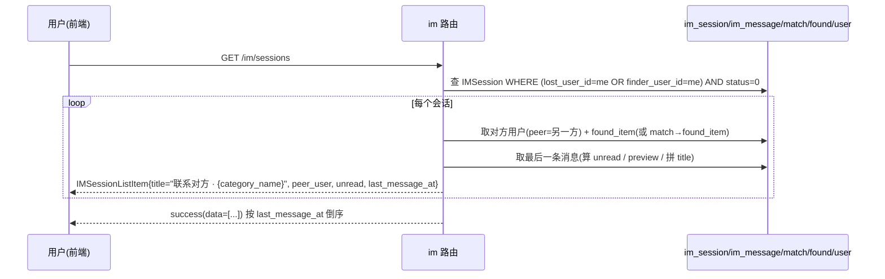
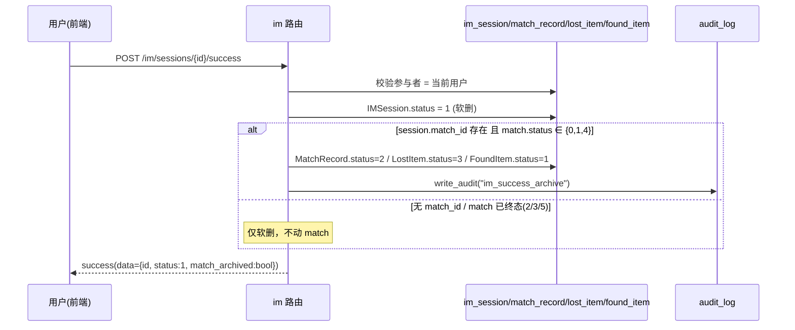
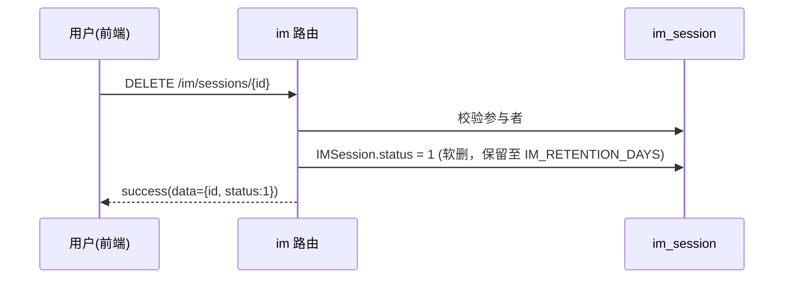
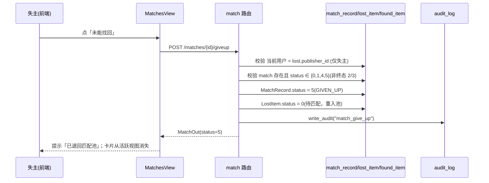
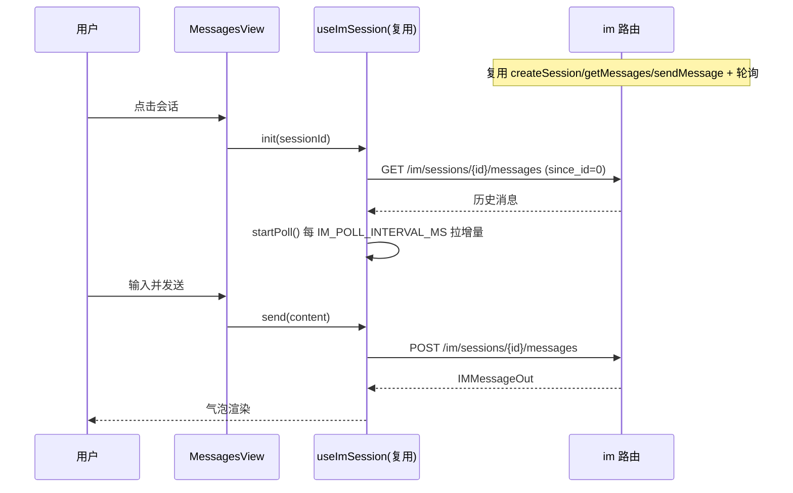
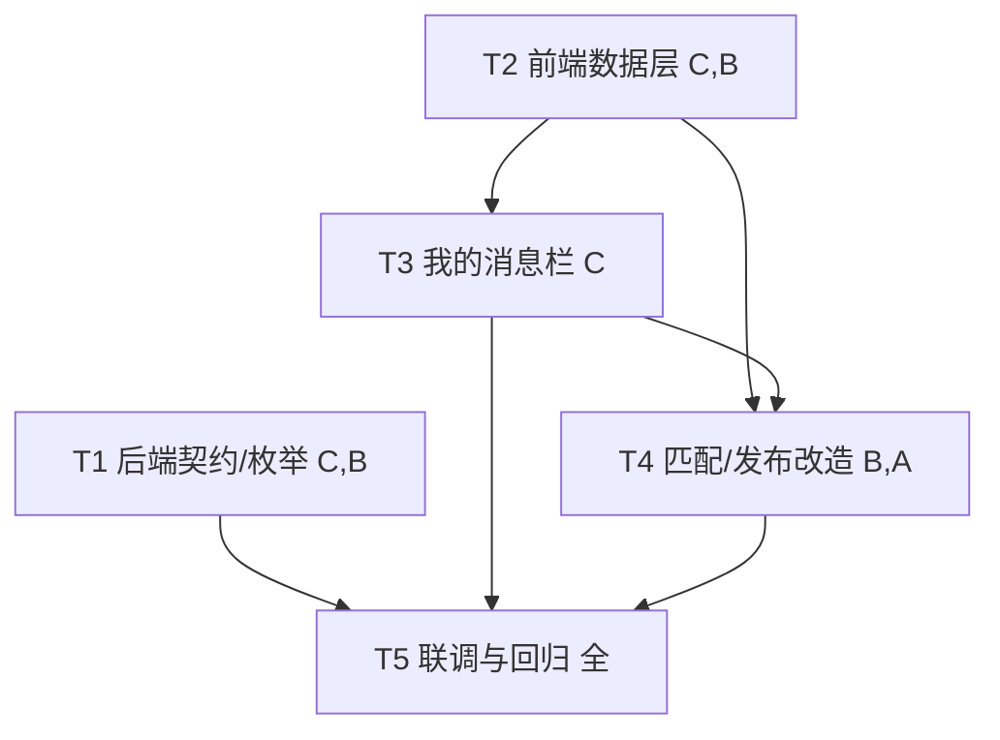

# v5 增量架构设计 + 任务分解（Incremental Architecture & Tasks）

| 项 | 内容 |
| --- | --- |
| 系统 | 基于 YOLOv8 的校园失物招领智能匹配系统 |
| 文档定位 | **增量设计**：仅在 v4 已落地基线之上描述变更；不另起技术栈、不修改源码（本文档只产出设计） |
| 架构师 | 高见远（software-architect） |
| 技术栈（沿用，禁止更换） | 前端 **Vue3 + Element Plus + Vite + Pinia + Axios**；后端 **FastAPI + SQLAlchemy 2.x + SQLite/MySQL + JWT**；IM **前端轮询**（非 WebSocket） |
| 配套 PRD | `docs/prd/v5_incremental_prd.md`（含 §5 Q1–Q11 及主理人拍板） |
| 基线设计 | `docs/architecture/v4_incremental_design.md`（v4 已落地事实） |
| 勘察基准 | 实地 Read 于 `app/`、`web/src/`、`migrations/`（行号见正文 F 标注） |

---

## 0. 实地勘察结论（设计依据，引用真实路径/行号）

| # | 事实 | 证据 | 对 v5 设计的影响 |
| --- | --- | --- | --- |
| F1 | `app/routers/im.py` 仅有 `POST /im/sessions`、`GET /im/sessions/{id}/messages`、`POST /im/sessions/{id}/messages`，**缺列表端点** | `app/routers/im.py:91-291` | v5 后端必补 `GET /im/sessions` + 软删/归档端点 |
| F2 | `IMSession.status` 已存在（`SmallInt, default=0, 注释 0 开启/1 关闭`，`app/models/im.py:49`） | `app/models/im.py:49` | 软删**零迁移**，直接复用 `status=1` 隐藏 |
| F3 | `IMSession.match_id` 以 `ForeignKey("match_record.id", ondelete="RESTRICT")` 引用 `MatchRecord`（`app/models/im.py:28-32`） | `app/models/im.py:28-32` | 「未能找回」必须**软删**（改 status），不可物理删 MatchRecord，否则撞 RESTRICT |
| F4 | `IMSession.found_id` 已存在并可空（`app/models/im.py:34-38`，v4 加） | `app/models/im.py:34-38` | 会话标题拼装可直接读 found_id 关联的 FoundItem |
| F5 | `MatchStatus` 现有 `0/1/2/3/4`，`app/schemas/common.py:71-76` | `app/schemas/common.py:71-76` | v5 仅新增 `GIVEN_UP=5`，`SmallInt` 值域扩展，**零迁移** |
| F6 | `LostItem.status`：0 待匹配/1 匹配中/2 待认领/3 已解决（`app/models/item.py:57`）；`FoundItem` 无 `title`，仅 `category_name` + `description`（`app/models/item.py:84-85`） | `app/models/item.py:57,84-85` | 未能找回双写：`MatchRecord.status=5` + `LostItem.status=0`；会话标题取 `found_item.category_name` |
| F7 | `IM_RETENTION_DAYS = 30`（`app/core/config.py:94`，v3 由 7 改为 30） | `app/core/config.py:94` | 软删保留期沿用现状 30 天（PRD 误引 7 天，以代码为准） |
| F8 | `IMMessage` 无 `read` 字段（`app/models/im.py:69-95`） | `app/models/im.py:69-95` | 未读态用粗粒度（最后消息 sender）实现，**零迁移** |
| F9 | 前端 `NAV_ITEMS` 驱动 `AppLayout` 侧边栏与底部 tabbar（`web/src/router/index.ts:13-20`、`web/src/layouts/AppLayout.vue:54-59,69-80`） | 上述文件 | 加「我的消息」只需改 `NAV_ITEMS` + 路由表，`AppLayout` 自动渲染，无需改渲染逻辑 |
| F10 | `ContactDialog.vue` 内联了完整收发逻辑（轮询 `getMessages` + `sendMessage`）（`web/src/views/ContactDialog.vue:131-213`） | 上述文件 | 可抽取 `useImSession` composable 供 `MessagesView` 与 `ContactDialog` 复用 |
| F11 | 前端 `mockAdapter.ts` 以正则路由表拦截请求（`web/src/api/mockAdapter.ts:594-631`） | 上述文件 | 演示模式闭环：需补 `GET /im/sessions`、`DELETE/POST .../success`、`POST /matches/{id}/giveup` 路由与 handler |
| F12 | `MatchesView.vue` 操作区失主侧有「认领/去交接/完成匹配」，通用「联系对方」（`web/src/views/MatchesView.vue:59-119`） | 上述文件 | 「未能找回」按钮与既有按钮并列（失主侧全状态） |

> **结论**：v5 全部变更均可基于 v4 事实落地；核心约束仍是 F3（RESTRICT FK）——「未能找回」采用软删 `status=5`，关联 `LostItem.status=0` 重入匹配池，IM 会话保留 `match_id` 溯源。**结论：v5 不需要新增迁移（零迁移，详见 §6）。**

---

## 1. 增量实现方案 + 框架选型

**架构风格**：沿用 v3/v4「路由层 → 服务层 → ORM」与「View + Pinia + api 适配器」分层；本次为**增量增强**，不引入新框架、不引入新进程、不新增第三方依赖。

**关键选型决策（沿用既有栈，零新增依赖优先）**：

1. **软删复用 `IMSession.status=1`**：v5 的「删除此对话」「招领成功」均仅将 `status` 置 1；列表端点强制过滤 `status=0`。字段已存在，**零迁移**（F2）。
2. **「未能找回」软删 `MatchStatus=5=GIVEN_UP`**：`SmallInt` 值域扩展 + 关联 `LostItem.status=0` 重入匹配池；**不物理删** MatchRecord，规避 `im_session.match_id` RESTRICT FK（F3）。`LostItem` 重新可参与自动匹配 + 重新出现在拾物栏手动候选。
3. **会话列表端点 `GET /im/sessions`**：返回当前用户参与且 `status=0` 的会话，后端富化为 `IMSessionListItem`（对方用户摘要 + 拼装标题 + 最后消息时间 + 粗粒度未读），按 `last_message_at` 倒序。新建 schema，不污染既有 `IMSessionOut` 契约。
4. **会话标题拼装规则（主理人拍板 #4）**：统一前缀「联系对方 · 」+ 物品标题；物品标题取自 `found_item.category_name`（经 `found_id` 或 `match→found_item`）；`category_name` 为空则回退取 `description` 截断 12 字。不区分「我联系对方 / 对方联系我」，简单一致。
5. **未读态粗粒度（主理人拍板 #6）**：`unread = bool(最后一条消息存在 且 该消息 sender_id != 当前用户)`；前端进入会话时将该会话加入本地 `readSet`（内存/localStorage）清除红点。无 `is_read` 列，**零迁移**（F8）。
6. **端到端契约（主理人拍板 #5）**：采用**拆分契约**更清晰——
   - `GET /im/sessions`：列出当前用户 `status=0` 会话（富化）。
   - `DELETE /im/sessions/{id}`：软删（`status=1`），参与者可操作。
   - `POST /im/sessions/{id}/success`：软删（`status=1`）+ 若关联 `match_id` 且 MatchRecord 未终态（`status∈{0,1,4}`）则置 `COMPLETED(2)` 并归档双端物品；无 match 或已终态则仅软删。
   - `POST /matches/{id}/giveup`：仅失主本人；`MatchRecord.status=5` + `LostItem.status=0`。
7. **保留期沿用 `IM_RETENTION_DAYS=30`**（F7），不改动；物理清理仍由既有 `im_service.purge_expired_im` 按 `expires_at` 执行。
8. **前端收发复用**：抽取 `web/src/composables/useImSession.ts` 封装 `getMessages`/`sendMessage`/轮询/气泡渲染状态机，供 `MessagesView`（双栏右面板）与 `ContactDialog` 共用，消除重复逻辑（F10）。

---

## 2. 文件列表及相对路径（标注 `[新增]/[变更]/[复用]`）

### 2.1 后端

| 文件 | 标记 | 变更说明 |
| --- | --- | --- |
| `app/schemas/common.py` | `[变更]` | `MatchStatus` 新增 `GIVEN_UP = 5`（注释：0待认领/1认领中/2已完成/3已拒绝/4待自取/5已放弃）；其余枚举不变 |
| `app/schemas/im.py` | `[变更]` | 新增 `PeerUser`（id/nickname/student_no）、`IMSessionListItem`（id/match_id/found_id/peer_user/title/last_message_at/last_message_preview/unread/status）；`IMSessionOut` 不变 |
| `app/routers/im.py` | `[变更]` | 新增 `GET /im/sessions`、`DELETE /im/sessions/{id}`、`POST /im/sessions/{id}/success`；新增内部 helper `_session_list_item(session, user)`、`_soft_delete_session(session)`、`_success_session_archive(db, session)` |
| `app/routers/match.py` | `[变更]` | 新增 `POST /matches/{id}/giveup`（校验失主归属 + 非终态 + 双写 + 审计） |
| `app/services/im_service.py` | `[变更]` | 新增 `list_sessions_for_user(db, user_id)`（富化列表装配）、`soft_delete_session(session, user)`、`success_session_archive(db, session, user)`；既有 `purge_expired_im` 不变 |
| `app/models/im.py`、`app/models/item.py`、`app/models/match.py` | `[复用]` | **不改**（字段/枚举值域复用，零迁移） |
| `migrations/versions/0004_v5_incremental.py` | `[无需新增]` | 见 §6：零迁移，不生成 |

### 2.2 前端

| 文件 | 标记 | 变更说明 |
| --- | --- | --- |
| `web/src/types/index.ts` | `[变更]` | `MatchOut.status` 注释补 `5=已放弃`；新增 `PeerUser`、`IMSessionListItem`；`IMSessionOut.status` 注释补「1=已关闭/软删」 |
| `web/src/api/im.ts` | `[变更]` | 新增 `listSessions()`→`GET /im/sessions`、`deleteSession(id)`→`DELETE /im/sessions/{id}`、`successSession(id)`→`POST /im/sessions/{id}/success` |
| `web/src/api/match.ts` | `[变更]` | 新增 `giveup(matchId)`→`POST /matches/{id}/giveup` |
| `web/src/api/constants.ts` | `[变更]` | `MATCH_STATUS_LABEL` 补 `5:'已放弃'`；新增 `IM_SESSION_STATUS_LABEL = {0:'进行中',1:'已关闭'}` 注释 |
| `web/src/api/mockData.ts` | `[变更]` | 补充 `mockUsers`（会话对方摘要源）、预制若干 `mockIMSessions`/`mockIMMessages` 样本（含 `found_id` 与 `match_id` 两类），供演示闭环 |
| `web/src/api/mockAdapter.ts` | `[变更]` | 路由表新增 `GET /im/sessions`、`DELETE /im/sessions/(\d+)`、`POST /im/sessions/(\d+)/success`、`POST /matches/(\d+)/giveup` 及对应 handler（软删/归档/放弃逻辑与后端一致） |
| `web/src/router/index.ts` | `[变更]` | `NAV_ITEMS` 加「我的消息」（icon `ChatDotRound`）+ 新增 `/messages` 路由指向 `MessagesView.vue` |
| `web/src/views/MessagesView.vue` | `[新增]` | 双栏：左侧会话列表（标题/对方/时间/未读红点）+ 右侧对话面板（复用 `useImSession`）；底部「删除此对话」「招领成功」二次确认 |
| `web/src/composables/useImSession.ts` | `[新增]` | 抽取 `getMessages`/`sendMessage`/轮询（`IM_POLL_INTERVAL_MS`）/气泡状态机，供 `MessagesView` 与 `ContactDialog` 复用 |
| `web/src/views/MatchesView.vue` | `[变更]` | 失主侧所有 status(0/1/2/3/4) 卡片加「未能找回」按钮 → 调 `matchApi.giveup(id)` |
| `web/src/views/PublishView.vue` | `[变更]` | 块 A：保管提示文案下沉到对应 radio 下方独立成行（纯排版，文案不变） |
| `web/src/views/ContactDialog.vue` | `[变更]` | 收发逻辑改为复用 `useImSession`（消除与 `MessagesView` 的重复） |
| `web/src/layouts/AppLayout.vue` | `[复用]` | **不改**（只读 `NAV_ITEMS`，加项即自动渲染） |

---

## 3. 数据结构和接口（Mermaid classDiagram）

> 完整 classDiagram 另存于 `docs/architecture/v5_class-diagram.mermaid`。

```mermaid
classDiagram
    class User {
        <<复用>>
        +BigInteger id
        +str student_no
        +str real_name
    }
    class LostItem {
        <<复用>>
        +BigInteger id
        +int publisher_id
        +str category_name
        +str title
        +SmallInt status  %% 0待匹配/1匹配中/2待认领/3已解决
    }
    class FoundItem {
        <<复用>>
        +BigInteger id
        +int finder_id
        +str category_name
        +Text description
        +SmallInt keep_status
        +SmallInt contact_allowed
        +SmallInt status  %% 0待认领/1已解决
    }
    class MatchRecord {
        <<变更·枚举>>
        +BigInteger id
        +int lost_id
        +int found_id
        +Numeric match_score
        +SmallInt status  %% 0待认领/1认领中/2已完成/3已拒绝/4待自取/5已放弃(GIVEN_UP)
    }
    class MatchStatus {
        <<变更·枚举>>
        +PENDING_CLAIM = 0
        +CLAIMING = 1
        +COMPLETED = 2
        +REJECTED = 3
        +MANUAL_PENDING = 4
        +GIVEN_UP = 5  %% v5 新增(已放弃/退回匹配池)
    }
    class IMSession {
        <<复用·零迁移>>
        +BigInteger id
        +int match_id  %% FK→match_record(RESTRICT) 可空
        +int found_id  %% FK→found_item(RESTRICT) 可空
        +int lost_user_id
        +int finder_user_id
        +SmallInt status  %% 0开启/1关闭(软删复用1)
        +DateTime last_message_at
        +DateTime expires_at
    }
    class IMMessage {
        <<复用>>
        +BigInteger id
        +int session_id
        +int sender_id
        +SmallInt sender_role
        +str content
        +DateTime sent_at
    }
    class IMSessionListItem {
        <<新增·schema>>
        +int id
        +int match_id
        +int found_id
        +PeerUser peer_user
        +str title  %% 后端拼"联系对方 · {category_name}"
        +DateTime last_message_at
        +str last_message_preview
        +bool unread  %% 粗粒度
        +int status
    }
    class PeerUser {
        <<新增·schema>>
        +int id
        +str nickname  %% real_name 或 用户{id}
        +str student_no
    }
    class IMRouter {
        <<变更>>
        +POST /im/sessions  %% 复用
        +GET /im/sessions  %% v5 新增(列表)
        +DELETE /im/sessions/{id}  %% v5 软删
        +POST /im/sessions/{id}/success  %% v5 软删+归档
        +GET /im/sessions/{id}/messages  %% 复用
        +POST /im/sessions/{id}/messages  %% 复用
    }
    class MatchRouter {
        <<变更>>
        +POST /matches/manual  %% 复用
        +POST /matches/{id}/self-complete  %% 复用
        +POST /matches/{id}/giveup  %% v5 新增(未能找回)
    }
    class ImService {
        <<变更>>
        +list_sessions_for_user(db, user_id) list  %% v5 富化列表
        +soft_delete_session(session, user)  %% v5 status=1
        +success_session_archive(db, session, user)  %% v5 软删+归档match
    }
    class MessagesView {
        <<新增·前端>>
        +sessionList
        +selectedSession
        +openConversation(id)
        +onDeleteSession(id)
        +onSuccess(id)
    }
    class useImSession {
        <<新增·前端>>
        +messages
        +draft
        +poll()
        +startPoll()
        +stopPoll()
        +send(content)
    }
    class ImApi {
        <<变更·前端>>
        +listSessions()
        +deleteSession(id)
        +successSession(id)
        +createSession()
        +getMessages()
        +sendMessage()
    }
    class MatchApi {
        <<变更·前端>>
        +giveup(matchId)
    }

    LostItem "1" --> "0..*" MatchRecord : lost_id
    FoundItem "1" --> "0..*" MatchRecord : found_id
    MatchRecord ..> MatchStatus : status=5
    IMSession "0..1" --> "1" MatchRecord : match_id(RESTRICT)
    IMSession "0..1" --> "1" FoundItem : found_id(RESTRICT)
    IMSession "1" --> "2" User : lost/finder
    IMSession "1" --> "0..*" IMMessage : session_id
    IMRouter ..> IMSession
    IMRouter ..> ImService
    MatchRouter ..> MatchRecord
    MatchRouter ..> LostItem
    IMSessionListItem *-- PeerUser
    MessagesView ..> ImApi
    MessagesView ..> useImSession
    useImSession ..> ImApi
    MatchesView ..> MatchApi
```

### 3.1 关键接口契约（请求/响应，统一 `{code,message,data}`）

**会话列表（v5 新增）**
- `GET /api/v1/im/sessions` → `List[IMSessionListItem]`（按 `last_message_at` 倒序）。
  - 过滤：`status=0` 且（`lost_user_id==当前用户` OR `finder_user_id==当前用户`）。
  - 每项字段：
    - `id`（会话 id）、`match_id`、`found_id`
    - `peer_user`：`{id, nickname, student_no}`（对方用户摘要；nickname=`real_name` 或 `用户{id}`）
    - `title`：后端拼好的「联系对方 · {物品标题}」
    - `last_message_at`、`last_message_preview`（最后消息截断 ~20 字，无则 null）
    - `unread`：`bool`（粗粒度，见 §7-5）
    - `status`

**删除此对话（v5 新增，软删）**
- `DELETE /api/v1/im/sessions/{id}` body 空 → `success(data={id, status:1})`。
  - 校验：当前用户为会话参与者；否则 403。
  - 副作用：`IMSession.status=1`（隐藏，保留至 `IM_RETENTION_DAYS`）。

**招领成功（v5 新增，软删 + 归档）**
- `POST /api/v1/im/sessions/{id}/success` body 空 → `success(data={id, status:1, match_archived:bool})`。
  - 校验：当前用户为会话参与者。
  - 副作用：`IMSession.status=1`；若 `session.match_id` 存在且关联 `MatchRecord.status ∈ {0,1,4}` → 置 `COMPLETED(2)` + `LostItem.status=3` + `FoundItem.status=1` + 审计 `action="im_success_archive"`。
  - 无 match_id 或 match 已终态（`2/3/5`）→ 仅软删，不动 match（终态保护）。

**未能找回（v5 新增，软删匹配 + 失物重入池）**
- `POST /api/v1/matches/{id}/giveup` body 空 → `MatchOut(status=5)`。
  - 校验：当前用户 = `lost.publisher_id`（仅失主）；`MatchRecord` 存在且 `status ∈ {0,1,4,5}`（非终态 `2/3`，否则 409「该匹配已终态」）。
  - 副作用：`MatchRecord.status=GIVEN_UP(5)` + 关联 `LostItem.status=0`（重入匹配池）+ 审计 `action="match_give_up"`。
  - 关联 IM 会话**保留 `match_id`**（RESTRICT 溯源），不物理断链。

---

## 4. 程序调用流程（Mermaid sequenceDiagram）

> 完整 sequenceDiagram 另存于 `docs/architecture/v5_sequence-diagram.mermaid`。

### 4.1 我的消息·会话列表（GET /im/sessions）



### 4.2 招领成功（POST /im/sessions/{id}/success，软删 + 归档）



### 4.3 删除此对话（DELETE /im/sessions/{id}，软删）



### 4.4 未能找回（POST /matches/{id}/giveup，软删匹配 + 失物重入池）



### 4.5 我的消息·对话面板收发（复用 useImSession）



---

## 5. 任务列表（有序、含依赖、按实现顺序，标注 P0/P1/P2 与需求字母）

> 主线：后端契约/枚举 → 前端数据层（类型/API/mock）→ 我的消息栏（路由+视图+复用 composable）→ 匹配/发布改造 → 联调回归。

| 任务 | 名称 | 来源文件 | 依赖 | 优先级 / 需求 |
| --- | --- | --- | --- | --- |
| **T1** | 后端契约与枚举扩展（5 端点 + GIVEN_UP + 富化 schema + 服务 helper） | `app/schemas/common.py`、`app/schemas/im.py`、`app/routers/im.py`、`app/routers/match.py`、`app/services/im_service.py` | 无 | **P0 / C,B** |
| **T2** | 前端数据层（类型/API/常量/mock 全量扩展，演示闭环） | `web/src/types/index.ts`、`web/src/api/im.ts`、`web/src/api/match.ts`、`web/src/api/constants.ts`、`web/src/api/mockData.ts`、`web/src/api/mockAdapter.ts` | 无（可并行） | **P0 / C,B** |
| **T3** | 「我的消息」栏（路由 + 双栏视图 + 抽取 useImSession 复用收发） | `web/src/router/index.ts`、`web/src/views/MessagesView.vue`、`web/src/composables/useImSession.ts` | T2 | **P0 / C** |
| **T4** | 匹配/发布改造（未能找回按钮 + 发布排版修复 + ContactDialog 复用） | `web/src/views/MatchesView.vue`、`web/src/views/PublishView.vue`、`web/src/views/ContactDialog.vue` | T2,T3 | **P0/P1 / B,A** |
| **T5** | 联调与回归（前后端联调 + 演示闭环验证 + 零迁移验证 + 测试） | `tests/`（`test_v5_*.py`）、前后端联调 | T1–T4 | **P0 / 全** |

**依赖图（Mermaid）**：



**任务要点说明**：
- **T1**：`MatchStatus.GIVEN_UP=5`；`IMSessionListItem`/`PeerUser` schema；`im.py` 加 `GET /im/sessions`（`list_sessions_for_user` 富化）、`DELETE /im/sessions/{id}`（软删）、`POST /im/sessions/{id}/success`（软删+归档，终态保护）；`match.py` 加 `POST /matches/{id}/giveup`（失主校验 + 非终态校验 + 双写 + 审计）。所有端点统一 `{code,message,data}`。
- **T2**：`types` 补 `IMSessionListItem`/`PeerUser`/`MatchStatus=5`；`im.ts` 补 `listSessions/deleteSession/successSession`；`match.ts` 补 `giveup`；`constants.ts` 补 `MATCH_STATUS_LABEL[5]` 与 `IM_SESSION_STATUS_LABEL`；`mockData.ts` 补 `mockUsers` + 预制 `mockIMSessions`/`mockIMMessages`；`mockAdapter.ts` 补 4 条路由与 handler（软删/归档/放弃与后端语义一致）。
- **T3**：`router/index.ts` `NAV_ITEMS` 加「我的消息」(`ChatDotRound`) + `/messages` 路由；`MessagesView.vue` 双栏（左列表含未读红点/时间/标题，右面板用 `useImSession`）；`useImSession.ts` 封装轮询收发，供 `MessagesView` 与后续 `ContactDialog` 复用。
- **T4**：`MatchesView.vue` 失主侧全 status 加「未能找回」按钮 → `matchApi.giveup`；`PublishView.vue` 块 A 提示文案下沉到各 radio 下方独立成行（文案不变）；`ContactDialog.vue` 收发改为复用 `useImSession`（消除重复）。
- **T5**：以「我的消息列表过滤 `status=0`」「giveup 后 `LostItem.status=0` 且 `MatchRecord.status=5`」「success 对无 match 仅软删」为验收闸门写 `test_v5_*.py`；验证零迁移（`alembic upgrade head` 无 0004 亦无报错）；演示模式闭环走通「我的消息 + 未能找回」。

---

## 6. 依赖包列表

| 包 | 是否新增 | 说明 |
| --- | --- | --- |
| `fastapi` / `sqlalchemy` / `alembic` / `pydantic` / `element-plus` / `axios` / `vue-router` / `pinia` | **否（已有）** | 沿用既有栈 |
| 任何新第三方依赖 | **否** | 零新增依赖 |

**结论：本增量无需新增任何第三方依赖。**

### 6.1 迁移影响判断（是否需新增 0004）

**结论：不需要新增迁移 0004（零迁移）。** 逐项评估：

| 变更 | 是否改列/表 | 理由 |
| --- | --- | --- |
| 软删会话（`DELETE`/`success`） | 否 | `IMSession.status` **已存在**（F2，`SmallInt, 0 开启/1 关闭`），仅将值置 1，无 DDL |
| `MatchStatus=5=GIVEN_UP` | 否 | `MatchRecord.status` 为 `SmallInteger`，值 5 在 int 域内；仅 `MatchStatus` 枚举加成员（`app/schemas/common.py`），ORM 列不变 |
| 「未能找回」双写（`MatchRecord.status=5` + `LostItem.status=0`） | 否 | 纯 UPDATE，不物理删；保留 `match_id` 溯源以规避 RESTRICT FK（F3） |
| 会话列表端点 `GET /im/sessions` | 否 | 仅新增查询 + 新增响应 schema（`IMSessionListItem`），无新表/字段 |
| 未读态（粗粒度） | 否 | `unread` 由「最后消息 sender ≠ 当前用户」推导（F8），无 `is_read` 列；**不引入 0004** |
| 标题拼装 | 否 | 读既有 `found_item.category_name`/`description`，无字段变更 |

> **可选增强（非必须）**：若后续要求精确未读计数，需 `im_message.is_read` 列或 `session_read` 游标表（将引入 0004）。**默认推荐零迁移**，以符合「多数情况可零迁移」原则。本期不引入。

---

## 7. 共享知识（跨文件约定）

1. **响应体统一**：所有接口返回 `{code,message,data}`（IM 路由同样遵循）。
2. **状态枚举（前后端一致）**：
   - `LostItem`：0 待匹配 / 1 匹配中 / 2 待认领 / 3 已解决
   - `FoundItem`：0 待认领 / 1 已解决；`keep_status` 0=暂为保管 / 1=未挪动（仅文案）
   - `MatchRecord`：0 待认领 / 1 认领中 / 2 已完成 / 3 已拒绝 / 4 待自取 / **5 已放弃(GIVEN_UP，v5 新增)**
   - `IMSession`：0 开启 / **1 已关闭(软删，v5 复用)**
3. **软删语义**：`IMSession.status=1` 的会话不出现在「我的消息」列表（`GET /im/sessions` 过滤 `status=0`），但物理数据保留至 `expires_at`（= `IM_RETENTION_DAYS=30` 天），供审计溯源；物理清理仍由 `im_service.purge_expired_im` 按 `expires_at` 执行。
4. **会话标题拼装**：前缀统一「联系对方 · 」+ 物品标题；物品标题来源优先级：`found_item.category_name`（经 `session.found_id` 或 `session.match_id→match.found_id`）；`category_name` 为空则取 `found_item.description` 截断 12 字；不区分发起方视角。
5. **未读态粗粒度**：`unread = bool(最后一条消息存在 且 该消息 sender_id != 当前用户)`；前端进入会话时将该 `session_id` 加入本地 `readSet`（内存或 localStorage）以清除红点（「进入即清除」）。无后端 read 状态。
6. **未能找回双写**：`POST /matches/{id}/giveup` 仅失主本人可调用；副作用 `MatchRecord.status=5` + 关联 `LostItem.status=0`（重入匹配池，可重新自动/手动匹配）；`FoundItem` 不动；关联 IM 会话保留 `match_id`（不物理断链）。
7. **招领成功归档**：`POST /im/sessions/{id}/success` 软删会话 + 若关联未终态 MatchRecord 则 `match=2 / lost=3 / found=1`；无 match 或 match 已终态仅软删（终态保护）。
8. **门控复用**：会话收发仍受既有 `contact_allowed` 门控 + 禁链接正则 + 消息镜像 `audit_log(action="im_message")` 约束（F2/F11 不变）。
9. **演示模式闭环**：`mockAdapter.ts` 路由正则与后端逐一对应；新增 4 条路由（`GET /im/sessions`、`DELETE /im/sessions/(\d+)`、`POST /im/sessions/(\d+)/success`、`POST /matches/(\d+)/giveup`）的 handler 须与后端语义一致（软删/归档/放弃），保证无后端时「我的消息 + 未能找回」可演示。
10. **`NAV_ITEMS` 驱动渲染**：`AppLayout` 只读 `NAV_ITEMS`，新增「我的消息」即侧边栏 + 底部 tabbar 同步渲染，无需改 `AppLayout` 模板。

---

## 8. 待明确事项 / 需主理人确认点（阻塞或风险）

1. **「未能找回」对终态 match 的行为（已按拍板 #5 处理，仅提示）**：拍板 #5 说「未最终完成」，本设计将终态定义为 `status∈{2,3}`，点击返回 409「该匹配已终态，无法放弃」；`status=5`（已放弃）幂等成功（保持 5 / lost=0）。PRD 拍板 1 要求「所有状态卡片显示按钮」，故按钮仍显示，但终态点击为错误提示——**是否与主理人预期一致**？← 默认按拍板 #5 实现；如需对终态卡片直接隐藏按钮，请确认（属前端微调）。
2. **未读态精度（P2 可选）**：本期粗粒度（最后消息 sender）已满足 P0；精确未读计数需后续引入 `is_read` 列（将产生 0004）。← 本期不引入，已确认零迁移。
3. **「我的消息」导航未读角标（P2-C2）**：左侧栏未读数量角标（`NAV_ITEMS` 带 `badge`）本期不实现，留作 P2。如需 P0 必做请确认。
4. **会话最后消息预览（P2-C1）**：`last_message_preview` 已在 `GET /im/sessions` 一并返回（截断 ~20 字，零成本），与 PRD P2-C1 一致，不额外加端点。
5. **保留期取值**：沿用现状 `IM_RETENTION_DAYS=30`（PRD 误引 7 天，以 `config.py` 为准），已确认。

> 文档结束。所有设计均基于实地勘察的真实文件路径与行号（F1–F12），未改动任何源码。任务 T1–T5 已按依赖排序，可直接移交工程按 P0→P1→P2 实施。
