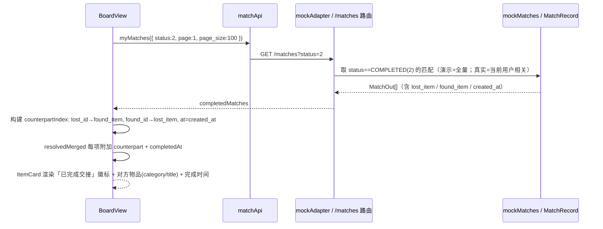
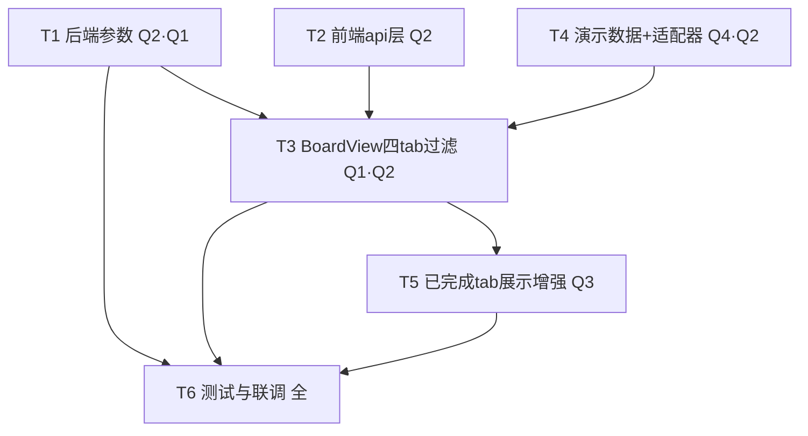

# v6 增量架构设计 + 任务分解（Incremental Architecture & Tasks）

| 项 | 内容 |
| --- | --- |
| 系统 | 基于 YOLOv8 的校园失物招领智能匹配系统 |
| 文档定位 | **增量设计**：在已落地 v5 之上描述 v6 变更（仅描述变更；不含完整源码、不修改源文件）；本文档只产出设计 |
| 架构师 | 高见远（software-architect） |
| 技术栈（沿用，禁止更换） | 前端 **Vue3 + Element Plus + Vite + Pinia + Axios**；后端 **FastAPI + SQLAlchemy 2.x + SQLite/MySQL + JWT**；IM **前端轮询**（非 WebSocket） |
| 配套 PRD | `docs/prd/v6_incremental_prd.md`（含 §5 Q1–Q4 及主理人拍板） |
| 基线设计 | `docs/architecture/v5_incremental_design.md`（v5 已落地事实） |
| 勘察基准 | 实地 Read 于 `web/src/views/BoardView.vue`、`web/src/api/{items,mockData,mockAdapter,constants}.ts`、`web/src/api/match.ts`、`web/src/types/index.ts`、`app/routers/items.py`、`app/schemas/{item,match,common}.py`、`migrations/versions/`（行号见正文 F 标注） |

---

## 0. 实地勘察结论（设计依据，引用真实路径/行号）

| # | 事实 | 证据 | 对 v6 设计的影响 |
| --- | --- | --- | --- |
| F1 | 四 tab 已存在：`all / lost / found / resolved`（`BoardView.vue:7-12`，`typeFilter` 取值） | `BoardView.vue:7-12` | v6 **不新建 tab 结构**，仅修正数据作用域 |
| F2 | 主三 tab `merged` 当前**不过滤已解决**（`BoardView.vue:171-177` 直接 `lostItems+foundItems`）；`load()` 拉主列表不带 status（`BoardView.vue:291-294`） | `BoardView.vue:171-177,287-305` | 核心缺陷：已解决项仍出现在主列表；v6 在 `merged` 过滤 `Lost.status===3`/`Found.status===1` |
| F3 | 「已完成交接」tab 现有拉取：`listLost({status:3})` + `listFound({status:1})`（`BoardView.vue:293-294`） | `BoardView.vue:293-294` | 判定口径已固定为**物品自身 status**；v6 改为 `resolved_only=true`，语义等价 |
| F4 | 演示模式 `mockAdapter.listLost/listFound` **忽略 status、返回全量**（`mockAdapter.ts:255-267`） | `mockAdapter.ts:255-267` | 这是当前演示态"全量都出现"的根因；v6 在 mock 实现 `exclude_resolved`/`resolved_only` 分支 |
| F5 | `mockFoundItems` 全部 `status:0`，无 `status:1` 项；`mockLostItems` id=5 为 `status:3` | `mockData.ts:175-266,142-156` | 演示「已完成交接」tab 缺已解决拾物示例；v6 补 1 对（`status=1` 拾物 + `status=3` 失物） |
| F6 | 枚举数值（已确认）：`LostItemStatus.PENDING_MATCH=0/MATCHING=1/PENDING_CLAIM=2/RESOLVED=3`；`FoundItemStatus.PENDING=0/RESOLVED=1`；`MatchStatus.COMPLETED=2` | `app/schemas/common.py:59-77` | v6 判定一律用物品 status，`Lost=3`/`Found=1` 为已解决 |
| F7 | ⚠️ **数值碰撞**：`MatchRecord.status===3`（REJECTED）与 `LostItem.status===3`（RESOLVED）同值异义 | `common.py:59-77` vs `common.py:71-77` | v6 判定**只读物品 status**，绝不读 `MatchRecord.status` 判定已解决 |
| F8 | `GET /matches`（myMatches）已支持 `status` 查询参数，返回 `MatchOut[]`（`match.py:87-124`、`match.ts:20`） | `app/routers/match.py:87-124` | Q3 前端关联 counterpart 复用 `matchApi.myMatches({status:2})`，**零后端改动** |
| F9 | 迁移基线停在 `0003_v4_incremental.py`，无 `0004` | `migrations/versions/` | v6 不改表/字段，**零迁移**（见 §9） |
| F10 | `ItemListParams`（前端）当前仅 `status/page/page_size`（`items.ts:10-14`） | `items.ts:10-14` | v6 增加 `exclude_resolved?`/`resolved_only?` 两布尔参数 |

> **结论**：v6 全部变更均可基于 v5 事实落地；核心约束是 **F7 数值碰撞**——判定一律以**物品自身 status** 为准。本设计不新增任何数据库表/字段/迁移（零迁移，详见 §9）。

---

## 1. 增量实现方案 + 框架选型

**架构风格**：沿用 v3/v4/v5「路由层 → 服务层（本期无新服务）→ ORM」与「View + api 适配器」分层；本次为**增量增强**，不引入新框架、不引入新进程、**零新增第三方依赖**。

**关键选型决策（沿用既有栈，零新增依赖优先）**：

1. **已解决判定口径（主理人拍板 Q1）**：一律以**物品自身 status** 为准——`LostItem.status===3`（RESOLVED）视为已解决，`FoundItem.status===1`（RESOLVED）视为已解决；**绝不读取 `MatchRecord.status` 来判定已解决**（规避 F7 数值碰撞）。`REJECTED(3)`/`GIVEN_UP(5)` 一律不算已解决。
2. **过滤实现（主理人拍板 Q2）——前后端都做，一步到位**：
   - **前端过滤（P0 保底）**：`BoardView.merged` 计算属性硬性过滤掉 `Lost.status===3` / `Found.status===1`；`resolvedMerged` 仅保留这二者。即使后端未过滤，前端也保证行为正确。
   - **后端参数（P1 增强）**：`list_lost_items` / `list_found_items` 新增 `exclude_resolved: bool`（`!= RESOLVED`）与 `resolved_only: bool`（`== RESOLVED`）两个查询参数，使分页 `total` 准确、传输量小。主三 tab 调 `exclude_resolved=true`，「已完成交接」tab 调 `resolved_only=true`。
   - 三者共存、互不冲突：`resolved_only` 优先于 `exclude_resolved` 优先于旧 `status`。
3. **演示模式（主理人拍板 Q4）**：`mockAdapter.listLost/listFound` 同步实现上述两分支（含兼容旧 `status`），使演示态与真实态语义一致；`mockData` 补 1 对示例（`status=1` 拾物 + `status=3` 失物 + 对应 `status=2` 已完成匹配），让「已完成交接」tab 呈现可见的完成配对。
4. **展示增强（主理人拍板 Q3）**：「已完成交接」tab 卡片展示①状态徽标「已完成交接」②匹配对方信息（counterpart）。**不改后端 schema / 不新增字段**：前端复用既有 `MatchOut`——调 `matchApi.myMatches({status:2})` 构建 `物品id → 对方物品 + 完成时间` 索引；演示态 `mockMatches` 直接提供完整 `lost_item/found_item`。真实态仅对当前用户的已完成匹配显示 counterpart（公开板的全量 counterpart 需未来只读匹配列表端点，本期不引入，见 §8 说明）。

---

## 2. 文件列表及相对路径（标注 `[新增]/[变更]/[复用]`）

### 2.1 后端

| 文件 | 标记 | 变更说明 |
| --- | --- | --- |
| `app/routers/items.py` | `[变更]` | `list_lost_items`（`items.py:162-182`）、`list_found_items`（`items.py:217-237`）新增 `exclude_resolved: bool = Query(False)`、`resolved_only: bool = Query(False)` 两参数 + 按物品 status 过滤逻辑 |
| `tests/test_v6_board_filter.py` | `[新增]` | 后端过滤单测：`exclude_resolved` / `resolved_only` 对 `LostItem`/`FoundItem` 的作用域与分页 total 正确性，及二者优先级 |
| `app/schemas/item.py` | `[复用]` | **不变**（参数直接写在 router 的 `Query(...)`，无需改 `ItemListQuery`；`LostItemOut`/`FoundItemOut` 字段不变） |
| `app/schemas/common.py` | `[复用]` | **不变**（`LostItemStatus.RESOLVED=3` / `FoundItemStatus.RESOLVED=1` 已存在，仅引用） |
| `app/models/item.py`、`app/models/match.py` | `[复用]` | **不改**（零迁移） |
| `migrations/versions/0004_*.py` | `[无需新增]` | 见 §9：零迁移，不生成 |

### 2.2 前端

| 文件 | 标记 | 变更说明 |
| --- | --- | --- |
| `web/src/api/items.ts` | `[变更]` | `ItemListParams` 增加 `exclude_resolved?: boolean`、`resolved_only?: boolean`（`items.ts:10-14`）；`listLost`/`listFound` 透传（URL query 自动序列化） |
| `web/src/views/BoardView.vue` | `[变更]` | ① `load()` 主列表改 `exclude_resolved:true`、已完成改 `resolved_only:true`（`BoardView.vue:290-295`）；② `merged` 计算属性过滤已解决（P0 保底，`BoardView.vue:171-177`）；③ `resolvedMerged` 仅保留已解决；④ Q3：`matchApi.myMatches({status:2})` 构建 counterpart 索引 + 已完成交接 tab 徽标/对方信息渲染 |
| `web/src/components/ItemCard.vue` | `[变更]` | 增加可选 props：`resolved?: boolean`（渲染「已完成交接」徽标）、`counterpart?: { kind, data } \| null`、`completedAt?: string`（Q3 对方信息展示）；主三 tab 不传即原样 |
| `web/src/api/mockData.ts` | `[变更]` | 补 1 对完成示例：`mockFoundItems` 加 1 条 `status:1`（已解决拾物），`mockLostItems` 加 1 条 `status:3`（已解决失物），`mockMatches` 加 1 条 `status:2`（COMPLETED）关联二者（Q4） |
| `web/src/api/mockAdapter.ts` | `[变更]` | `listLost`（`mockAdapter.ts:255-260`）、`listFound`（`mockAdapter.ts:262-267`）实现 `exclude_resolved`/`resolved_only` 分支（及兼容旧 `status`） |
| `web/src/api/match.ts` | `[复用]` | `myMatches({status})` 已支持 `status` 参数（`match.ts:20`），Q3 直接复用，**不改** |
| `web/src/api/constants.ts` | `[变更·轻量]` | 新增 `RESOLVED_BADGE_LABEL = '已完成交接'`（供 Q3 徽标文案，避免硬编码） |
| `web/src/types/index.ts` | `[复用/确认]` | `LostItemOut`/`FoundItemOut`/`MatchOut` 字段**不变**（Q3 不改 schema）；`Page<T>`/`MatchOut` 已满足 counterpart 关联需求 |
| `web/src/api/im.ts`、`web/src/api/request.ts` | `[复用]` | **不改** |

---

## 3. 数据结构和接口（Mermaid classDiagram）

> 完整 classDiagram 另存于 `docs/architecture/v6_class-diagram.mermaid`。

```mermaid
classDiagram
    class LostItemStatus {
        <<复用·枚举>>
        +PENDING_MATCH = 0
        +MATCHING = 1
        +PENDING_CLAIM = 2
        +RESOLVED = 3  %% 已解决(物品自身)
    }
    class FoundItemStatus {
        <<复用·枚举>>
        +PENDING = 0
        +RESOLVED = 1  %% 已解决(物品自身)
    }
    class MatchStatus {
        <<复用·枚举>>
        +PENDING_CLAIM = 0
        +CLAIMING = 1
        +COMPLETED = 2  %% 交接完成=>物品置已解决
        +REJECTED = 3   %% ⚠️数值碰撞:≠LostItem.RESOLVED
        +MANUAL_PENDING = 4
        +GIVEN_UP = 5
    }
    class LostItem {
        <<复用>>
        +BigInteger id
        +SmallInt status  %% 0/1/2 进行中; 3 已解决
    }
    class FoundItem {
        <<复用>>
        +BigInteger id
        +SmallInt status  %% 0 进行中; 1 已解决
    }
    class MatchRecord {
        <<复用>>
        +BigInteger id
        +int lost_id
        +int found_id
        +SmallInt status  %% 仅COMPLETED(2)用于溯源, 不用于判定已解决
    }
    class ItemsRouter {
        <<变更>>
        +GET /lost-items  %% +exclude_resolved, +resolved_only
        +GET /found-items %% +exclude_resolved, +resolved_only
    }
    class ItemListParams {
        <<变更·前端>>
        +status?
        +exclude_resolved? : bool
        +resolved_only? : bool
        +page?
        +page_size?
    }
    class itemsApi {
        <<变更·前端>>
        +listLost(params)
        +listFound(params)
    }
    class MockAdapter {
        <<变更>>
        +listLost 过滤 exclude_resolved/resolved_only(及兼容status)
        +listFound 过滤 exclude_resolved/resolved_only(及兼容status)
    }
    class mockData {
        <<变更>>
        +mockLostItems 新增 status=3 示例
        +mockFoundItems 新增 status=1 示例
        +mockMatches 新增 status=2 关联二者
    }
    class BoardView {
        <<变更>>
        -merged 过滤已解决(P0保底)
        -resolvedMerged 仅已解决
        -counterpartIndex 来自myMatches(status=2)
        +load() 主=exclude_resolved / 已解决=resolved_only
    }
    class ItemCard {
        <<变更>>
        +resolved? : bool  %% 徽标
        +counterpart? : 对方物品
        +completedAt? : string
    }
    class matchApi {
        <<复用>>
        +myMatches({status:2})  %% Q3 counterpart源
    }
    class MatchOut {
        <<复用>>
        +int lost_id
        +int found_id
        +LostItemOut lost_item
        +FoundItemOut found_item
        +status : 2=COMPLETED
        +created_at  %% 完成时间
    }

    LostItem ..> LostItemStatus : status
    FoundItem ..> FoundItemStatus : status
    MatchRecord ..> MatchStatus : status
    ItemsRouter ..> LostItem
    ItemsRouter ..> FoundItem
    ItemListParams ..> itemsApi
    itemsApi ..> ItemsRouter
    itemsApi ..> MockAdapter
    MockAdapter ..> mockData
    BoardView ..> itemsApi
    BoardView ..> ItemCard
    BoardView ..> matchApi
    matchApi ..> MatchOut
    MatchOut *-- LostItemOut
    MatchOut *-- FoundItemOut
```

### 3.1 关键接口契约变更（请求/响应，统一 `{code,message,data}`）

**失物列表（变更：`app/routers/items.py:162`）**
- `GET /lost-items`
- 新增可选 query 参数：`exclude_resolved: bool = False`、`resolved_only: bool = False`（保留旧 `status: int | None`）。
- 过滤优先级：`resolved_only` ＞ `exclude_resolved` ＞ `status`。
  - `resolved_only=true` → `WHERE lost_item.status = 3`（仅已解决）
  - `exclude_resolved=true` → `WHERE lost_item.status != 3`（排除已解决，即进行中 `0/1/2`）
  - 二者皆 false 且 `status` 给定 → `WHERE lost_item.status = :status`（旧行为，向后兼容）
- 响应：`Page[LostItemOut]`（含准确 `total`）。

**拾物列表（变更：`app/routers/items.py:217`）**
- `GET /found-items`
- 同上加 `exclude_resolved`/`resolved_only`。
- 过滤：`resolved_only=true` → `WHERE found_item.status = 1`；`exclude_resolved=true` → `WHERE found_item.status != 1`（即进行中 `0`）。
- 响应：`Page[FoundItemOut]`。

**前端调用约定（Q2）**
- 主三 tab：`itemsApi.listLost({ exclude_resolved: true, page:1, page_size:100 })`、`itemsApi.listFound({ exclude_resolved: true, ... })`。
- 「已完成交接」tab：`itemsApi.listLost({ resolved_only: true, ... })`、`itemsApi.listFound({ resolved_only: true, ... })`。

**后端 SQLAlchemy 过滤写法（示意，非完整源码）**
```python
# list_lost_items
q = db.query(LostItem)
if resolved_only:
    q = q.filter(LostItem.status == int(LostItemStatus.RESOLVED))   # == 3
elif exclude_resolved:
    q = q.filter(LostItem.status != int(LostItemStatus.RESOLVED))   # != 3
elif status is not None:
    q = q.filter(LostItem.status == status)
# ... order_by / offset / limit / count(total)
```
```python
# list_found_items
q = db.query(FoundItem)
if resolved_only:
    q = q.filter(FoundItem.status == int(FoundItemStatus.RESOLVED))  # == 1
elif exclude_resolved:
    q = q.filter(FoundItem.status != int(FoundItemStatus.RESOLVED))  # != 1
elif status is not None:
    q = q.filter(FoundItem.status == status)
```
> ⚠️ 全程只针对 `LostItem.status` / `FoundItem.status`，**绝不出现 `MatchRecord.status`**——避免与 `MatchRecord.status===3`（REJECTED）数值碰撞。

**Mock 适配器过滤写法（示意，非完整源码）**
```js
function filterLost(items, params) {
  const resolvedOnly = params.get('resolved_only') === 'true'
  const excludeResolved = params.get('exclude_resolved') === 'true'
  if (resolvedOnly) return items.filter(i => i.status === 3)        // 仅已解决
  if (excludeResolved) return items.filter(i => i.status !== 3)     // 排除已解决
  const s = params.get('status')
  if (s != null) return items.filter(i => i.status === Number(s))   // 兼容旧 status
  return items
}
// listFound 同构，status 阈值改为 1（resolvedOnly: ===1, excludeResolved: !==1）
```

---

## 4. 程序调用流程（Mermaid sequenceDiagram）

> 完整 sequenceDiagram 另存于 `docs/architecture/v6_sequence-diagram.mermaid`。

### 4.1 切换 tab → 拉取过滤列表（Q1/Q2，真实后端与演示态统一）

```mermaid
sequenceDiagram
    participant U as 用户
    participant BV as BoardView
    participant API as itemsApi
    participant AD as mockAdapter / FastAPI items 路由
    participant DB as LostItem / FoundItem 表

    U->>BV: 切换 typeFilter('all'|'lost'|'found'|'resolved')
    BV->>BV: load()（onMounted 或首次）
    par 主三 tab 数据
        BV->>API: listLost({ exclude_resolved:true, page:1, page_size:100 })
        BV->>API: listFound({ exclude_resolved:true, page:1, page_size:100 })
    and 已完成交接 tab 数据
        BV->>API: listLost({ resolved_only:true, page:1, page_size:100 })
        BV->>API: listFound({ resolved_only:true, page:1, page_size:100 })
    end
    API->>AD: GET /lost-items?exclude_resolved=true ...
    API->>AD: GET /found-items?resolved_only=true ...
    AD->>DB: SELECT ... WHERE lost.status!=3 / =3 ; found.status!=1 / =1
    DB-->>AD: 过滤后集合 + 准确 total
    AD-->>API: Page[...]（{code,message,data}）
    API-->>BV: lostItems / foundItems / resolvedLost / resolvedFound
    BV->>BV: merged 再次前端过滤 Lost.status===3 / Found.status===1（P0 保底）
    BV->>BV: resolvedMerged 仅保留已解决
    BV->>BV: filteredItems / pagedItems 渲染卡片
    BV-->>U: 主三 tab 仅进行中；已完成交接 tab 仅已解决
```

### 4.2 「已完成交接」tab 展示增强（Q3，counterpart 关联）



---

## 5. 任务列表（有序、含依赖、按实现顺序，标注优先级与需求字母）

> 主线：后端参数（T1）→ 前端 api 层（T2）→ 演示数据+适配器（T4）→ BoardView 四 tab 过滤绑定（T3）→ 已完成 tab 展示增强（T5）→ 测试与联调（T6）。

| 任务 | 名称 | 来源文件 | 依赖 | 优先级 / 需求 |
| --- | --- | --- | --- | --- |
| **T1** | 后端：`list_lost_items`/`list_found_items` 新增 `exclude_resolved`/`resolved_only` 参数 + 按物品 status 过滤（SQLAlchemy 写法见 §3.1） | `app/routers/items.py` | 无 | **P0(后端)/P1 / Q2·Q1** |
| **T2** | 前端 API 层：`ItemListParams` 增加 `exclude_resolved?`/`resolved_only?`，`listLost`/`listFound` 透传 | `web/src/api/items.ts` | 无（可并行 T1） | **P0 / Q2** |
| **T3** | BoardView 四 tab 过滤绑定（P0 核心）：`load()` 改用 `exclude_resolved`/`resolved_only`；`merged` 前端硬过滤已解决；`resolvedMerged` 仅保留已解决 | `web/src/views/BoardView.vue` | T2（需参数）；演示需 T4 适配器就绪 | **P0 / Q1·Q2** |
| **T4** | 演示数据 + 适配器：mockData 补 1 对（`status=1` 拾物 + `status=3` 失物 + `status=2` 匹配）；mockAdapter `listLost/listFound` 实现两分支（兼容旧 `status`） | `web/src/api/mockData.ts`、`web/src/api/mockAdapter.ts` | 无（可并行） | **P0 / Q4·Q2** |
| **T5** | 「已完成交接」tab 展示增强（Q3）：ItemCard 加 `resolved`/`counterpart`/`completedAt` props；BoardView 用 `matchApi.myMatches({status:2})` 构建 counterpart 索引并渲染徽标+对方信息 | `web/src/components/ItemCard.vue`、`web/src/views/BoardView.vue`、`web/src/api/constants.ts` | T3（BoardView 基础） | **P2 / Q3** |
| **T6** | 测试与联调回归：`tests/test_v6_board_filter.py` 后端过滤单测 + 演示闭环验证（四 tab 隔离 + 配对可见）+ 零迁移验证（`alembic upgrade head` 无 0004） | `tests/test_v6_board_filter.py`、前后端联调 | T1、T3、T5 | **P0 / 全** |

**依赖图（Mermaid）**：



**任务要点说明**：
- **T1**：在 `list_lost_items`/`list_found_items` 增加两 `Query(bool=False)` 参数；过滤优先级 `resolved_only`＞`exclude_resolved`＞`status`；只对 `LostItem.status`/`FoundItem.status` 过滤，**绝不涉及 `MatchRecord.status`**。分页 `total` 基于过滤后计数。
- **T2**：`items.ts` 的 `ItemListParams` 增加 `exclude_resolved?`/`resolved_only?`；`listLost`/`listFound` 已是 `apiGet(path, params)`，布尔值自动序列化为 `true/false` query 串。
- **T3**：`BoardView.load()` 四路并行请求改为 `exclude_resolved:true`（主）/ `resolved_only:true`（已完成）；`merged` computed 仍做 `filter(d => d.status !== 3 (lost) && d.status !== 1 (found))` 作为 P0 保底；`resolvedMerged` 仅保留 `status===3 (lost)` / `status===1 (found)`。
- **T4**：`mockData` 新增 `mockFoundItems` 1 条 `status:1`、`mockLostItems` 1 条 `status:3`（二者 category/title 对应，如书籍《高等数学》配对）、`mockMatches` 1 条 `status:2` 关联二者（含 `lost_item`/`found_item`/`created_at`）；`mockAdapter.listLost/listFound` 按 §3.1 写法实现分支。
- **T5**：`ItemCard` 增加可选 `resolved`/`counterpart`/`completedAt`；`BoardView` 在 `load()` 内并行 `matchApi.myMatches({status:2})`，构建 `counterpartIndex`；resolved tab 卡片显示「已完成交接」徽标 + 对方 `category_name`/`title` + 完成时间。演示态 `mockMatches` 提供完整 counterpart；真实态仅当前用户已完成匹配可见 counterpart（公开板全量 counterpart 见 §8 说明）。
- **T6**：以「`exclude_resolved` 后列表不含 `Lost.status=3`/`Found.status=1`」「`resolved_only` 后列表仅含二者」「分页 total 准确」「演示四 tab 隔离 + 完成配对可见」「`alembic upgrade head` 无 0004 报错」为验收闸门。

---

## 6. 依赖包列表

| 包 | 是否新增 | 说明 |
| --- | --- | --- |
| `fastapi` / `sqlalchemy` / `alembic` / `pydantic` / `element-plus` / `axios` / `vue-router` / `pinia` / `vite` | **否（已有）** | 沿用既有栈 |
| 任何新第三方依赖 | **否** | 零新增依赖 |

**结论：本增量无需新增任何第三方依赖（零新增依赖）。**

---

## 7. 共享知识（跨文件约定）

1. **响应体统一**：所有接口返回 `{code,message,data}`（items / matches 路由一致）。
2. **已解决判定口径（全局唯一真源）**：
   - 失物已解决 = `LostItem.status === 3`（`LostItemStatus.RESOLVED`）。
   - 拾物已解决 = `FoundItem.status === 1`（`FoundItemStatus.RESOLVED`）。
   - 进行中（主三 tab 可见）= `Lost.status ∈ {0,1,2}` / `Found.status === 0`。
   - **数值碰撞红线**：`MatchRecord.status === 3` = REJECTED（已拒绝），与 `LostItem.status === 3` = RESOLVED（已解决）**数值相同、含义完全不同**。v6 判定已解决**只认物品自身 status**，绝不在任何过滤/展示逻辑中读取 `MatchRecord.status` 来判定已解决。`REJECTED(3)` / `GIVEN_UP(5)` / 进行中(0/1/4) 一律不算已解决。前后端共用此常量语义。
3. **过滤参数语义（前后端一致）**：`exclude_resolved=true` ⇒ 排除已解决（主三 tab）；`resolved_only=true` ⇒ 仅已解决（「已完成交接」tab）。优先级 `resolved_only`＞`exclude_resolved`＞旧 `status`。布尔值前端序列化为 `true/false`。
4. **Mock 与真实接口返回结构对齐**：`mockAdapter.listLost/listFound` 的 `exclude_resolved`/`resolved_only` 分支必须与 `app/routers/items.py` 过滤语义逐一对齐（Lost 阈值 3、Found 阈值 1）；演示态返回结构与真实后端 `Page[ItemOut]` 完全一致。
5. **演示数据配对约定（Q4）**：新增的 `status=1` 拾物与 `status=3` 失物必须存在一条 `status=2`（COMPLETED）的 `mockMatches` 记录关联二者（`lost_id`/`found_id` 指向新增项，且 `lost_item`/`found_item` 指向新增对象），使「已完成交接」tab 既可见完成配对、又能被 Q3 counterpart 索引命中。
6. **Q3 counterpart 数据来源（零后端改动）**：前端统一调 `matchApi.myMatches({status:2})`；演示态由 `mockMatches` 提供完整 `lost_item/found_item`/`created_at`，真实态返回当前用户相关的已完成匹配（公开板非本人项不显示 counterpart，见 §8）。
7. **徽标文案常量**：`RESOLVED_BADGE_LABEL = '已完成交接'`（`constants.ts`），前端统一引用，避免硬编码。
8. **零迁移红线**：本增量不新增/修改任何数据库表、列、枚举值域（枚举成员均复用既有），不生成 Alembic 迁移（停在 `0003`）。所有变更仅为查询参数与前端视图/数据层。

---

## 8. 待明确事项 / 需主理人确认点

1. **无阻塞项**：主理人已就 Q1（物品 status 判定）、Q2（前后端都做）、Q3（不改后端 schema、前端关联 MatchOut）、Q4（补 1 对示例）拍板，设计据此落地，无待确认阻塞点。
2. **Q3 真实后端 counterpart 覆盖范围（已知限制，非阻塞）**：本期严格遵循「不改后端 schema / 不新增字段」，故 counterpart 复用既有 `GET /matches`（myMatches，返回当前用户相关匹配）。公开公示栏中**非当前用户**的已完成项在真实后端下不显示 counterpart（仅演示态因 `mockMatches` 全量而全显示）。若需公开板全量 counterpart，未来可加一个**只读** `GET /matches?status=2`（全部已完成）端点——该端点仅复用既有 `MatchOut` schema 与既有 `status` 查询参数，**不新增任何字段**，属 schema 安全增强，可后续单独排期，**不纳入本期**。
3. **`ItemCard` 是否改用独立「配对卡片」同框（P2-2）**：本期 Q3 仅做「徽标 + 对方信息」增强（按主理人拍板 Q3 轻量方案）；「失物 A 与拾物 a 同框配对卡片」为 P2-2 视觉优化，本期未纳入，可在 Q3 基础上迭代。

> 以上均非阻塞，主理人拍板已覆盖核心决策。

---

## 9. 零迁移确认（明确）

**结论：本增量设计不改动任何数据库表结构 / 不新增字段 / 不新增 Alembic 迁移，迁移基线停在 `0003_v4_incremental.py`（无 `0004`）。**

逐项评估：

| 变更 | 是否改列/表 | 理由 |
| --- | --- | --- |
| `list_lost_items`/`list_found_items` 加 `exclude_resolved`/`resolved_only` 查询参数 | 否 | 仅为 `Query(bool)` 入参与 `WHERE` 条件，**无 DDL**，不触及 `LostItem`/`FoundItem` 模型 |
| 前端 `ItemListParams` 加两布尔字段 | 否 | 纯 TypeScript 接口扩展，无 DB 影响 |
| `mockData` 补 1 对示例 + `mockMatches` 补 1 条 | 否 | 仅静态样本数据，无 DB/迁移 |
| `mockAdapter` 过滤分支 | 否 | 仅内存数组 `filter`，无 DB/迁移 |
| Q3「已完成交接」tab 展示增强（徽标 + counterpart） | 否 | 复用既有 `MatchOut`（`lost_item`/`found_item`/`created_at`），**不新增字段**、不改 `LostItemOut`/`FoundItemOut` schema |
| `ItemCard` 加可选 props | 否 | 纯前端组件 props，无 DB/迁移 |
| `constants.ts` 加 `RESOLVED_BADGE_LABEL` | 否 | 仅常量，无 DB/迁移 |

> 验证闸（T6）：执行 `alembic upgrade head` 不应生成或需要 `0004`；`LostItem`/`FoundItem`/`MatchRecord` 模型与 v5 完全一致。本期为**纯查询/视图层增量**，符合「多数情况可零迁移」原则。

---

## 10. 设计摘要（交付给主理人）

- **核心改动**：公示栏「全部/失物/拾物」三 tab 改为**仅展示进行中物品**，`Lost.status∈{0,1,2}`、`Found.status===0`；「已完成交接」tab **仅展示已解决物品**，`Lost.status===3`、`Found.status===1`。已解决项从主列表移除，集中到「已完成交接」。
- **判定口径**：一律以**物品自身 status** 为准（绝不读 `MatchRecord.status`），显式规避 `MatchRecord.status===3`(已拒绝) 与 `LostItem.status===3`(已解决) 的数值碰撞。
- **过滤实现**：前端过滤（P0 保底，mer犠`merged` 硬过滤）+ 后端 `exclude_resolved`/`resolved_only` 查询参数（P1，分页 total 准确），前后端都做、一步到位；Mock 适配器同步两分支，演示态与真实态语义一致。
- **演示增强（Q4）**：`mockData` 补 1 对完成示例（`status=1` 拾物 + `status=3` 失物 + `status=2` 匹配），「已完成交接」tab 演示可见配对。
- **展示增强（Q3）**：「已完成交接」tab 卡片加「已完成交接」徽标 + 匹配对方信息（复用既有 `MatchOut`，零后端改动）。
- **零新增依赖、零迁移**：沿用既有栈，迁移停在 `0003`。
- **任务分解**：T1 后端参数 → T2 前端 api → T3 BoardView 四 tab 过滤 → T4 演示数据+适配器 → T5 已完成 tab 展示增强 → T6 测试联调（依赖见 §5 图）。
