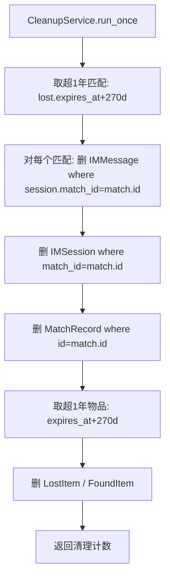
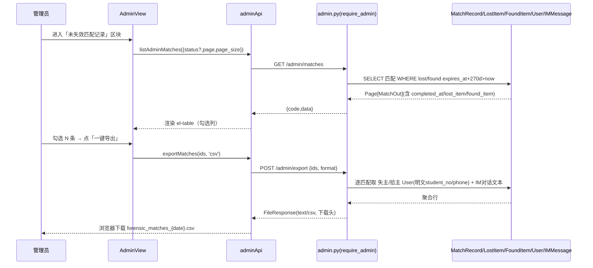
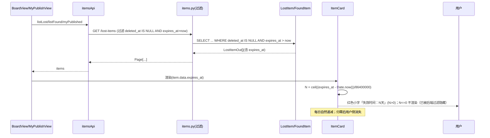
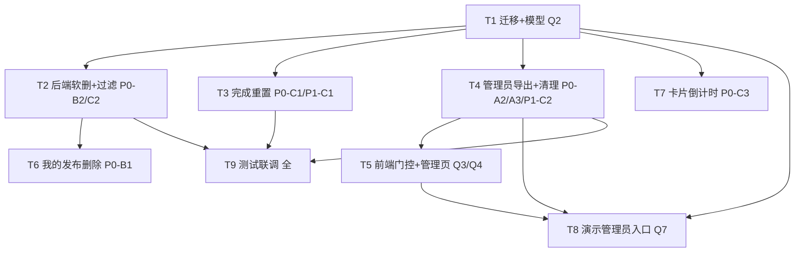

# v7 增量架构设计 + 任务分解（Incremental Architecture & Tasks）

| 项 | 内容 |
| --- | --- |
| 系统 | 基于 YOLOv8 的校园失物招领智能匹配系统 |
| 文档定位 | **增量设计**：在已落地 v6 之上描述 v7 变更（仅描述变更；不含完整源码、不修改源文件）；本文档只产出设计 |
| 架构师 | 高见远（software-architect） |
| 技术栈（沿用，禁止更换） | 前端 **Vue3 + Element Plus + Vite + Pinia + Axios**；后端 **FastAPI + SQLAlchemy 2.x + SQLite/MySQL + JWT**；IM **前端轮询**；**非默认 React/MUI**（既有系统增量改造） |
| 配套 PRD | `docs/prd/v7_incremental_prd.md`（含 §0 实地事实 F-A1~F-D1、需求池、UI 草图、Q1–Q8 及主理人拍板） |
| 基线设计 | `docs/architecture/v6_incremental_design.md`（v6 已落地，零迁移） |
| 勘察基准 | 实地 Read 于 `app/models/{item,match,im,user}.py`、`app/schemas/*`、`app/routers/{items,admin,deps,match}.py`、`app/services/{handover_service,im_service,publish_service}.py`、`migrations/versions/0003_*.py`、`web/src/**` |

---

## 0. 实地勘察结论（设计依据，引用真实路径/行号）

| # | 事实 | 证据 | 对 v7 设计的影响 |
| --- | --- | --- | --- |
| F1 | `LostItem`/`FoundItem` **无** `expires_at`/`deleted_at`；仅有 `created_at` | `app/models/item.py:58,95` | 需 0004 迁移新增两列（DateTime, 可空） |
| F2 | `MatchRecord` **无** `completed_at`；仅有 `created_at` | `app/models/match.py:47` | 需 0004 迁移新增 `completed_at`（DateTime, 可空） |
| F3 | `IMSession.expires_at` 范式：非空 `DateTime` + 索引 `idx_im_expires` | `app/models/im.py:52,62` | 新增 `expires_at` 列**复用同一命名/索引范式** |
| F4 | 3 处完成匹配路径 `status→COMPLETED(2)` 且置双方物品 `status=RESOLVED` | `handover_service.py:136`、`match.py:385`、`im_service.py:183` | 这 3 个落点**都需写 `completed_at` + 重置双方 `expires_at`** |
| F5 | `DELETE /lost-items/{id}`/`/found-items/{id}` 当前语义=撤销（置 `status=RESOLVED` + 拒绝进行中匹配） | `items.py:211-228,280-297` | v7 改为**软删**（置 `deleted_at`，保留拒绝进行中匹配逻辑） |
| F6 | `MatchRecord.lost_id`/`found_id` 外键 `ondelete="RESTRICT"` | `app/models/match.py:32-41` | 物理删物品被拒 → **一律软删**；超 1 年周期清理须按依赖序（IMMessage→IMSession→MatchRecord→Item） |
| F7 | `require_admin` 已实现（`user.role != 1 → AdminRequiredError`） | `app/routers/deps.py:44-48` | 导出/列表/清理端点直接复用 |
| F8 | 既有审计导出 `GET /admin/audit-logs/export?format=csv|json` 用 stdlib `csv`/`json`，零依赖 | `app/routers/admin.py:53-90` | v7 导出**直接沿用同一范式**（stdio csv + 下载头） |
| F9 | 前端 `/admin` 导航项对全员可见；`router.beforeEach` 仅校验登录 | `router/index.ts:13-21,88-98`、`AppLayout.vue:97` | 需加 `role==1` 过滤 + `meta.roles` 守卫 |
| F10 | `ItemCard` 有 `item/resolved/counterpart/completedAt` props，无删除按钮/倒计时 | `ItemCard.vue:97-110,167-193` | 加 `showDelete` prop + 删除按钮 + `失效时间` 红色小字 |
| F11 | `MyPublishView` 用 `itemsApi.myPublished()` 渲染，无删除 UI | `MyPublishView.vue:59-70` | 加删除按钮 + `ElMessageBox.confirm` |
| F12 | `mockCurrentUser.role=0` / `mockAdminUser.role=1`；`mockAdapter.deleteLost/Found` 用 `splice` 物理删 | `mockData.ts:47-67`、`mockAdapter.ts:303-315` | 演示态：增加管理员身份切换；删除改置 `deleted_at`；列表按失效/软删过滤 |
| F13 | `AppLayout` 直接 `navItems = NAV_ITEMS`（无 role 过滤） | `AppLayout.vue:97` | 改 `navItems` 为按 `auth.user?.role===1` 计算 |

> **结论**：v7 变更均可基于 v6 事实落地。核心约束：① 0004 首次打破零迁移（必要，见 §9）；② RESTRICT FK 强制软删 + 周期清理依赖序（F6）；③ 3 个完成路径统一挂接 `completed_at`+重置（F4）。

---

## 1. 实现方案 + 框架选型（沿用 FastAPI+Vue3，零新增依赖）

**架构风格**：沿用「路由层 → 服务层 → ORM」与「View + api 适配器」分层；本次为**增量增强**，不引入新框架、不引入新进程、**零新增第三方依赖**。CSV 导出复用 Python 标准库 `csv`（与 F8 审计导出完全一致）。

**关键选型决策（主理人拍板已固化为设计约束）**：

1. **Q1 导出格式 = CSV（stdlib）**：复用 `app/routers/admin.py` 既有 `csv` 导出范式；**不引入 openpyxl**。导出聚合「失主发布 + 拾主发布 + 交接时间 + 交接对话(IM 文本) + 双方账号」为 1 个 CSV 文件。对话为纯文本（F：IM 无图），物品图片以 URL 列表写入列。
2. **Q2 失效字段 = 0004 迁移新增列**（必要时打破零迁移）：`LostItem.expires_at`/`FoundItem.expires_at`/`LostItem.deleted_at`/`FoundItem.deleted_at`/`MatchRecord.completed_at`，全部 DateTime 可空；索引对齐 `IMSession.expires_at` 范式（F3）。
3. **Q3 管理员三重门控**：① 前端 `NAV_ITEMS` 仅 `role==1` 可见；② 路由 `meta.roles=['admin']` + `beforeEach` 守卫；③ 后端 `require_admin` 依赖（F7）。
4. **Q4 导出范围 = 勾选（单选/批量）合并 1 个 CSV**：管理后台列表支持勾选 + 全选，一键导出合并文件。
5. **Q5 导出内容 / 隐私边界**：IM 对话仅文本；物品图片以 URL 列表列；双方 `student_no`/`phone`（明文，非脱敏）**仅在管理员导出时写入**（普通用户 `UserOut.phone` 已脱敏，见 `types/index.ts:26`）。导出文件含敏感信息，设计上在下载响应头/UI 提示「取证用途妥善保管」。
6. **Q6 删除/归零 = 全软删 + 周期清理**：`DELETE /items/{id}` 语义由"撤销"改为"软删"（置 `deleted_at`）；用户侧列表过滤 `deleted_at IS NULL AND expires_at > now`（3 个月）；管理后台过滤 `expires_at + 270天 > now`（1 年，基于用户侧 `expires_at` 推算，不新增字段）；超期物理清理按依赖序（IMSession→MatchRecord→Item）应对 RESTRICT FK（F6）。
7. **Q7 演示模式**：`mockData`/`mockAdapter`/`demo` 增加"以管理员身份进入"入口（切 `mockCurrentUser.role=1`），使需求 A 在演示态可演示。
8. **Q8 软删后**：物品 `deleted_at` 非空后不参与匹配池（列表/候选均过滤），与用户侧过期过滤合并处理。

---

## 2. 文件清单及相对路径（标注 `[新增]/[变更]/[复用]`）

### 2.1 后端

| 文件 | 标记 | 变更说明 |
| --- | --- | --- |
| `migrations/versions/0004_v7_incremental.py` | `[新增]` | 新增列 `lost_item.expires_at/deleted_at`、`found_item.expires_at/deleted_at`、`match_record.completed_at` + 索引；存量回填（`expires_at = created_at + 90d`；已完成匹配 `completed_at = created_at`）；`batch_alter_table` + inspector 幂等 |
| `app/models/item.py` | `[变更]` | `LostItem`/`FoundItem` 增加 `expires_at`/`deleted_at`（DateTime, 可空）；`expires_at` 模型级默认 `= utcnow() + 90d`；索引 `idx_lost_expires/idx_lost_deleted/idx_found_expires/idx_found_deleted` |
| `app/models/match.py` | `[变更]` | `MatchRecord` 增加 `completed_at`（DateTime, 可空）；索引 `idx_match_completed` |
| `app/routers/items.py` | `[变更]` | ① `DELETE /lost-items/{id}`/`/found-items/{id}` 语义改为**软删**（置 `deleted_at`，保留拒绝进行中匹配逻辑）；② `list_lost_items`/`list_found_items` 增加 `deleted_at IS NULL AND expires_at > now` 用户侧过滤；③ `my_items`（`/users/me/items`）增加同一用户侧过滤 |
| `app/routers/admin.py` | `[变更]` | 新增 `GET /admin/matches`（未失效匹配列表，`require_admin`）、`POST /admin/export`（按 id 列表导出 CSV，`require_admin`）、`POST /admin/cleanup`（周期清理触发，`require_admin`） |
| `app/services/cleanup.py` | `[新增]` | `CleanupService.run_once(db)`：按依赖序物理清理超 1 年数据（IMMessage→IMSession→MatchRecord→Item），规避 RESTRICT FK |
| `app/services/handover_service.py` | `[变更]` | `verify()` 双方验证通过处：写 `match.completed_at = now`，重置 `lost.expires_at`/`found.expires_at = now + 90d`（F4-①） |
| `app/routers/match.py` | `[变更]` | `self_complete_match`：写 `completed_at` + 重置双方 `expires_at`（F4-②） |
| `app/services/im_service.py` | `[变更]` | `success_session_archive`：写 `completed_at` + 重置双方 `expires_at`（F4-③） |
| `app/schemas/item.py` | `[变更]` | `LostItemOut`/`FoundItemOut` 增加 `expires_at?`/`deleted_at?`（`from_model` 透传） |
| `app/schemas/match.py` | `[变更]` | `MatchOut` 增加 `completed_at?`（`from_model` 透传） |
| `tests/test_v7_migration.py` | `[新增]` | 0004 迁移可重复执行（幂等）、列/索引存在、存量回填正确 |
| `tests/test_v7_soft_delete.py` | `[新增]` | 软删置 `deleted_at`；用户侧不可见、管理员仍可见；被匹配引用物品软删不触发 FK 拒绝 |
| `tests/test_v7_expiry_filter.py` | `[新增]` | 列表过滤 `expires_at>now AND deleted_at IS NULL`（用户侧）与 `expires_at+270d>now`（管理侧）；完成重置后 `expires_at` 顺延 |
| `tests/test_v7_admin_export.py` | `[新增]` | 导出 CSV 列顺序完整、含双方明文 `student_no/phone`、对话文本、隐私边界（非管理员 403） |
| `tests/test_v7_cleanup_fk_order.py` | `[新增]` | 超 1 年数据按 IMSession→MatchRecord→Item 依赖序清理，不破坏 RESTRICT FK |

### 2.2 前端

| 文件 | 标记 | 变更说明 |
| --- | --- | --- |
| `web/src/types/index.ts` | `[变更]` | `LostItemOut`/`FoundItemOut` 增加 `expires_at?: string`/`deleted_at?: string`；`MatchOut` 增加 `completed_at?: string` |
| `web/src/router/index.ts` | `[变更]` | ① `NAV_ITEMS` 中 `/admin` 增加 `roles:['admin']` 元信息；② `beforeEach` 对 `meta.roles` 校验（非管理员直访 `/admin` → `/board`）；③（可选）导出 `visibleNavItems(role)` 辅助 |
| `web/src/layouts/AppLayout.vue` | `[变更]` | `navItems` 改为按 `auth.user?.role === 1` 过滤出含 `/admin` 的项（F13） |
| `web/src/views/AdminView.vue` | `[变更]` | 扩展：新增「未失效匹配记录」区块（`el-table` + 勾选 + 全选 + 状态过滤 + 一键导出按钮），调用 `adminApi.listAdminMatches` + `adminApi.exportMatches`；保留既有审计日志视图 |
| `web/src/api/admin.ts` | `[变更]` | 增加 `listAdminMatches(params)`（`GET /admin/matches`）、`exportMatches(ids, format)`（`POST /admin/export`，blob 下载）、`triggerCleanup()`（`POST /admin/cleanup`） |
| `web/src/api/items.ts` | `[复用/轻量]` | `deleteLost`/`deleteFound` 已存在，语义由后端改为软删，前端无需改；如需传参保持 |
| `web/src/views/MyPublishView.vue` | `[变更]` | 每条 ItemCard 加 `:show-delete="true"` + `@delete` 处理：`ElMessageBox.confirm` → `itemsApi.deleteLost/deleteFound` → 成功后从本地列表移除（乐观更新） |
| `web/src/components/ItemCard.vue` | `[变更]` | ① 新增 `showDelete?: boolean` prop + 删除按钮（行动区，emit `delete`）；② 新增「失效时间：N天」红色小字（`N = ceil((expires_at - now)/86400000)`，`expires_at` 取自 `item.data.expires_at`），`N<=0` 不渲染（归零由列表过滤隐藏） |
| `web/src/utils/demo.ts` | `[变更]` | 增加演示身份切换：`setDemoRole(role: 0|1)`（切 `mockCurrentUser.role`，配合重新登录/刷新 auth），使需求 A 在演示态可演示（Q7） |
| `web/src/stores/demo.ts` | `[变更·轻量]` | 增加 `demoRole` 状态 + 切换动作，绑定到 `demo.ts` 的 `setDemoRole`，管理后台/头部提供"普通/管理员"切换 UI |
| `web/src/api/mockData.ts` | `[变更]` | ① `mockLostItems`/`mockFoundItems` 增加 `expires_at`（= `created_at+90d`）、`deleted_at: null`；② 增加模块级 `currentMockRole`（默认 0），`mockCurrentUser` 登录时按 `currentMockRole` 取 role |
| `web/src/api/mockAdapter.ts` | `[变更]` | ① `listLost`/`listFound`/`myItems` 增加 `expires_at>now AND deleted_at IS NULL` 过滤（与后端语义对齐）；② `deleteLost`/`deleteFound` 由 `splice` 改为置 `deleted_at=now`（与后端软删对齐）；③ `handleLogin`/`handleRegister` 用 `currentMockRole` 决定返回用户 role；④ 新增路由 `/admin/matches`（返回 mock 未失效匹配）、`/admin/export`（聚合 CSV blob）、`/admin/cleanup`（noop/计数） |

> **说明**：`ItemCard` 倒计时直接从 `props.item.data.expires_at` 读取（types 增加字段后无需新增 prop）；`MyPublishView`/`BoardView` 透传即可，无需改 props 传参。`BoardView` 主三 tab 与「已完成交接」tab 已按 `status` 过滤，叠加后端 `expires_at/deleted_at` 过滤后自然隐藏过期/已删项，前端可保留既有 `merged` 硬过滤作 P0 保底（不强制改 `BoardView`）。

---

## 3. 数据结构和接口（Mermaid classDiagram）

> 完整 classDiagram 另存于 `docs/architecture/v7_class-diagram.mermaid`。

```mermaid
classDiagram
    class LostItem {
        <<变更>>
        +BigInteger id
        +SmallInt status
        +DateTime created_at
        +DateTime expires_at  %% [新增] created_at+90d / 完成时重置
        +DateTime deleted_at  %% [新增] 软删标记
    }
    class FoundItem {
        <<变更>>
        +BigInteger id
        +SmallInt status
        +DateTime created_at
        +DateTime expires_at  %% [新增]
        +DateTime deleted_at  %% [新增]
    }
    class MatchRecord {
        <<变更>>
        +BigInteger id
        +int lost_id
        +int found_id
        +SmallInt status
        +DateTime created_at
        +DateTime completed_at  %% [新增] status→2 时写入
    }
    class IMSession {
        <<复用>>
        +DateTime expires_at  %% 范式来源
    }
    class User {
        <<复用>>
        +String student_no
        +String phone  %% 导出用明文
        +SmallInt role  %% 1=管理员
    }
    class ItemsRouter {
        <<变更>>
        +GET /lost-items  %% +deleted_at IS NULL + expires_at>now
        +GET /found-items %% 同上
        +GET /users/me/items %% +同上用户侧过滤
        +DELETE /lost-items/{id}  %% 语义→软删(deleted_at)
        +DELETE /found-items/{id} %% 语义→软删
    }
    class AdminRouter {
        <<变更>>
        +GET /admin/matches  %% require_admin, 未失效匹配列表
        +POST /admin/export  %% require_admin, ids→CSV
        +POST /admin/cleanup  %% require_admin, 触发清理
    }
    class HandoverService {
        <<变更>>
        +verify()  %% 写 completed_at + 重置双方 expires_at
    }
    class MatchRouter {
        <<变更>>
        +POST /matches/{id}/self-complete  %% 写 completed_at + 重置
    }
    class IMService {
        <<变更>>
        +success_session_archive()  %% 写 completed_at + 重置
    }
    class CleanupService {
        <<新增>>
        +run_once(db)  %% 依赖序物理清理超1年
    }
    class LostItemOut {
        <<变更>>
        +expires_at? : string
        +deleted_at? : string
    }
    class FoundItemOut {
        <<变更>>
        +expires_at? : string
        +deleted_at? : string
    }
    class MatchOut {
        <<变更>>
        +completed_at? : string
    }

    LostItem "1" --> "0..*" MatchRecord : lost_id(RESTRICT)
    FoundItem "1" --> "0..*" MatchRecord : found_id(RESTRICT)
    MatchRecord "1" --> "0..*" IMSession : match_id(RESTRICT)
    IMSession "1" --> "0..*" IMMessage : session_id(RESTRICT)
    LostItem ..> LostItemOut
    FoundItem ..> FoundItemOut
    MatchRecord ..> MatchOut
    ItemsRouter ..> LostItem
    ItemsRouter ..> FoundItem
    AdminRouter ..> MatchRecord
    AdminRouter ..> CleanupService
    HandoverService ..> MatchRecord
    HandoverService ..> LostItem
    HandoverService ..> FoundItem
    MatchRouter ..> MatchRecord
    IMService ..> MatchRecord
```

### 3.1 关键接口契约变更（请求/响应，统一 `{code,message,data}`）

**① `DELETE /lost-items/{id}` / `DELETE /found-items/{id}`（变更语义：撤销→软删）**
- 入参：`item_id`（路径）；依赖 `get_current_user` + 所有权校验（`_ensure_owner`）。
- 行为（示意，非完整源码）：
  ```python
  item = db.get(LostItem, item_id)
  _ensure_owner(item.publisher_id, user)
  item.deleted_at = utcnow()                       # 软删标记
  # 保留：拒绝其待处理匹配（与旧"撤销"一致，不破坏证据链）
  db.query(MatchRecord).filter(
      MatchRecord.lost_id == item_id,
      MatchRecord.status.in_([PENDING_CLAIM, CLAIMING]),
  ).update({MatchRecord.status: REJECTED})
  db.commit()
  ```
- 响应：`LostItemOut`（含 `deleted_at`）。**不触发 RESTRICT FK**（标记删除，非物理删）。

**② `GET /lost-items` / `GET /found-items`（变更：用户侧自动过期过滤）**
- 在既有 `exclude_resolved`/`resolved_only`/`status` 过滤**之后**叠加（无条件，用户侧）：
  ```python
  q = q.filter(LostItem.deleted_at.is_(None), LostItem.expires_at > now)
  ```
  其中 `now = datetime.now(timezone.utc)`（与模型 `utcnow` 同 tz 基准）。
- 管理后台列表（`GET /admin/matches`）使用**不同**过滤（见③），不在此端点区分角色。

**③ `GET /admin/matches`（新增，`require_admin`）**
- query：`status?: int`（可选，按 `MatchRecord.status` 过滤，默认全部未失效）、`page`、`page_size`。
- 过滤：仅返回"未失效"匹配 = 关联 `lost_item` 与 `found_item` 均满足 `expires_at + 270天 > now`（管理员留存 1 年窗；**不**看 `deleted_at`，软删项在 1 年内仍可见）。
  ```python
  cutoff = now + timedelta(days=270)
  q = db.query(MatchRecord).join(LostItem, ...).join(FoundItem, ...)\
        .filter(LostItem.expires_at > cutoff, FoundItem.expires_at > cutoff)
  ```
- 响应：`Page[MatchOut]`（含 `lost_item`/`found_item`/`completed_at`）。

**④ `POST /admin/export`（新增，`require_admin`）**
- body（JSON）：`{ ids: List[int], format: str = "csv" }`。
- 行为：对每个 `id` 调 `MatchRecord` → 取 `lost_item`/`found_item` → 取双方 `User`（明文 `student_no`/`phone`）→ 取 `IMSession.match_id==id` 下全部 `IMMessage`（按 `sent_at` 排序）拼对话文本 → 写 1 行 CSV。
- 响应：`FileResponse` / `StreamingResponse` / `PlainTextResponse`（`text/csv`，`Content-Disposition: attachment; filename=forensic_matches_{date}.csv`）。非管理员 → `AdminRequiredError`（403）。
- CSV 列顺序（**共享知识 §7**）：见 §7-③。

**⑤ `POST /admin/cleanup`（新增，`require_admin`）**
- 行为：调用 `CleanupService(db).run_once()`，返回 `{purged_matches: int, purged_items: int}`（仅统计本次清理量，建议 `limit` 批处理）。
- 依赖序（核心，F6）：先删 `IMMessage`（关联即将删的会话）→ 删 `IMSession`（关联即将删的匹配）→ 删 `MatchRecord`（关联即将超期的物品）→ 删 `Item`（超 `expires_at+270d` 且已无引用）。详见 §3.2。

### 3.2 周期清理依赖序（规避 RESTRICT FK）



> ⚠️ **顺序不可反**：`MatchRecord.lost_id/found_id` 为 RESTRICT（F6），必须先清除依赖它的 `IMSession`/`IMMessage` 与 `MatchRecord` 自身，才能物理删除 `Item`。清理"超 1 年匹配"时只选**双方物品都超期**的匹配，确保物品侧随后可安全删除。

### 3.3 完成匹配重置锚点（3 个落点统一）

| 落点 | 文件:行 | 重置动作 |
| --- | --- | --- |
| `HandoverService.verify` 双方验证通过 | `handover_service.py:131-151` | `match.completed_at = now`；`lost.expires_at = now+90d`；`found.expires_at = now+90d`；`lost/found.status=RESOLVED` |
| `self_complete_match` | `match.py:385-402` | 同上（在 `m.status=COMPLETED` 处追加） |
| `IMService.success_session_archive` | `im_service.py:183-204` | 同上（在 `match.status=COMPLETED` 处追加） |

> 统一代码骨架（注入到上述 3 处 `match.status = COMPLETED` 之后）：
> ```python
> now = datetime.now(timezone.utc)
> match.completed_at = now
> if lost is not None:
>     lost.expires_at = now + timedelta(days=90)
> if found is not None:
>     found.expires_at = now + timedelta(days=90)
> ```

---

## 4. 程序调用流程（Mermaid sequenceDiagram）

> 完整 sequenceDiagram 另存于 `docs/architecture/v7_sequence-diagram.mermaid`。

### 4.1 管理员选匹配 → 导出 CSV（需求 A / Q1·Q4·Q5）



### 4.2 用户删发布 → 软删（需求 B / Q6）

```mermaid
sequenceDiagram
    participant U as 用户
    participant MV as MyPublishView
    participant IC as ItemCard
    participant API as itemsApi
    participant IT as items.py(软删)
    participant DB as LostItem/FoundItem
    U->>MV: 我的发布页
    MV->>IC: 渲染(showDelete=true)
    U->>IC: 点「删除」
    IC->>MV: emit('delete', item)
    MV->>U: ElMessageBox.confirm("删除后仅你不可见，管理员留存1年")
    U->>MV: 确认
    MV->>API: deleteLost(id) / deleteFound(id)
    API->>IT: DELETE /lost-items/{id}
    IT->>DB: item.deleted_at = now; 拒绝进行中匹配
    DB-->>IT: LostItemOut(deleted_at 非空)
    IT-->>API: {code,data}
    API-->>MV: 成功
    MV->>MV: 乐观移除本地该项（列表不再含 deleted_at）
    Note over DB: 用户侧列表过滤 deleted_at IS NULL → 该项消失；管理员后台仍可见至1年
```

### 4.3 卡片渲染倒计时（需求 C / Q2）



---

## 5. 任务列表（有序、含依赖、按实现顺序，标注优先级与需求字母）

> 主线：T1 迁移+模型 →（T2 软删过滤 / T3 完成重置 / T4 管理员导出）并行 → T5 前端门控+管理页 → T6 删除按钮 / T7 倒计时（可并行）→ T8 演示管理员入口 → T9 测试联调。

| 任务 | 名称 | 来源文件 | 依赖 | 优先级 / 需求 |
| --- | --- | --- | --- | --- |
| **T1** | 0004 迁移 + 模型字段 | `0004_v7_incremental.py`、`app/models/item.py`、`app/models/match.py`、`app/schemas/{item,match}.py` | 无 | **P0 / Q2·P0-C1·P1-A2** |
| **T2** | 后端软删 + 用户侧列表过滤 | `app/routers/items.py` | T1 | **P0 / P0-B2·P0-C2** |
| **T3** | 后端完成匹配重置（3 落点写 completed_at + 重置 expires_at） | `handover_service.py`、`match.py`、`im_service.py` | T1 | **P0 / P0-C1·P1-C1·P1-A2** |
| **T4** | 后端管理员导出 + 周期清理 | `app/routers/admin.py`、`app/services/cleanup.py` | T1 | **P0 / P0-A2·P0-A3·P1-A1·P1-C2** |
| **T5** | 前端路由门控 + 管理后台页 | `web/src/router/index.ts`、`web/src/layouts/AppLayout.vue`、`web/src/views/AdminView.vue`、`web/src/api/admin.ts` | T4 | **P0 / P0-A1·P0-A2·P0-A3·Q3·Q4** |
| **T6** | 前端我的发布删除按钮 + 确认 | `web/src/views/MyPublishView.vue`、`web/src/components/ItemCard.vue` | T2 | **P0 / P0-B1** |
| **T7** | 前端卡片倒计时 | `web/src/components/ItemCard.vue`、`web/src/types/index.ts` | T1 | **P0 / P0-C3** |
| **T8** | 演示模式管理员入口 + 导出/删除语义对齐 | `web/src/utils/demo.ts`、`web/src/stores/demo.ts`、`web/src/api/mockData.ts`、`web/src/api/mockAdapter.ts` | T4,T5,T1 | **P1 / P1-D1·P1-D2·Q7** |
| **T9** | 测试与联调 | `tests/test_v7_*.py` | T2,T3,T4 | **P0 / 全** |

**依赖图（Mermaid）**：



**任务要点说明**：
- **T1**：模型加 `expires_at`/`deleted_at`/`completed_at`（DateTime 可空）；`LostItem`/`FoundItem` 的 `expires_at` 设模型级默认 `utcnow()+timedelta(days=90)`（与 `created_at` 同 tz 基准）；新增索引 `idx_lost_expires/idx_lost_deleted/idx_found_expires/idx_found_deleted/idx_match_completed`。0004 迁移用 `batch_alter_table` + inspector 幂等，存量回填 `expires_at=created_at+90d`（按方言分支 SQL），已完成匹配 `completed_at=created_at`（best-effort）。详见 §9。
- **T2**：`DELETE` 端点改 `item.deleted_at = utcnow()`（保留拒绝进行中匹配逻辑）；`list_lost_items`/`list_found_items`/`my_items` 增加 `deleted_at.is_(None) & expires_at > now` 过滤（无条件，用户侧）。
- **T3**：在 3 个完成落点（`handover_service.verify` / `match.self_complete_match` / `im_service.success_session_archive`）的 `match.status=COMPLETED` 之后，写 `match.completed_at=now` 并重置 `lost.expires_at=found.expires_at=now+90d`。
- **T4**：`admin.py` 新增 `GET /admin/matches`、`POST /admin/export`、`POST /admin/cleanup`（均 `require_admin`）；新建 `CleanupService.run_once` 按 §3.2 依赖序物理清理。导出 CSV 列顺序见 §7-③。
- **T5**：`router/index.ts` 给 `/admin` 加 `meta.roles:['admin']` + `beforeEach` 守卫（非管理员直访 `/admin` → `/board`）；`AppLayout` 按 `auth.user?.role===1` 过滤 `NAV_ITEMS`；`AdminView` 扩「未失效匹配记录」区块（`el-table` 勾选 + 状态过滤 + 一键导出）；`adminApi` 加 `listAdminMatches`/`exportMatches`/`triggerCleanup`。
- **T6**：`ItemCard` 加 `showDelete` prop + 删除按钮（emit `delete`）；`MyPublishView` 监听 `@delete` → `ElMessageBox.confirm` → `deleteLost/deleteFound` → 乐观移除。
- **T7**：`types` 给 `LostItemOut`/`FoundItemOut` 加 `expires_at?`/`deleted_at?`；`ItemCard` 计算 `N=ceil((expires_at-Date.now())/86400000)` 渲染红色小字「失效时间：N天」，`N<=0` 不渲染。
- **T8**：`mockData` 增 `currentMockRole`（默认 0）+ 各 item 增 `expires_at`/`deleted_at`；`demo.ts`/`stores/demo.ts` 增管理员身份切换；`mockAdapter` 的 `listLost/listFound/myItems` 增失效/软删过滤、`deleteLost/Found` 改置 `deleted_at`、登录按 `currentMockRole` 返 role、新增 `/admin/matches`+`/admin/export` 处理。
- **T9**：以「0004 幂等 + 回填」「软删不可见/管理员可见/不触 FK」「用户侧 `expires_at>now AND deleted_at IS NULL`、管理侧 `expires_at+270d>now`」「导出列完整 + 双方明文账号 + 非管理员 403」「清理依赖序不破坏 FK」为验收闸门。

---

## 6. 依赖包列表

| 包 | 是否新增 | 说明 |
| --- | --- | --- |
| `fastapi` / `sqlalchemy` / `alembic` / `pydantic` / `element-plus` / `axios` / `vue-router` / `pinia` / `vite` | 否（已有） | 沿用既有栈 |
| `csv` / `io` / `datetime` | 否（stdlib） | 导出复用标准库（Q1 拍板：不引入 openpyxl） |
| 任何新第三方依赖 | **否** | **零新增依赖** |

**结论：本增量无需新增任何第三方依赖（零新增依赖）。**

---

## 7. 共享知识（跨文件约定）

1. **响应体统一**：所有接口返回 `{code,message,data}`（items / admin / match 路由一致）。
2. **失效倒计时计算规则（全局唯一真源）**：
   - 物品创建：`expires_at = created_at + 90天`（3 个月）。模型级默认实现，发布服务无需手写（见 §9/T1）。
   - 完成匹配交接（`MatchRecord.status→COMPLETED` 的 3 个落点）：`lost.expires_at = found.expires_at = 完成时刻 + 90天`（重置计时）。
   - 前端卡片 `N = ceil((expires_at - Date.now())/86400000)`，精确到天；`N<=0` 用户侧消失。
   - 时区基准：模型 `utcnow = lambda: datetime.now(timezone.utc)`（感知 UTC）；过滤 `now` 须用同一基准（感知 UTC），避免 SQLite/MySQL 比较错位。
3. **软删 / 过期过滤条件（前后端一致）**：
   - **用户侧**（公示栏/我的发布/我的匹配）：`deleted_at IS NULL AND expires_at > now`（3 个月窗）。
   - **管理后台**（列表/检索）：`expires_at + 270天 > now`（1 年窗；不判 `deleted_at`，软删项在 1 年内仍可见）。基于用户侧 `expires_at` 推算，**不新增字段**。
   - **匹配池**：软删（`deleted_at` 非空）物品不参与候选召回（`_recall_*` 已按 `status` 过滤，叠加 `deleted_at IS NULL` 防御）。
4. **角色常量**：`User.role == 1` = 管理员；`0` = 普通。`require_admin` 后端门控；前端 `auth.user?.role === 1` 判门控。枚举 `UserRole.ADMIN=1`（`app/schemas/common.py:50`）。
5. **CSV 列顺序（导出取证文件，固定不变）**：
   ```
   match_id,
   lost_item_id, lost_category, lost_title, lost_description, lost_images, lost_student_no, lost_phone,
   found_item_id, found_category, found_title, found_description, found_images, found_student_no, found_phone,
   completed_at,
   conversation
   ```
   - `lost_images`/`found_images`：URL 列表以 `|` 分隔写入单列。
   - `conversation`：该匹配下 `IMMessage` 文本，按 `sent_at` 升序拼为 `[sent_at] {失主|拾得者}: {content}`，多行以换行（CSV 引号包裹）或 ` ⏎ ` 分隔（默认 ` ⏎ ` 单行，便于 Excel）。
   - `lost_student_no/lost_phone/found_student_no/found_phone`：**明文**（后端直查 `User` 表，非脱敏 `UserOut`），**仅管理员导出可见**。
6. **隐私边界**：普通用户 `UserOut.phone` 已脱敏（`138****8001`）；`student_no`/`phone` 明文**只在 `POST /admin/export` 出现**。导出文件含敏感信息，UI 与响应头提示「取证用途妥善保管」。
7. **下载响应头**：`Content-Disposition: attachment; filename=forensic_matches_{YYYYMMDD}.csv`，`Content-Type: text/csv; charset=utf-8`。
8. **清理依赖序红线**：超 1 年物理清理必须按 `IMMessage → IMSession → MatchRecord → Item` 顺序（规避 `MatchRecord.lost_id/found_id` RESTRICT）。只清理**双方物品都超期**的匹配，确保物品侧随后可安全删除。
9. **Mock 与真实接口对齐**：`mockAdapter` 的 `listLost/listFound/myItems` 过滤、`deleteLost/Found` 语义（置 `deleted_at`）、`/admin/matches`+`/admin/export` 返回结构，须与后端 §3.1 逐一对齐；`mockData` item 须含 `expires_at`/`deleted_at`，演示态倒计时/删除/导出与真实态一致。

---

## 8. 待明确事项 / 需主理人确认点

1. **无阻塞项**：主理人已就 Q1（CSV/stdlib）、Q2（0004 迁移 + 字段）、Q3（三重门控）、Q4（勾选批量单文件）、Q5（文本对话 + URL 列表 + 明文账号仅管理员）、Q6（全软删 + 周期清理）、Q7（演示管理员入口）、Q8（软删后退出匹配池）全部拍板，设计据此落地，**无待确认阻塞点**。
2. **导出端点方法（已知非阻塞）**：本设计采用 `POST /admin/export`（body `{ids, format}`）以接收 id 列表（与任务书一致）；若团队偏好与既有 `GET /admin/audit-logs/export` 完全同构，可改为 `GET /admin/matches/export?ids=1,2,3&format=csv`。二者语义等价，不纳入阻塞。
3. **周期清理触发方式（已知非阻塞）**：本设计以 `POST /admin/cleanup`（`require_admin` 手动/脚本触发）为首选实现；如需"启动即跑"，可在 `main.py` 的 `startup` 事件用 `BackgroundTasks`/`asyncio.create_task` 调用 `CleanupService.run_once`（注意事件循环内 DB 会话生命周期）。当前无 APScheduler 依赖，定时任务交由外部 cron/手动触发，不引入新依赖。

---

## 9. 0004 迁移要点（v7 首次打破零迁移，但必要）

**结论：v7 必须新增 `0004_v7_incremental.py` 迁移**（v6 刻意零迁移，v7 因 `expires_at`/`deleted_at`/`completed_at` 三字段无法靠"纯计算"干净实现——详见 PRD Q2 论证），但写法须**安全、幂等、可回滚**，规避 v4 的 `name` 坑。

### 9.1 为什么必须迁移（不可绕开）

- `expires_at` 需要**可索引**的用户侧过滤（`WHERE expires_at > now()`），且需**重置锚点**（完成交接改写），纯计算方案（读取时 `created_at+90d`）无法支持重置且不索引 → 方案 A 胜出（PRD Q2）。
- `deleted_at` 软删标记、`completed_at` 导出"交接时间"+重置锚点，均为持久化字段，必须落库。

### 9.2 安全写法（规避 v4 的 `name` 坑）

> **v4 教训**（`0003_v4_incremental.py:37-42`）：SQLite 下 `batch_alter_table` 重建表时会重新挂外键，若加列时 FK **不显式命名**，重建后自动名与后续引用名不一致 → 后续操作失败。故：① 所有新增约束/索引**显式命名**；② 用 `batch_alter_table`（`render_as_batch=True`）保证 SQLite 安全；③ 用 `inspect` 检查列/索引是否存在，**幂等可重复执行**。

本 0004 新增列**无外键**（均为可空 DateTime），不触发 FK 重命名问题，但仍遵循以下铁律：

```python
"""v7 增量迁移：失效/软删/完成时间字段。

- lost_item / found_item 增加 expires_at(可空) + deleted_at(可空) + 索引
- match_record 增加 completed_at(可空) + 索引
- 存量回填：expires_at = created_at + 90天；已完成匹配 completed_at = created_at
- 通过 batch_alter_table(render_as_batch=True) 对 SQLite 安全加列
- 幂等：基于 inspector 检查列/索引是否存在
- 所有索引显式命名，规避 v4 name 坑

依赖：0003_v4_incremental
"""
from __future__ import annotations

import sqlalchemy as sa
from alembic import op
from sqlalchemy import inspect, text

revision = "0004_v7_incremental"
down_revision = "0003_v4_incremental"
branch_labels = None
depends_on = None

EXPIRE_DAYS = 90
ADMIN_RETENTION_DAYS = 270


def _exists(inspector, table: str, column: str) -> bool:
    return column in {c["name"] for c in inspector.get_columns(table)}


def _index_exists(inspector, table: str, index: str) -> bool:
    return index in {i["name"] for i in inspector.get_indexes(table)}


def upgrade() -> None:
    bind = op.get_bind()
    inspector = inspect(bind)
    dialect = bind.dialect.name  # 'sqlite' / 'mysql'

    with op.batch_alter_table("lost_item") as b:
        if not _exists(inspector, "lost_item", "expires_at"):
            b.add_column(sa.Column("expires_at", sa.DateTime(), nullable=True))
        if not _exists(inspector, "lost_item", "deleted_at"):
            b.add_column(sa.Column("deleted_at", sa.DateTime(), nullable=True))
        if not _index_exists(inspector, "lost_item", "idx_lost_expires"):
            b.create_index("idx_lost_expires", ["expires_at"])
        if not _index_exists(inspector, "lost_item", "idx_lost_deleted"):
            b.create_index("idx_lost_deleted", ["deleted_at"])

    with op.batch_alter_table("found_item") as b:
        if not _exists(inspector, "found_item", "expires_at"):
            b.add_column(sa.Column("expires_at", sa.DateTime(), nullable=True))
        if not _exists(inspector, "found_item", "deleted_at"):
            b.add_column(sa.Column("deleted_at", sa.DateTime(), nullable=True))
        if not _index_exists(inspector, "found_item", "idx_found_expires"):
            b.create_index("idx_found_expires", ["expires_at"])
        if not _index_exists(inspector, "found_item", "idx_found_deleted"):
            b.create_index("idx_found_deleted", ["deleted_at"])

    with op.batch_alter_table("match_record") as b:
        if not _exists(inspector, "match_record", "completed_at"):
            b.add_column(sa.Column("completed_at", sa.DateTime(), nullable=True))
        if not _index_exists(inspector, "match_record", "idx_match_completed"):
            b.create_index("idx_match_completed", ["completed_at"])

    # ---- 存量回填（按方言分支，保证 SQLite/MySQL 均可执行） ----
    if dialect == "sqlite":
        op.execute(text("UPDATE lost_item SET expires_at = datetime(created_at, '+90 days') WHERE expires_at IS NULL"))
        op.execute(text("UPDATE found_item SET expires_at = datetime(created_at, '+90 days') WHERE expires_at IS NULL"))
    else:  # mysql / 其他
        op.execute(text("UPDATE lost_item SET expires_at = created_at + INTERVAL 90 DAY WHERE expires_at IS NULL"))
        op.execute(text("UPDATE found_item SET expires_at = created_at + INTERVAL 90 DAY WHERE expires_at IS NULL"))
    # 已完成匹配（status=2）best-effort 回填 completed_at = created_at
    op.execute(text("UPDATE match_record SET completed_at = created_at WHERE completed_at IS NULL AND status = 2"))


def downgrade() -> None:
    bind = op.get_bind()
    inspector = inspect(bind)

    with op.batch_alter_table("match_record") as b:
        if _index_exists(inspector, "match_record", "idx_match_completed"):
            b.drop_index("idx_match_completed")
        if _exists(inspector, "match_record", "completed_at"):
            b.drop_column("completed_at")

    with op.batch_alter_table("found_item") as b:
        if _index_exists(inspector, "found_item", "idx_found_deleted"):
            b.drop_index("idx_found_deleted")
        if _index_exists(inspector, "found_item", "idx_found_expires"):
            b.drop_index("idx_found_expires")
        if _exists(inspector, "found_item", "deleted_at"):
            b.drop_column("deleted_at")
        if _exists(inspector, "found_item", "expires_at"):
            b.drop_column("expires_at")

    with op.batch_alter_table("lost_item") as b:
        if _index_exists(inspector, "lost_item", "idx_lost_deleted"):
            b.drop_index("idx_lost_deleted")
        if _index_exists(inspector, "lost_item", "idx_lost_expires"):
            b.drop_index("idx_lost_expires")
        if _exists(inspector, "lost_item", "deleted_at"):
            b.drop_column("deleted_at")
        if _exists(inspector, "lost_item", "expires_at"):
            b.drop_column("expires_at")
```

### 9.3 迁移安全清单（验收闸门）

- [ ] `alembic upgrade head` 在 SQLite 与 MySQL 均可执行，生成 `0004_v7_incremental`。
- [ ] 重复执行 `alembic upgrade head` 不报错（inspector 幂等）。
- [ ] `lost_item`/`found_item` 出现 `expires_at`/`deleted_at` + 4 个索引；`match_record` 出现 `completed_at` + `idx_match_completed`。
- [ ] 存量行 `expires_at` 被回填为 `created_at + 90天`；已完成匹配 `completed_at` 被回填。
- [ ] `alembic downgrade -1` 可回滚至 0003（drop 列/索引）。
- [ ] 所有索引**显式命名**，无自动生成名（规避 v4 name 坑）。

---

## 10. 设计摘要（交付给主理人）

- **生命周期**：物品发布 `expires_at = created_at + 90天`；完成交接（`MatchRecord.status→2` 的 3 个落点）写 `completed_at` 并重置双方 `expires_at = now + 90天`；用户侧 3 个月窗（`expires_at>now AND deleted_at IS NULL`）自动隐藏；管理员后台 1 年窗（`expires_at+270d>now`）仍可见取证；超 1 年周期清理按 `IMMessage→IMSession→MatchRecord→Item` 依赖序物理删（规避 RESTRICT FK）。
- **软删**：`DELETE /items/{id}` 语义由"撤销"改为置 `deleted_at`，保留拒绝进行中匹配逻辑；不触发 FK 拒绝，被匹配引用物品也能安全删。
- **管理员取证导出**：`GET /admin/matches`（未失效匹配列表）+ `POST /admin/export`（勾选 id → 1 个 CSV，含失主/拾主发布、交接时间、IM 对话文本、双方明文 `student_no/phone`），三重门控（前端 nav 过滤 + 路由 `meta.roles` 守卫 + 后端 `require_admin`），复用 stdlib `csv` 零新增依赖。
- **前端**：`ItemCard` 加删除按钮 + 「失效时间：N天」红色倒计时；`MyPublishView` 加删除确认；`router`/`AppLayout` 加 `role==1` 门控；`AdminView` 扩未失效匹配区块。
- **演示模式**：`mockData`/`mockAdapter`/`demo` 增管理员身份切换，使需求 A 在演示态可演示；删除改软删语义、列表按失效/软删过滤。
- **零新增依赖、首次 0004 迁移（必要且安全）**：沿用既有栈，0004 用 `batch_alter_table`+inspector 幂等+显式命名索引，规避 v4 name 坑，含存量回填与回滚。
- **任务分解**：T1 迁移+模型 → T2 软删过滤 / T3 完成重置 / T4 管理员导出+清理 → T5 前端门控+管理页 → T6 删除按钮 / T7 倒计时 → T8 演示管理员入口 → T9 测试联调（依赖见 §5 图）。
