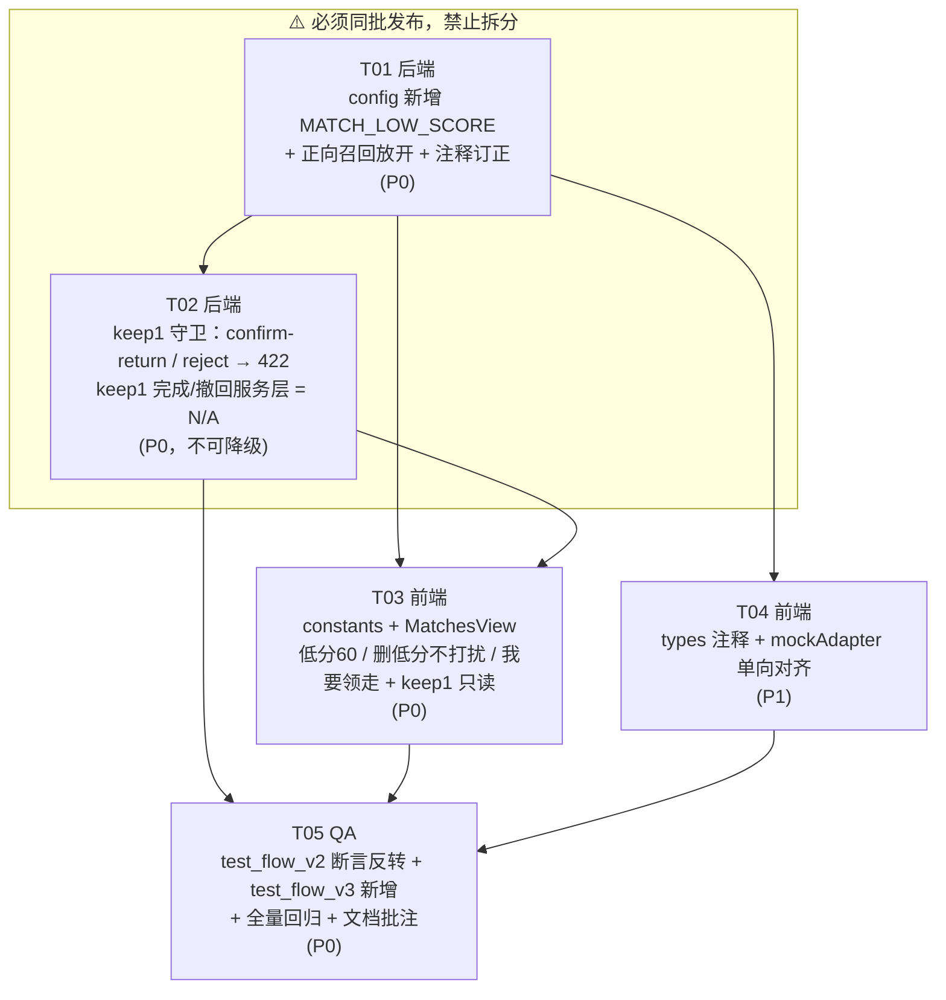

# flow-v3 增量架构设计（keep1 单向回归匹配池 + 低分阈值 60）

| 项 | 内容 |
| --- | --- |
| 文档性质 | **增量设计** —— 仅描述相对 flow-v2 的变更，未提及部分一律保持现状 |
| 基线版本 | flow-v2（已交付） |
| 上游输入 | `docs/prd/v9_flow_v3_incremental_prd.md` + 用户最新拍板澄清（覆盖 PRD 部分条目） |
| 技术栈 | 后端 FastAPI + SQLAlchemy；前端 Vue3 + Element Plus + Vite |
| 关联图 | `v9_flow_v3_class-diagram.mermaid`、`v9_flow_v3_sequence-diagram.mermaid` |
| 新增依赖 | **无**（前后端均零新增第三方包） |

---

## 1. 实现方案概述

### 1.1 本次要解决的三个问题

| 变更 | 一句话描述 |
| --- | --- |
| **A** | keep1（留在原地未挪动）拾物重新进入匹配池，但**单向**：只作为"被匹配对象"出现在**失主**的"我的匹配"，绝不为拾得者自己生成候选。 |
| **B** | 新增独立常量 `MATCH_LOW_SCORE=60`，仅驱动**失主侧**低分弱化视觉；`suspected` 阈值保留 80；**整体删除**"低分不打扰"功能。 |
| **C** | 不提供存量数据回填脚本，老 keep1 数据保持原状。 |

### 1.2 核心设计取舍：为什么是"不对称召回"

flow-v2 把"退出双向认领闭环"误实现为"退出匹配池"，在**召回层双向**剔除了 keep1。本次的修正不是简单地把两处过滤都删掉（PRD P0-1/P0-2 的原主张），而是按用户澄清的责任模型做**不对称放开**：

> keep1 拾得者的角色是"看见 → 拍照 → 发出来帮忙"。物品不在他手上，**东西被谁领走跟他无关、他不承担责任**。因此他不应该收到任何"需要他处理"的候选，也不应该拥有否决失主的权力。

据此确定召回方向的取舍：

| 召回方向 | 方法 | flow-v2 现状 | flow-v3 决策 | 理由 |
| --- | --- | --- | --- | --- |
| **正向**：失物 → 拾物 | `PublishService._recall_lost_candidates`（`publish_service.py:289`） | `.filter(FoundItem.keep_status == KEEPING)` 排除 keep1 | **删除该过滤** | 失主需要被系统告知"原地就有一件很像的东西"，这是变更 A 的全部价值所在 |
| **反向**：拾物 → 失物 | `PublishService._reverse_match_found`（`publish_service.py:359-360`） | `if keep_status == NOT_KEEPING: return []` 早退 | **保留早退（不改）** | keep1 发布者不参与下一步，为他生成候选只会制造无效打扰与误操作面 |

**这两处一改一留，是本次设计的主轴。** 它带来两个自然收益：

1. `_recall_lost_candidates` 被 `_reverse_match_lost`（发布失物）与 `refresh_lost_candidates`（刷新候选）**共同复用**，改一处即两条路径同步生效，无需分别改动。
2. keep1 候选只能经"失主侧动作"创建（发布失物 / 刷新候选 / 拾物广场 manual），天然受 `MATCH_TOP_N=10` 与 `scored[:MATCH_TOP_N - existing]` 约束，**top10 上限不可能被突破**。

### 1.3 对 PRD 的修正说明（按用户拍板覆盖 PRD 原文）

| PRD 条目 | PRD 原主张 | 本设计的最终结论 | 依据 |
| --- | --- | --- | --- |
| P0-1 / A-1 | 删除正向召回 keep1 过滤 | ✅ **执行** | 用户拍板 |
| P0-2 / A-2 | 删除反向匹配 keep1 早退 | ❌ **不执行，保留早退** | 用户拍板：keep1 拾得者不参与下一步 |
| P0-4 / A-4 | `confirm-return` 补 keep1 → 422 守卫 | ✅ **执行，且维持 P0 优先级（不降级）** | 见 §2 论证：team-lead 的降级前提不成立 |
| P0-5 / A-5 | 前端拾得者侧 keep1 只读提示 | ✅ **执行，且维持 P0 优先级（不降级）** | 同上 |
| —（PRD 未覆盖） | — | 🆕 **新增：`reject` 补 keep1 → 422 守卫** | 见 §2.3：本设计新发现的越权缺口，风险高于 confirm-return |
| P0-6 / A-3 | mock 双向放开 keep1 | ⚠️ **改为单向**：只删 `genCandidatesForLost` 的过滤，`publishFound` 的 `isKeep1` 早退保留 | 与后端不对称口径对齐 |
| Q1 | suspected 阈值是否降到 60 | ❌ **保留 80** | 用户拍板 |
| Q2 | 低分不打扰是否跟随 60 | ❌ **整体删除该功能** | 用户拍板："这功能没用" |
| Q5 | 是否回填存量数据 | ❌ **不提供脚本** | 用户拍板；且见 §2.5：失主自助"刷新候选"已天然覆盖 |
| Q6 | keep1 是否差异化通知 | ⭕ **N/A**：核查 `app/services/` 无通知服务，"疑似提醒"即发布响应的 `suspected_matches`，无差异化空间 | 源码核查 |
| B 系列 | 新增 `MATCH_LOW_SCORE=60` | ✅ **执行** | 用户拍板 |

---

## 2. 关键架构发现与风险论证（本节为本设计最重要的部分）

### 2.1 ⚠️ 纠正一个前提错误：反向排除**并不能**让 keep1 候选从拾得者侧消失

任务书中的判断是：

> "因反向排除已保证 keep1 候选不会出现在拾得者'我的匹配'，这两个守卫实际不需要。"

**经源码核查，这个前提不成立。** 证据链如下：

**证据 1 —— 候选是"一条记录、两侧可见"，与它由谁创建无关。**
`app/routers/match.py:130-143` 的 `list_my_matches` 用两路 union 拼装列表：

```python
as_lost  = query(MatchRecord).join(LostItem,  ...).filter(LostItem.publisher_id == user.id)
as_found = query(MatchRecord).join(FoundItem, ...).filter(FoundItem.finder_id  == user.id)
matches  = as_lost.all() + as_found.all()
```

`as_found` 分支**没有任何 `keep_status` 过滤**。只要失主侧生成了一条 `MatchRecord(lost_id, found_id=keep1拾物)`，该记录立刻同时进入 keep1 拾得者的"我的匹配"。反向召回排除只决定"**谁来创建**候选"，完全不决定"**谁能看见**候选"。

**证据 2 —— `_counterpart_hidden` 也拦不住。**
`match.py:67-82` 只在「对端软删」或「进行中状态且对端已解决」时隐藏。新生成的 keep1 候选是 `status=0`、lost/found 均未解决 → **不隐藏**。

**证据 3 —— 前端会为它渲染出可点击的主按钮。**
`MatchesView.vue:306-310` 的 `myRole()` 按 `found_item.finder_id === myId` 判定为 `'found'` → 进入 `:182` 的拾得者分支 → `m.status === 0` → 渲染「确认归还 / 拒绝」。

**证据 4 —— 变更 B 恰好拆掉了唯一的偶然屏障。**
flow-v2 里 `:184-191` 的"低分不打扰"分支，让 `<80` 分的候选在拾得者侧只显示只读文案。这个分支**顺带**挡住了一部分候选。本次变更 B 要求删除它 → 删除后 **100% 的 keep1 候选都会在拾得者侧长出两个可点击按钮**。

> **结论：变更 A 与变更 B 叠加，会打开一个 flow-v2 下不存在的越权面。A-4 / A-5 不是"可选防御"，而是变更 A 的必要组成部分，必须与召回放开在同一次发布中上线。**

### 2.2 keep1 候选在拾得者侧：可见还是不可见？

有两个可选方案：

| 方案 | 做法 | 评估 |
| --- | --- | --- |
| **方案 1（推荐）**：可见 + 只读 + 后端守卫 | 候选保留在拾得者列表，前端渲染只读提示，后端补 422 守卫 | ✅ 满足 PRD US-4（"我知道自己的善意有没有被接住"）；✅ 已完成/已撤回记录在拾得者侧语义连续；成本：前端 1 个分支 + 后端 2 个守卫 |
| 方案 2：在 `list_my_matches` 的 `as_found` 分支直接过滤掉 keep1 | 后端列表层剔除 | ❌ 拾得者连"已被领走"的完成记录也会消失，与"已完成"tab 语义割裂；❌ 破坏 `/matches` 作为通用列表接口的正交性；✅ 前端零改动 |

**建议采用方案 1。** 它以最小成本同时满足"拾得者可感知进展"与"拾得者无操作权"，且守卫本身是防御纵深（即使前端被绕过，接口层仍拦得住），符合既有 `claim` 的 422 守卫（`match.py:219-220`）风格，口径统一。

### 2.3 🆕 新发现：`reject` 的越权风险高于 `confirm-return`

PRD 只提到 `confirm-return`，但 `reject_match`（`match.py:331-364`）的风险更严重：

```python
if int(m.status) not in (PENDING_CLAIM, CLAIMING):
    raise MatchProcessedError(...)
m.status = int(MatchStatus.REJECTED)   # ← 直接终结失主的候选
```

- `confirm-return` 只写一条审计（`match.py:257-266` 明确"保持认领中；记录审计"），**不改 match.status**，属于语义污染；
- `reject` 会把 `status` 直接打成 `3 REJECTED`，**一个"东西被谁领走跟我无关"的拾得者，可以单方面毙掉失主的认领机会**。这与用户拍板的责任模型直接冲突。

更糟的是它会形成**骚扰循环**：`_exists_match`（`publish_service.py:420-441`）排除终态 `{2,3,6}` → 被 reject 掉的 `(lost, found)` 对在失主下次"刷新候选"时**会被重新召回并再次生成候选** → 拾得者可以再 reject 一次，无限循环。

> **决定：`reject` 必须与 `confirm-return` 同批补 422 守卫。**

### 2.4 已核查确认**不需要**改动的路径

| 路径 | 结论 | 依据 |
| --- | --- | --- |
| `handover/generate` | **无需守卫**，路径不可达 | `handover_service.py:75-76` 要求 `match.status == CLAIMING(1)`；keep1 候选被 `claim` 的 422（`match.py:219-220`）挡在 `status=0`，永远进不了 CLAIMING |
| `complete_keep1_claim` / `revoke_keep1_claim` / `_apply_keep1_completion` | **零改动（N/A）** | 三者只校验 `found.keep_status==1`、`match.status==PENDING_CLAIM(0)`、`found.status==PENDING(0)`，与候选"由谁生成"无关。变更 A 后候选来源从"存量/manual"扩展为"自动召回"，全部校验条件天然满足 |
| `_exists_match` | **零改动** | 终态 `{2,3,6}` 排除逻辑是"撤回后可再申请"的基础，不动 |
| `create_manual_match` 的 keep1 分流（`match.py:423`） | **零改动** | 拾物广场入口仍走 manual → 一步完成；与新增的"我的匹配 → 我要领走 → claim-complete"入口并存，两者最终都汇入 `_apply_keep1_completion`，落库结果完全一致 |
| R1 已交接栏（只展示拾物 + 去重） | **零改动** | 该栏走 `items` 的 `resolved_only` 接口，不依赖 MatchRecord |
| `MATCH_TOP_N` / 五维公式 / 权重 | **零改动** | 明确排除项 |
| 信誉分 | **零改动** | 仅 keep0 发布 +1（`publish_service.py:249-259`），keep1 不加分，本次不引入变化 |

### 2.5 变更 C（不回填）的成本实际为 0

`refresh_lost_candidates`（`publish_service.py:387-418`）复用了 `_recall_lost_candidates`。正向过滤一删除，**失主在"我的匹配"点一次「刷新候选」，所有存量 keep1 拾物（`status=PENDING` 且 `deleted_at IS NULL`）就会被自助召回补入**，且严格受 `MATCH_TOP_N - existing` 约束。

> 因此"不写回填脚本"不等于"老数据失联"——它只是把批量回填改成了**用户自助、按需、增量**的方式，风险更低、无需运维介入。此结论建议同步给产品经理更新 PRD Q5 的影响描述。

### 2.6 变更 B 的两个实现陷阱

| # | 陷阱 | 后果 | 规避 |
| --- | --- | --- | --- |
| B-陷阱1 | `MatchesView.vue:254` 的 `import { ..., MATCH_THRESHOLD, ... }`，在 `isLowScore` 切换到 `MATCH_LOW_SCORE` 后，`MATCH_THRESHOLD` 在该文件内**再无引用** | TS `noUnusedLocals` / ESLint 报错，**`npm run build` 直接失败** | 改 `isLowScore` 的同时，从 import 语句中移除 `MATCH_THRESHOLD`、加入 `MATCH_LOW_SCORE` |
| B-陷阱2 | `MatchesView.vue:374-378` 的 `scoreColor()` 内有硬编码 `>= 90` / `>= 80` | 工程师按 AC-B5"全仓无残留硬编码 80"机械替换，会误改进度环配色 | **明确豁免**：`scoreColor` 的 80/90 是进度环三档配色，与低分判定无关，**禁止改动**。AC-B5 的检索范围仅限"低分判定与低分文案" |

### 2.7 已知遗留风险（本轮不修，仅登记 + 要求 QA 覆盖）

| # | 风险 | 说明 | 处置 |
| --- | --- | --- | --- |
| R-1 | **keep1 一步完成会"越过"同一失物下进行中的 keep0 匹配** | `complete_keep1_claim` 不校验 `lost.status`，直接置 `RESOLVED`。若该失物另有一条 keep0 `CLAIMING(1)` 记录，它会因 `_counterpart_hidden` 对双方同时隐藏，成为悬挂记录 | **flow-v2 既有行为**（manual 路径同样可触发），非本次引入。但变更 A 使该路径"从边缘变常规"，**要求 QA 覆盖为观察用例**，本轮不改以免扩大范围 |
| R-2 | `MatchesView.vue:172-180` 的「未能找回」按钮插在 `<template v-if="lost">` 与 `<template v-else-if="found">` 之间，`v-else-if` 实际挂在该按钮的 `v-if` 上 | 当前靠"两个条件互斥"侥幸正确，是脆弱结构 | 本次要在这一带插入 keep1 分支，**T03 必须先确认改动不破坏该链条**；建议顺手把「未能找回」按钮移入 lost 的 `<template>` 内部（P1，低风险重构） |
| R-3 | keep1 候选占用失主 top10 名额 | Q4 决策：占用，与 keep0 等价 | 维持默认，QA 验证不出现第 11 条即可 |

---

## 3. 文件列表（相对项目根）

### 3.1 后端

| 文件 | 类型 | 改动摘要 |
| --- | --- | --- |
| `app/core/config.py` | 修改 | `:89` 附近新增 `MATCH_LOW_SCORE: float = 60.0`；`MATCH_THRESHOLD = 80.0` 保留并补注释 |
| `app/services/publish_service.py` | 修改 | `:289` 删除 keep1 过滤；`:279-283`、`:352-357`、`:11-16` 三处注释/docstring 改为 flow-v3 不对称口径；`:359-360` 早退**保留** |
| `app/routers/match.py` | 修改 | `confirm_return`（`:242-269`）与 `reject_match`（`:331-364`）各新增 keep1 → 422 守卫 |

### 3.2 前端

| 文件 | 类型 | 改动摘要 |
| --- | --- | --- |
| `web/src/api/constants.ts` | 修改 | `:92-94` 新增 `MATCH_LOW_SCORE = 60`；修正 `MATCH_THRESHOLD` 注释 |
| `web/src/views/MatchesView.vue` | 修改 | 5 处：import 换常量、`isLowScore` 切 60、弹窗文案插值、删除低分不打扰分支、新增 keep1 分流（失主侧文案 / 拾得者侧只读） |
| `web/src/types/index.ts` | 修改 | `:124` 注释更新为 60 口径 + suspected 解耦说明 |
| `web/src/api/mockAdapter.ts` | 修改 | `:222` 删除 `f.keep_status === 0` 过滤；`:392-395` 的 `isKeep1` 早退**保留**；`:196` suspected 不变；建议补 `confirm-return`/`reject` 的 keep1 拦截以对齐后端 |

### 3.3 测试与文档

| 文件 | 类型 | 改动摘要 |
| --- | --- | --- |
| `tests/test_flow_v2.py` | 修改 | `:4` docstring、`:84-103` 两条 R2-a 用例断言**反转**（详见 T05） |
| `tests/test_match.py` | 修改 | `:56` 附近补 `assert settings.MATCH_LOW_SCORE == 60.0` |
| `tests/test_flow_v3.py` | **新增** | flow-v3 专属增量用例（keep1 单向性、我要领走、守卫 422、top10） |
| `tests/test_mymatch_top10.py` | 修改 | `:17-18` 过时注释订正 |
| `tests/test_v3_incremental.py` | 修改 | `:26` 过时注释订正 |
| `docs/architecture/v9_flow_v3_incremental_design.md` | **新增** | 本文档 |
| `docs/architecture/v9_flow_v3_class-diagram.mermaid` | **新增** | 增量类图 |
| `docs/architecture/v9_flow_v3_sequence-diagram.mermaid` | **新增** | 增量时序图 |
| `docs/prd/2026-08-05-flow-v2.md`、`docs/architecture/2026-08-05-flow-v2-design.md` | 修改 | R2-a 段落追加"已由 flow-v3 修订为单向"批注（P1，可追溯性） |

> **无新增文件的模块**：`app/services/match_service.py`（打分逻辑与 `suspected` 判定完全不动）、`app/schemas/`（无契约字段增减）、数据库迁移（**无 schema 变更，不需要 alembic 版本**）。

---

## 4. 数据结构与接口影响

### 4.1 数据库 Schema

**零变更。** 无新增表、无新增列、无索引调整、无 alembic 迁移。`MatchRecord.flow_type`、`FoundItem.keep_status` 均为 flow-v2 已有字段。

### 4.2 配置项

| 常量 | 值 | 位置 | 使用方 | 语义 |
| --- | --- | --- | --- | --- |
| `MATCH_THRESHOLD` | 80.0（不变） | `config.py` + `constants.ts` | **后端**：`match_service` 的 `suspected` 判定、解释体 `threshold`；**mock**：`suspected` 计算 | 疑似匹配 |
| `MATCH_LOW_SCORE` | **60.0（新增）** | `config.py` + `constants.ts` | **仅前端失主侧**：弱化标签、`match-card--low` 样式、低分二次确认文案 | 低分视觉 |
| `MATCH_TOP_N` | 10（不变） | `config.py` + `constants.ts` | 候选上限 | — |

> `MATCH_LOW_SCORE` 加入后端 `config.py` 的**唯一目的**是保持前后端常量单一事实源与可测性（`test_match.py` 断言），**后端业务代码不得引用它**。若未来后端出现 `settings.MATCH_LOW_SCORE` 的引用，即为设计违规。

### 4.3 API 契约变化

| 接口 | 变化 | 说明 |
| --- | --- | --- |
| `POST /lost-items` | **行为变化，契约不变** | `suspected_matches` 现在可能包含 keep1 拾物候选 |
| `POST /lost-items/{id}/refresh-matches` | **行为变化，契约不变** | 可补入 keep1 候选（含存量） |
| `POST /found-items` | **无变化** | keep1 发布仍返回 `suspected_matches: []` |
| `POST /matches/{id}/confirm-return` | **新增 422 分支** | `found.keep_status==1` → `ParamError`，code=9001 |
| `POST /matches/{id}/reject` | **新增 422 分支** | `found.keep_status==1` → `ParamError`，code=9001 |
| `POST /matches/{id}/claim` | **无变化** | 既有 422 守卫保持 |
| `POST /matches/{id}/claim-complete` | **无变化** | 服务层零改动，仅调用来源扩展 |
| `POST /matches/{id}/revoke` | **无变化** | 服务层零改动 |
| `POST /matches/manual` | **无变化** | keep1 一步完成分流保持 |
| `GET /matches` | **无变化** | 仍返回双侧候选；keep1 单向性由**前端只读 + 后端写守卫**共同保证，**不在列表层过滤**（见 §2.2 方案取舍） |

### 4.4 前端交互文案（最终口径）

| 场景 | 文案 |
| --- | --- |
| 失主侧 · keep0 候选按钮 | 「申请匹配」（不变） |
| 失主侧 · **keep1 候选按钮** | **「我要领走」**（新） |
| 失主侧 · keep1 二次确认 | 标题「确认领走」；正文「该拾物留在原地未挪动，确认后将立即标记为已完成交接（可随时撤回）。」 |
| 失主侧 · `<60` 低分标签 | 「低匹配度·谨慎申请」（阈值 80 → 60） |
| 失主侧 · `<60` 二次确认 | 「该候选匹配度较低（<${MATCH_LOW_SCORE}），请确认对方物品与你的失物一致后谨慎申请。」（常量插值，杜绝硬编码漂移） |
| 拾得者侧 · **keep1 候选** | **「留在原地·等待失主自取」**（只读，无任何按钮） |
| 拾得者侧 · keep0 候选（任意分数） | 「确认归还 / 拒绝」（**删除低分不打扰后，60-79 与 <60 一律显示**） |
| 后端 422 · confirm-return | 「该物品留在原地未挪动，无需你确认归还，请等待失主申请后自行取回」 |
| 后端 422 · reject | 「该物品留在原地未挪动，是否被领走由失主决定，你无需处理」 |

### 4.5 分数区间行为矩阵（改动后最终态）

| 分数 | `suspected` | 失主侧弱化 | 失主侧申请路径（keep0） | 失主侧申请路径（keep1） | 拾得者侧（keep0） | 拾得者侧（keep1） |
| --- | --- | --- | --- | --- | --- | --- |
| ≥ 80 | true | 无 | 「申请匹配」→ 直接弹认领理由 | 「我要领走」→ keep1 确认 → 一步完成 | 确认归还 / 拒绝 | 只读 |
| 60-79 | false | **无**（本次变更点） | 「申请匹配」→ 直接弹认领理由 | 同上 | **确认归还 / 拒绝**（本次变更点） | 只读 |
| < 60 | false | 有（标签 + 虚线卡片） | 「申请匹配」→ 低分二次确认 → 认领理由 | 同上（keep1 分支早退，**不叠加**低分弹窗；弱化视觉仍生效） | **确认归还 / 拒绝**（本次变更点） | 只读 |

### 4.6 类图

见 `v9_flow_v3_class-diagram.mermaid`。要点：`Settings` 新增 `MATCH_LOW_SCORE`；`PublishService` 的正向召回放开、反向早退保留、keep1 完成/撤回三方法零改动；`MatchRouter` 新增两处守卫；前端 `MatchesView` 新增 `isKeep1Candidate` / `applyButtonText` 两个派生函数。

### 4.7 时序图

见 `v9_flow_v3_sequence-diagram.mermaid`，覆盖 6 条流程：keep1 发布（反向不放开）、失主发布（正向放开）、失主侧渲染（低分 60 口径）、我要领走一步完成、**keep1 单向性守卫（含拾得者侧只读与 422 防御纵深）**、撤回与老数据自助回填。

---

## 5. 依赖包列表

**无新增依赖。** 后端不引入任何 pip 包，前端不引入任何 npm 包。本次全部改动为常量、条件分支、模板渲染与注释，不触及任何库边界。

| 层 | 变化 |
| --- | --- |
| Python (`requirements.txt`) | 无 |
| Node (`web/package.json`) | 无 |
| 数据库迁移 (`alembic/`) | 无 |

---

## 6. 任务列表（按实现顺序，含依赖）

> **上线约束（重要）**：T01 与 T02 **必须同批发布**。若只上 T01（召回放开）而不上 T02（守卫），线上将立即出现"keep1 拾得者可拒绝失主认领"的越权缺口（见 §2.3）。禁止拆分发布。

### T01 · 后端：新增低分常量 + 正向召回放开 + 注释订正

- **优先级**：P0
- **依赖**：无
- **源文件**：
  - `app/core/config.py`
  - `app/services/publish_service.py`
- **内容**：
  1. `config.py:89` 之后新增 `MATCH_LOW_SCORE: float = 60.0`，注释标明"低分**视觉**阈值，仅供前端弱化展示对齐口径，后端业务代码不得引用；与 suspected 判定完全解耦"；`MATCH_THRESHOLD = 80.0` 保留，注释补"仅用于 suspected 判定与解释体 threshold"。
  2. `publish_service.py:289` **删除** `.filter(FoundItem.keep_status == int(KeepStatus.KEEPING))` 一行。注意保留其上方 `deleted_at.is_(None)` 软删过滤（v7 Q8），不得误删。
  3. `publish_service.py:359-360` 的 `_reverse_match_found` keep1 早退 **保持原样不动**。
  4. 注释订正三处：`:279-283`（`_recall_lost_candidates` docstring）、`:352-357`（`_reverse_match_found` docstring）、`:11-16`（模块头 flow-v2 R2 描述）。统一改为 flow-v3 不对称口径表述："keep1 单向进入匹配池——正向（失主→拾物）参与召回，反向（拾物→失物）不生成候选。"
  5. **不得改动**：`_exists_match`、`refresh_lost_candidates` 主体、`complete_keep1_claim`、`revoke_keep1_claim`、`_apply_keep1_completion`、`MATCH_TOP_N`、五维权重。
- **验收**：`KeepStatus` 若在 `publish_service.py` 中因删行变为未使用需保留（`_reverse_match_found` 与 `complete_keep1_claim` 仍在用，不会未使用）；`python -c "from app.core.config import settings; print(settings.MATCH_LOW_SCORE)"` 输出 60.0。

### T02 · 后端：keep1 单向性守卫（confirm-return + reject 返回 422）

- **优先级**：P0（**不可降级，见 §2.1 / §2.3 论证**）
- **依赖**：T01
- **源文件**：`app/routers/match.py`
- **内容**：
  1. `confirm_return`（`:242-269`）在 `found` 取出后、状态校验附近新增：
     `if int(found.keep_status) == int(KeepStatus.NOT_KEEPING): raise ParamError("该物品留在原地未挪动，无需你确认归还，请等待失主申请后自行取回")`
  2. `reject_match`（`:331-364`）同位置新增：
     `if int(found.keep_status) == int(KeepStatus.NOT_KEEPING): raise ParamError("该物品留在原地未挪动，是否被领走由失主决定，你无需处理")`
  3. 两处守卫的写法与错误码需与既有 `claim` 守卫（`:219-220`）**完全对称**（同用 `ParamError` → 422 / code 9001）。
  4. **核查结论（无需改动，标 N/A）**：`complete_keep1_claim` / `revoke_keep1_claim` / `_apply_keep1_completion` 三个服务层方法经逐条校验分析，对"自动生成的 keep1 候选"完全适用，**本轮零改动**；`handover/generate` 因 `status==CLAIMING` 前置校验而路径不可达，**不加守卫**；`GET /matches` **不做列表层过滤**（保留拾得者可见性，见 §2.2）。
- **验收**：keep1 候选上，失主 `claim`→422、拾得者 `confirm-return`→422、拾得者 `reject`→422、失主 `claim-complete`→200。

### T03 · 前端：常量 + MatchesView 三改（低分 60 / 删低分不打扰 / 我要领走 + keep1 只读）

- **优先级**：P0
- **依赖**：T01（常量口径），T02（422 契约）
- **源文件**：
  - `web/src/api/constants.ts`
  - `web/src/views/MatchesView.vue`
- **内容**：
  1. `constants.ts:92-94`：新增 `export const MATCH_LOW_SCORE = 60`（注释："低分**视觉**阈值，对齐后端 settings.MATCH_LOW_SCORE，仅失主侧弱化展示使用"）；修正 `MATCH_THRESHOLD` 注释，**删除**"前端低分判定口径：match_score < 80 为低分"这句误导描述。
  2. `MatchesView.vue:254`：import 中移除 `MATCH_THRESHOLD`、加入 `MATCH_LOW_SCORE`（**见 §2.6 陷阱1，漏改会导致 build 失败**）。
  3. `:292-295`：`isLowScore(m) => m.match_score < MATCH_LOW_SCORE`；注释同步改为"仅驱动失主侧弱化视觉，与后端 suspected(80) 解耦"。
  4. `:447`：文案改为模板插值 `` `该候选匹配度较低（<${MATCH_LOW_SCORE}），请确认对方物品与你的失物一致后谨慎申请。` ``。
  5. `:52` 模板注释中的"match_score<80"同步改 60。
  6. **删除低分不打扰**：`:183-192` 拾得者侧 `m.status === 0` 分支内的 `<template v-if="isLowScore(m)">…疑似候选（等待失主申请）…</template>` / `<template v-else>` 分流整体删除，改为直接渲染「确认归还 / 拒绝」。
  7. **新增 keep1 分流**（两侧）：
     - 新增派生 `function isKeep1Candidate(m) { return m.found_item?.keep_status === 1 }`。
     - **失主侧** `:132-139`：按钮文案改为 `{{ isKeep1Candidate(m) ? '我要领走' : '申请匹配' }}`；`onApplyMatch` 内部逻辑（`:421` 的 keep1 早退分支）**无需改动**，仅建议把 `:423-430` 的弹窗标题从「申请即完成」改为「确认领走」、正文对齐 §4.4。
     - **拾得者侧**：在第 6 步删除后的 `m.status === 0` 分支内，新增最高优先级判定 `v-if="isKeep1Candidate(m)"` → 渲染只读 `<span class="lf-muted">留在原地·等待失主自取</span>`；`v-else` 才渲染「确认归还 / 拒绝」。
  8. **不得改动**：`scoreColor()` 内的 80/90（§2.6 陷阱2）、`.match-card--low` 样式定义本身（`:624-628`，仅触发条件变了）、`canRevoke`、`onRevoke`、五维明细渲染。
  9. **注意 §2.7 R-2**：改动区域紧邻「未能找回」按钮打断的 `v-if / v-else-if` 链，改完必须实机验证四种组合（失主×keep0/keep1、拾得者×keep0/keep1）渲染正确。
- **验收**：`npm run build` 通过；四种角色×keep 组合渲染符合 §4.5 矩阵。

### T04 · 前端：类型注释 + Mock 适配器单向对齐

- **优先级**：P1
- **依赖**：T01（后端口径确定）
- **源文件**：
  - `web/src/types/index.ts`
  - `web/src/api/mockAdapter.ts`
- **内容**：
  1. `types/index.ts:124` 注释改为："达到疑似阈值（`score >= 80`，语义不变）；低分**弱化展示**由前端用 `match_score < 60`（`MATCH_LOW_SCORE`）派生，与 `suspected` 完全解耦"。
  2. `mockAdapter.ts:222`：删除 `f.keep_status === 0 && // R2-a：排除 keep1` 一行，并更新 `:212-213` 的函数 docstring 为 flow-v3 口径。
  3. `mockAdapter.ts:392-395`：`isKeep1 ? [] : genCandidatesForFound(...)` **保留**，注释改为"flow-v3：keep1 单向——不为拾得者反向生成候选（与后端 `_reverse_match_found` 同口径）"。
  4. `mockAdapter.ts:196` 的 `suspected: score >= MATCH_THRESHOLD` **不变**。
  5. 建议（P1）：在 mock 的 `confirm-return` / `reject` 分支补 keep1 拦截，与后端 T02 对齐，避免 mock 演示口径漂移。
- **验收**：mock 模式下发布失物能看到 keep1 候选；发布 keep1 拾物候选为空；`npm run build` 通过。

### T05 · QA：测试反转/新增 + 全量回归 + 文档批注

- **优先级**：P0
- **依赖**：T01、T02、T03、T04
- **源文件**：
  - `tests/test_flow_v2.py`、`tests/test_match.py`、`tests/test_flow_v3.py`（新增）
  - `tests/test_mymatch_top10.py`、`tests/test_v3_incremental.py`（仅注释）
  - `docs/prd/2026-08-05-flow-v2.md`、`docs/architecture/2026-08-05-flow-v2-design.md`（仅批注）
- **内容**：

  **(1) `tests/test_flow_v2.py` 断言反转（3 处）**

  | 位置 | 原断言 | flow-v3 期望 |
  | --- | --- | --- |
  | `:4` 模块 docstring | "keep1 退出自动双向匹配：发布 keep1 拾物无候选；失物发布召回排除 keep1" | 改为"keep1 **单向**进匹配池：发布 keep1 拾物仍无候选（反向不放开）；**失物发布召回包含 keep1**（正向放开，flow-v3 修订）" |
  | `:85-91` `test_keep1_found_publish_has_no_candidates` | `suspected_matches == []` | **保持不变**（反向早退保留，此用例是 flow-v3 的正向资产，建议重命名为 `test_keep1_found_publish_still_has_no_candidates` 并在 docstring 注明"flow-v3 有意保留"） |
  | `:94-103` `test_lost_publish_excludes_keep1_candidates` | `keep1_id not in found_ids` | **反转**：改名 `test_lost_publish_includes_keep1_candidates`，断言 `keep0_id in found_ids and keep1_id in found_ids`，docstring 改为"失物发布召回**包含** keep1 拾物" |
  | `:66-71` `_insert_legacy_candidate` helper | 注释"模拟 flow-v2 前存量 keep1 候选" | 注释更新："flow-v3 起该候选亦可由正向召回自动生成，本 helper 仅用于精确控制分数" |

  **(2) `tests/test_flow_v3.py`（新增）必须覆盖的用例**

  | 编号 | 用例 | 断言要点 |
  | --- | --- | --- |
  | F3-1 | keep1 候选自动生成（正向） | 先发 keep1 拾物 → 再发同品类失物 → `suspected_matches` 含该 found_id，`status=0`，`lost.status=MATCHING` |
  | F3-2 | keep1 反向仍不生成（单向性核心） | 先发失物 → 再发 keep1 拾物 → `suspected_matches == []` **且**查库确认该 (lost, found) 无 MatchRecord |
  | F3-3 | 「我要领走」端到端 | F3-1 的自动候选直接 `claim-complete` → `status=2`、`flow_type=1`、`completed_at` 非空、lost=3/found=1、审计含 `keep1_claim_complete`、**全程无 HandoverCode 生成** |
  | F3-4 | 撤回后可再申请（自动候选版） | F3-3 后 `revoke` → `status=6`、审计含 `keep1_claim_revoke`；再 `refresh-matches` → 同对再次生成 `status=0` 候选 → 再 `claim-complete` 成功 |
  | F3-5 | **守卫：拾得者 confirm-return → 422** | 对 F3-1 自动候选，用 finder token 调用 → 422 / code 9001 |
  | F3-6 | **守卫：拾得者 reject → 422** | 同上；并断言 `match.status` 仍为 0（未被打成 3） |
  | F3-7 | 守卫：失主 claim → 422（不回归） | 既有 AC-A6 |
  | F3-8 | **keep1 候选在拾得者 `/matches` 中可见** | finder 调 `GET /matches` 能看到该候选（验证 §2.2 方案 1 的可见性设计，防止后续误加列表过滤） |
  | F3-9 | top10 不破 | 造 12 件 keep1 拾物 + 1 件失物 → 候选恰好 10 条；再 `refresh-matches` → `created=0` |
  | F3-10 | 存量自助回填 | 先发 keep1 拾物、再发失物（模拟同批），`refresh-matches` 能补入未在候选中的 keep1 |
  | F3-11 | 常量断言 | `settings.MATCH_LOW_SCORE == 60.0` **且** `settings.MATCH_THRESHOLD == 80.0`（可放 `test_match.py:56` 就近） |
  | F3-12 | 五维明细完整 | keep1 候选的 `score_detail` 含 photo/category/text/location/time，`total` 正确 |
  | F3-13 | 软删不回归 | 软删的 keep1 拾物不进候选（`deleted_at` 过滤未被误删） |
  | F3-14 | **观察用例（§2.7 R-1）** | 同一失物同时存在 keep0 CLAIMING 与 keep1 候选，对 keep1 `claim-complete` 后，记录当前实际行为并在 QA 报告中标注，**不作为失败判定** |

  **(3) 注释订正**：`tests/test_mymatch_top10.py:17-18`、`tests/test_v3_incremental.py:26` 中"keep1 退出自动匹配池"的表述改为"flow-v3 起 keep1 单向进池；本文件走认领闭环语义故统一 keep0"。

  **(4) 前端回归清单（人工 + build）**：`npm run build` 通过；真实模式与 mock 模式分别走查 §4.5 行为矩阵全部 6 格。

  **(5) 文档批注**：在 flow-v2 PRD 与设计文档的 R2-a 段落追加"⚠️ 已由 flow-v3（`v9_flow_v3_incremental_design.md`）修订为**单向**口径"。

- **验收**：`pytest tests/ -q` 全绿（含既有全部用例）；`npm run build` 通过；QA 报告覆盖 §10 全部 12 条回归点。

### 6.1 任务依赖图



---

## 7. 共享知识（跨文件约定，工程师必读）

1. **keep1 是"单向"的，不是"双向"的。** 这是本次最容易改错的地方。正向召回（`_recall_lost_candidates`，失物找拾物）**放开**；反向召回（`_reverse_match_found`，拾物找失物）**保留排除**。任何一处改反，都会违背用户模型。mock 适配器同样遵守这条不对称约定。

2. **`MATCH_LOW_SCORE` 只属于失主侧视觉层。** 它不参与候选生成、不参与打分、不参与排序、不参与 `suspected` 判定、不参与任何后端分支。后端 `config.py` 里定义它，只是为了单一事实源与可测性。拾得者侧**不存在**任何低分判定（"低分不打扰"已整体删除）。

3. **`MATCH_THRESHOLD = 80` 仍然有效且不变。** 它是 `suspected` 的唯一口径。前端 `MatchesView.vue` 不再引用它，但 `mockAdapter.ts` 仍要引用（计算 `suspected`），`constants.ts` 必须保留导出。

4. **"低分弱化"与"keep1"是两个正交维度。** 一个 55 分的 keep1 候选，在失主侧既显示弱化标签/虚线卡片（因为 <60），按钮又是「我要领走」（因为 keep1）。但点击时**只弹 keep1 确认弹窗，不叠加低分弹窗**——`onApplyMatch` 的 keep1 分支早退保证了这一点，不要改动这个顺序。

5. **候选记录是双侧共享的单条记录。** `MatchRecord` 一旦生成，失主与拾得者都能在 `/matches` 看到。"谁能操作"由**前端渲染分支 + 后端 422 守卫**两层保证，**不由列表过滤保证**。请勿在 `list_my_matches` 中添加 `keep_status` 过滤（会让拾得者看不到已完成/已撤回记录）。

6. **守卫写法统一。** 所有 keep1 分流守卫一律用 `ParamError`（→ HTTP 422 / code 9001），文案指向"由失主自取完成"，与 `claim` 的既有守卫（`match.py:219-220`）保持完全对称。

7. **文案数字必须走常量插值。** 二次确认文案中的 60 用 `${MATCH_LOW_SCORE}` 插值，不得硬编码，避免下次调阈值时文案漂移。

8. **`scoreColor()` 中的 80/90 是配色阈值，不是低分阈值。** 全仓检索"80"时必须跳过它。

9. **本次无数据库变更。** 不要创建 alembic 迁移文件。

10. **`refresh-matches` 就是回填工具。** 不写脚本；如需为存量 keep1 提效，引导失主点「刷新候选」即可。

---

## 8. 待明确事项

| # | 事项 | 我的建议 | 状态 |
| --- | --- | --- | --- |
| **U1** | **keep1 守卫是否做？** | ✅ **必须做，且从 confirm-return 扩展到 reject。** 理由见 §2.1–§2.3：team-lead"反向排除已保证候选不出现在拾得者侧"的前提经源码核查不成立（`list_my_matches` 的 `as_found` 分支无 keep_status 过滤）；变更 B 删除低分不打扰后，100% 的 keep1 候选会在拾得者侧长出可点击按钮；其中 `reject` 可让"不负责任"的 keep1 拾得者单方面毙掉失主认领，并形成刷新—再拒的骚扰循环。**这不是可选防御，是变更 A 的必要组成。** | ⏳ 待 team-lead 确认（**若否决，请明确接受 §2.3 的越权风险**） |
| **U2** | keep1 候选在拾得者"我的匹配"中是否保留可见（只读）？ | ✅ **保留可见（方案 1）**。满足 PRD US-4"我想知道善意有没有被接住"，且完成/撤回记录语义连续。备选方案 2（列表层过滤）会让拾得者失去全部感知，不推荐。 | ⏳ 待确认（影响 T03 是否需要只读分支） |
| **U3** | keep1 候选卡片是否加「留在原地」徽标？ | ⭕ **本轮不加**（PRD P2-1）。但按钮文案「我要领走」已能传达差异，优先级可降。若后续失主反馈困惑，再补。 | 建议延后 |
| **U4** | §2.7 R-1（keep1 完成越过同失物进行中的 keep0 匹配） | ⭕ **本轮不修**，仅作为 QA 观察用例（F3-14）记录实际行为。变更 A 让该路径从边缘变常规，若 QA 发现体感问题，单独立项。 | 建议延后 |
| **U5** | §2.7 R-2（`v-if/v-else-if` 链被「未能找回」按钮打断） | ⭕ **建议 T03 顺手重构**（把该按钮移入 lost 的 `<template>` 内），成本 <5 行，能消除后续所有分支改动的隐性风险。若求稳可只做验证不重构。 | 由工程师视改动风险决定 |
| **U6** | `MATCH_LOW_SCORE` 是否提升为运行时可配 | ⭕ 本轮不做（PRD P2-2）。当前前后端各写一份常量，已有漂移风险但可接受。 | 建议延后 |

---

## 9. 关联回归点清单（必须逐条验证）

| # | 回归点 | 验证方式 | 关联用例 |
| --- | --- | --- | --- |
| 1 | **已交接栏只展示拾物 + 去重**（flow-v2 R1） | keep1 自动候选完成后，BoardView 已交接栏仍只出现拾物、无重复 | `test_flow_v2.py:392` + 人工 |
| 2 | **撤回后可再申请** | `_exists_match` 排除 `{2,3,6}`；撤回 → 刷新候选 → 再次生成 → 再次「我要领走」成功 | F3-4 |
| 3 | **top10 上限不破** | 12 件 keep1 + 1 件失物 → 恰好 10 条；`refresh` 返回 `created=0` | F3-9 |
| 4 | **keep0 双向闭环零回归** | claim → confirm-return → handover generate/verify 全链路正常，keep0 候选生成不受影响 | `test_flow_v2.py:106/174/231`、`test_handover_audit.py` |
| 5 | **`claim` 对 keep1 的 422 不被放开破坏** | keep1 自动候选走 `claim` 仍 422 | F3-7 / `test_flow_v2.py:116` |
| 6 | **manual 对 keep1 的一步完成分流仍生效** | 拾物广场 manual keep1 → `status=2 + flow_type=1`，不生成 `status=4` | `test_flow_v2.py:157` |
| 7 | **manual 对 keep0 仍生成 `status=4`** | 不回归 | `test_flow_v2.py:174` |
| 8 | **软删物品退出候选池**（v7 Q8） | 删 `keep_status` 过滤时未误删 `deleted_at.is_(None)` | F3-13 / `test_v7_soft_delete.py` |
| 9 | **信誉分与审计完整** | keep1 完成/撤回的 `TrustScoreLog` 与 `keep1_claim_complete` / `keep1_claim_revoke` 审计齐全；keep1 发布仍不加分 | F3-3 / F3-4 |
| 10 | **五维明细展示** | keep1 候选卡片正确展示 photo/category/text/location/time 与总分 | F3-12 + 人工 |
| 11 | **`suspected` 语义未漂移** | 85 分 → `suspected=true`；70 分 → `suspected=false`；解释体 `threshold` 仍回传 80 | `test_match.py:56` + F3-11 |
| 12 | **分数矩阵 6 格全对**（§4.5） | 85/70/45 三档 × 失主/拾得者两侧，弱化标签、卡片样式、二次确认、按钮文案全部符合矩阵 | 人工走查（真实模式 + mock 模式各一遍） |
| 13 | **`npm run build` 通过** | 特别验证 `MATCH_THRESHOLD` 未使用 import 已清理（§2.6 陷阱1） | CI |
| 14 | **`GET /matches` 拾得者侧仍能看到 keep1 候选** | 防止后续误加列表过滤（§2.2 设计意图守护） | F3-8 |

---

## 10. 变更影响面小结

| 维度 | 规模 |
| --- | --- |
| 后端改动文件 | 3 个（config / publish_service / match.py） |
| 后端净增代码 | 约 6 行（1 常量 + 2 守卫 × ~2 行），净删 1 行 |
| 前端改动文件 | 4 个（constants / MatchesView / types / mockAdapter） |
| 前端净改动 | 约 25 行（含删除低分不打扰分支 ~8 行） |
| 数据库迁移 | 0 |
| 新增依赖 | 0 |
| 测试改动 | 2 文件反转 + 1 文件新增（14 用例）+ 2 文件注释 |
| 最大风险 | **T01 与 T02 拆开发布** → keep1 越权（见 §2.3、§6 上线约束） |
