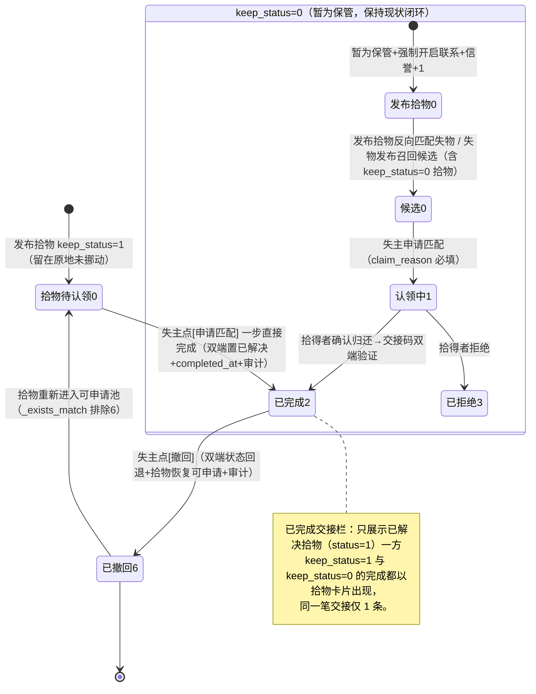

# 增量 PRD：已交接栏去重 + keep_status=1 简化流程 + 时间非必填 + 匹配度重心转向文字

| 项 | 内容 |
| --- | --- |
| 系统名称 | 基于 YOLOv8 的校园失物招领智能匹配系统 |
| 文档定位 | 在**已落地 v8 + 昨日 top10 候选增量**之上定义本期增量变更（R1–R4 共 4 项）；需求层文档，不含实现代码 |
| 文档版本 | 2026-08-05 · 增量（简单 PRD）· Q1–Q7 已拍板 |
| 产品经理 | Alice（软件产品经理） |
| 技术栈（沿用，禁止更换） | 前端 Vue3 + Element Plus + Vite + Pinia + Axios；后端 FastAPI + SQLAlchemy 2.x + SQLite/MySQL + JWT；视觉 YOLOv8 + 感知哈希/CLIP |
| 状态 | **Q1–Q7 已由用户拍板**；Q5 采用用户自定义"照片/文字/地点"三块 + 文字动态计分公式（见 §5 Q5 与 §4 P0-6）；论文公式段需按 §5.5 同步 |

---

## 1. 产品目标（一句话）

> **把「已完成交接」收敛为单一视角（只看拾物）、让"留在原地未挪动"（keep_status=1）的拾物走一条"申请即完成、可撤回"的极简路径、时间不再必填，并把匹配度重心转向"照片（含分类识别）/文字/地点"三块、文字动态计分占大头——让失主找东西更准、拾得者记录更省事、公示栏不再重复。**

---

## 2. 用户故事

- **失主（keep_status=1 场景）**：As a 失主，我看到一条"留在原地未挪动"的拾物（比如"行李箱两个，黄色和粉色，在教学楼"），点「申请匹配」即可直接完成交接，so that 我不必等拾得者确认、也无需交接码——因为东西本来就没被拿走。
- **失主（防误操作）**：As a 失主，如果我手快点错了「申请匹配」，我能在已交接记录里点「撤回」，so that 真正失主不会因为我误操作而错过这条拾物。
- **拾得者（keep_status=1 场景）**：As a 拾得者，我选择"留在原地未挪动"发布拾物，只是顺手记录、方便别人寻找，so that 我不被打扰（不参与自动双向匹配、不被认领闭环打扰），也不因我的发布影响匹配列表。
- **公示栏浏览者**：As a 浏览者，我在「已完成交接」tab 只看到拾物一方的交接记录，so that 同一笔交接不再重复显示两条。
- **失主（匹配度）**：As a 失主，系统按"双方文字对上了多少"给我排序候选，so that 像"两个行李箱、黄色和粉色"这种文字高度吻合的拾物排在最前面。

---

## 3. 现状 vs 期望差距表（R1–R4）

| # | 维度 | 现状行为 | 期望行为 |
| --- | --- | --- | --- |
| R1 | 已完成交接栏 | `BoardView.vue` 的 `resolvedMerged` 把已解决失物（status=3）+ 已解决拾物（status=1）**合并展示**，同一笔交接显示两条（失物一条 + 拾物一条） | **只展示拾物**：同一笔交接在「已完成交接」tab 仅出现一条拾物卡片（对方失物信息仍可作为"匹配对方"展示在卡片上） |
| R2-a | keep_status=1 参与自动匹配 | `publish_service._reverse_match_lost/_reverse_match_found` **不区分 keep_status**：keep_status=1 拾物也进入双向候选与认领闭环 | keep_status=1 拾物**退出自动双向匹配**：发布拾物不反向匹配失物；失物召回候选 / 刷新候选时排除 keep_status=1 拾物 |
| R2-b | keep_status=1 的申请动作 | 现状任何拾物都能被手动申请（`POST /matches/manual` 生成 status=4 待自取，再 `self-complete` 两步单边完成），**不区分 keep_status** | keep_status=1 拾物点「申请匹配」= **一步直接完成**：生成终态 MatchRecord + lost/found 双端置已解决 + completed_at + 审计留档，无需等待、无需交接码 |
| R2-c | 完成记录可撤回 | 现状无撤回能力；`giveup`（status=5）只处理进行中匹配，已完成(2)被终态保护 | 对 keep_status=1 的"申请即完成"记录，失主可**撤回**：撤销完成、双方状态回退、拾物恢复可申请、审计留档；撤回记录为终态 `status=6 已撤回`（Q7 已拍板） |
| R3 | 失物发布时间 | `LostItemPublishDTO.lost_time` **必填**；`LostItem.lost_time` `nullable=False`；前端表单必填；匹配公式 `time_decay_factor` 直接消费该值 | 失物发布时间**非必填**：schema 可空 + 模型可空 + 前端表单去必填 + SQLite 迁移；新公式下 time 仅 5 分极低权重，空值给中性 0.5（不报错、不惩罚，见 §5 Q5/Q6） |
| R4 | 匹配度重心 | v8 六维：`20·photo + 30·category + 20·appearance + 15·feature + 10·time + 5·location`；**description 文本不参与打分**；时间占 10 分 | **已拍板新公式** `score = 15·photo + 20·category + 50·text + 10·location + 5·time`：总分 100 由「照片（含分类识别）」「文字」「地点」三块共同定夺，**文字占大头且动态计分**（命中相似词越多分越高）；appearance/feature 并入 text 词覆盖率；时间仅 5 分极低权重。⚠️ 与论文 v8 公式不一致，论文需按 §5.5 同步 |

### ⚠️ flow-v3 修订批注（2026-08-05 后续增量，R2-a 口径已变更）

> **本节 R2-a「退出自动双向匹配」已由 flow-v3 增量修订为「单向进匹配池」。** 上表 R2-a 行、
> §2 用户故事中「不参与自动双向匹配」的表述，以及 §4 P0-2 的相关描述，均以本批注为准。
> 权威口径见 `docs/architecture/v9_flow_v3_incremental_design.md` 与 `docs/prd/v9_flow_v3_incremental_prd.md`。

**问题**：flow-v2 R2-a 把 keep1（留在原地未挪动）拾物做了**双向排除**——既不为拾得者反向生成候选，
也把它从失主侧的召回池里剔除。后者是**过度设计**：失主本来就该看到「东西还在原地、你自己去拿」这类
拾物，把它藏起来直接损害了失主的找回率，与产品目标背道而驰。拾得者「不被打扰」的诉求，只需要**不给
拾得者推候选、不让拾得者被认领动作骚扰**即可，与「失主能不能看到」是两件事。

**修订后口径（flow-v3）：keep1 拾物 = 单向进池**

| 方向 | flow-v2（旧） | flow-v3（现行） | 实现位置 |
| --- | --- | --- | --- |
| **正向**：失主发布/刷新候选时，keep1 拾物能否被召回 | ❌ 排除（`keep_status==0` 过滤） | ✅ **放开**，keep1 可作为失主侧候选 | `publish_service._recall_lost_candidates` 删除 keep_status 过滤（仍保留 `deleted_at.is_(None)`） |
| **反向**：发布 keep1 拾物时，是否为拾得者生成候选 | ❌ 不生成 | ❌ **保持不生成**（早退不变） | `publish_service._reverse_match_found` 开头 `keep_status==1 → return []` |

**配套的「拾得者不被打扰」守卫**：候选是**一条双方共享的记录**，反向不生成 ≠ 拾得者看不见——
失主侧一旦召回落库，拾得者在「我的匹配」里同样能看到这条 keep1 候选（这是**有意保留**的可见性，
便于拾得者知晓有人来取）。因此 flow-v3 在接口层补齐单向性守卫：拾得者对 keep1 候选调用
`confirm-return`、`reject` 一律 **422**（`ParamError` / code 9001），与既有 `claim` 的 422 守卫对齐。
keep1 的闭环只有一条路径：**失主点「我要领走」→ `claim-complete` 一步完成（`flow_type=1`，可撤回）**。

**对本文档其余条目的影响**：R2-b（申请即完成）、R2-c（可撤回、`status=6`、`_exists_match` 排除 `{2,3,6}`）
**均不受影响，继续有效**；R1 / R3 / R4 **不受影响**。

**回归测试映射**：`tests/test_flow_v3.py`（keep1 单向性专项，F3-01～F3-17）；
`tests/test_flow_v2.py` 中两条断言已随之调整——
`test_keep1_found_publish_still_has_no_candidates`（反向早退，断言**不变**，转红即严重回归信号）、
`test_lost_publish_includes_keep1_candidates`（正向放开，断言由「排除」**反转**为「包含」）。

---

## 4. 需求池（P0 / P1 / P2）

> 优先级：**P0 = 必做（阻塞上线）｜P1 = 应做（工程化必需）｜P2 = 体验优化**。
> 标记：`[变更]` 既有逻辑需修改｜`[新增]` 需新增｜`[复用]` 结构已存在仅确认行为。

### P0 — 必做（阻塞上线）

| ID | 需求 | 描述 | 标记 | 关联模块 | 验收标准 |
| --- | --- | --- | --- | --- | --- |
| P0-1 | R1：已完成交接 tab 只展示拾物 | `BoardView.vue` `resolvedMerged` 仅保留 `found` 部分（已解决拾物 status=1），不再拼接 `lost` 部分；`resolvedLost` 拉取可停用（若 counterpart 索引仍需失物详情则保留拉取但不展示）；「已完成交接」搜索/筛选只作用于拾物。**「我的匹配-已完成」tab 是 MatchRecord 视角（`MatchesView.vue`，按 status∈{2,3} 分组），本期不动。** | `[变更]` | `web/src/views/BoardView.vue` | ① 同一笔交接在已完成交接 tab 仅 1 条拾物卡片；② 卡片仍能展示对方失物信息与完成时间（counterpart 索引保留）；③「我的匹配-已完成」不回归。 |
| P0-2 | R2：keep_status=1 退出自动双向匹配 | `_recall_lost_candidates` 增加 `FoundItem.keep_status == 0` 过滤（失物召回/刷新候选均排除 keep_status=1 拾物）；`_reverse_match_found` 开头判断 `found.keep_status == 1` 直接返回 `[]`（发布拾物不反向匹配失物）。 | `[变更]` | `app/services/publish_service.py` | ① keep_status=1 拾物发布后，拾得者「我的匹配」不出现任何候选失物；② 失主发布/刷新失物时，候选列表不含任何 keep_status=1 拾物；③ keep_status=0 拾物行为不回归。 |
| P0-3 | R2：keep_status=1「申请即完成」（Q2 已拍板：不填理由） | 失主对 keep_status=1 拾物点「申请匹配」→ **一步到位**：生成 MatchRecord 终态（status=2 COMPLETED，含 match_score）+ 失物置已解决（lost.status=3）+ 拾物置已解决（found.status=1）+ `completed_at` + 审计留档（action 建议 `keep1_claim_complete`，detail 记录 lost_id/found_id/score）。不触发 claim 双向、不生成交接码。需记录"完成方式=keep1 单边"以便撤回动作只作用于该类记录（推荐 MatchRecord 新增 `flow_type` 列 0=双向交接/1=keep1 单边，或等价标记；与 Q7 的 status=6 撤回终态配合）。 | `[新增]` | 后端路由（建议 `app/routers/match.py`）+ 前端 `MatchesView.vue` / `BoardView.vue` | ① 失主对 keep_status=1 拾物点「申请匹配」，无需填理由、无需等确认，立即成为已完成；② lost/found 双端 status 置已解决；③ `completed_at` 有值；④ 审计有记录；⑤ 对 keep_status=0 拾物点「申请匹配」仍走原 claim 流程（P1-1 分流）。 |
| P0-4 | R2：完成记录可撤回（Q3/Q7 已拍板：不限时限、status=6） | 新增「撤回」动作：仅失主可对**自己的、完成方式=keep1 单边**的已完成记录执行，**不限时限**。效果：① MatchRecord 进入终态 `status=6 已撤回`；② lost.status 回退（若失物还有其他进行中匹配→MATCHING=1，否则→PENDING_MATCH=0）；③ found.status RESOLVED→PENDING（拾物恢复可申请）；④ `completed_at` 保留原值 + 审计记录撤回时间；⑤ 审计留档（action 建议 `keep1_claim_revoke`）。**幂等去重适配**：`_exists_match` 排除 status=6，否则撤回后同一 (lost, found) 无法再次申请（P1-2）。 | `[新增]` | 后端路由 + 前端操作入口 | ① 失主撤回后，该拾物恢复"待认领"并再次出现在可申请列表；② 其他失主（含原失主）可再次对其发起申请即完成；③ 撤回有审计留档；④ keep_status=0 的交接码完成记录**不可撤回**。 |
| P0-5 | R3：失物发布时间非必填 | ① `LostItemPublishDTO.lost_time` 改 `Optional[datetime] = None`；② `LostItem.lost_time` 改 `nullable=True`（SQLite dev.db 迁移方案：重建表 or ALTER，由架构师定）；③ 前端发布失物表单去掉必填校验；④ `LostItemOut.lost_time` 输出改可空，前端详情/卡片对空时间显示"—"。 | `[变更]` | `app/schemas/item.py`、`app/models/item.py`、迁移、前端发布表单/展示 | ① 不填 lost_time 可成功发布失物；② 已存在记录不受影响；③ 空时间在详情页/卡片不报错、显示占位。 |
| P0-6 | R4：文字动态计分 + 三块新公式（Q5 已拍板） | 按新公式重构打分：`score = 15·photo + 20·category + 50·text + 10·location + 5·time`（合计 100）。① 新增**动态文字词覆盖率**维度 `text_match_rate(lost, found)`：失物侧词集（title ∪ description ∪ tags ∪ appearance ∪ features ∪ location 分词并集，去停用词，保留名词/颜色词/数量词）对候选拾物的**命中率** `hit / |失物词集|`（分母固定失物侧；命中判定复用 `_token_hit` 精确+WordNet+中文近义词表）；② **description 正式进入打分**（现状不参与）；③ appearance/feature 并入 text 词覆盖率（v8 的 appearance_factor/feature_factor 退化为 text 词集子集，或保留供展示）；④ `MatchOut` 维度明细/前端展示同步适配。算法细节与空值规则见 §5 Q5.2/Q5.3。 | `[变更]`+`[新增]` | `app/services/match_service.py`、`app/core/config.py`、前端匹配卡片维度展示 | ① **可测断言**：失物"两个行李箱、黄色和粉色、在教学楼"（词集 5 词）——拾取物2（命中 4/5：行李箱/两个/黄色/粉色）text 贡献 40 分 > 拾取物1（命中 2/5：行李箱/教学楼）text 贡献 20 分，总分拾取物2 > 拾取物1；② 维度明细与前端展示与新权重一致（text 最高 50、time 最低 5、photo+category 35）。 |
| P0-7 | R3/R4：空字段计分规则统一（Q6 已拍板） | 新公式下空值规则：① **time**（5 分）：lost_time 或 found_time 缺失 → 中性因子 0.5（贡献 2.5 分），`time_decay_factor`/`delta_days` 对 None 不报错；② **location**（10 分）：任一侧缺失 → 中性因子 0.5（不惩罚；现状为 0.0，需改）；③ **text**（50 分）：失物侧词集为空 → 中性 0.5；拾物侧为空且失物有词 → 0.0；④ **photo**（15 分）：无图/hash 缺失 → 0.0（保持现状，纯文字失物靠 category/text 得分）。 | `[变更]` | `app/services/match_service.py`、`app/utils/time_decay.py` | ① 任一时间/地点缺失时打分不抛异常；② 空字段不因 0 分过度惩罚；③ 纯文字失物仍可依靠 category/text 维度得分。 |

### P1 — 应做（工程化必需）

| ID | 需求 | 描述 | 标记 | 关联模块 | 验收标准 |
| --- | --- | --- | --- | --- | --- |
| P1-1 | R2：存量 keep_status=1 候选分流 | 历史数据中 keep_status=1 拾物**已生成**的 status=0 候选不清理，但失主对其点「申请匹配」时后端按 `found.keep_status` 分流：1 → 走申请即完成（P0-3）；0 → 走原 claim 认领闭环。保证新旧路径语义一致，避免同一拾物既走双向又走单边。 | `[变更]` | 后端申请入口（`claim_match` 或新入口） | ① 存量 keep_status=1 候选点申请 → 一步完成；② 存量 keep_status=0 候选点申请 → 走认领闭环。 |
| P1-2 | R2：幂等去重适配撤回（Q7 已拍板：status=6） | `_exists_match` 及 manual 去重查询排除 `status=6 已撤回` 记录，使撤回后同 (lost, found) 可再次发起申请即完成。 | `[变更]` | `app/services/publish_service.py`、`app/routers/match.py` | ① 撤回后再次申请同一 (lost, found) 不报"已存在进行中匹配"；② 正常进行中匹配的去重不回归。 |
| P1-3 | R2：撤回的权限与一致性 | 撤回动作校验：仅失主（lost.publisher_id=当前用户）、仅完成方式=keep1、仅终态已完成；撤回时若对方（拾得者）侧已有 IM 会话等关联，仅作审计不阻断（规避 RESTRICT 外键，同 v5 思路）。 | `[变更]` | 后端撤回路由 | ① 非失主不可撤回；② keep_status=0 完成记录不可撤回；③ 撤回不因关联数据导致 500。 |
| P1-4 | R1：已完成交接 tab 文案/空态 | 「已完成交接」tab 顶部/空态说明文案改为"已完成的拾物交接记录"，避免用户疑惑为何只看到拾物。 | `[变更]` | `BoardView.vue` | ① 空态与提示文案明确为拾物视角。 |
| P1-5 | R4：匹配维度展示适配 | 前端匹配卡片/详情按**新三块权重**渲染（photo 15、category 20、text 50 动态、location 10、time 5），`score_detail` 返回新键（text_match_rate/text 贡献值）；共享关键词高亮（P2-2 复用）；历史 `MatchOut` 兼容展示（旧记录无 text 键时回退，不崩溃）。 | `[变更]` | `web/src/views/MatchesView.vue`、`MatchOut` | ① 新维度在卡片/详情正确展示；② 旧记录不崩溃。 |

### P2 — 体验优化

| ID | 需求 | 描述 | 标记 | 关联模块 | 验收标准 |
| --- | --- | --- | --- | --- | --- |
| P2-1 | R2：撤回入口 UI | 「我的匹配-已完成」tab 与「已完成交接」tab 中，完成方式=keep1 的记录显示「撤回」按钮（带二次确认，提示"撤回后该拾物将恢复可申请"）；撤回成功后刷新列表；撤回记录灰显"已撤回"。 | `[新增]` | `MatchesView.vue`、`BoardView.vue` | ① keep1 完成记录可见撤回按钮；② 双向交接完成记录无撤回按钮。 |
| P2-2 | R4：文字匹配解释 | 匹配卡片展示"共享文字词"（如 [行李箱][黄色][粉色]），帮助用户理解为什么分数高。 | `[新增]` | `MatchesView.vue` | ① 卡片显示共享关键词；② 数量词/颜色词可解释。 |
| P2-3 | R3：发布表单时间占位 | 失物发布时间非必填后，表单提供"不知道/记不清"占位引导，减少留空焦虑。 | `[变更]` | 前端发布表单 | ① 时间字段可留空并有友好提示。 |

---

## 5. 待确认问题（Q1–Q7 已拍板；Q5 为新公式定稿）

> 以下 Q1–Q7 均已完成用户拍板，不再待确认；Q5 为用户自定义公式的**落地定稿**，直接作为 P0-6 的实现依据。

### Q1：已完成交接只展示拾物，是否连"失物侧自己的记录"也一并隐藏？（已拍板：A）

**已采纳推荐 A——全部只看拾物**：tab 内每条交接只显示拾物卡片（对方失物信息仅作为卡片上的"匹配对方"辅助信息展示），列表数量减半、无重复。「我的匹配-已完成」tab 是 MatchRecord 视角，不属本期改动范围（保持不变）。

### Q2：keep_status=1 的"申请即完成"是否需要填认领理由/凭证？（已拍板：A）

**已采纳推荐 A——不需要，一步到位**：不填认领理由/凭证；误点靠撤回兜底（Q3），不靠填理由拦截。

### Q3：撤回的入口与时限？（已拍板：A）

**已采纳推荐 A——不限时限**：失主随时在「我的匹配-已完成」或「已交接栏」对该 keep1 完成记录点「撤回」；撤回后拾物恢复可申请；撤回记录在已完成侧灰显"已撤回"保留（便于追溯）。

### Q4：keep_status=1 拾物是否保留「联系对方」？（已拍板：保持现状，不弱化）

**用户拍板：不弱化、不隐藏，保持现状**——拾物侧沿用 `contact_allowed` 开关：拾得者发布时选了允许联系就可联系，关闭就不可联系；不新增"拾得者可能不在场"提示，不需要额外弱化/隐藏。**本期 Q4 无代码变更**，仅记录决策（PRD 无相关 P0/P1 弱化项）。

### Q5：R4 新公式 —— 用户拍板"照片/文字/地点"三块 + 文字动态计分（已定稿）

> 用户不接受固定权重方案 A/B/C/C'，原话："微调公式可以吗，这个100肯定是由照片、文字、地点共同定夺，文字占大头且动态定夺（由命中的相似词数量决定）。"
> 以下为**已拍板的落地公式**，直接作为 P0-6 实现依据。

#### 5.1 最终公式（权重分配）

```
score = 15·photo + 20·category + 50·text + 10·location + 5·time        （合计 100）
```

| 块 | 权重 | 说明 |
| --- | --- | --- |
| photo（照片相似度） | 15 | 感知哈希/CLIP 相似度因子（沿用现状）；无图/hash 缺失 → 0.0 |
| category（照片的分类 / 视觉识别类别） | 20 | 类目命中因子（精确 1.0 / 父级 0.5，沿用现状）；与 photo 合为"照片（含分类识别）"块 35 分，排第二 |
| **text（文字，动态）** | **50** | **文字占大头**；按双方命中相似词数量/覆盖率动态计分，非固定满分（算法见 5.2） |
| location（地点） | 10 | 地点相似度因子（沿用现状；任一侧缺失 → 中性 0.5，见 5.3） |
| time（时间） | 5 | 极低权重（用户：时间不再重要）；空值中性 0.5 → 贡献 2.5 分 |
| **「其他」类特殊路径** | — | 沿用 v8：`score = 20·photo + 80·tag_match_rate`；其中 `tag_match_rate` 升级为与 text_match_rate 同口径（词集纳入 description，见 5.2 备注） |

> 解读：用户"照片的分类" = 视觉识别类别 → category 单独保留 20 分、从属照片块；photo 15 + category 20 = 照片块 35 分，排第二；文字 50 分占大头；地点 10 分；时间 5 分极低（R3 呼应）。appearance/feature 不再独立成块，并入 text 词覆盖率。

#### 5.2 text 动态计分算法（text_match_rate）

```
text_match_rate(lost, found) = hit / |lost_text_tokens|

1) 失物侧词集 lost_text_tokens = title ∪ description ∪ tags ∪ appearance ∪ features ∪ location
   分词并集；去停用词（"的/了/在/看见/一个"等无判别力词）；
   保留：名词（NOUN_SET）、颜色词（COLOR_WORDS）、数量词（"两个/2个/一对"）、品牌/特殊标记。
   （复用 _ATTR_SPLIT_RE 分词 + 近义词表/颜色表/数量词规则；"黄色的"→"黄色"由颜色词子串匹配归一）
2) 拾物侧词集 found_text_tokens 同上（对候选拾物提取）。
3) hit = lost_text_tokens 中每个 token 用 _token_hit 判定是否命中 found 侧
   （精确包含 + WordNet 同义 + 中文近义词表，复用现有语义命中逻辑）。
4) 分母固定失物侧（containment 口径，与 semantic_tag_match_rate 一致）：
   命中越多 → rate 越高 → text 块贡献越高（动态，非固定满分）。
5) 边界：
   - 失物侧词集为空（纯图失物）→ 中性 0.5（text 贡献 25 分，不惩罚）；
   - 拾物侧词集为空且失物有词 → hit=0 → 0.0（有文字失物对无文字拾物得 0，合理）；
   - nltk 缺失/离线 → 自动回退纯精确命中（沿用兼容铁律，不破坏测试）。

用户示例验证（可测断言）：
  失物1：词集 {两个, 行李箱, 黄色, 粉色, 教学楼}（5 词）
  拾取物1：行李箱、教学楼 → 命中 2/5 = 0.40 → text 贡献 20 分
  拾取物2：行李箱两个，黄色的和粉色 → 命中 4/5 = 0.80 → text 贡献 40 分
  ⇒ 拾取物2 文字得分高于拾取物1（40 > 20），总分拾取物2 > 拾取物1 ✓
```

备注（「其他」类）：`tag_match_rate` 升级为与 text_match_rate 同口径（词集纳入 description），保持"其他"类仍由照片+文字驱动，类目不占权重。

#### 5.3 空值计分规则（Q6 已拍板）

| 维度 | 空值规则 |
| --- | --- |
| photo | 无图 / hash 缺失 → 0.0（保持现状；纯文字失物靠 category+text 得分） |
| category | 发布时恒解析，无空值 |
| text | 失物侧词集为空 → 中性 0.5；拾物侧为空且失物有词 → 0.0 |
| location | 任一侧缺失 → 中性 0.5（现状为 0.0，需改，不惩罚） |
| time | 任一缺失 → 中性 0.5（贡献 2.5 分，不惩罚不报错） |

#### 5.4 阈值

**阈值 80 保留**，仅作 suspected（疑似匹配）标记；top10 候选全量落库机制不受影响（昨日增量不变）。

#### 5.5 对论文公式一致性的影响与同步建议

**影响**：新公式与论文 v8 六维公式（§3.3/图4.2/摘要）**不一致**——六维改为"photo+category+text+location+time"（text 升为 50 分动态主维度、time 降为 5 分、appearance/feature 并入 text 词覆盖率）。代码-论文一致性是本项目历次铁律，本期需明确论文同步方案。

| 选项 | 做法 | 适用 |
| --- | --- | --- |
| A（推荐，若论文未定稿） | **改公式段**：论文 §3.3 公式、图4.2、摘要同步更新为新公式；将"文字词覆盖率动态匹配"作为论文创新点/改进章节展开（复用语义同义召回 WordNet+中文近义词表作为方法亮点） | 论文未定稿/答辩前有时间修订，保持代码-论文完全一致 |
| B（若论文已定稿/答辩在即） | **延伸实验章节**：论文主体保留 v8 六维作为"基线方法"，新增一节"改进：基于文字词覆盖率的动态匹配增强"描述新公式，摘要措辞改为"在六维基线基础上引入文字词覆盖率动态加权"；代码以新公式为准，在论文实现说明中注明 | 论文定稿，只能追加/小幅修订 |

**专业建议**：优先 A（改公式段）——本项目历次迭代均以论文-代码一致为验收铁律，公式是本系统核心算法，答辩时被追问概率最高；text 动态词覆盖率本身有方法增量（语义同义召回），写进论文反而是加分项。若时间不允许全文改写，退 B，但务必在论文中显式注明"系统实现采用增强公式"。

### Q6：时间非必填后，匹配公式 time 维度拿不到值时如何计分？（已拍板：A 中性分 0.5）

**已采纳推荐 A**：time 因子缺失返回中性 0.5（time 权重 5 分 → 贡献 2.5 分），不报错、不惩罚、不奖励；具体规则并入 §5.3 空值计分表（P0-7）。

### Q7：撤回后 MatchRecord 的状态呈现？（已拍板：A 新增 status=6 已撤回）

**已采纳推荐 A**：新增终态 `status=6 已撤回`——语义清晰；`_exists_match` 排除 6（保证撤回后可重新申请）；前端已完成侧灰显"已撤回"；`MatchesView` 已完成 tab 过滤集合扩展为 {2,3,6}。P0-4/P1-2 按此实现。

---

## 6. 状态机说明（Mermaid）



要点说明：

1. **keep_status=1 简化流转**（本期新增）：发布即不参与自动双向匹配；失主「申请匹配」= 一步完成（不填理由，Q2）；完成可撤回（不限时限，Q3）；撤回后拾物恢复可申请；撤回记录终态 status=6（Q7）。不产生交接码、不要求拾得者确认。
2. **keep_status=0 保持现状**：自动候选 + claim 认领 + 确认归还 + 交接码闭环一律不动。
3. **与已完成交接栏的关系**：R1 后，已完成交接 tab 只展示已解决**拾物**卡片；keep_status=0 与 keep_status=1 的完成记录都会以拾物形态出现（对方失物信息作为卡片辅助展示），同一笔交接仅一条。

---

## 7. 明确不做（Scope Out）

- **不改视觉模型/类目**：YOLOv8 / 感知哈希 / CLIP 消费逻辑、类目表、TaggingService 抽取逻辑均不动（R4 只新增"text 词覆盖率"维度并复用既有语义命中，不改视觉与类目）。
- **不重做广场页**：公示栏整体布局、搜索、发布流程不重构；仅「已完成交接」tab 的数据源与展示收敛。
- **不改 keep_status=0 的既有闭环**：认领（claim）、确认归还、交接码双端验证、拒绝、未能找回（giveup）等流程一律保持现状。
- **不动上一批 top10 候选机制**：发布时快照落库、每件 ≤10、含低分、`suspected` 标记、拾得者侧对称落库等均保留；仅新增 keep_status=1 的排除规则（P0-2）与撤回后的去重适配（P1-2），属必要微调。
- **不新增类目、不新增视觉识别能力**。
- **不做全量实时重算**：候选仍为发布时快照 + 对称补充 + 手动刷新。
- **论文公式段同步是新公式的配套交付**（按 §5.5 选项 A/B 执行）：具体由主理人与用户确认后由文档/论文负责人处理，不阻塞代码交付。

---

## 8. 验收标准（可测）

1. **R1 去重**：对同一笔已完成交接（失物+拾物均已解决），进入「已完成交接」tab 仅出现 **1 条拾物卡片**，无失物重复卡片；卡片仍显示对方失物信息与完成时间。
2. **R2 退出自动匹配**：发布 keep_status=1 拾物后，拾得者「我的匹配」无候选；失主发布/刷新失物后，候选列表不含任何 keep_status=1 拾物；keep_status=0 拾物候选照常。
3. **R2 申请即完成**：失主对 keep_status=1 拾物点「申请匹配」，无需填理由、无需拾得者操作，立即变为已完成（MatchRecord 终态 + lost/found 双端已解决 + completed_at 有值 + 审计有记录）。
4. **R2 可撤回**：失主对 keep1 完成记录点「撤回」后，拾物恢复待认领、再次出现在可申请列表，其他失主（含原失主）可再次申请；撤回记录为 status=6 且灰显"已撤回"；审计留档；keep_status=0 的交接码完成记录无撤回入口。
5. **R2 边界不回归**：keep_status=0 拾物仍走 申请匹配→认领→确认归还→交接码→完成 的原流程，不受影响。
6. **R3 时间非必填**：失物发布不填 lost_time 可成功；空时间在详情/卡片显示占位不报错；匹配打分对空时间不抛异常、不惩罚（time 维度中性 0.5 → 贡献 2.5 分）。
7. **R4 文字重心（可测断言）**：用户示例场景——失物"两个行李箱、黄色和粉色、在教学楼看见"（词集 5 词）：拾取物2（命中行李箱/两个/黄色/粉色 = 4/5，text 贡献 40 分）**得分高于** 拾取物1（命中行李箱/教学楼 = 2/5，text 贡献 20 分）；`score_detail` 中 text 贡献值分别约 40/20，总分拾取物2 > 拾取物1。
8. **R4 新公式一致性**：打分按 `15·photo + 20·category + 50·text + 10·location + 5·time` 计算；前端匹配卡片/维度明细展示与之一致（text 最高 50、time 最低 5、photo+category 35）；阈值 80 保留作 suspected 标记；旧记录（无 text 键）展示不崩溃。
