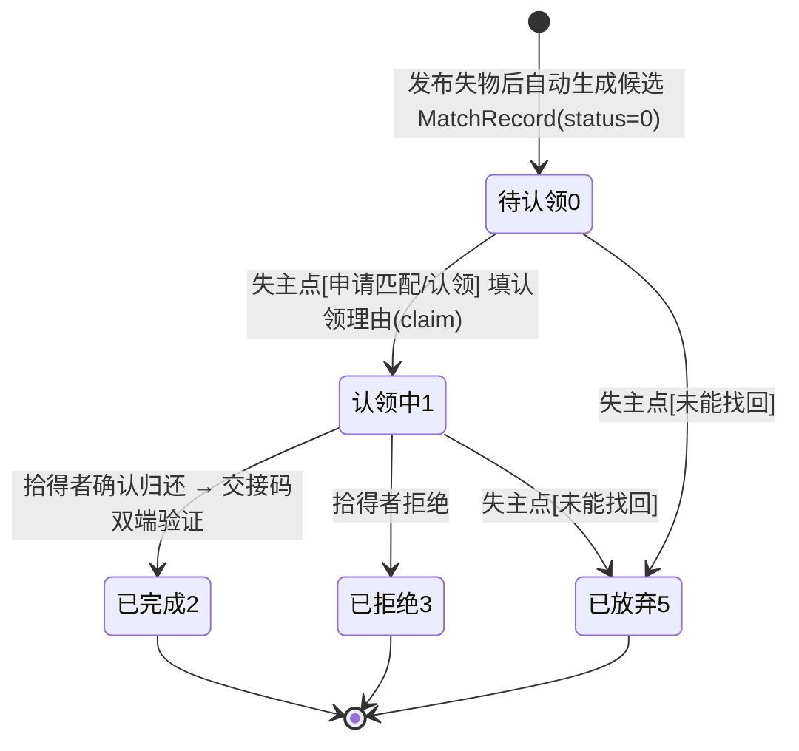

# 增量 PRD：失物发布后「我的匹配」自动陈列 Top10 候选并可直接申请匹配

| 项 | 内容 |
| --- | --- |
| 系统名称 | 基于 YOLOv8 的校园失物招领智能匹配系统 |
| 文档定位 | 在**已落地 v8** 之上定义增量变更（仅涉及「我的匹配」候选生成 / 展示 / 申请链路）；需求层文档，不含实现代码 |
| 文档版本 | 2026-08-05 · 增量（简单 PRD） |
| 产品经理 | Alice（软件产品经理） |
| 技术栈（沿用，禁止更换） | 前端 Vue3 + Element Plus + Vite + Pinia + Axios；后端 FastAPI + SQLAlchemy 2.x + SQLite/MySQL + JWT；视觉 YOLOv8 + 感知哈希/CLIP |
| 状态 | **待主理人与用户确认**（见 §5 待确认问题 Q1–Q5） |

---

## 0. 原始需求与根因诊断（增量基线）

### 0.1 用户原始需求（原话）

> "我进行简单测试，现在发布失物和发布拾物都没问题了，但是现在'智能匹配'功能没了，正常来说，发布'失物'的人，在'我的匹配'一栏，系统会自动将匹配度最高的前10条陈列出来，让它自己能浏览，点击'申请匹配'，否则全靠自己在失物栏一个一个找太麻烦了。"

### 0.2 根因诊断（主理人已确认，直接采信）

1. **功能链路本身完整存在**：发布失物 → `publish_service._reverse_match_lost()` 召回候选拾物 → `MatchService().score()` 打分 → `is_suspected(score)`（score ≥ 80）才生成 `MatchRecord`（status=0 待认领）→ 前端「我的匹配」页（`MatchesView.vue`）调 `GET /matches` 展示。前端展示、后端查询、认领/交接/拒绝/放弃等动作全部正常。
2. **问题根源 = 80 分阈值一刀切**：用户测试数据实测 `score = 60.0`（失物与拾物 category_id 同为 3=钥匙、tags 同为 `['钥匙','银色','内含:钥匙']`，但 appearance/features/location 全为 None，时间维度也低分）→ 低于 `settings.MATCH_THRESHOLD`(80) → 发布时**一条 MatchRecord 都不生成** → dev.db 的 match_record 表 0 行 → 「我的匹配」永远空列表。
3. 系统已有"疑似匹配"（suspected）概念：`MatchOut.suspected` 字段前端已渲染"疑似匹配"标签；`build_match_outs` 里 threshold 参数用于标记低分。**但发布逻辑用 `is_suspected(score)` 做硬过滤，低分候选根本没有机会入库展示。**
4. 已有 v4「手动申请匹配」接口：`POST /matches/manual`（失主针对某拾物发起，生成 status=4「待自取」单边匹配，match_score 仅作展示可 < 阈值），前端 `matchApi.createManual(lostId, foundId)` 已存在但入口在别处（用户嫌"靠自己在失物栏一个一个找太麻烦"）。

### 0.3 现状行为 vs 期望行为差距

| 维度 | 现状行为 | 期望行为 |
| --- | --- | --- |
| 发布失物后的候选生成 | 仅 `score ≥ 80` 才生成 MatchRecord；< 80 全部丢弃 | 对**全部召回候选**打分，按分数降序取前 10 条，**无论分数**均生成 MatchRecord（不足 10 取全部） |
| 「我的匹配」列表 | 低分候选不落库 → 永远空 / 不全 | 发布即出现候选卡片，按分数降序，**每件失物最多 10 条** |
| 候选操作 | 仅 ≥ 80 有「认领」按钮 | 所有候选可「申请匹配」（含低分，需二次确认） |
| 低分候选呈现 | 不可见（被过滤） | 显示"疑似匹配"标签 + 弱化样式 |
| 拾得者侧 | ≥ 80 对称反向匹配 | 待 Q5 拍板（推荐对称落库，但拾得者侧低分不打扰） |

### 0.4 状态机现状（本期沿用，不新增状态）



> 说明：`MatchStatus` 枚举为 `0=待认领 / 1=认领中 / 2=已完成 / 3=已拒绝 / 4=待自取(v4 manual) / 5=已放弃(v5)`。**本期推荐不新增状态值**，低分候选与高分候选共用 `status=0 待认领`，用 `suspected`（score ≥ 80）字段区分展示层级。

---

## 1. 产品目标（一句话）

> **让失主发布失物后，「我的匹配」自动陈列与其失物匹配度最高的前 10 条候选（含低分疑似项，按分数降序），并可直接发起「申请匹配」，不再靠手动翻广场。**

---

## 2. 用户故事

- **失主（核心）**：As a 失主，我发布一条"丢失的钥匙"失物后，进入「我的匹配」就能看到系统按匹配度排好的候选拾物清单（最多 10 条；即使只有 60% 匹配也会出现，并标注"疑似匹配"），so that 我不必去拾物广场一条条翻找。
- **失主**：As a 失主，我看到某条候选拾物像我的东西，点击「申请匹配」并填写认领理由，so that 拾得者能收到我的申请并核实确认。
- **拾得者**：As a 拾得者，当失主对我的拾物发起「申请匹配」后，我在「我的匹配」能看到该申请并选择"确认归还/拒绝"，so that 我能确认对方确为失主，避免误配。

---

## 3. 需求池（P0 / P1 / P2）

> 优先级：**P0 = 必做（阻塞上线）｜P1 = 应做（工程化必需）｜P2 = 体验优化**。
> 标记：`[变更]` 既有逻辑需修改｜`[新增]` 需新增｜`[复用/确认]` 结构已存在仅确认行为。

### P0 — 必做（阻塞上线）

| ID | 需求 | 描述 | 标记 | 关联模块 | 验收标准 |
| --- | --- | --- | --- | --- | --- |
| P0-1 | 发布失物时生成 Top10 候选（含低分） | `_reverse_match_lost()` 改为对**全部召回候选**（同类目 ∪ 共享名词 tag）打分，按分数降序取前 10 条，**无论分数**均落 `MatchRecord(status=0 待认领)`；不足 10 条取全部；候选为 0 条时不生成、不失物状态不置 MATCHING。生成任意候选时 `lost.status → MATCHING`（沿用现状）。`_exists_match` 幂等去重保留。 | `[变更]` | `publish_service.py` | ① 同 category 或共享名词 tag 的拾物，即使 score<80 也生成候选记录；② 单件失物候选 ≤ 10；③ 同一 (lost_id, found_id) 不重复生成。 |
| P0-2 | 「我的匹配」展示候选清单 | `GET /matches` 返回结果即含低分候选，前端按分数降序展示；tab 归属沿用（status=0 进"进行中"）；**每件失物最多展示 10 条**。 | `[复用/确认]`+`[变更]` | `match.py`、`MatchesView.vue` | ① 发布失物后进入「我的匹配」能看到候选；② 分数降序；③ 单件失物候选卡片 ≤ 10。 |
| P0-3 | 「申请匹配」落地路径 | 候选卡片（status=0）增加「申请匹配」按钮；点击**复用现有认领流程**（`claim_reason` 必填 → status 0→1 认领中 → 拾得者确认归还/拒绝）。高分（≥80）候选可保留「认领」或统一为「申请匹配」（文案待 Q3 拍板）。 | `[复用]`+`[变更]` | `match.py`、`MatchesView.vue` | ① 点击「申请匹配」→ 填理由 → 记录转 status=1；② 拾得者侧可见并出现"确认归还/拒绝"；③ 不产生第二条重复记录。 |
| P0-4 | 低分候选呈现 | score<80 候选显示"疑似匹配"标签（沿用 `suspected`）+ 弱化样式 + 「申请匹配」二次确认提示；score≥80 行为不回归。 | `[复用]`+`[变更]` | `MatchesView.vue` | ① <80 候选带"疑似匹配"标签且视觉弱化；② 点击申请需二次确认；③ ≥80 候选的认领/交接/完成流程不回归。 |

### P1 — 应做（工程化必需）

| ID | 需求 | 描述 | 标记 | 关联模块 | 验收标准 |
| --- | --- | --- | --- | --- | --- |
| P1-1 | 拾得者侧低分候选不打扰 | 若 Q5 拍板对称落库：拾得者「我的匹配」中 <80 候选显示为"疑似候选（等待失主申请）"弱化样式，**不主动展示「确认归还」主按钮**（避免拾得者困惑）；≥80 保持现状（确认归还/拒绝）。 | `[变更]` | `MatchesView.vue` | ① 拾得者侧 <80 候选无"确认归还"主按钮；② 失主申请后（status=1）才出现"确认归还/拒绝"。 |
| P1-2 | 候选对端物品已解决/软删的隐藏 | 候选记录对端物品已 RESOLVED 或软删时，在「我的匹配」隐藏或置灰该候选。 | `[变更]` | `match.py`、`MatchesView.vue` | ① 对端已解决/删除的候选不再出现在进行中 tab。 |
| P1-3 | 空态文案优化 | 无候选时提示"可完善物品外观/特征/地点信息，系统将自动推荐；或前往拾物广场浏览"。 | `[变更]` | `MatchesView.vue` | ① 空列表展示引导文案而非生硬空态。 |
| P1-4 | 分页上限 | 前端 `page_size` 与后端分页适配多件失物 × 10 候选的场景（避免 page_size=100 截断）。 | `[变更]` | `MatchesView.vue`、`match.py` | ① 多件失物候选总数 >100 时仍可完整浏览。 |

### P2 — 体验优化

| ID | 需求 | 描述 | 标记 | 关联模块 | 验收标准 |
| --- | --- | --- | --- | --- | --- |
| P2-1 | 「刷新候选」手动入口 | 对单条失物重跑召回+打分，增量补充新发布拾物（去重、仍受每件 10 条上限约束），缓解"发布时快照"的时效性缺口。 | `[新增]` | 后端 + `MatchesView.vue` | ① 点刷新后新发布的拾物能补入候选列表；② 不重复生成已有候选。 |
| P2-2 | 候选上限提示 | 每件失物候选满 10 条时提示"仅显示匹配度最高的 10 条，查看更多请前往拾物广场"。 | `[新增]` | `MatchesView.vue` | ① 达到上限时有明确引导文案。 |

---

## 4. UI 设计稿（文字/ASCII）

「我的匹配」页改造后布局（沿用现有 `MatchesView.vue` 卡片结构，主要变化：**低分候选可见**、新增「申请匹配」按钮、低分弱化样式）：

```
┌──────────────────────────────────────────────────────────────────┐
│  我的匹配                                                          │
│  [进行中] [已完成]                              [刷新候选 · P2]    │
│                                                                    │
│  ┌──────────────────────────────────────────────────────────────┐ │
│  │  ◔ 60%   我是失主   待认领   [疑似匹配] [低匹配度·谨慎申请]    │ │
│  │  ┌────────┐                                                  │ │
│  │  │ 拾物图  │  拾物 · 钥匙                                      │ │
│  │  │        │  一串银色钥匙（拾得者发布）                         │ │
│  │  └────────┘  外观：银色｜特征：—｜地点：—                      │ │
│  │  共享特征：[钥匙] [银色]                                       │ │
│  │  匹配维度：图像 0/20 类别 30/30 外观 10/20 … 总分 60/100      │ │
│  │  ┌────────────────────────────────┐                          │ │
│  │  │ [申请匹配] [联系对方] [未能找回] │   ← 低分卡片弱化(灰边框)  │ │
│  │  └────────────────────────────────┘                          │ │
│  └──────────────────────────────────────────────────────────────┘ │
│  ┌──────────────────────────────────────────────────────────────┐ │
│  │  ◉ 88%   我是失主   待认领                                     │ │
│  │  ┌────────┐                                                  │ │
│  │  │ 拾物图  │  拾物 · 校园卡                                    │ │
│  │  └────────┘  外观：…｜特征：…｜地点：…                        │ │
│  │  ┌────────────────────────────────┐                          │ │
│  │  │ [认领] [联系对方] [未能找回]     │   ← 高分候选(正常样式)    │ │
│  │  └────────────────────────────────┘                          │ │
│  └──────────────────────────────────────────────────────────────┘ │
│   （其余候选按分数降序排列，最多 10 条/失物）                        │
└──────────────────────────────────────────────────────────────────┘
```

关键交互说明：

1. **分数环**：沿用 `el-progress` 圆形进度（score 颜色：≥90 绿 / ≥80 蓝 / <80 橙）。
2. **疑似标签**：<80 候选展示"疑似匹配"标签（沿用现有 `m.suspected` 渲染），并追加弱化样式（灰边框、降低背景强调）；排序靠后由"分数降序"天然保证。
3. **申请匹配按钮**：失主侧 status=0 候选主按钮，低分候选文案为「申请匹配」，高分候选保留「认领」或统一为「申请匹配」（Q3 拍板）；点击弹出**认领理由弹窗**（复用现有 claim dialog，必填）。
4. **拾得者侧（对称场景）**：<80 候选显示"疑似候选（等待失主申请）"，无「确认归还」主按钮；失主申请后 status=1 才出现「确认归还/拒绝」。

---

## 5. 待确认问题（Q1–Q5，供主理人转交用户拍板）

### Q1：展示范围 —— top10 是否包含低分（<80）候选？

| 选项 | 描述 | 评价 |
| --- | --- | --- |
| A（推荐） | **包含**。按分数降序取全部召回候选的 top10，无论分数 | 符合用户原话"匹配度最高的前10条"；正是 60 分被吞掉导致功能"消失"；低分候选用"疑似匹配"标签 + 弱化样式 + 申请二次确认控制误配风险 |
| B | 不包含，仅 ≥80 | 维持现状 = 问题不解决（测试数据 60 分仍看不到任何候选） |

**推荐 A**：低分候选进入列表，但明确标注"疑似匹配"，且申请时二次确认。

### Q2：生成时机 —— 发布时快照落库 vs 每次进「我的匹配」实时计算？

| 维度 | 方案 A：发布时快照落库（推荐） | 方案 B：每次进入实时计算（不落库） |
| --- | --- | --- |
| 实现方式 | 发布时对全部召回候选打分 → 排序取 top10 落 MatchRecord（无论分数） | `GET /matches` 实时重跑召回+打分返回 top10，点申请才落库 |
| 与现有状态机兼容性 | **完全兼容**：候选即 MatchRecord，认领/交接/拒绝/自取/放弃全部照常 | **分叉**：候选无状态，无法直接进入认领/交接流程；需新增"候选"概念或临时态 |
| 新发布的拾物何时进入失主候选 | 发布拾物时通过对称的 `_reverse_match_found` 增量补入（对已存在失物再匹配 top10）；失主也可手动"刷新候选"（P2） | 每次进页面即最新 |
| 性能 | 打分只发生在发布时（一次），页面浏览零开销 | 每次进页面全量打分，数据量大时有开销 |
| 记录量 | 每件失物 ≤10 条 + 每件拾物 ≤10 条（去重），总量可控 | 不落库，但"申请"时仍需落库 |
| 前端改造 | 小（tab 归属、按钮、弱化样式） | 大（新接口、候选/正式匹配双态、分页筛选重做） |

**推荐 A（发布时快照落库）**：改动最小、与状态机兼容、满足"发布即见"核心诉求；新鲜度缺口由"对称补充 + 可选手动刷新候选（P2-1）"弥补。

### Q3：「申请匹配」动作语义 —— 走哪条路径？

| 选项 | 描述 | 评价 |
| --- | --- | --- |
| A（推荐） | **复用认领主流程**：候选以 status=0 落库，「申请匹配」= 触发 claim（填认领理由 → 0→1 认领中 → 拾得者确认归还/拒绝 → 交接完成） | 全流程闭环、失主需填理由防误认领、拾得者有确认权、与现有状态机零新增；按钮文案：低分=「申请匹配」，高分可保留「认领」 |
| B | 复用 `POST /matches/manual`（status=4 待自取，单边） | 语义是"我直接去自取"而非"我申请匹配"；且候选已落 status=0 时与 manual 的重复校验冲突（需改语义）；单边完成缺少拾得者确认，误配风险高 |
| C | 新建"申请 → 拾得者确认"中间态（如 status=6 待确认） | 状态机改动最大，需迁移与全链路适配；除非用户明确要求，不推荐 |

**推荐 A**。按钮文案子选项：3a 统一为「申请匹配」（简单一致）；3b 高分保留「认领」、低分显示「申请匹配」（语义更细但 UI 不一致）——请用户拍板。

### Q4：低分（<80）匹配在列表里的呈现？

| 选项 | 描述 | 评价 |
| --- | --- | --- |
| A（推荐） | 沿用现有 `suspected`"疑似匹配"标签 + 弱化样式（灰边框）+ 申请二次确认；排序由分数降序天然靠后 | 复用已实现的能力，改动最小；"排序靠后"无需额外处理 |
| B | 仅标签、不弱化 | 实现更简单，但低分与高分视觉无区分，可能引发误点 |
| C | 单独"疑似候选"分区 | 视觉更清晰但改动更大、与"按分数降序 top10"诉求冲突 |

**推荐 A**。

### Q5：拾得者侧是否对称 —— 发布拾物后「我的匹配」也自动陈列 top10 候选失物？

| 选项 | 描述 | 评价 |
| --- | --- | --- |
| A（推荐） | **对称落库（拾物发布也生成 top10 候选失物），但拾得者侧 <80 候选不主动打扰**：显示"疑似候选（等待失主申请）"弱化样式，无「确认归还」主按钮；失主申请后才进入正式认领流程 | 对称性解决 Q2 的"新拾物补入旧失物候选"缺口；拾得者不被低分噪音打扰 |
| B | 拾得者侧维持现状（仅 ≥80 提醒） | 改动最小，但新拾物与旧失物低分匹配不会补入 → 失主侧新鲜度缺口仍在 |
| C | 完全对称且拾得者侧也全量展示 | 最彻底，但拾得者可能被大量低分"匹配"打扰，体验差 |

**推荐 A**：失主侧全量 top10（满足核心诉求），拾得者侧对称落库但低分弱化不打扰（解决新鲜度 + 不增噪音）。

---

## 6. 明确不做（Scope Out）

- **不改匹配算法**：不动六维公式（20·photo + 30·category + 20·appearance + 15·feature + 10·time + 5·location）、不动「其他」类路径、不动阈值 80 本身。
- **不新增类目**、不改视觉识别模型（YOLOv8 / 感知哈希 / CLIP 消费逻辑）。
- **不新增状态枚举值**（除非 Q3 拍板走方案 C）。
- **不做全量实时重算**（Q2 推荐方案 A：发布时快照 + 对称补充 + 可选手动刷新）。
- **不扩大拾物广场搜索范围**；用户"手动翻广场"的替代方案本期仅做候选清单 + 申请入口，不重做广场页。

---

## 7. 验收标准（可测）

1. **发布即见（含低分）**：发布一条失物（与某拾物同 category 或共享名词 tag，实测 score<80 如 60），发布后进入「我的匹配」→ 进行中 tab 能看到该候选卡片，分数正确显示（如 60%），带"疑似匹配"标签。
2. **排序与上限**：候选按 `match_score` 降序排列；单件失物关联候选 ≤ 10 条（不足 10 取全部）。
3. **申请匹配闭环**：候选卡片点「申请匹配」→ 填认领理由 → 提交后该记录 status=0→1（认领中）、失物 status→2（待认领）；拾得者侧可见并出现"确认归还/拒绝"；确认归还 → 交接码 → 完成后进入"已完成" tab。
4. **幂等去重**：同一 (lost_id, found_id) 不重复生成候选（重复发布 / 重复刷新不产生第二条记录）。
5. **高分不回归**：score≥80 候选的认领 / 确认归还 / 交接码 / 完成 / 未能找回等既有流程全部正常，suspected=true 展示不受影响。
6. **拾得者侧低分弱化（若 Q5 拍板对称）**：拾得者「我的匹配」中 <80 候选无「确认归还」主按钮，显示"疑似候选（等待失主申请）"。
