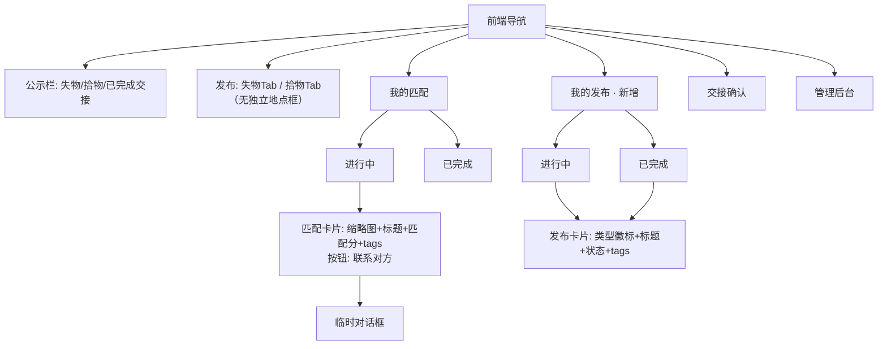
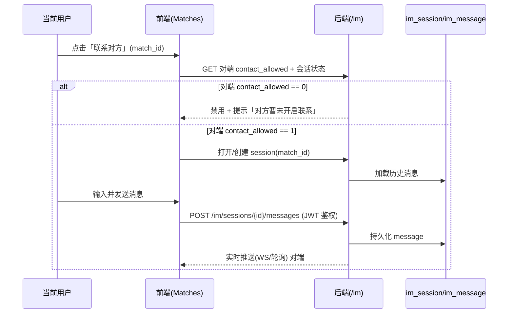

# v3 增量产品需求文档（Incremental PRD v3）

| 项 | 内容 |
| --- | --- |
| 系统名称 | 基于 YOLOv8 的校园失物招领智能匹配系统 |
| 文档定位 | 在**已上线 v2** 之上定义 v3 增量变更（本文档仅描述变更部分，沿用既有系统；不含任何实现代码、不修改源文件） |
| 文档版本 | v3.0（增量·简单 PRD） |
| 产品经理 | 许清楚（Xu） |
| 技术栈（沿用） | 前端 **Vue3 + Element Plus + Vite + Pinia + Axios**；后端 **FastAPI + SQLAlchemy 2.x + SQLite/MySQL + Redis + JWT**；**非默认 React/MUI**（既有系统增量改造，禁止另起技术栈） |
| 状态 | 待架构师与工程评审 |

---

## 0. 增量基线（v2 已落地事实，本次在其上改造）

> 以下为 v2 已上线现状，所有 v3 变更**必须基于这些事实**。

- **字段（v2）**：`LostItem` / `FoundItem` 已删「校区」字段；`category_name`（自由文本，必填）替代固定分类下拉；`category_id` 仅作内部匹配键。
- **地点（v2）**：仍有文本地点列 `lost_location`（失物，NOT NULL）/ `found_location`（拾物，可空），匹配 `W3` 基于二者文本相似度。
- **匹配公式（v2）**：`score = W1·category_hit(40) + W2·time_decay(25) + W3·location_similarity(20) + W4·keyword_jaccard(15)`，阈值 `80`，`τ=3天`。
- **公示栏（v2）**：已有「失物 / 拾物 / 已完成交接」三栏，「已完成交接」为独立集合 + 独立关键词搜索。
- **IM 基建（v1 已建，v2 未动）**：`im_session` / `im_message` 两张表已存在（`match_id` 外键、`sender_role`、`content` 等齐全），但 `/im/*` 路由与 WebSocket 未完全接入前端。
- **联系开关（已存在）**：`found_item.contact_allowed`（默认 1，"是否愿接收联系"）已落地。
- **配置（已存在）**：`MATCH_W1~W4`、`MATCH_THRESHOLD`、`TIME_DECAY_TAU_DAYS`、`IM_RETENTION_DAYS` 均在 `config.py`。
- **视觉（已存在）**：`VisionService.predict(image_bytes)` 双分支（COCO yolov8n.pt + YOLO-World yolov8s-world.pt），惰性加载、永不抛异常；仅当检出白名单 9 类且 conf≥0.25 才返回真实 label+confidence，否则降级 `YOLO_FALLBACK_CATEGORY_ID` + confidence=0.0。种子类目 12 个。
- **前端（已存在）**：6 个页面在 `web/src/views/`（Publish / Board / Matches / Handover / Admin / Login），含 mock 适配器兜底。

---

## 1. 产品目标与范围边界

### 1.1 产品目标（一句话）
> **v3 通过「地点入描述 + 自动标签 + 照片相似度匹配 + 站内可信通信 + 个人中心分栏」，把非结构化发布升维为可计算、可沟通、可溯源的防冒领闭环。**

### 1.2 本期范围边界

**做（Scope In）**
- A. 删除独立「地点」字段，地点语义并入 `description` 自然语言。
- B. 发布时由「视觉标签 + 描述/标题文本」自动抽取结构化标签并持久化。
- C. 匹配增加「照片相似度」维度，并提高关键词/标签权重（调整 W3/W4 语义）。
- D. 「我的匹配」每条匹配支持「联系对方」临时对话，消息持久化，受联系开关约束。
- E. 新增「我的发布」页，并与「我的匹配」共同按「进行中 / 已完成」分栏。

**不做（Scope Out）**
- 不新建 `messages` 表：复用既有 `im_session` / `im_message`。
- 不引入新前端框架（保持 Vue3 + Element Plus，不切换 React/MUI）。
- 不改核心闭环（发布→匹配→认领→交接→审计不变），仅扩展标签维度、匹配因子、接入既有 IM、新增个人分栏。
- 不改动 v2 已交付基线（去校区、自由文本分类、中文时间、已完成交接栏）。

---

## 2. 五条需求用户故事（角色 / 场景 / 价值）

> 格式：`As a [角色], I want [功能] so that [价值]`。每条需求下列 1–3 个故事。

### A. 删除「地点」字段
- **失主**：As a 失主，我希望发布失物时不用单独填地点，直接写"在食堂二楼丢了一把白色雨伞"，so that 表单更轻、地点也不丢失。
- **拾得者**：As a 拾得者，我希望地点写在描述里即可发布，so that 发布门槛更低、系统仍能从描述抽到地点标签。
- **管理员**：As a 管理员，我希望地点信息仍可从描述/标签中检索，so that 查冒领时地点线索不缺失。

### B. 发布自动打标签
- **失主**：As a 失主，我希望发布后系统自动提取"雨伞/白色/食堂二楼"等标签，so that 我不必手填分类也能被精准匹配。
- **拾得者**：As a 拾得者，我希望视觉识别的"雨伞"和描述里的"白色""食堂二楼"自动合并成标签，so that 我的发布在搜索和匹配中更易被找到。
- **系统**：As a 匹配服务，我希望每条记录带结构化 `tags`，so that 匹配与检索可基于标签而非纯文本。

### C. 匹配增强（照片相似度 + 关键词提权）
- **失主**：As a 失主，我希望写"我丢了一把白色雨伞"能匹配到拾得栏的白色雨伞照片，so that 即使描述措辞不同也能命中。
- **失主**：As a 失主，我希望疑似匹配按"照片像 + 关键词对得上"排序，so that 列表更准、翻看更少。
- **拾得者**：As a 拾得者，我希望我发布的物品能靠照片相似度被失主找到，so that 非文本特征也能参与匹配。

### D. 真实站内通信（联系对方）
- **失主**：As a 失主，我希望对每条匹配直接点"联系对方"和拾得者确认细节，so that 不用离开系统就能沟通、聊天记录留底防冒领。
- **拾得者**：As a 拾得者，我希望能主动联系来认领的失主，但若我关了"允许联系"别人就点不了我，so that 沟通可控、不被骚扰。
- **管理员**：As a 管理员，我希望冒领申诉时能调阅双方留存聊天记录，so that 可溯源判定责任。

### E. 新增「我的发布」栏 + 分栏
- **失主/拾得者**：As a 用户，我希望有"我的发布"页一眼看到我发过的所有物品，so that 对自己发布的内容有掌控感。
- **用户**：As a 用户，我希望"我的发布"与"我的匹配"都按「进行中 / 已完成」分栏，so that 历史堆积不再难翻。
- **用户**：As a 用户，我希望已完成交接的记录从进行中列表移出，so that 当前待办清晰、不干扰。

---

## 3. 需求池（P0 / P1 / P2，标注需求字母）

> 优先级：**P0 = 必做（阻塞上线）｜P1 = 应做（工程化必需）｜P2 = 体验优化**。
> 标记：`[复用]` 沿用既有；`[新增]` 需新增表/字段/服务；`[变更]` 既有字段/逻辑需修改。

### P0 — 必做（阻塞上线）

| ID | 需求 | 描述 | 标记 | 关联模块 | 验收标准 |
| --- | --- | --- | --- | --- | --- |
| P0-A1 | A | 删除独立「地点」字段：发布表单（失物/拾物）移除地点输入框；后端发布接口移除 `lost_location` / `found_location` 入参（或置可选/忽略）；存量数据并入 `description` 或置空。 | `[变更]`删列 | `PublishView.vue`、`app/api/items.py`、`app/schemas/item.py`、`LostItem`/`FoundItem` | ① 发布页无地点输入框；② 提交不强制填地点；③ 描述可含地点文本；④ 存量数据迁移不丢地点语义。 |
| P0-B1 | B | 自动打标签·持久化：发布时服务端由「`VisionService.predict()` 视觉 label + 标题/描述文本」抽取结构化标签，写入**新增 `tags` JSON 字段**（如 `["雨伞","白色","食堂二楼"]`）。规则=`category.name` 种子词 + 颜色词 + 地点词做中文子串/词典匹配，去重合并。 | `[新增]`字段+服务 | 新增 `app/services/tagging_service.py`、`LostItem.tags`、`FoundItem.tags`、`category.name`(种子词) | ① 发布后 `tags` 非空且含分类/颜色/地点类；② 视觉与描述重复词不重复入库；③ 标签写入 DB。 |
| P0-B2 | B | 标签抽取服务：实现 `tagging_service`（视觉 label 归一 + 标题/描述关键词抽取），失败不阻塞发布（降级为空数组）。 | `[新增]`服务 | `app/services/tagging_service.py`、`publish_service` | ① 服务可被发布链路调用；② 异常降级为空 tags 不抛错。 |
| P0-D1 | D | 通信骨架：在「我的匹配」每条匹配加「联系对方」按钮 → 弹临时对话框（**复用 `im_session`/`im_message`**）→ 双方互发消息并落库。 | `[复用]`IM 表 | `MatchesView.vue`、`app/api/im.py`、`websockets/connection.py` | ① 点按钮创建/复用 match 关联 session；② 双方消息实时收发并落库；③ 可事后调阅。 |
| P0-D2 | D | 通信门控（基础）：对端 `contact_allowed==0` 时「联系对方」按钮置灰禁用并提示。 | `[复用]`字段 | `FoundItem.contact_allowed`、`MatchesView.vue` | ① 对端关闭联系时按钮禁用并提示；② 开启时可发起。 |
| P0-E1 | E | 新增「我的发布」页：查看本人发布的所有物品（失物+拾物混合），按「进行中 / 已完成」分栏。 | `[新增]`页面 | 新增 `MyPublishView.vue`、复用 `GET /users/me/items` | ① 本人失物/拾物均可见；② 两 Tab 数据正确隔离。 |
| P0-E2 | E | 「我的匹配」分栏：按「进行中 / 已完成」二分展示（复用 `match_record.status`）。 | `[变更]`前端分栏 | `MatchesView.vue`、复用 `GET /matches?status=` | ① 进行中/已完成两 Tab 隔离；② 已完成项不混入进行中。 |

### P1 — 应做（工程化必需）

| ID | 需求 | 描述 | 标记 | 关联模块 | 验收标准 |
| --- | --- | --- | --- | --- | --- |
| P1-C1 | C | 照片相似度（第一路）：对上传首图提取图像特征（embedding / 感知哈希，选型见 Q2），与拾得栏候选图片算相似度 ∈[0,1]，特征提取失败降级。 | `[新增]`能力 | `match_service.py`、复用 `images` JSON | ① 同物不同角度相似度高、异类低；② 失败降级不阻塞。 |
| P1-C2 | C | 关键词/标签交集匹配（第二路）：失物 `tags` 与候选 `tags` 做交集/Jaccard，替代原 `W4` 纯文本 Jaccard。 | `[变更]`因子 | `match_service.py`、`tags` | ① 失物 `["雨伞","白色"]` 与拾物 `["雨伞","白色","食堂二楼"]` 排序靠前；② 无交集排后。 |
| P1-C3 | C | 综合排序（替换 W3）：`score = w_photo·photo_sim + w_tag·tag_jaccard + w_cat·category_hit + w_time·time_decay`，阈值可调；原 `W3·location_similarity` 因地点列删除而移除/替换，关键词权重提高。 | `[变更]`公式+配置 | `match_service.py`、`config.py`(`MATCH_W*`) | ① 新公式排序合理；② 阈值/权重可配；③ 端到端跑通。 |
| P1-D3 | D | 通信权限与持久化完善：明确 `IM_RETENTION_DAYS` 留存策略（建议 ≥30 天或镜像至 `audit_log`）；JWT 鉴权校验发送者身份与 match 归属；禁链接防骚扰。 | `[复用+变更]`策略 | `im_service.py`、`audit_service.py`、`config.py` | ① 留存期内可查；② 申诉可引用聊天证据；③ 越权发送被拒。 |
| P1-D4 | D | 实时机制选型落地：WebSocket 或轮询二选一（见 Q6），实现消息实时推送 + 历史加载。 | `[复用]`WS/轮询 | `websockets/connection.py` 或前端轮询 | ① 消息实时到达对端；② 进入会话加载历史消息。 |
| P1-C4 | C | 候选集裁剪：照片相似度检索按类目/时间窗裁剪候选集，避免全表图片比对。 | `[变更]`性能 | `match_service.py` | ① 大数量下响应可控；② 不漏高相似候选。 |

### P2 — 体验优化（Nice to have）

| ID | 需求 | 描述 | 标记 | 关联模块 | 验收标准 |
| --- | --- | --- | --- | --- | --- |
| P2-B1 | B | 标签可视化/筛选：物品卡片与公示栏展示 `tags` chips，支持按标签筛选。 | `[复用]`tags | `BoardView.vue`、`ItemCard.vue` | ① 卡片展示标签；② 可按标签筛选。 |
| P2-B2 | B | 标题也参与标签抽取；视觉 label 已含颜色时与描述去重策略固化。 | `[变更]`抽取范围 | `tagging_service` | ① 标题中地点/颜色/分类词也抽中；② 不重复。 |
| P2-D1 | D | 消息快捷模板：对话内置预设语（"在哪里交接？""已核实，谢谢"）。 | `[新增]`模板 | `MatchesView.vue` | ① 可一键发送模板消息。 |
| P2-D2 | D | 失主侧对称开关：若需失主也能控制"是否允许拾得者联系我"，在 `lost_item` 新增 `contact_allowed`（默认 1）。 | `[新增·可选]`字段 | `LostItem`、`items.py` | ① 失主可开关；② 影响拾得者对其联络可用性（见 Q5）。 |
| P2-E1 | E | 「我的发布」含已撤销/已删除项区分展示（折叠或标记）。 | `[变更]`范围 | `MyPublishView.vue` | ① 撤销项可识别不干扰主列表。 |

---

## 4. UI 设计稿（文字 + Mermaid）

### 4.1 页面导航结构（Mermaid flowchart）



### 4.2 「我的发布」页（MyPublishView · 新增，ASCII 草图）

```
┌──────────────────────────────────────────────────────────┐
│  我的发布                                          [+发布] │
├───────────────────────┬──────────────────────────────────┤
│  进行中 (12)          │  已完成 (5)                       │
├───────────────────────┴──────────────────────────────────┤
│ [拾物] 白色雨伞       状态: 保管中    tags: 雨伞 白色 食堂二楼 │
│        发布于 周一 14:20                                 │
│ ─────────────────────────────────────────────────────── │
│ [失物] 校园卡         状态: 等待匹配  tags: 校园卡 图书馆一楼 │
│        发布于 周二 09:10                                 │
│ ─────────────────────────────────────────────────────── │
│ [拾物] 蓝色书包       状态: 保管中    tags: 书包 蓝色 教学楼 │
└──────────────────────────────────────────────────────────┘
```
- 顶部两 Tab：**进行中 / 已完成**（按 `lost_item`/`found_item` 自身 status 映射）。
- 每条左侧**类型徽标**（失物/拾物）+ 标题 + 状态 + `tags` chips + 发布时间。
- 点击进入详情（含 `description` 中的地点信息）。

### 4.3 「我的匹配」分栏（MatchesView，ASCII 草图）

```
┌──────────────────────────────────────────────────────────┐
│  我的匹配                                                  │
├───────────────────────┬──────────────────────────────────┤
│  进行中 (8)           │  已完成 (3)                        │
├───────────────────────┴──────────────────────────────────┤
│ [图] 白色雨伞  匹配分 92   tags: 雨伞 白色 食堂二楼         │
│      失主: 张三(已开启联系)            [联系对方]           │
│ ─────────────────────────────────────────────────────── │
│ [图] 校园卡    匹配分 85   tags: 校园卡 图书馆一楼          │
│      拾得者: 李四(已关闭联系→按钮置灰)  [联系对方·禁用]     │
└──────────────────────────────────────────────────────────┘
```
- 顶部两 Tab：**进行中 / 已完成**（按 `match_record.status`：进行中=待认领/已认领，已完成=已交接/已拒绝归入对应）。
- 每条卡片：缩略图 + 标题 + 匹配分 + `tags` chips + 「联系对方」按钮。
- 对端 `contact_allowed==0` → 按钮置灰 + 提示「对方暂未开启联系」。

### 4.4 「联系对方」对话框（临时会话，ASCII 草图 + 时序）

```
┌──────────────────────────────────────────────────────┐
│  与 李四 的会话（匹配 #1024）            [× 关闭]       │
├──────────────────────────────────────────────────────┤
│                                       你好，这把雨伞是我捡的 │
│  请问是在食堂二楼捡的吗？                              │
│                                       对的，白色那把     │
│  那约个时间交接吧                                 │
├──────────────────────────────────────────────────────┤
│  [ 输入消息……                ]  [发送]                │
└──────────────────────────────────────────────────────┘
```
- 气泡按 `sender_role` 左右分（失主/拾得者）；底部输入框 + 发送。
- 关闭后可从「我的匹配」再次进入，历史消息按时间轴加载（复用 `GET /im/sessions/{id}/messages`）。
- 消息全部持久化（落 `im_message`），保留 `IM_RETENTION_DAYS`，用于冒领溯源。

**权限与消息流（Mermaid sequenceDiagram）**



---

## 5. 待确认问题（需用户 / 架构师拍板）

### 5.1 阻塞细化（建议尽快确认）
- **Q1 地点列硬删 vs 保留空列**：建议**硬删** `lost_location`/`found_location` 并写迁移（存量并入 `description`）；是否接受？是否有其他模块（如 admin 导出）依赖这两列需先解耦？
- **Q2 照片相似度算法选型**：YOLO 骨干特征 / 感知哈希（pHash）/ 轻量图像模型（如 CLIP 小模型）？CPU 推理耗时是否可接受？失败降级策略？
- **Q3 综合排序权重与阈值**：新公式初值建议 `w_photo / w_tag / w_cat / w_time` 与阈值（是否沿用 80）？原 `MATCH_W3` 改为照片/标签权重后是否重命名配置项？
- **Q4 关键词提权幅度**：原 W4=15，「提高关键词权重」具体提到多少？是否同步下调 W3（地点）归零、上调 W4→标签权重？
- **Q5 「联系对方」开关语义**：本次是否**仅用 `found_item.contact_allowed`** 作唯一门控？是否需要 P2-D2 给 `lost_item` 补 `contact_allowed` 以对称（失主联系拾得者看拾得者开关；拾得者联系失主看失主开关）？
- **Q6 实时机制选型**：WebSocket 还是前端轮询？（影响 `websockets/connection.py` 是否落地；毕设语境下轮询更易部署）
- **Q7 消息留存与溯源**：`IM_RETENTION_DAYS` 当前默认 7 天物理删除；冒领溯源建议**延长至 ≥30 天**或**镜像消息摘要至 `audit_log`**。采用哪种？留存期满清理是否误删溯源数据？

### 5.2 产品细节（非阻塞）
- **Q8 标签抽取范围**：是否覆盖**标题**（不仅是描述）？视觉 label 已含颜色（如"白色雨伞"）时与描述"白色"如何统一去重（建议按词归一后 set 去重）？
- **Q9 标签抽取方式**：规则（词典/子串）还是轻量模型？毕设建议先用**中文规则**（种子词表 + 颜色词 + 地点词），准确率高且零额外推理成本。
- **Q10 「我的发布」状态映射**：失物/拾物各自的「已完成」状态值？是否含已撤销/已删除项（P2-E1）？
- **Q11 地点词表来源**：校园地点词表由产品提供清单，还是先用通用词 + 楼层词占位、后续由 admin 维护？

### 5.3 风险与缓解
- **R1 照片相似度性能**：全表图片比对慢 → 缓解：P1-C4 候选集裁剪（类目 + 时间窗）。
- **R2 标签误命中**：地点词与分类词重叠（如"书"）→ 缓解：词表优先级（分类 > 颜色 > 地点）+ 最长匹配优先；词表可维护。
- **R3 匹配回归**：替换 W3 可能改变既有匹配结果 → 缓解：P1-C3 保留类目/时间因子、阈值可配，既有测试同步更新为验收闸门。
- **R4 通信滥用**：站内消息可骚扰 → 缓解：受 `contact_allowed` 门控 + 禁链接 + 留存溯源。

---

## 6. 字段 / 表 复用与新增对照

| 项 | 类型 | 说明 | 标记 |
| --- | --- | --- | --- |
| `lost_location` / `found_location` | 列（v2 文本地点） | 本次**删除**，地点并入 `description` | **[删除]** |
| `tags`（JSON 数组） | **新增字段** | 加到 `LostItem` 与 `FoundItem`；发布时由标签服务写入 | **[新增字段]** |
| `tagging_service` + 颜色/地点词表 | 服务+常量（新增） | 中文规则抽取标签 | **[新增]** |
| `im_session` / `im_message` | 表（v1 已建） | 接入「联系对方」，**复用，不新建 `messages` 表** | **[复用]** |
| `found_item.contact_allowed` | 字段（已存在） | 「联系对方」门控 | **[复用]** |
| `lost_item.contact_allowed` | 字段（可选） | 仅当 P2-D2 采纳时新增 | **[新增·可选]** |
| `match_record`（score/status/...） | 表（已存在） | 打分公式调整（W3 替换） | **[复用+逻辑变更]** |
| `category.name` | 字段（已存在） | 种子分类词来源 | **[复用]** |
| `images`（JSON） | 字段（已存在） | 照片相似度输入源 | **[复用]** |
| `VisionService.predict()` | 服务（已存在） | 视觉标签来源（B 需求复用） | **[复用]** |
| `MATCH_W1~W4` / `MATCH_THRESHOLD` / `TIME_DECAY_TAU_DAYS` / `IM_RETENTION_DAYS` | 配置（已存在） | W3 语义变更、留存策略可能调整 | **[复用+调整]** |
| 照片特征提取（embedding/感知哈希） | 能力（新增） | 匹配第一路（C） | **[新增]** |
