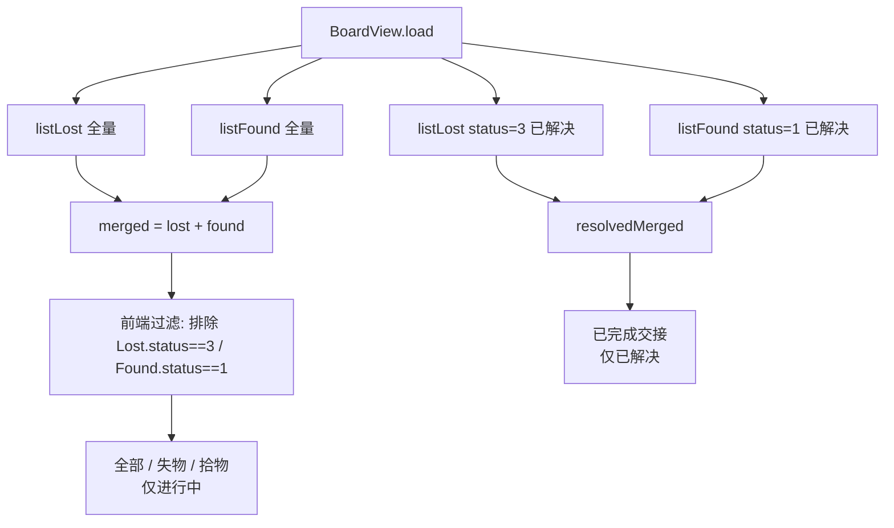

# v6 增量产品需求文档（Incremental PRD v6）

| 项 | 内容 |
| --- | --- |
| 系统名称 | 基于 YOLOv8 的校园失物招领智能匹配系统 |
| 文档定位 | 在**已落地 v5** 之上定义 v6 增量变更（仅描述变更部分；不含任何实现代码、不修改源文件）；需求层文档 |
| 文档版本 | v6.0（增量·简单 PRD） |
| 产品经理 | 许清楚（Xu） |
| 技术栈（沿用，禁止更换） | 前端 **Vue3 + Element Plus + Vite + Pinia + Axios**；后端 **FastAPI + SQLAlchemy 2.x + SQLite/MySQL + JWT**；IM 沿用**前端轮询**；**非默认 React/MUI**（既有系统增量改造） |
| 状态 | 待架构师与工程评审 |

---

## 0. 增量基线（v5 已落地事实 + 本次起点）

> 以下为 v5 已上线现状（实地 Read 于 `web/src/views/BoardView.vue`、`web/src/api/{items,mockData,mockAdapter,constants}.ts`、`web/src/types/index.ts`），所有 v6 变更**必须基于这些事实**。

- **F-B1（四 tab 已存在）**：`BoardView.vue:7-12` 的 `el-radio-group` 已有 **四个 tab**：`全部 / 失物 / 拾物 / 已完成交接`（`typeFilter` 取值 `'all' | 'lost' | 'found' | 'resolved'`）。v6 **无需新建 tab 结构**，只需修正其数据作用域。
- **F-B2（主三 tab 未排除已解决 · 本次核心缺陷）**：`load()`（`BoardView.vue:287-305`）拉取主列表用 `listLost({ page:1, page_size:100 })` 与 `listFound({ page:1, page_size:100 })`——**不带 status 过滤**，返回全量（含已解决）；`merged` computed（`BoardView.vue:171-177`）=`lostItems + foundItems`（含已解决项），直接喂给「全部/失物/拾物」三 tab → **已解决项仍出现在主列表，挤占视觉空间（用户原话复现）**。
- **F-B3（已完成交接 tab 现有拉取）**：`resolvedLost = listLost({ status: 3 })`、`resolvedFound = listFound({ status: 1 })`（`BoardView.vue:293-294`），`resolvedMerged`（`BoardView.vue:179-185`）喂「已完成交接」tab。**判定口径已固定为物品自身 status**：`LostItem.status===3`（已解决）/ `FoundItem.status===1`（已解决）。
- **F-B4（演示模式路径）**：`mockAdapter.listLost/listFound`（`mockAdapter.ts:255-267`）返回**全量**（无 status 过滤），故**前端过滤即可在演示模式生效**；`mockData.ts` 中 `mockLostItems` id=5 为 `status:3`（已解决），但 `mockFoundItems` **全部 `status:0`，无 `status:1` 项** → 演示下「已完成交接」tab 仅有失物、缺拾物完成示例（无法呈现"配对完成"）。
- **F-B5（状态枚举，v5 沿用，务必区分数值碰撞）**：
  - `LostItem.status`：`0 待匹配 / 1 匹配中 / 2 待认领 / 3 已解决`
  - `FoundItem.status`：`0 待认领 / 1 已解决`
  - `MatchRecord.status`：`0 待认领 / 1 认领中 / 2 已完成(COMPLETED) / 3 已拒绝(REJECTED) / 4 待自取(MANUAL_PENDING) / 5 已放弃(GIVEN_UP，v5 新增)`
  - ⚠️ **数值碰撞提醒**：`MatchRecord.status===3`（已拒绝）与 `LostItem.status===3`（已解决）**数值相同、含义完全不同**；v6 判定一律以**物品自身 status** 为准，避免误判。

### 0.1 问题陈述（待修缺陷）

用户原话：「已解决的东西，只会出现在'已完成交接栏'，在'全部''失物''拾物'，栏就不会再显示了，免得一堆已经完成的挤占视觉空间。」

- **缺陷根因**：主三 tab 的 `merged` 未排除已解决项；`listLost/listFound` 不带 status 过滤，返回全量。
- **期望行为（用户举例）**：现有失物 A B C、拾物 a b c；若 A 与 a 匹配交接完成，则「全部」只剩 B C b c、「失物」只剩 B C、「拾物」只剩 b c，「已完成交接」显示 A 与 a。
- **枚举映射验证**：A→`LostItem.status=3`、a→`FoundItem.status=1`；B/C→`{0,1,2}`、b/c→`0`。与 F-B3 判定口径完全一致。

---

## 1. 产品目标与范围边界

### 1.1 产品目标（一句话）

> **v6 让公示栏主列表（全部/失物/拾物）只展示「进行中」的物品，已解决的集中到「已完成交接」tab，减少视觉拥挤、聚焦待办。**

### 1.2 本期范围边界

**做（Scope In）**
- T. 固化四 tab 行为：主三 tab **排除**已解决项；「已完成交接」tab **仅**展示已解决项（失物 + 拾物）。
- 演示模式（mock）同步支持该过滤与四 tab（含补齐拾物完成示例）。
- 后端「排除已解决 / 仅已解决」查询视图（P1 优化项）。

**不做（Scope Out）**
- 不改动 `keep_status` / `contact_allowed` / `MatchStatus` 既有约束与语义（v5 已定）。
- 不改动匹配/交接/IM 主流程；不新增表/字段/迁移。
- 不重写 BoardView 结构，仅调整数据作用域与少量展示（P2 配对展示除外）。
- 不做「已解决项的编辑/删除/恢复」操作（本期仅展示隔离）。

---

## 2. 用户故事（角色 / 场景 / 价值）

> 格式：`As a [角色], I want [功能] so that [价值]`。

- **失主**：As a 失主，我希望在公示栏浏览时，进行中的失物/拾物不被已完成的记录挤占，so that 我能更快看到还待认领/待匹配的物件。
- **拾得者**：As a 拾得者，我希望我捡到的物品一旦完成交接就从主列表消失，so that 我发布的拾物不会长期挂在「拾物」栏干扰新发布。
- **双方**：As a 用户，我希望想看历史已解决的物品时，统一去「已完成交接」tab 找，so that 主列表干净、历史有归处。
- **演示者（常用演示模式）**：As a 演示者，我希望在无后端时四 tab 行为与真实一致（含已解决隔离），so that 演示/截图能完整呈现"已完成交接"闭环。

---

## 3. 需求池（P0 / P1 / P2，标注需求字母）

> 优先级：**P0 = 必做（阻塞上线）｜P1 = 应做（工程化必需）｜P2 = 体验优化**。
> 标记：`[复用/确认]` 结构已存在仅确认行为；`[变更]` 既有逻辑需修改；`[新增]` 需新增；`[复用]` 原样复用。

### P0 — 必做（阻塞上线）

| ID | 需求 | 描述 | 标记 | 关联模块 | 验收标准 |
| --- | --- | --- | --- | --- | --- |
| P0-1 | 第四 tab 固化 | 「已完成交接」已为 BoardView 第四 tab（v5 已建）。本次**确认**其为唯一已解决项入口，行为符合需求；无需新建 tab 结构。 | `[复用/确认]` | `BoardView.vue:7-12` | ① 四 tab 顺序=全部/失物/拾物/已完成交接；② 该 tab 仅承载已解决项。 |
| P0-2 | 主三 tab 排除已解决 | 「全部/失物/拾物」列表**排除**已解决项：`merged` 过滤掉 `LostItem.status===3`（已解决）与 `FoundItem.status===1`（已解决），仅保留进行中（`Lost∈{0,1,2}` / `Found===0`）。 | `[变更]`前端 | `BoardView.vue:171-177` `merged` + `:187-213` `filteredItems` | ① 已解决失物/拾物不出现在主三 tab；② 进行中项正常显示；③ 例：`mockLostItems` id=5(`status:3`) 仅出现在「已完成交接」。 |
| P0-3 | 已完成交接 仅已解决 | 「已完成交接」tab 仅展示已解决项 = `resolvedLost`(`LostItem.status===3`) + `resolvedFound`(`FoundItem.status===1`)，与现有拉取（`BoardView.vue:293-294`）一致。 | `[复用/确认]` | `BoardView.vue:179-185` `resolvedMerged` | ① 该 tab 只含 `status=3` 失物 + `status=1` 拾物；② 进行中项不混入。 |

### P1 — 应做（工程化必需）

| ID | 需求 | 描述 | 标记 | 关联模块 | 验收标准 |
| --- | --- | --- | --- | --- | --- |
| P1-1 | 演示模式覆盖 | 演示模式（mock）须支持该过滤与四 tab。前端过滤已天然生效；但 `mockFoundItems` 无 `status=1` 项 → 「已完成交接」tab 演示下缺拾物示例。**建议在 `mockData.ts` 补 1 条 `status=1` 拾物 + 对应 `status=3` 失物**（构成完成配对，参考 `mockMatches` id=3 的 completed 配对）。 | `[变更]`mock | `mockData.ts`、`mockAdapter.ts:262-267` | ① 演示下四 tab 行为一致；② 已完成交接可见「失物+拾物」完成配对示例。 |
| P1-2 | 后端过滤支持 | `listLost`/`listFound` 新增「排除已解决 / 仅已解决」视图参数（建议 `exclude_resolved: bool` 与 `resolved_only: bool`，或复用 `status_in`）。**建议默认：前端过滤（P0）先行，后端参数作为 P1 优化**，避免一次性后端改动，同时保持大数据量下分页 total 正确。 | `[变更]`后端+`[变更]`mock | `app/routers/items.py`、`mockAdapter.ts` | ① 后端可返回正确作用域集合；② 与前端过滤结果一致。 |

### P2 — 体验优化（Nice to have）

| ID | 需求 | 描述 | 标记 | 关联模块 | 验收标准 |
| --- | --- | --- | --- | --- | --- |
| P2-1 | 已完成交接 展示增强 | 已解决卡片在「已完成交接」tab 的样式：除「已完成交接」状态徽标外，建议展示（a）匹配对方信息（关联 `MatchRecord` 的 counterpart 类别/标题）；（b）交接完成时间。实现：后端 item 出参携带 `resolved_match`（match_id + counterpart 摘要 + completed_at），或前端按 id 关联 `MatchOut`。 | `[变更]`前端+可选后端 | `BoardView.vue`、`app/schemas/item.py` | ① 用户能看出 A 与 a 是一对完成交接；② 可见完成时间。 |
| P2-2 | 完成配对视觉关联 | 「已完成交接」tab 将失物 A 与拾物 a 以「配对卡片」同框展示（而非两条独立卡片），强化"交接完成"语义。 | `[变更]`前端 | `BoardView.vue` | ① 完成配对同框；② 视觉区别于主 tab。 |

---

## 4. UI 设计稿（文字 + 草图要点）

### 4.1 四 tab 数据流向（Mermaid flowchart）



**要点**：主三 tab 与「已完成交接」tab 数据源在 v6 后**不重叠**（前者过滤掉已解决，后者仅已解决）。

### 4.2 四 tab 布局与内容来源（表格）

| Tab | 内容来源（v6 后） | 包含 | 空态提示 |
| --- | --- | --- | --- |
| **全部** | `merged` 过滤已解决 | 进行中失物(`status∈{0,1,2}`) + 进行中拾物(`status==0`) | 「暂无进行中的失物与拾物」 |
| **失物** | `merged` 过滤已解决 + `kind==='lost'` | 进行中失物(`status∈{0,1,2}`) | 「暂无进行中的失物」 |
| **拾物** | `merged` 过滤已解决 + `kind==='found'` | 进行中拾物(`status==0`) | 「暂无进行中的拾物」 |
| **已完成交接** | `resolvedLost`(`status==3`) + `resolvedFound`(`status==1`) | 已解决失物 + 已解决拾物 | 「暂无已完成的交接记录」 |

### 4.3 公示栏四 tab（ASCII 草图）

```
┌──────────────────────────────────────────────────────────┐
│  公示栏                                                    │
│  (●)全部  ( )失物  ( )拾物  ( )已完成交接      [搜索框]     │
├──────────────────────────────────────────────────────────┤
│  全部（进行中，已排除已解决项）                             │
│  [图] 黑色 iPhone 13   失物  状态:匹配中                   │   ← Lost status=1
│  [图] 白色保温杯       失物  状态:待匹配                   │   ← Lost status=0
│  [图] 一串钥匙         失物  状态:待匹配                   │   ← Lost status=0
│  [图] 黑色书包         失物  状态:匹配中                   │   ← Lost status=1
│  [图] 手机(捡)         拾物  状态:待认领                   │   ← Found status=0
│  [图] 水杯(捡)         拾物  状态:待认领                   │   ← Found status=0
│  ...（已解决的《高等数学》失物与对应拾物 不在此出现）       │
└──────────────────────────────────────────────────────────┘

┌──────────────────────────────────────────────────────────┐
│  公示栏                                                    │
│  ( )全部  ( )失物  ( )拾物  (●)已完成交接    [搜索框]      │
├──────────────────────────────────────────────────────────┤
│  已完成交接（仅已解决项）                                  │
│  [图] 《高等数学》第七版  失物  状态:已解决   [已完成交接]  │   ← Lost status=3（例：A）
│  [图] 《高等数学》(捡)    拾物  状态:已解决   [已完成交接]  │   ← Found status=1（例：a，配套补齐）
│  ...（P2：可同框展示为"配对完成"卡片）                     │
└──────────────────────────────────────────────────────────┘
```

- 主三 tab 的卡片与现有 `ItemCard` 一致；「已完成交接」tab 卡片建议带「已完成交接」状态徽标（P2-1）。
- 空态：`el-empty` 文案按上表区分（V-B 现状 `BoardView.vue:44` 已有 `el-empty`，按 tab 切换提示文案即可）。

---

## 5. 待确认问题（需主理人 / 用户拍板，附建议默认）

### 5.1 阻塞细化（建议尽快确认）

- **Q1 「已解决」判定标准（核心，建议默认）**
  - **建议**：以**物品自身 status** 为准——失物已解决 = `LostItem.status===3`；拾物已解决 = `FoundItem.status===1`。与现有「已完成交接」tab 拉取口径（`status:3` / `status:1`）完全一致，无需改判定。
  - **与 MatchRecord 的关系（重要）**：物品仅在其关联 `MatchRecord.status === COMPLETED(2)`（完成交接/招领成功）时被置为已解决（v4 双码交接 / v4 未挪动自取 / v5 招领成功均置 `lost=3`、`found=1`）。故"物品已解决"业务上等价于"其匹配已完成(2)"，但**判定用物品 status 更直接（无需 join MatchRecord）**。
  - **其他终态明确不算「已解决」**（与任务建议一致）：
    - `MatchRecord.status===3`（REJECTED 已拒绝）：物品**保持进行中**（lost 仍 `0/1/2`、found 仍 `0`），不置已解决 → 仍出现在主三 tab，可重新匹配。**建议：不算已解决。** ⚠️ 注意 `MatchRecord.status=3` 与 `LostItem.status=3` 数值相同但含义不同（前者=匹配被拒，后者=失物已解决），请勿混淆。
    - `MatchRecord.status===5`（GIVEN_UP 已放弃/未能找回）：仅失物重置 `LostItem.status=0`（重入池），拾物不变 → 不置已解决。**建议：不算已解决。**
    - `MatchRecord.status===4`（待自取）、`0/1`：进行中，不置已解决。
  - **默认拍板建议**：采用物品 status 判定（Lost==3 / Found==1）；REJECTED / GIVEN_UP / 进行中均不算已解决。请主理人确认。

- **Q2 后端过滤 vs 前端过滤（性能 / 一致性，建议默认）**
  - 现状：`listLost/listFound` 不带 status 时返回全量；BoardView 现以 `status:3`/`status:1` 单独拉已解决。
  - **建议默认（P0）**：**前端过滤**。在 `merged` computed 中过滤掉 `Lost.status===3` / `Found.status===1`，改动最小、零后端、演示模式天然支持。代价：全量拉取（`page_size=100`）含已解决项，演示/小数据量无影响；数据量大时全量分页 total 含已解决项、主 tab 可能"看起来少"。
  - **后端增强（P1）**：`listLost/listFound` 加 `exclude_resolved` / `resolved_only`（或 `status_in`）参数，由后端返回正确作用域集合，分页 total 准确、传输量小。
  - 请主理人确认：**先前端（P0）+ 后端参数（P1）两阶段**，还是**直接上后端过滤（一步到位）**。

- **Q3 已解决项是否展示匹配对方信息（P2，建议默认）**
  - 建议：在「已完成交接」tab 展示（a）状态徽标「已完成交接」；（b）**匹配对方信息**（关联 `MatchRecord` 的 counterpart 类别/标题）；（c）**交接完成时间**。
  - 实现方式：后端 item 出参携带 `resolved_match`（match_id + counterpart 摘要 + completed_at），或前端按 id 关联 `mockMatches` / `GET /matches`。默认建议**轻量方案**：前端从已有 `MatchOut`（演示态 `mockMatches`；真实态可加 `GET /matches?lost_id=` 或 item 携带 `match_id`）关联出对方。
  - 请主理人确认是否需后端在 item schema 显式携带 `match_id`/`completed_at`（将涉及 schema 微改），还是仅前端关联即可。

### 5.2 补充确认（非阻塞）

- **Q4 演示数据缺已解决拾物示例**：当前 `mockFoundItems` 全 `status=0`、无 `status=1` 项；`mockLostItems` 有 id=5(`status:3`)。→ 演示下「已完成交接」tab 仅有失物、缺拾物完成示例，无法呈现"配对完成"。建议：`mockData.ts` 补 1 条 `status=1` 拾物（并保留/补对应 `status=3` 失物，二者构成完成配对，参考 `mockMatches` id=3 的 completed 配对）。请主理人确认补数据范围（仅补 1 对示例即可，见 P1-1）。

### 5.3 风险与缓解

- **R1 数值碰撞误判**：`MatchRecord.status=3`(已拒绝) 与 `LostItem.status=3`(已解决) 同值异义 → 缓解：v6 一律以**物品 status** 判定（Q1），代码注释显式区分。
- **R2 全量拉取分页偏差**：前端过滤下主 tab 分页 total 含已解决项 → 缓解：演示/小数据量可接受；数据量大走 P1 后端 `exclude_resolved`（Q2）。
- **R3 完成配对不同框**：「已完成交接」tab 失物/拾物为两条独立卡片，用户难感知"是一对" → 缓解：P2-2 配对卡片同框；P2-1 展示 counterpart。
- **R4 演示缺示例**：mock 无 `status=1` 拾物 → 缓解：P1-1 补数据（Q4）。

---

## 6. 字段 / 表 / 状态对照（v6 增量）

| 项 | 类型 | v5→v6 变化 | 标记 |
| --- | --- | --- | --- |
| BoardView 四 tab 结构 | 前端 | **复用**（「已完成交接」tab v5 已存在）；本次仅修正数据作用域 | **[复用/确认]** |
| `BoardView.merged` | 前端 computed | **变更**：过滤掉 `Lost.status===3` / `Found.status===1` | **[变更]** |
| `listLost`/`listFound` 全量拉取 | 前端/后端 | **复用**全量拉取 + **前端过滤**；可选后端 `exclude_resolved`(P1) | **[复用]+[变更·可选]** |
| `resolvedLost`/`resolvedFound` 拉取 | 前端 | **复用**（`status=3` / `status=1`） | **[复用]** |
| `mockFoundItems` | mock 数据 | **变更**（P1-1）：补 1 条 `status=1` 拾物完成示例 | **[变更]** |
| `LostItem.status` / `FoundItem.status` 判定 | 枚举语义 | **复用**现有语义（Lost `3`=已解决 / Found `1`=已解决） | **[复用]** |
| `MatchRecord.status` | 枚举 | **复用**：`2`=COMPLETED 置物品已解决；`3`=REJECTED / `5`=GIVEN_UP 不置已解决 | **[复用]** |

**状态机要点（v6）**
- 进行中（`Lost∈{0,1,2}` / `Found===0`）→ 出现在「全部/失物/拾物」主三 tab。
- 已解决（`Lost===3` / `Found===1`，由 `MatchRecord===COMPLETED(2)` 置位）→ 仅出现在「已完成交接」tab。
- `MatchRecord===REJECTED(3)` / `GIVEN_UP(5)` / `4` / `0` / `1` → 物品保持进行中，仍驻主三 tab（可重新匹配/重入池）。
- 枚举数值碰撞：`MatchRecord.status===3`（已拒绝）≠ `LostItem.status===3`（已解决），判定一律以物品 status 为准。
