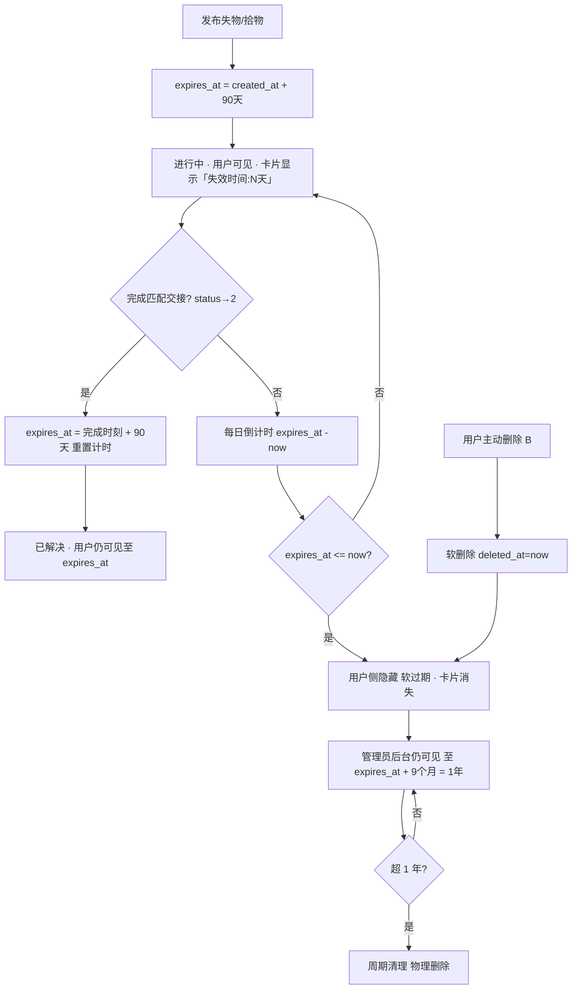

# v7 增量产品需求文档（Incremental PRD v7）

| 项 | 内容 |
| --- | --- |
| 系统名称 | 基于 YOLOv8 的校园失物招领智能匹配系统 |
| 文档定位 | 在**已落地 v6** 之上定义 v7 增量变更（仅描述变更部分；不含任何实现代码、不修改源文件）；需求层文档 |
| 文档版本 | v7.0（增量·简单 PRD） |
| 产品经理 | 许清楚（Xu） |
| 技术栈（沿用，禁止更换） | 前端 **Vue3 + Element Plus + Vite + Pinia + Axios**；后端 **FastAPI + SQLAlchemy 2.x + SQLite/MySQL + JWT**；IM 沿用**前端轮询**；**非默认 React/MUI**（既有系统增量改造） |
| 状态 | 待架构师与工程评审 |

> 术语与状态语义严格沿用 v6（见 §6 对照表）：`keep_status`、`contact_allowed`、`MatchStatus` 枚举、物品 status 语义均**不变**。

---

## 0. 增量基线（v6 已落地事实 + 本次起点）

> 以下为实地 Read 于 `app/models/*`、`app/schemas/*`、`app/routers/*`、`web/src/**` 的事实，所有 v7 变更**必须基于这些事实**。

### 0.1 角色与管理员判定（关联需求 A / Q3）
- **F-A1（管理员标识已存在）**：`app/models/user.py:34` 中 `User.role: SmallInteger`，默认 `0`（普通）/ `1`（管理员）；`app/schemas/common.py:49-51` 定义 `UserRole.NORMAL=0 / ADMIN=1`。
- **F-A2（后端管理员鉴权已存在）**：`app/routers/deps.py:44-48` 的 `require_admin` 依赖校验 `user.role != 1 → AdminRequiredError()`。
- **F-A3（管理员路由已存在一处）**：`app/routers/admin.py` 已实现 `GET /api/v1/admin/audit-logs/export?format=csv|json`（`require_admin` 门控），**使用标准库 `csv`/`json` 导出，零额外依赖**——是需求 A 导出功能的直接先例。
- **F-A4（前端管理员入口未做权限门控）**：`web/src/router/index.ts:13-21` 的 `NAV_ITEMS` 含 `{ path:'/admin', title:'管理后台' }`，**对所有登录用户可见**；`router.beforeEach`（`:88-98`）仅校验登录态，不校验 `role`。`web/src/views/AdminView.vue` 当前是「审计日志」视图（CSV/JSON 导出按钮 + 时间线），调用 `adminApi.exportAudit` 与 `matchApi.auditLogs`。
- **F-A5（前端可读取 role）**：`UserOut.role` 已下放到前端（`web/src/types/index.ts:28`、`stores/auth.ts`），前端门控无需后端额外接口。

### 0.2 物品 / 匹配 / IM 现状（关联需求 A/B/C）
- **F-B1（物品已有时间字段，但无失效字段）**：`LostItem`/`FoundItem`（`app/models/item.py`）有 `created_at`，**无 `expires_at` / `deleted_at`**。`LostItem.status: 0 待匹配/1 匹配中/2 待认领/3 已解决`；`FoundItem.status: 0 待认领/1 已解决`。
- **F-B2（删除端点已存在，但语义=撤销而非删除）**：`app/routers/items.py:211-228`（`DELETE /lost-items/{id}`→`revoke_lost_item`）与 `:280-297`（`DELETE /found-items/{id}`→`revoke_found_item`）**仅把 status 置为已解决(RESOLVED)并拒绝进行中匹配**——是"撤销"，不是"删除"。
- **F-B3（物品不可物理删除的硬约束）**：`MatchRecord.lost_id`/`found_id`（`app/models/match.py:32-41`）外键 `ondelete="RESTRICT"`。**物理删除被匹配引用的物品会触发外键拒绝** → 物品删除必须走**软删除**（标记），不能物理删。
- **F-B4（匹配完成态=2，但无完成时间字段）**：`MatchRecord.status`（common.py:71-77）`2=COMPLETED(已完成)`；但 `MatchRecord`（`app/models/match.py:26-56`）**只有 `created_at`，没有 `completed_at`**。v6 的「完成时间」是用 `MatchOut.created_at`（匹配创建时间）近似的（`BoardView.vue:339-340`），并非真实交接时刻。
- **F-B5（IM 为纯文本）**：`IMMessage`（`app/models/im.py:69-95`）`content_type: 0 文字/1 预设模板`，`content: String(500)`——**IM 不含图片消息**，对话内容即文本。
- **F-B6（IM 会话已有时效字段范式）**：`IMSession.expires_at`（`app/models/im.py:52`，非空 DateTime，且有索引 `idx_im_expires`）——物品失效字段应**复用同一命名范式**。

### 0.3 前端展示现状（关联需求 B/C）
- **F-C1（我的发布无删除按钮）**：`web/src/views/MyPublishView.vue` 仅用 `ItemCard` 渲染、点击查看，**无任何删除/撤销按钮**；`itemsApi.deleteLost/deleteFound` 已存在但无 UI 调用。
- **F-C2（卡片无倒计时）**：`ItemCard.vue` 仅有 `item-meta`（lost_time/found_time）与 v6 的「已完成交接」配对展示区，**无失效倒计时**。
- **F-C3（演示模式路径已具备）**：`mockAdapter.ts` 拦截所有请求返回与后端 Schema 一致的数据；`handleExportAudit`（`:691-719`）已实现 blob 下载范式；`mockMatches` 含 `status=2` 完成配对（id=3、id=7）可直接演示导出；`mockCurrentUser.role=0`、`mockAdminUser.role=1` 均在 `mockData.ts`。

### 0.4 迁移基线（关联 Q2）
- **F-D1**：`migrations/versions/` 现有 `0001_initial` / `0002_v3_incremental` / `0003_v4_incremental`，**无 0004**。Alembic 基础设施完备；v6 刻意"零迁移"（Scope Out 写明"不新增表/字段/迁移"）。v7 将**首次打破该惯例**（新增 `expires_at`/`deleted_at`/`completed_at` 需 0004）。

---

## 1. 产品目标与范围边界

### 1.1 产品目标（一句话）
> **v7 让管理员能对"未失效匹配"一键取证导出、让用户能自主清理误发、并让每条失物/拾物按 3 个月生命周期自动过期（完成交接重置计时、管理员后台留存 1 年）。**

### 1.2 本期范围边界

**做（Scope In）**
- **A. 管理后台取证导出**：仅管理员可见可操作的入口，列出未失效匹配记录，支持勾选 + 一键导出（失主发布 + 拾主发布 + 交接时间 + 交接对话 + 双方账号）。
- **B. 「我的发布」删除按钮**：失物/拾物每条加删除按钮（用户自主软删除误发）。
- **C. 失效倒计时生命周期**：物品存储 3 个月；完成匹配交接重置计时；管理员后台存 1 年；卡片下方红色「失效时间：N天」倒计时；归零用户侧隐藏。
- 演示模式（mock）同步支持上述三者。

**不做（Scope Out）**
- 不改 `keep_status` / `contact_allowed` / `MatchStatus` 枚举语义（沿用 v5/v6）。
- 不改匹配/交接/IM 主流程逻辑；仅在**完成态(status→2)**挂接"重置计时"副作用。
- 不做账号体系改造（管理员仍由 `role` 字段标识，沿用 seed/既有逻辑）。
- 不做导出内容的图像嵌入渲染（IM 无图；物品图片以 URL 列表导出，见 Q5）。

---

## 2. 用户故事（角色 / 场景 / 价值）

- **管理员**：As a 管理员，我希望在后台看到所有"还没消失"的匹配记录并勾选后一键导出成取证文件，so that 发生经济纠纷时我能提供失主/拾主发布信息、交接时间与对话作为证据。
- **失主/拾得者**：As a 用户，我希望在「我的发布」里能删除自己误发的条目（如把失物错发成拾物），so that 错误发布不会一直挂在我的列表里干扰。
- **失主/拾得者**：As a 用户，我希望每张卡片下方看到「失效时间：N天」的红色小字，so that 我清楚这条信息何时会从我的视图消失、及时跟进。
- **管理员**：As a 管理员，我希望用户侧已消失的条目在我的后台仍保留 1 年，so that 我在更长窗口内仍能追溯与取证。

---

## 3. 需求池（P0 / P1 / P2，标注需求字母）

> 优先级：**P0 = 必做（阻塞上线）｜P1 = 应做（工程化必需）｜P2 = 体验优化**。
> 标记：`[复用/确认]` 结构已存在仅确认行为；`[变更]` 既有逻辑需修改；`[新增]` 需新增；`[变更·mock]` 演示数据/适配器需改。

### P0 — 必做（阻塞上线）

| ID | 需求 | 描述 | 标记 | 关联模块 | 验收标准 |
| --- | --- | --- | --- | --- | --- |
| P0-A1 | 管理后台入口（仅管理员） | 新增「未失效匹配记录」区块（扩展 `AdminView.vue`）。仅 `role==1` 可见：① 前端隐藏 `/admin` 导航项 + 路由守卫；② 后端 `require_admin` 门控导出端点。 | `[变更]`前端+`[复用]`后端 | `router/index.ts`、`AppLayout.vue`、`admin.py`、`deps.py` | ① 普通用户侧边栏无「管理后台」、直访 `/admin` 被拦截；② 管理员可见并可读写。 |
| P0-A2 | 未失效匹配列表 | 管理后台列出"未失效匹配记录"= 关联双方物品仍处管理员留存窗（未超 1 年）的 `MatchRecord`；默认展示并可按状态过滤（推荐含"已完成(2)"强调）。 | `[新增]`后端+`[新增]`前端 | `admin.py`、`AdminView.vue`、`MatchRecord` | ① 列表含匹配 id、失主/拾主物品摘要、状态、交接时间；② 仅管理员可取。 |
| P0-A3 | 勾选 + 一键导出 | 列表支持单选/批量勾选（含"全选"），「一键导出」按钮生成取证文件（默认 CSV）。导出内容 = **失主发布信息 + 拾主发布信息 + 交接时间 + 交接对话(IM 文本) + 双方账号信息**。 | `[新增]`后端+`[新增]`前端 | `admin.py`、`AdminView.vue`、`admin.ts` | ① 选中 N 条导出 1 个文件；② 文件含上述 5 类信息；③ 双方账号为原始标识（管理员专属，见 Q5）。 |
| P0-B1 | 我的发布删除按钮 | 「我的发布」每条失物/拾物加「删除」按钮；点击弹确认框（`ElMessageBox.confirm`），确认后软删除（置 `deleted_at`）。 | `[新增]`前端+`[变更]`后端 | `MyPublishView.vue`、`ItemCard.vue`、`items.py` | ① 仅本人发布可见删除按钮；② 确认后该条从「我的发布」与该用户其余视图消失；③ 弹窗防误删。 |
| P0-B2 | 删除语义=软删除 | 复用 `DELETE /lost-items/{id}`、`DELETE /found-items/{id}`，语义由"撤销(置已解决)"改为"软删除(置 `deleted_at`)"。兼容外键 RESTRICT（不物理删）。 | `[变更]`后端 | `items.py` | ① 被匹配引用的物品也能安全软删（不触发 FK 拒绝）；② 删除后用户侧不可见、管理员后台仍可见（至 1 年）。 |
| P0-C1 | 物品失效字段 | `LostItem`/`FoundItem` 新增 `expires_at`（DateTime，可空）。发布时 = `created_at + 90天`；完成匹配交接(status→2)时重置 = `now + 90天`。 | `[新增]`模型+`[新增]`迁移0004 | `item.py`、`match.py`(完成钩子) | ① 新发布物品有正确 `expires_at`；② 完成交接后 `expires_at` 重新计算为 +90天。 |
| P0-C2 | 用户侧自动过期 | 所有用户可见查询（公示栏/我的发布/我的匹配）过滤 `expires_at > now()` 且 `deleted_at IS NULL`；归零后用户侧"消失"（逻辑隐藏，非物理删）。 | `[变更]`后端+`[变更]`前端 | `items.py`、`BoardView.vue`、`MyPublishView.vue` | ① `expires_at<=now` 或 `deleted_at` 非空 的物品不出现在用户视图；② 仍可被管理员检索。 |
| P0-C3 | 卡片倒计时显示 | 卡片下方红色小字「失效时间：N天」，`N = ceil((expires_at - now)/天)`；按天递减（73→72→…）；归零后按 P0-C2 隐藏。 | `[新增]`前端 | `ItemCard.vue`、`types` | ① 红色小字位于卡片信息区下方；② 精确到天、每日递减；③ 已完成交接 tab 卡片同样显示。 |
| P0-C4 | 管理员留存 1 年 | 管理员视图（含 P0-A2 匹配列表与物品检索）的可见窗 = 物品 `expires_at + 9个月`（即自锚点起 1 年）；超出 1 年由周期清理移除（见 P1-C2）。 | `[新增]`后端 | `admin.py`、`items.py` | ① 用户侧已隐藏(超 3 月)但 <1 年 的物品，管理员仍可见；② 超 1 年不可见。 |

### P1 — 应做（工程化必需）

| ID | 需求 | 描述 | 标记 | 关联模块 | 验收标准 |
| --- | --- | --- | --- | --- | --- |
| P1-A1 | 导出端点落地 | 后端新增 `GET /api/v1/admin/matches/export?format=csv&ids=1,2,3`（`require_admin`），聚合双方物品 + `completed_at` + 关联 IM 会话消息 + 双方用户原始标识，返回 CSV 下载。 | `[新增]`后端 | `admin.py` | ① 仅管理员可调；② 按 `ids` 导出；③ 字段完整。 |
| P1-A2 | 交接时间字段 | `MatchRecord` 新增 `completed_at`（DateTime，可空），在 status 置为 `COMPLETED(2)` 的各路径（handover_verify / self_complete / confirm_return，依 v4–v5 实现）写入当前时刻。供 P0-A3 导出"交接时间"与 P0-C1 重置锚点。 | `[新增]`模型+`[新增]`迁移0004+`[变更]`match 服务 | `match.py`、`match_service` | ① 完成交接即写入 `completed_at`；② 导出/重置正确使用该时刻。 |
| P1-C1 | 完成态重置计时副作用 | 在 `MatchRecord.status→2` 的落库处，将 `lost_item.expires_at` 与 `found_item.expires_at` 重置为 `now + 90天`（若物品已过期则重新起算）。 | `[变更]`后端 | `match_service` / 路由 | ① 任一完成路径均触发重置；② 双方物品计时一并刷新。 |
| P1-C2 | 1 年周期清理 | 后端启动/定时任务扫描：超 1 年（`expires_at + 9月`）的物品及其关联 `MatchRecord`/`IMMessage` 按依赖序物理清理（先删消息与匹配，再删物品，规避 FK RESTRICT）。 | `[新增]`后端 | `services/cleanup`、main.py | ① 超 1 年数据被移除；② 不破坏外键；③ 可手动/自动触发。 |
| P1-D1 | 演示模式覆盖（管理员视图） | mock 提供切换/以管理员身份进入演示的入口；`AdminView` 演示态展示未失效匹配列表（含 `status=2` 配对）并支持导出 blob 下载。 | `[变更·mock]` | `mockData.ts`、`mockAdapter.ts`、`stores/demo.ts` | ① 演示态可呈现管理员视图与导出；② 角色门控在演示态可演示。 |
| P1-D2 | 演示模式覆盖（倒计时/删除） | `mockData` 的 `LostItemOut/FoundItemOut` 增加 `expires_at`（= `created_at+90d`）与 `deleted_at`；`mockAdapter` 的 `myItems`/`listLost/listFound` 过滤过期/已删项；`deleteLost/deleteFound` 由物理 splice 改为置 `deleted_at`（与后端 P0-B2 语义对齐）。 | `[变更·mock]` | `mockData.ts`、`mockAdapter.ts` | ① 演示态卡片显示倒计时；② 删除后演示态该条消失、管理员态仍可见。 |

### P2 — 体验优化（Nice to have）

| ID | 需求 | 描述 | 标记 | 关联模块 | 验收标准 |
| --- | --- | --- | --- | --- | --- |
| P2-A1 | 批量导出文件组织 | 多选导出时：默认单文件（matches 一行一匹配 + 对话并入列）；或双文件（`matches.csv` 摘要 + `conversations.csv` 按消息一行）。见 Q2/P2 文件组织。 | `[新增]`后端 | `admin.py` | ① 多选对话不丢失；② 文件可被 Excel/文本工具打开。 |
| P2-A2 | 导出格式扩展 | 在 CSV 之外按需支持 `.xlsx`（需引入 `openpyxl`，打破零依赖）。默认不引入，见 Q1。 | `[新增·可选]`后端 | `admin.py`、`requirements.txt` | ① 若启用，xlsx 可嵌图/多 sheet；② 默认路径仍零依赖。 |
| P2-C1 | 临近失效提醒 | 卡片在 `N<=7` 时由红字变"即将失效"警示样式；可选「我的发布」顶部汇总"X 条将于 7 天内失效"。 | `[新增]`前端 | `ItemCard.vue`、`MyPublishView.vue` | ① 临近到期有更强视觉提示。 |
| P2-B1 | 删除二次确认细节 | 确认框文案区分"误发可删"与"有关联匹配"提示（若有进行中匹配，提示"该条已有关联匹配，删除后将仅你不可见，管理员仍留存"）。 | `[变更]`前端 | `MyPublishView.vue` | ① 用户理解删除后果；② 不破坏证据链。 |

---

## 4. UI 设计稿（文字 + 草图要点）

### 4.1 物品生命周期与失效计时（Mermaid flowchart）



**要点**：用户可见窗 = 物品锚点 + 3 个月（`expires_at`）；管理员留存窗 = 锚点 + 1 年（`expires_at + 9月`）；完成交接重置锚点。

### 4.2 ① 管理后台「未失效匹配记录」页面布局

| 区域 | 内容 | 说明 |
| --- | --- | --- |
| 标题区 | 「管理后台 · 取证导出」+ 右侧「一键导出」按钮（置灰直至有勾选） | 仅 `role==1` 可见 |
| 过滤区 | 状态下拉：全部 / 已完成(2) / 认领中(1) / 待认领(0) / 待自取(4) / 已拒绝(3) / 已放弃(5) | 默认「全部（未失效）」 |
| 列表（el-table） | 列：`☑ 选择` / 匹配ID / 失物摘要(类别·标题) / 拾物摘要 / 状态 / 交接时间(completed_at) / 双方账号(学号) / 对话条数 | 一行一匹配；勾选列可批量 |
| 全选 | 表头 `el-checkbox` 全选当前列表 | 支持跨页需另议（默认当前页） |
| 导出 | 点击「一键导出」→ 浏览器下载 CSV（文件名含日期） | 见 P0-A3 / P1-A1 |

```
┌──────────────────────────────────────────────────────────────────────┐
│  管理后台 · 取证导出                                 [ 一键导出(CSV) ]   │
│  状态：[全部▼]                                                       │
├──────────────────────────────────────────────────────────────────────┤
│  ☑  匹配ID   失物            拾物          状态     交接时间   双方账号 │
│  ☑  7   黑色长柄雨伞   黑色长柄雨伞(捡)  已完成   07-11    2021.../2021│
│  ☐  3   校园一卡通     校园卡(捡)      已完成   07-15    2021.../2021│
│  ☐  1   黑色iPhone13   手机(捡)       认领中   —       2021.../2021│
│  ...（用户侧已过期但 <1年 的匹配仍列出，供管理员取证）                  │
└──────────────────────────────────────────────────────────────────────┘
```

### 4.3 ② 「我的发布」删除按钮 + 确认弹窗

```
┌──────────────────────────────────────────────────────┐
│  我的发布                                               │
│  (●)进行中  ( )已完成                                   │
│  ┌──────────────┐   ┌──────────────┐                  │
│  │ [图] 一串钥匙 │   │ [图] 白色水杯 │                  │
│  │ 失物 · 待匹配 │   │ 失物 · 待匹配 │                  │
│  │ 失效时间：73天 │   │ 失效时间：80天 │                  │
│  │        [ 删除 ]│   │        [ 删除 ]│   ← 每条新增   │
│  └──────────────┘   └──────────────┘                  │
└──────────────────────────────────────────────────────┘

   点击「删除」→ ElMessageBox.confirm：
   ┌─────────────────────────────────────┐
   │ ⚠ 提示                               │
   │ 确定删除这条发布吗？删除后仅你自己不可 │
   │ 见，管理员后台仍会留存 1 年作为记录。  │
   │                        [取消] [确定删除]│
   └─────────────────────────────────────┘
```
- 删除按钮位置：卡片右下角行动区（`ItemCard` 新增 `showDelete` prop 或 `MyPublishView` 直接渲染），仅当 `item.data` 属当前用户时显示。
- 确认弹窗：`ElMessageBox.confirm`，文案区分是否含进行中匹配（P2-B1）。

### 4.4 ③ 卡片下方倒计时红色小字（样式与位置）

```
┌────────────────────────────┐
│ [图]                        │
│ 失物 · 待匹配      [类别标签] │
│ 一串钥匙（含门禁卡）         │
│ 教学楼A区楼梯间遗失…         │
│ 🕒 2026-07-14 18:00         │
│ 失效时间：73天   ← 红色小字   │   /* color:#ef4444; font-size:12px; margin-top:6px */
└────────────────────────────┘
```
- 位置：复用 `ItemCard.vue` 的 `item-meta` 下方新增一行（紧接时间元信息）。
- 样式：`.item-expire { color:#ef4444; font-size:12px; margin-top:6px; }`，文案 `失效时间：{N}天`（`N=max(0, ceil((expires_at-now)/86400000))`）。
- 作用范围：公示栏四 tab、我的发布、我的匹配中的物品卡片统一渲染；`N<=0` 时按 P0-C2 不渲染（已隐藏）。

---

## 5. 待确认问题（需主理人 / 用户拍板，附建议默认）

### 5.1 阻塞细化（建议尽快确认）

- **Q1 导出格式：CSV 还是 Excel .xlsx？**
  - **现状**：现有 `app/routers/admin.py` 审计导出已用**标准库 `csv`/`json`**（零依赖）。系统 `requirements.txt` 当前**无 `openpyxl`**。
  - **建议默认**：**CSV 为主**（零新依赖、通用、可被 Excel/记事本直接打开，与既有审计导出一致）；可顺带保留 **JSON**（机器消费）。**不引入 `openpyxl`**，除非管理员明确要求 `.xlsx`。
  - **取舍**：`.xlsx` 对非技术管理员更友好（双击即开、可嵌图/多 sheet），代价是新增依赖 + 打包体积。若拍板要 xlsx，放入 P2-A2。请主理人确认：**默认 CSV（+JSON），还是必须 xlsx？**

- **Q2 失效时间字段实现：新增 `expires_at` 列（0004 迁移）还是复用已有时间字段？**
  - **方案 A（建议默认）**：`LostItem`/`FoundItem` 新增 `expires_at`（DateTime, 可空），发布时 `= created_at + 90天`，完成交接重置 `= now + 90天`；**需要 0004 Alembic 迁移**（打破 v6"零迁移"惯例），并对存量行回填 `created_at + 90天`。
    - 利：与 `IMSession.expires_at` 命名/索引范式完全一致；用户可见过滤 `WHERE expires_at > now()` 高效可索引；管理员留存 `expires_at + 9月` 可直接推导，无需额外列；语义清晰、易测试。
    - 弊：需写 0004 迁移（含回填脚本）；首次打破零迁移。
  - **方案 B（复用已有字段）**：不新增列，过期时刻 = `created_at + 90天` 在读取时计算；完成重置复用 `created_at` 或新增 `last_resolved_at`。
    - 利：看似少一列。
    - 弊：① **重置必须改锚点**，若直接覆盖 `created_at` 会破坏排序/审计（created_at 多处使用）；② 即便"纯计算"，重置仍需存一个独立锚点（`last_resolved_at`）→ **同样要加列、同样要迁移**，并未省事；③ 查询无法索引，过滤需每行计算。
  - **结论**：两种方案实质都需加列 + 迁移；方案 A 更干净、可索引、与既有范式一致。**默认建议方案 A（`expires_at`）。** 另建议同 0004 增加 `MatchRecord.completed_at`（导出"交接时间"与重置锚点所需，见 P1-A2）。
  - 请主理人确认：**接受 0004 迁移 + `expires_at`/`completed_at`（方案 A），还是坚持零迁移走方案 B？**

- **Q3 管理员判定与权限门控**
  - **现状**：管理员 = `user.role == 1`（模型/枚举已定）；后端 `require_admin` 已就绪；但**前端 `/admin` 导航项对所有登录用户可见、路由未做 role 守卫**（F-A4）。
  - **建议默认**：**双重门控**——① 前端：`NAV_ITEMS` 按 `auth.user?.role === 1` 过滤掉「管理后台」；`router.beforeEach` 对 `/admin` 增加 `meta.roles:['admin']` 校验，非管理员直访跳回 `/board`；② 后端：导出/列表端点继续 `require_admin`。
  - 请主理人确认：**采用"前端隐藏 + 路由守卫 + 后端鉴权"三重兜底（默认），还是仅后端鉴权即可？**

- **Q4 导出范围：单选 / 多选批量？**
  - **用户原话**："选中（可单选或批量勾选）后一键导出"。
  - **建议默认**：**支持单选与批量勾选，合并导出为 1 个文件**；提供表头「全选」勾选当前列表；「一键导出」对所选 `ids` 生成单份 CSV。
  - 请主理人确认：**默认多选批量单文件（建议），还是要求每条独立文件？**

- **Q5 对话内容范围与图片处理**
  - **现状**：`IMMessage.content_type ∈ {0 文字,1 预设模板}`，**IM 本身无图片消息**（F-B5）；物品图片存于 `LostItem.images`/`FoundItem.images`（JSON 数组，存 URL/路径），非 IM。
  - **导出内容界定**：
    - 失主/拾主**发布信息** = `LostItem`/`FoundItem` 字段（含 `images` URL 列表）。
    - **交接对话** = 该匹配关联 `IMSession` 的 `IMMessage` 文本行（`[sent_at] 角色: content`），CSV 直接用文本，无图问题。
    - **双方账号信息** = 失主/拾主 `student_no`（UserOut 已明文）+ `phone`（UserOut 默认脱敏，证据需**原始 phone**，故导出走管理员专属 schema，返回明文，仅 `role==1` 可见）。
  - **图片处理**：物品图片以 **URL/路径列表** 写入导出列（CSV 用 `|` 分隔或仅首图）；如需把图片真正嵌入文件，需 `.xlsx` + openpyxl（见 Q1/P2-A2），默认不做。
  - 请主理人确认：**① 对话仅文本（默认，因 IM 无图）是否可接受？② 物品图片以 URL 列表导出（默认）还是必须嵌图？③ 导出含原始 phone 的隐私边界是否同意（仅管理员）？**

- **Q6 归零 / 删除后处理：软删还是物理删？**
  - **现状**：`MatchRecord` 外键 `ondelete="RESTRICT"` → **物理删除被引用物品会被拒**（F-B3）；现有 `DELETE` 端点实为"撤销(置已解决)"（F-B2）。
  - **建议默认**：
    - **用户侧"消失" = 逻辑隐藏（软过期/软删除）**：`expires_at <= now` 或 `deleted_at` 非空 的物品，在用户可见查询中被过滤，**不物理删**，行保留供管理员取证。
    - **需求 B「删除」= 软删除**：复用 `DELETE /items/{id}`，语义由"撤销"改为置 `deleted_at=now()`（保留对进行中匹配的拒绝逻辑）；因是标记删除，**不触发 FK RESTRICT**，被匹配引用的物品也能安全删除。
    - **管理员 1 年 = 逻辑留存 + 周期清理**：管理员视图可见至 `expires_at + 9月`；超 1 年由 P1-C2 周期任务**物理清理**（先删 `IMMessage`/`MatchRecord` 再删 `Item`，规避 FK）。
  - **冲突提示**：现有 `DELETE` 端点语义将从"撤销(置已解决)"变为"软删除(置 deleted_at)"。若主理人希望**保留"撤销"功能**（置已解决、留在已完成 tab），则需**新增独立端点**（如 `POST /items/{id}/soft-delete`）以免与需求 B 混淆。
  - 请主理人确认：**① 采用软删（默认）？② 是否保留旧"撤销"端点（需新增独立删除端点）？③ 1 年清理用周期任务还是懒删除（访问时清理）？**

### 5.2 补充确认（非阻塞）

- **Q7 演示模式管理员身份**：`mockCurrentUser.role=0`，演示态默认非管理员。建议：`stores/demo.ts` 增加"演示身份：普通/管理员"切换（或固定提供 `mockAdminUser` 登录入口），使 P0-A / P1-D1 可在演示态完整演示。请主理人确认演示态如何进入管理员视图。
- **Q8 倒计时锚点边界**：若物品在 `expires_at` 前已被软删除（需求 B），其 `expires_at` 是否仍参与"重置"（完成交接）？建议：软删除物品不应再被匹配完成（进行中匹配在删除时已拒绝），故不影响。请确认删除后是否允许其进行中匹配继续。

### 5.3 风险与缓解

- **R1 迁移破坏零惯例**：0004 首次打破 v6"零迁移" → 缓解：Alembic 基建完备、demo 用内存数据不受影响；迁移含存量回填脚本，单独可回滚（Q2）。
- **R2 外键拒绝物理删**：`ondelete=RESTRICT` → 缓解：一律软删除（deleted_at/expires_at 过滤），P1-C2 清理按依赖序物理删（Q6）。
- **R3 前端门控被绕过**：仅前端隐藏 `/admin` 不够 → 缓解：叠加路由守卫 + 后端 `require_admin`（Q3）。
- **R4 批量导出对话丢失/超长**：CSV 单列嵌长对话易截断 → 缓解：P2-A1 双文件（matches + conversations）或限长摘要。
- **R5 演示态无管理员入口**：默认角色非管理员 → 缓解：P1-D1 / Q7 增加演示身份切换。

---

## 6. 字段 / 表 / 状态对照（v6→v7 增量）

| 项 | 类型 | v6→v7 变化 | 标记 |
| --- | --- | --- | --- |
| `User.role` | 模型字段 | **复用**：`1`=管理员，判定与 `require_admin` 不变 | **[复用/确认]** |
| `LostItem.expires_at` | 模型字段 | **新增**（DateTime, 可空）；`= created_at + 90d`，完成交接重置 `= now + 90d` | **[新增]** |
| `FoundItem.expires_at` | 模型字段 | **新增**（同上） | **[新增]** |
| `LostItem/FoundItem.deleted_at` | 模型字段 | **新增**（DateTime, 可空）；需求 B 软删除标记 | **[新增]** |
| `MatchRecord.completed_at` | 模型字段 | **新增**（DateTime, 可空）；status→2 时写入，供导出"交接时间"+重置锚点 | **[新增]** |
| `DELETE /items/{id}` 语义 | 后端路由 | **变更**：由"撤销(置已解决)"改为"软删除(置 deleted_at)" | **[变更]** |
| `GET /admin/matches/export` | 后端路由 | **新增**（require_admin）：取证导出 | **[新增]** |
| `AdminView` 未失效匹配区块 | 前端视图 | **新增**（扩展现有审计视图） | **[新增]** |
| `/admin` 导航项 + 路由守卫 | 前端 | **变更**：按 `role==1` 显隐 + `meta.roles` 守卫 | **[变更]** |
| `ItemCard` 删除按钮 | 前端组件 | **新增**（仅本人发布显示） | **[新增]** |
| `ItemCard` 失效倒计时 | 前端组件 | **新增**红色小字「失效时间：N天」 | **[新增]** |
| `myItems/listLost/listFound` 可见性 | 前端/后端 | **变更**：过滤 `expires_at>now` 且 `deleted_at IS NULL` | **[变更]** |
| `mockData/mockAdapter` | 演示层 | **变更**：补 `expires_at`/`deleted_at`、管理员身份、导出/删除语义对齐 | **[变更·mock]** |
| `keep_status` / `contact_allowed` / `MatchStatus` | 枚举语义 | **复用**（语义不变） | **[复用]** |

**状态机要点（v7 叠加 v6）**
- 用户可见：物品 `expires_at > now` 且 `deleted_at IS NULL` → 出现在公示栏/我的发布/我的匹配。
- 软过期：`expires_at <= now` → 用户侧隐藏（逻辑），管理员仍可见至 `expires_at + 9月`。
- 软删除（需求 B）：`deleted_at` 非空 → 用户侧隐藏，管理员可见至 1 年。
- 完成交接（`MatchRecord.status→2`）：写 `completed_at`，双方物品 `expires_at` 重置 `= now + 90天`。
- 1 年清理：超 `expires_at + 9月` → 周期任务物理删除（依赖序：IMMessage → MatchRecord → Item）。
