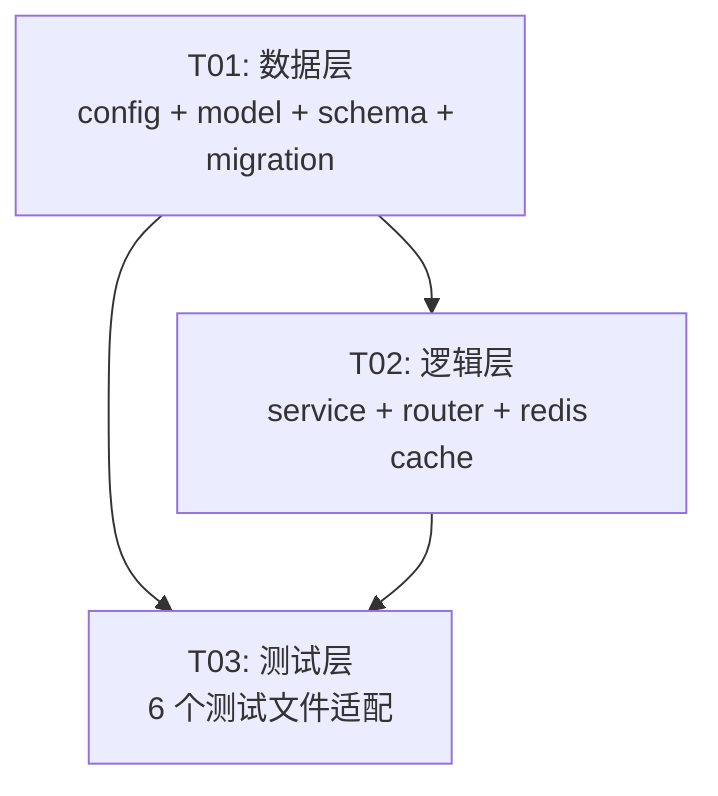

# 交接码后端重构设计方案

> 架构师：高见远 | 日期：2026-07-16 | 范围：后端 API + 模型 + 服务层（前端暂不改）

---

## Part A: System Design

### 1. 实现方案

#### 1.1 核心设计思路

将当前「单共享码 + 30分钟TTL + 同码双端验证」模型重构为「双码交叉验证 + 10秒TTL + 交叉输入」模型。

**当前模型**：
- 失主或拾得者任一方调用 generate → 生成1个6位字母数字共享码（30分钟有效）
- 失主输入该码（`verified_by_lost=True`），拾得者输入该码（`verified_by_finder=True`）
- 双方都验证 → 交接完成

**新模型**：
- 失主调用 generate → 生成失主专属4位数字码（`lost_code`），10秒过期
- 拾得者调用 generate → 生成拾得者专属4位数字码（`finder_code`），10秒过期
- 拾得者输入失主的码 → `lost_code_verified=True`（证明自己是失主授权的领取人，防截胡）
- 失主输入拾得者的码 → `finder_code_verified=True`（确认物品已交到自己手中）
- 双方交叉验证通过 → 交接完成

#### 1.2 模型变更策略

**改造现有 HandoverCode 表**（不新建表），原因：
1. 语义上是同一实体（交接码审计记录），只是从「单码」变为「双码」
2. 避免引入新表带来的 JOIN 复杂度和迁移成本
3. Alembic 迁移可以平滑地添加/删除列

#### 1.3 关键设计决策

| 决策点 | 方案 | 理由 |
|--------|------|------|
| 一行存双码 vs 两行 | **一行存双码**（lost_code + finder_code 在同一 HandoverCode 行） | 同一"轮"交接概念清晰，seq 自增语义不变，查询简单 |
| 独立过期 vs 统一过期 | **独立过期**（lost_code_expire + finder_code_expire 各自10s） | 符合需求：每方独立点击生成，各自10s |
| 重新生成时旧码处理 | **覆盖同行的该方码 + 重置该码的验证标记** | 不新建 seq，同一轮内可反复生成；对方已验证的码不受影响 |
| 过期检查机制 | **惰性检查**（与当前30分钟机制一致，只在 verify 时检查） | 简单可靠，10s TTL 下不会积累大量过期行 |
| Redis 缓存 | **保留但更新 key 格式和 TTL** | Redis 仍默认关闭，DB 是权威存储 |

#### 1.4 边界场景处理

| 场景 | 处理方式 |
|------|---------|
| 一方已生成码，另一方尚未生成 | 已生成方的码存在于行中，未生成方字段为 NULL；对方尝试验证时返回"对方尚未生成交接码" |
| 码过期后重新生成 | 覆盖同行同方码字段，重置该码的 verified 标记；对方码及验证状态不变 |
| 双方都验证后码过期 | 验证标记是永久的——一旦 `lost_code_verified=True`，即使码后续过期也不影响已完成的验证 |
| 一方重新生成码后对方已验证旧码 | 重新生成会重置该码的 verified 标记为 False，对方需要重新验证新码 |

---

### 2. 文件列表

| # | 文件路径 | 变更类型 | 说明 |
|---|---------|---------|------|
| 1 | `app/core/config.py` | 修改 | 新增 `HANDOVER_TTL_SEC=10`，标记 `HANDOVER_TTL_MIN` 为 deprecated |
| 2 | `app/models/match.py` | 修改 | HandoverCode 模型字段重构；MatchRecord 镜像字段保留 |
| 3 | `app/schemas/match.py` | 修改 | HandoverGenerateOut / HandoverVerifyOut 结构变更 |
| 4 | `app/services/handover_service.py` | 重写 | `_gen_code`、`generate_code`、`verify` 方法完全重写 |
| 5 | `app/routers/match.py` | 修改 | `handover_generate` / `handover_verify` 端点适配 |
| 6 | `migrations/versions/0007_dual_handover_code.py` | 新建 | Alembic 迁移：列增删 + 索引调整 |
| 7 | `tests/test_handover_audit.py` | 重写 | 所有用例适配双码模型 |
| 8 | `tests/test_qa_e2e.py` | 修改 | 交接码相关用例适配 |
| 9 | `tests/test_publish_flow.py` | 修改 | 交接码相关用例适配 |
| 10 | `tests/test_mymatch_top10.py` | 修改 | `_claim_handover_close` helper 适配 |
| 11 | `tests/test_errors.py` | 修改 | `test_handover_verify_bad_role_422` 适配 |
| 12 | `tests/redis_tests/test_redis_fallback.py` | 修改 | `test_handover_code_generate_verify_without_redis` 适配 |

---

### 3. 数据结构变更

#### 3.1 HandoverCode 模型（修改后）

```python
class HandoverCode(Base):
    """动态交接码审计镜像表（双码交叉验证模型）。"""

    __tablename__ = "handover_code"

    id: Mapped[int] = mapped_column(BigInteger().with_variant(Integer, "sqlite"), primary_key=True, autoincrement=True)
    match_id: Mapped[int] = mapped_column(
        BigInteger().with_variant(Integer, "sqlite"),
        ForeignKey("match_record.id", ondelete="RESTRICT"),
        nullable=False,
    )
    seq: Mapped[int] = mapped_column(SmallInteger, nullable=False, default=1)

    # ---- 双码（各自4位数字，独立生成、独立10s过期） ----
    lost_code: Mapped[str | None] = mapped_column(String(4), nullable=True)
    finder_code: Mapped[str | None] = mapped_column(String(4), nullable=True)
    lost_code_expire: Mapped[datetime | None] = mapped_column(DateTime, nullable=True)
    finder_code_expire: Mapped[datetime | None] = mapped_column(DateTime, nullable=True)

    # ---- 交叉验证标记 ----
    # lost_code_verified = 拾得者已正确输入失主的码（证明自己是授权领取人）
    lost_code_verified: Mapped[bool] = mapped_column(Boolean, nullable=False, default=False)
    # finder_code_verified = 失主已正确输入拾得者的码（确认物品已交到自己手中）
    finder_code_verified: Mapped[bool] = mapped_column(Boolean, nullable=False, default=False)

    # ---- 行级状态 ----
    status: Mapped[int] = mapped_column(SmallInteger, nullable=False, default=0)  # 0 有效/1 已验证/2 已过期

    # ---- GPS（验证时记录） ----
    gps_lost: Mapped[str | None] = mapped_column(String(50), nullable=True)   # 失主验证时（输入拾得者码）的GPS
    gps_finder: Mapped[str | None] = mapped_column(String(50), nullable=True)  # 拾得者验证时（输入失主码）的GPS

    # ---- 审计时间 ----
    generated_at: Mapped[datetime] = mapped_column(DateTime, nullable=False, default=utcnow)

    __table_args__ = (
        Index("uq_handover_match_seq", "match_id", "seq", unique=True),
        Index("idx_handover_lost_code", "lost_code"),
        Index("idx_handover_finder_code", "finder_code"),
        Index("idx_handover_status", "status"),
    )
```

**删除的字段**：`code`（单共享码）、`qr_token`（二维码令牌）、`verified_by_lost`、`verified_by_finder`、`expire_at`（单过期时间）

#### 3.2 MatchRecord 模型（镜像字段保留，语义变更）

```python
# 保持不变，但语义变更：
code: Mapped[str | None]          # 镜像最近一次生成的码（lost_code 或 finder_code）
code_expire: Mapped[datetime | None]  # 镜像该码的过期时间
```

#### 3.3 Schema 变更

```python
class HandoverGenerateOut(BaseModel):
    """交接码生成响应（返回调用方刚生成的码）。"""
    role: str          # "lost" | "finder" — 本次生成的是哪方的码
    code: str          # 4位数字码
    expire_at: datetime

class HandoverVerifyRequest(BaseModel):
    """交接码验证请求体（结构不变，语义变更）。"""
    code: str = Field(..., min_length=4, max_length=4, description="对方的4位数字码")
    role: str = Field(..., description="lost | finder — 谁在验证")
    gps: Optional[str] = None

class HandoverVerifyOut(BaseModel):
    """交接码验证响应。"""
    both_verified: bool
    lost_code_verified: bool       # 拾得者已正确输入失主码
    finder_code_verified: bool     # 失主已正确输入拾得者码
```

---

### 4. 接口变更

#### 4.1 POST /matches/{match_id}/handover/generate

**请求**：无 body（与当前一致），通过 JWT 判断调用方身份。

**逻辑变更**：服务层根据 operator_id 判断 role（lost 或 finder），只生成该方的4位码。

**响应**（变更）：
```json
{
  "code": 0,
  "message": "success",
  "data": {
    "role": "lost",
    "code": "1234",
    "expire_at": "2026-07-16T12:00:10"
  }
}
```

#### 4.2 POST /matches/{match_id}/handover/verify

**请求**（结构不变，语义变更）：
```json
{
  "code": "5678",
  "role": "lost",
  "gps": "30.123,104.456"
}
```
- `role="lost"`：失主在验证 → 输入的是**拾得者的码**（finder_code）
- `role="finder"`：拾得者在验证 → 输入的是**失主的码**（lost_code）

**响应**（变更）：
```json
{
  "code": 0,
  "message": "success",
  "data": {
    "both_verified": false,
    "lost_code_verified": true,
    "finder_code_verified": false
  }
}
```

#### 4.3 不变的端点

- `POST /matches/{id}/claim-complete` — keep1 申请即完成，**完全不动**
- `POST /matches/{id}/self-complete` — 自取完成，**完全不动**
- `POST /matches/{id}/confirm-return` — 确认归还，**完全不动**
- `POST /matches/{id}/reject` — 拒绝认领，**完全不动**

---

### 5. 服务层重构方案

#### 5.1 `_gen_code()` 重写

```python
def _gen_code() -> str:
    """生成4位随机数字码（0000-9999）。"""
    return f"{secrets.randbelow(10000):04d}"
```

#### 5.2 `generate_code()` 重写

```python
def generate_code(self, match_id: int, operator_id: int | None = None) -> HandoverCode:
    """为认领中的匹配生成交接码（双码模型：根据 operator 判断生成 lost_code 或 finder_code）。"""
    match = self.db.get(MatchRecord, match_id)
    if not match:
        raise NotFoundError("匹配不存在")
    if match.status != int(MatchStatus.CLAIMING):
        raise MatchProcessedError("仅认领中（待交接）的匹配可生成交接码")

    # 根据 operator_id 判断角色
    lost = self.db.get(LostItem, match.lost_id)
    found = self.db.get(FoundItem, match.found_id)
    if not lost or not found:
        raise NotFoundError("匹配关联物品不存在")
    if operator_id == lost.publisher_id:
        role = "lost"
    elif operator_id == found.finder_id:
        role = "finder"
    else:
        raise PermissionError("仅失主或拾得者可生成交接码")

    now = _now()
    expire = now + timedelta(seconds=settings.HANDOVER_TTL_SEC)

    # 查找当前有效行（同一 match 最新 seq，status=VALID）
    hc = (
        self.db.query(HandoverCode)
        .filter(HandoverCode.match_id == match_id, HandoverCode.status == int(HandoverStatus.VALID))
        .order_by(HandoverCode.seq.desc())
        .first()
    )

    if hc is None:
        # 新建一轮
        last = (
            self.db.query(HandoverCode)
            .filter(HandoverCode.match_id == match_id)
            .order_by(HandoverCode.seq.desc())
            .first()
        )
        seq = (last.seq + 1) if last else 1
        hc = HandoverCode(match_id=match_id, seq=seq, status=int(HandoverStatus.VALID))
        self.db.add(hc)

    # 设置该方的码 + 过期时间，重置该码的验证标记
    if role == "lost":
        hc.lost_code = _gen_code()
        hc.lost_code_expire = expire
        hc.lost_code_verified = False
    else:
        hc.finder_code = _gen_code()
        hc.finder_code_expire = expire
        hc.finder_code_verified = False

    self.db.flush()

    # 镜像到 match_record（最新生成的码）
    code_value = hc.lost_code if role == "lost" else hc.finder_code
    match.code = code_value
    match.code_expire = expire
    self.db.flush()

    audit_service.write_audit(
        self.db, user_id=operator_id, action="handover_generate",
        target_type="match", target_id=match_id,
        detail=f"seq={hc.seq};role={role};code={code_value}",
    )
    self.db.commit()

    # 缓存层（Redis 默认关闭，DB 是权威存储）
    _cache_handover_code(code_value, match_id, role)

    self.db.refresh(hc)
    return hc
```

#### 5.3 `verify()` 重写

```python
def verify(self, code: str, role: str, gps: str | None = None, operator_id: int | None = None) -> dict:
    """双码交叉验证。
    
    role="lost"  → 失主在验证，输入的是 finder_code（确认物品已收到）
    role="finder" → 拾得者在验证，输入的是 lost_code（证明是授权领取人）
    """
    if role not in ("lost", "finder"):
        raise ParamError("role 必须为 lost 或 finder")

    # 查找当前有效行
    hc = (
        self.db.query(HandoverCode)
        .filter(HandoverCode.status == int(HandoverStatus.VALID))
        .order_by(HandoverCode.id.desc())
        .first()
    )
    # 更精确：按 match_id 查找。但 verify API 不传 match_id，只传 code。
    # 需要通过 code 反查。由于是4位数字码，可能有碰撞，所以取最新一条。
    # 实际上，路由层已有 match_id，应传入服务层。
    
    # ... 见下方完整实现说明
```

**重要修正**：verify 方法需要通过 `match_id` 来定位 HandoverCode 行，而不是仅靠 code（4位数字碰撞概率高）。当前路由已经知道 match_id，应将其传入 verify 方法。

**修正后的 verify 签名**：
```python
def verify(self, match_id: int, code: str, role: str, gps: str | None = None, operator_id: int | None = None) -> dict:
```

**完整 verify 实现**：
```python
def verify(self, match_id: int, code: str, role: str, gps=None, operator_id=None) -> dict:
    if role not in ("lost", "finder"):
        raise ParamError("role 必须为 lost 或 finder")

    hc = (
        self.db.query(HandoverCode)
        .filter(HandoverCode.match_id == match_id, HandoverCode.status == int(HandoverStatus.VALID))
        .order_by(HandoverCode.seq.desc())
        .first()
    )
    if not hc:
        raise HandoverInvalidError()

    now = _now()

    if role == "lost":
        # 失主验证 → 输入的是 finder_code
        target_code = hc.finder_code
        target_expire = hc.finder_code_expire
        verified_flag = "finder_code_verified"
        if hc.finder_code_verified:
            raise HandoverConflictError("你已验证，请等待对方确认")
    else:
        # 拾得者验证 → 输入的是 lost_code
        target_code = hc.lost_code
        target_expire = hc.lost_code_expire
        verified_flag = "lost_code_verified"
        if hc.lost_code_verified:
            raise HandoverConflictError("你已验证，请等待对方确认")

    # 检查对方是否已生成码
    if target_code is None:
        raise HandoverInvalidError("对方尚未生成交接码")

    # 检查码是否正确
    if target_code != code:
        raise HandoverInvalidError()

    # 检查是否过期
    if target_expire and target_expire < now:
        raise HandoverExpiredError()

    # 标记验证通过
    if role == "lost":
        hc.finder_code_verified = True
        hc.gps_lost = gps
    else:
        hc.lost_code_verified = True
        hc.gps_finder = gps
    self.db.flush()

    both = bool(hc.lost_code_verified and hc.finder_code_verified)
    if both:
        hc.status = int(HandoverStatus.VERIFIED)
        match = self.db.get(MatchRecord, hc.match_id)
        if match:
            match.status = int(MatchStatus.COMPLETED)
            lost = self.db.get(LostItem, match.lost_id)
            found = self.db.get(FoundItem, match.found_id)
            if lost:
                lost.status = int(LostItemStatus.RESOLVED)
                lost.expires_at = now + timedelta(days=90)
            if found:
                found.status = int(FoundItemStatus.RESOLVED)
                found.expires_at = now + timedelta(days=90)
            match.completed_at = now
            audit_service.write_audit(
                self.db, user_id=operator_id, action="handover_complete",
                target_type="match", target_id=match.id,
                gps=f"{hc.gps_lost or ''}|{hc.gps_finder or ''}",
                detail=f"seq={hc.seq};lost_code={hc.lost_code};finder_code={hc.finder_code}",
            )

    self.db.commit()
    self.db.refresh(hc)
    return {
        "both_verified": both,
        "lost_code_verified": bool(hc.lost_code_verified),
        "finder_code_verified": bool(hc.finder_code_verified),
    }
```

#### 5.4 缓存层更新

```python
def _cache_handover_code(code: str, match_id: int, role: str) -> None:
    """生成交接码后写入 KV 活跃存储，TTL = HANDOVER_TTL_SEC。"""
    try:
        ttl = int(settings.HANDOVER_TTL_SEC)
        get_redis().set(f"handover:{match_id}:{role}", code, ttl_sec=ttl)
    except Exception:
        pass

# _touch_handover_code 删除（10s TTL 下不需要续期，验证是永久标记）
```

#### 5.5 路由层适配

```python
@router.post("/matches/{match_id}/handover/generate", response_model=StandardResponse)
def handover_generate(match_id, request, db, user):
    m = _get_match_or_404(db, match_id)
    # ... 权限校验不变 ...
    hc = HandoverService(db).generate_code(match_id, operator_id=user.id)
    # 从 hc 中取出生成的码
    role = "lost" if hc.lost_code and not hc.finder_code else "finder"  # 简化判断
    # 更准确：服务层返回时附加 role 信息
    code = hc.lost_code or hc.finder_code
    expire = hc.lost_code_expire or hc.finder_code_expire
    return success(data=HandoverGenerateOut(role=role, code=code, expire_at=expire))

@router.post("/matches/{match_id}/handover/verify", response_model=StandardResponse)
def handover_verify(match_id, body, request, db, user):
    m = _get_match_or_404(db, match_id)
    # ... 权限校验不变 ...
    result = HandoverService(db).verify(
        match_id=match_id,    # 新增：传入 match_id
        code=body.code,
        role=body.role,
        gps=body.gps,
        operator_id=user.id,
    )
    return success(data=HandoverVerifyOut(
        both_verified=result["both_verified"],
        lost_code_verified=result["lost_code_verified"],
        finder_code_verified=result["finder_code_verified"],
    ))
```

**建议**：`generate_code` 方法返回值改为附加 role 信息（如返回 tuple `(hc, role)` 或在 hc 上临时附加属性），避免路由层猜测。

---

### 6. 程序调用流程

见 `docs/sequence-diagram.mermaid`

---

### 7. 类图

见 `docs/class-diagram.mermaid`

---

## Part B: Task Decomposition

### 8. Required Packages

无新增第三方包。全部使用现有依赖（FastAPI, SQLAlchemy, Pydantic, secrets 标准库）。

---

### 9. Task List (ordered by dependency)

#### T01: 数据层 — 配置 + 模型 + Schema + 迁移

- **Task Name**: 交接码数据层重构（config + model + schema + migration）
- **Source Files**:
  - `app/core/config.py` — 新增 `HANDOVER_TTL_SEC=10`，标记 `HANDOVER_TTL_MIN` deprecated
  - `app/models/match.py` — HandoverCode 字段重构（删 5 字段 + 加 6 字段 + 索引调整）；MatchRecord 镜像字段保留
  - `app/schemas/match.py` — `HandoverGenerateOut` 加 `role` 删 `qr_token`；`HandoverVerifyOut` 改 `lost_code_verified`/`finder_code_verified`；`HandoverVerifyRequest` 加 `min_length=4 max_length=4`
  - `migrations/versions/0007_dual_handover_code.py` — Alembic 迁移：ADD COLUMN lost_code/finder_code/lost_code_expire/finder_code_expire/lost_code_verified/finder_code_verified；DROP COLUMN code/qr_token/verified_by_lost/verified_by_finder/expire_at；索引调整
- **Dependencies**: 无
- **Priority**: P0

#### T02: 逻辑层 — 服务层重构 + 路由更新 + 缓存层

- **Task Name**: 交接码服务层与路由重构
- **Source Files**:
  - `app/services/handover_service.py` — `_gen_code()` 改4位数字；`generate_code()` 按角色生成双码；`verify()` 改交叉验证 + 接收 match_id 参数；`_cache_handover_code` 更新 key/TTL；删除 `_touch_handover_code`
  - `app/routers/match.py` — `handover_generate` 适配新返回结构；`handover_verify` 传入 match_id
  - `tests/redis_tests/test_redis_fallback.py` — `test_handover_code_generate_verify_without_redis` 适配双码流程
- **Dependencies**: T01
- **Priority**: P0

#### T03: 测试层 — 交接码相关测试全面更新

- **Task Name**: 交接码测试用例适配双码模型
- **Source Files**:
  - `tests/test_handover_audit.py` — 全部用例重写：双码生成 → 交叉验证 → 审计断言
  - `tests/test_qa_e2e.py` — E2E 交接码流程 + 过期用例适配
  - `tests/test_publish_flow.py` — 交接码闭环用例适配
  - `tests/test_mymatch_top10.py` — `_claim_handover_close` helper 适配
  - `tests/test_errors.py` — `test_handover_verify_bad_role_422` 适配
- **Dependencies**: T01, T02
- **Priority**: P0

---

### 10. Shared Knowledge

- **码格式**：4位纯数字字符串 "0000"-"9999"（`f"{secrets.randbelow(10000):04d}"`）
- **TTL**：10秒（`HANDOVER_TTL_SEC=10`），惰性过期检查（与当前30分钟机制一致）
- **交叉验证语义**：
  - `role="lost"` 验证 = 失主输入拾得者的码 → 设 `finder_code_verified=True`
  - `role="finder"` 验证 = 拾得者输入失主的码 → 设 `lost_code_verified=True`
- **重新生成**：覆盖同行同方码 + 重置该码 verified 标记；不影响对方码及验证状态
- **审计日志**：保持 `handover_generate`（detail 含 role + code）和 `handover_complete`（detail 含 seq + 双码）
- **verify 方法签名变更**：新增 `match_id` 参数（4位数字码碰撞概率高，不能仅靠 code 反查）
- **claim-complete / self-complete 完全不动**
- **Redis 默认关闭**，DB 是权威存储，缓存层仅做活性加速
- **日期时间**：全部使用朴素 UTC（`datetime.now(timezone.utc).replace(tzinfo=None)`），与 SQLite 存储一致

---

### 11. Task Dependency Graph



---

### 12. 兼容性说明

#### 12.1 受影响测试清单

| 测试文件 | 影响程度 | 涉及用例数 | 说明 |
|---------|---------|-----------|------|
| `test_handover_audit.py` | **重写** | 7 个 | 全部用例引用 `hc.code`/`qr_token`/`verified_by_lost`/`verified_by_finder`/`[A-Z2-9]{6}` 正则 |
| `test_qa_e2e.py` | **修改** | 2 个 | `test_full_handover_e2e`（`len(code)==6` → `len(code)==4`）；`test_handover_code_expired_returns_4002` |
| `test_publish_flow.py` | **修改** | 1 个 | `test_publish_match_claim_handover`（`len(code)==6` → `len(code)==4`，验证流程改为双码） |
| `test_mymatch_top10.py` | **修改** | 1 个 helper | `_claim_handover_close`（generate 改为双方各调一次，verify 改为交叉） |
| `test_errors.py` | **修改** | 1 个 | `test_handover_verify_bad_role_422`（generate 返回结构变 `code`→`data.code`） |
| `test_redis_fallback.py` | **修改** | 1 个 | `test_handover_code_generate_verify_without_redis`（`hc.code`→`hc.lost_code`，双码流程） |
| `test_flow_v3.py` | **无需修改** | 0 | 仅断言 `HandoverCode.count()==0`（keep1 不走交接码），不涉及码字段 |
| `test_v4_manual_match.py` | **无需修改** | 0 | 仅注释中提及 handover（self-complete 不走交接码），不涉及码字段 |
| `db_tests/test_mysql_create_all.py` | **无需修改** | 0 | 仅引用表名 "handover_code"（不变），不涉及列名 |
| `conftest.py` | **无需修改** | 0 | 仅 import HandoverCode 和在 `_BUSINESS_TABLES` 中引用，模型类名不变 |

#### 12.2 兼容性保障措施

1. **claim-complete / self-complete 零改动**：这两个单边捷径完全不经过 HandoverService，不受影响
2. **HandoverCode 表名不变**：`handover_code` 表名和 `id`/`match_id`/`seq`/`status`/`gps_lost`/`gps_finder`/`generated_at` 字段保持不变
3. **MatchRecord 镜像字段不变**：`code` 和 `code_expire` 字段名不变，仅语义微调
4. **错误码不变**：`HandoverInvalidError(4001)`、`HandoverExpiredError(4002)`、`HandoverConflictError(4003)` 错误码和 HTTP 状态码不变
5. **API 路径不变**：`/matches/{id}/handover/generate` 和 `/matches/{id}/handover/verify` 路径不变
6. **verify 请求 body 结构不变**：`{code, role, gps}` 三字段不变，仅 `code` 从6位字母数字变为4位数字

#### 12.3 数据库迁移注意事项

- **开发环境（SQLite）**：删除 `dev.db` 重建即可，或运行 `alembic upgrade head`
- **测试环境**：`conftest.py` 的 `_initial_cleanup()` 每次会话先 `drop_all` + `create_all`，自动适配新 schema
- **生产环境（MySQL）**：需运行 Alembic 迁移 `0007_dual_handover_code.py`；迁移脚本需处理存量数据（建议将旧 `code` 值清空，存量交接记录视为已过期）

---

### 13. Anything UNCLEAR

1. **verify 方法签名变更**：新增 `match_id` 参数。当前 `verify(code, role, gps, operator_id)` 不含 match_id，路由层调用时也未传 match_id。新设计需要改为 `verify(match_id, code, role, gps, operator_id)`。这会影响所有直接调用 `HandoverService.verify()` 的测试。**假设：主理人同意此签名变更。**

2. **generate_code 返回值**：当前返回 `HandoverCode` 对象，路由层从 `hc.code` 和 `hc.qr_token` 取值。新设计需要路由层知道刚生成的是 lost_code 还是 finder_code。**建议：generate_code 返回 `(HandoverCode, role)` 元组，或在返回的 hc 上附加临时属性 `_generated_role`。**

3. **存量 dev.db 数据**：HandoverCode 表中可能有旧格式数据（code/qr_token 等）。迁移时是否需要保留？**建议：清空 handover_code 表存量数据（都是测试/开发数据，无生产价值）。**

4. **4位数字码碰撞**：4位数字只有 10000 种组合，同一时刻多个 match 可能生成相同码。当前设计通过 `match_id + seq` 定位行，验证时也通过 `match_id` 查找，不依赖 code 全局唯一。索引 `idx_handover_lost_code` / `idx_handover_finder_code` 仅供调试查询，不设唯一约束。**假设：可接受碰撞风险（10s TTL + match_id 定位 = 碰撞不影响正确性）。**

5. **test_v4_manual_match.py**：grep 命中交接码引用，但未读取具体内容。工程师实现时需检查此文件是否需要修改。
